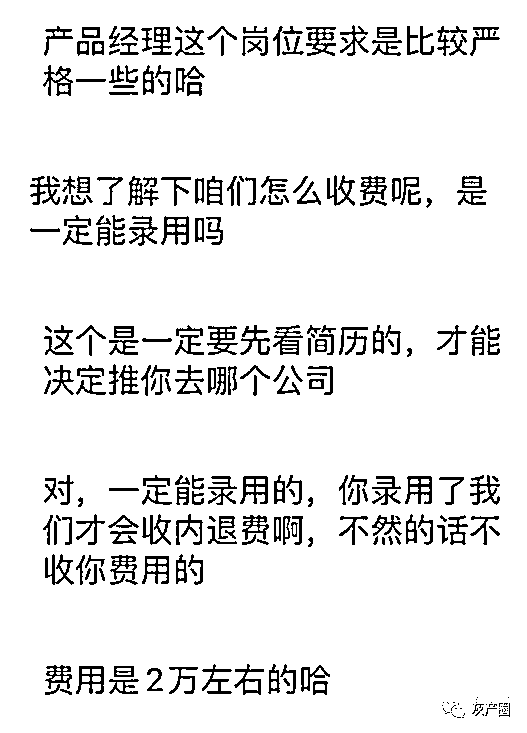
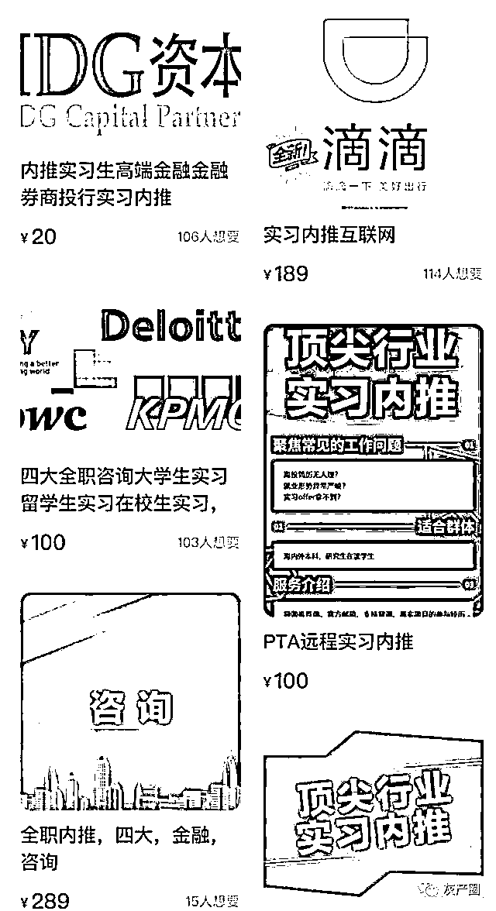
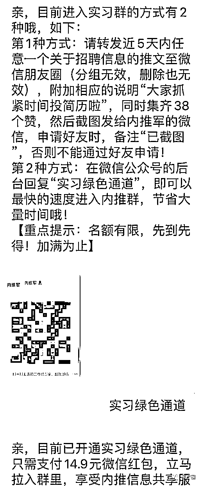
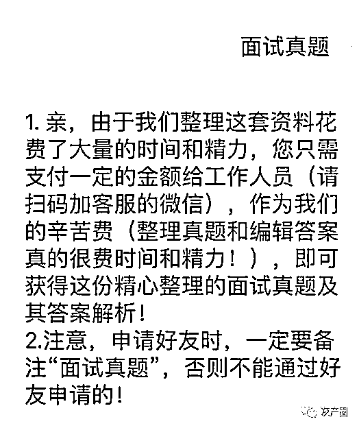
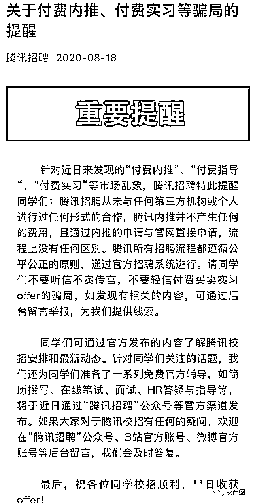

# 花钱就能进名企实习？一个实习岗，开价两万元

> 原文：[`mp.weixin.qq.com/s?__biz=MzIyMDYwMTk0Mw==&mid=2247507711&idx=1&sn=3115d84b444084323386fc02b58cc239&chksm=97cb15c7a0bc9cd1b2dc46b31d3798c79610bf7d4a0343337180aaf2b117f977fa0051a511dc&scene=27#wechat_redirect`](http://mp.weixin.qq.com/s?__biz=MzIyMDYwMTk0Mw==&mid=2247507711&idx=1&sn=3115d84b444084323386fc02b58cc239&chksm=97cb15c7a0bc9cd1b2dc46b31d3798c79610bf7d4a0343337180aaf2b117f977fa0051a511dc&scene=27#wechat_redirect)

重点

两三万元的实地实习，五六千元的远程实习，这些价码，并非岗位对应的工资，而是想要获得它，求职者需付出的金钱。在现实焦虑的冲击与驱动下，“花钱购买一份实习”成了暗潮汹涌的灰色地带，更给诈骗提供了萌生土壤。

“没有名校光环加持，没拿过校内外大奖，能让你救自己的只有这最后一根稻草——尽快积攒实习实践经验！”2021 寒假在即，除了忙于论文、求职的应届毕业生，不少还未进入毕业季的高校学生，也开始琢磨着为自己的简历“镀金”了。

拥有知名企业的实习经历，是拿到高薪体面工作的加分筹码。利益驱使下，号称可以付费帮忙内推的机构、个人纷纷涌现。如出一辙的广告语精准挑动着学生的情绪，将就业焦虑提前再提前。

声称内推岗 花钱“买”关系

身处二三线城市也能接触头部企业项目、用一段引以为傲的实习经历提升简历背景……在互联网平台上，以“实习”“内推”等为关键词进行搜索，会出现大量宣称可助力进入名企实习的卖家。

‘记者以北京一所 211 大学经济管理专业大三学生身份，联系上某求职机构。一位 C 女士问清相关信息后表示，“你必须得实习了，等到 10 月开始校招，你的简历上应该至少有两份实习经历。而且得是有点份量，大家都知道的公司。”

C 女士为实习开价 2 万元

话锋一转，C 女士称，一线大厂竞争非常激烈，招人至少要 3 个流程，每个流程至少筛掉 30%。而通过她的内推，可以让学生进入到最后面试中。“只要你别表现得太差，问题都答出来，发挥到七八十分，就可以得到实习机会了。”

当然，内推前学生需要先将自己的简历发给她，匹配一个“差不多”的岗位，再依需求修改简历。一般技术、产品经理等要求比较高，运营则门槛低些。根据记者情况，她推荐了后者。“做过社团、策划过活动、运营过小红书、知乎账号，这些都可以写。实在没有相关经历，就写希望学习这方面经验也可以。”

C 女士承诺，付费两万元，即可得到一份为期 3 至 6 个月的实习，并开具实习证明。记者追问，是否能理解成她认识公司内部的人，所付费用相当于“买”她这个关系？对方沉吟后表示肯定，并透露了两个比较有把握“找关系“成功的岗位，分别是某电商企业和某出行平台的运营岗。“很多员工其实是有内推名额的，他们基本可以自己来决定用不用你。实在没成功的话，费用也会退给你。”

琳琅满目的实习内推产品

“不提前收集信息，你根本不知道哪里能看到实习机会。等寒假有了时间，实习机会已经没有了。”除了直接出售实习机会的卖家，记者发现微信群、朋友圈里还会常常出现类似内容的文章，文末附有二维码，声称可加入实习群、内推群中。

事实上，入群困难重重，不但要关注指定公众号，还需将相关文章转发到自己其他微信群或朋友圈，并集齐几十个赞，截图发给小助手等待审核。如不想大动干戈，也可走“绿色通道”，发送十几元红包直接入群。

这同样是一种利用焦虑的生意，走的是“小额量大”路线。记者在两个群里看到，成员均达 200 人以上规模。一些面试真题、求职测试等内容，均需付费才能查看。而所谓优惠价 18.99 元的求职测试，点开后即为九型人格测试，网络上其实随处可查。

交费等合同 发现被拉黑

小山是西北地区一名高校学生，他坦言，因表哥在北京工作，可以帮忙提供住宿，自己去年暑假曾动过来京实习的念头。“我给比较出名的互联网公司投了一些简历，只是都没有回音。”

加入实习群困难重重

通过逛论坛、浏览社交平台，小山接触到了“付费内推”，可价格实在不是他能够承受的。“实地实习的话要 1 万多起步，去一线公司会到两三万元以上。我没有想到这么贵，对方说也有便宜的，安排一位‘导师’远程带我，最后通过公司邮箱发实习证明，一个月 5000 元左右。”

虽然家庭经济条件尚可，但跟父母聊过后，他们一致对”连找个实习都要花大价钱”这事儿不能理解，否定了小山的想法。

已经工作数年的小高对此倒不觉得奇怪，他回忆起自己大二暑假第一份实习，是在一家不错的事业单位。“我父亲请以前认识的一位工作伙伴吃了顿饭，人家帮忙找了那个单位一位部门领导，递上了我的简历。”

在他看来，若能和实习单位七拐八拐攀上关系，有师兄师姐帮忙递个简历，谁会不用呢？实在任何关系也找不到，那可能就想到了花钱。只是令小高不解的是，真的能放心把钱交给陌生人？“如果没‘安排’成功或者对方压根就在骗人，哪怕损失了个定金也是损失啊！你去哪儿找他呢？找得到吗？你会愿意声张吗？”

群内各种资料均需再次付费

“交费后等待邮寄实习合同，却发现被对方拉黑”、“花 1.2 万买了某大厂三个月远程实习和证明，事后参加公司招聘时发现实习证明是伪造的”……社交平台上，由于轻信“内推”而遭受时间、钱财损失的案例比比皆是，俨然渐成诈骗新途径。

对此，不少企业通过公开声明的方式进行提醒。去年 8 月 18 日，“腾讯招聘”微信公众号发布文章称，腾讯招聘从未与任何第三方机构或个人进行过任何形式的合作，请同学们不要轻信付费买卖实习机会的骗局。四大会计师事务所中的毕马威、安永、普华永道，也纷纷出具各自“打假声明”，均称从未授权或与任何第三方求职、培训、个人等合作，任何号称只要支付费用就能获取面试、实习、工作机会的第三方机构或个人都是假的。

付费被录用？恐是押概率

那么，抛开实习证明造假，或者单纯就是诈骗的风险不谈，付费请“中间人”向企业员工“托关系”，是否存在这种门路？

一位一线互联网公司某业务负责人告诉记者，公司大致招聘流程为简历全部汇聚到 HR 处，由 HR 先筛选一轮，将与各招人部门相匹配的简历分发下去。“我们会从发给我们部门的简历里选出希望面试的人，一般是 2 位部门员工和 1 位 HR 一起面试，分别给出评估。”

“腾讯招聘”发布的防骗提醒

关于内推，该负责人称员工确实有相关权限，但推来的候选人怎么样，同部门的人都能看到。真的很不匹配，面试也明摆着不行的话，谁也没办法坚持录用。“除非是高层领导指定人选才行？我是没遇到这种情况。不过都认识高层领导了，还费劲实习干嘛呢？”

至于与中介“里应外合”售卖实习岗位，这位负责人坦言，公司那么多人，他无法完全排除这种可能。“但更大的可能是，你花了钱被录用，说明你本身质素还可以，即便不交这个钱，也有相当的机会被录用。”换句话说，中介只需帮学生改改简历、投递出去，总会有能力与岗位相匹配的求职者被录取。对没成功的人，退钱就完事儿了，反正也没有什么实质性的成本。

北京某高校就业指导部门的一位老师介绍，目前帮同学找工作、找实习，都运作有专门的微信群。负责就业工作的老师，以及每个班不少于 2 名“就业联系员”在这个群中，随时将最新发布的就业、实习信息转发到各自班级群。“不能保证每家企业都是 500 强，但从量上肯定是充足的，能达到每个同学至少 5 条的比例。”

该老师透露，确实会有不少机构找来，希望与学校进行合作。主要方式是机构提供求职技能培训，收费从三五千至上万元不等，并承诺提供实习、就业机会。或称可以免费参与求职相关项目，成功录取的话要拿出 1-2 个月工资支付，属于“事后算账”办法。

在这位老师看来，“付费内推”一定存在骗人风险，但也不能排除真有人收了钱帮忙。“学校态度是，只要涉及收费，一概拒绝官方层面合作，因为已经给了学生足够的免费资源。”同时他坦言，学生都是成年人，如果经过判断，愿意去走所谓的“捷径”，学校也无从阻止。

北京市两高律师事务所主任律师戴智勇在社交平台上发布观点称，有需求就有利益，付费内推这种畸形现象其实是多个主体的结果。“企业在将就，有些企业选拔人才十分机械和呆板，明知只靠简历筛人不太合理，但为了高效依然这么做；大学生在将就，很多学生大二就在找实习，研究生刚入学就想实习，殊不知这是本末倒置的行为。大学是学习知识和技能的黄金时期，大厂的实习机会最终还是靠实力而非履历；中介在将就，做着牵线搭桥的生意，图个暴利套现。如果这种现象导致了就业不公，寻求劳动法等法律的帮助或许是个思路。”

来源：北京日报客户端

← 向右滑动与灰产圈互动交流 →

