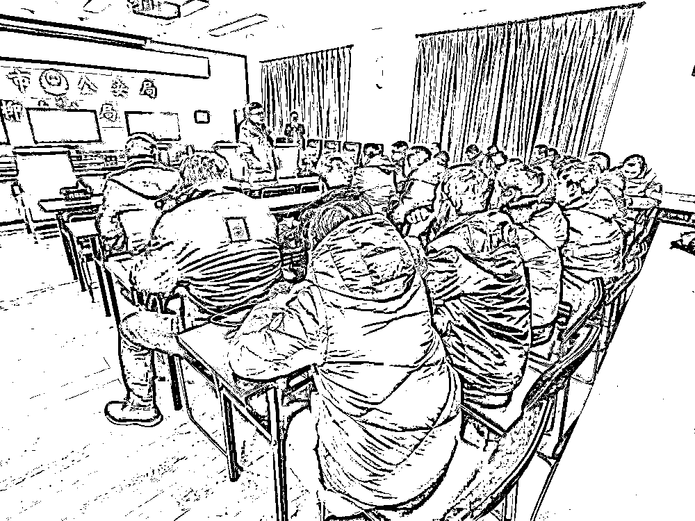
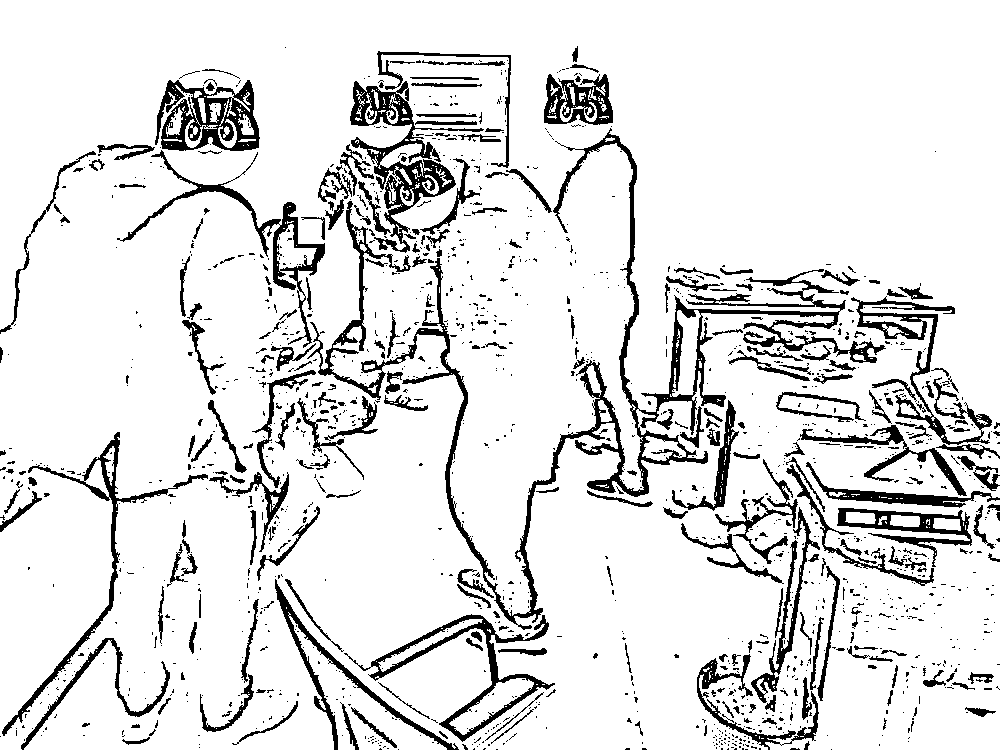

# “赌石”直播变成抓捕直播！柳州警方打掉一诈骗团伙！

> 原文：[`mp.weixin.qq.com/s?__biz=MzIyMDYwMTk0Mw==&mid=2247507711&idx=2&sn=12c413918d3b6250e0840714bbb449f3&chksm=97cb15c7a0bc9cd17320904d42781983b0ebf6ab6e5cc72e06b92c2dbed2f96bf4b95584d0fe&scene=27#wechat_redirect`](http://mp.weixin.qq.com/s?__biz=MzIyMDYwMTk0Mw==&mid=2247507711&idx=2&sn=12c413918d3b6250e0840714bbb449f3&chksm=97cb15c7a0bc9cd17320904d42781983b0ebf6ab6e5cc72e06b92c2dbed2f96bf4b95584d0fe&scene=27#wechat_redirect)

一个带货“玉石”的直播间直播中

网友正期待捡“大漏”

忽然画风突转

只听见一阵紧促的

“趴下，趴下”声

画面变成了警方抓捕直播

[`mp.weixin.qq.com/mp/readtemplate?t=pages/video_player_tmpl&action=mpvideo&auto=0&vid=wxv_1693022580091240459`](https://mp.weixin.qq.com/mp/readtemplate?t=pages/video_player_tmpl&action=mpvideo&auto=0&vid=wxv_1693022580091240459)

近日，柳州市公安局柳南分局在市局的指导和支持下，历经 3 个多月的缜密侦查，出动大批警力多地围剿，打掉一个涉案**500 余**起、案值**千万**元的特大“杀猪盘”电信诈骗团伙，抓获犯罪嫌疑人**39**人，查获假玉石原石约 1 吨，劣质珠宝首饰一批。

[`mp.weixin.qq.com/mp/readtemplate?t=pages/video_player_tmpl&action=mpvideo&auto=0&vid=wxv_1690579326036967426`](https://mp.weixin.qq.com/mp/readtemplate?t=pages/video_player_tmpl&action=mpvideo&auto=0&vid=wxv_1690579326036967426)

2020 年 10 月初，柳南公安分局河西责任区刑侦大队民警在工作中发现，柳州市某贸易公司利用某网络直播平台，通过假玉石毛料买卖实施电信诈骗。

警方开展深入摸排，一个以叶某诗为首的“杀猪盘”诈骗团伙浮出水面。该团伙与云南边境“赌石”直播窝点串联，共同实施“赌石”诈骗活动。

由于案情重大，柳南公安分局立即将情况上报，柳州市公安局要求柳南分局牵头成立专案组，尽快摸清案件细节，确定抓捕对象，务必全链条打掉该犯罪团伙。

去年 12 月底，专案组赶赴云南瑞丽、广东四会等地调查取证，并制定详细抓捕方案。

2021 年 1 月 9 日晚，抓捕时机成熟。专案组 100 余名警员在柳州市城中区某大厦，抓获以叶某诗为首的诈骗团伙成员 34 名；在云南瑞丽网络直播窝点抓获诈骗团伙成员 3 名；在广东四会市抓获犯罪嫌疑人 2 名，当场缴获作案电脑 40 余台，假玉石原石约 1 吨及劣质首饰 1 批。

经初步调查，叶某诗为首的电信网络诈骗团伙以柳州某贸易公司为伪装，组织“业务员”冒充美女在互联网上以婚恋、交友为名，骗取受害者信任，诱导受害者进入云南的网络直播间内，观看“赌石”直播，让对方购买劣质玉石首饰送给女方及双方亲戚等……

云南的直播窝点雇佣缅甸籍人员冒充毛料市场摊主，网络主播则以帮助被害人在毛料市场和摊主讨价还价为名来骗取毛料费、加工费、鉴定费等。假如受害者下单后，收到的玉石也是假货。

经审讯，团伙成员叶某诗（男，34 岁，福建人）、谢某东（22 岁，广西人）等 36 人均对实施电信网络诈骗的犯罪事实供认不讳。

经查，该团伙涉案资金上千万元，初步核实“赌石”电信诈骗案件 500 余起。

目前，叶某诗、谢某东等 36 人因涉嫌诈骗已被公安机关依法刑事拘留，3 人另案处理。案件仍在进一步侦办中。

来源：柳南警方，广西刑侦

← 向右滑动与灰产圈互动交流 →

