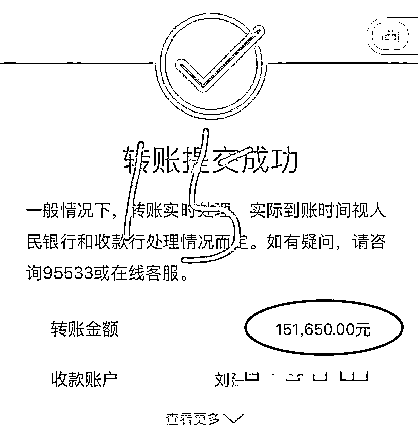
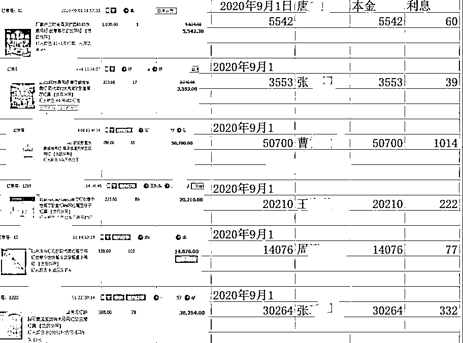

# 1 人被骗，60 人遭殃——论受害者的黑化历程

> 原文：[`mp.weixin.qq.com/s?__biz=MzIyMDYwMTk0Mw==&mid=2247507711&idx=3&sn=7c913b234c1c583e851bcdef22041235&chksm=97cb15c7a0bc9cd18b6f4e22f1900b0242242f3c4282431195b76af4a81ba74a9d23048c39a0&scene=27#wechat_redirect`](http://mp.weixin.qq.com/s?__biz=MzIyMDYwMTk0Mw==&mid=2247507711&idx=3&sn=7c913b234c1c583e851bcdef22041235&chksm=97cb15c7a0bc9cd18b6f4e22f1900b0242242f3c4282431195b76af4a81ba74a9d23048c39a0&scene=27#wechat_redirect)

电商平台确实存在雇佣刷单情况

但是，有真正安全的刷单吗？

这取决于企业的经营情况

今天的案件比较特别

**骗与被骗竟是一同主角**

原来，古镇的刘某

有一家正规电商店铺

还有一家实体工厂

为了提升网店的信誉

2018 年她成立了自己的刷单群

随着时间发展佣金提升到

10 天 **1% **、15 天 **1.5% **

这就是不存在暴利的真实刷单

**然而，刘某肯定没有想到**

**她会栽在自己的刷单群里**

刘某陷入投资骗局

2019 年某一天

刘某在刷单群里看到一则投资理财信息

被**对方高返点和大量获利例子**成功诱惑

刚开始试着投资了一笔

**6 天后对方就把本金和佣金退了回来**

这点“甜头”打消了刘某的顾虑

开始加大投资

竟然也成功收到本佣

于是为了利益最大化

还把刷单人的本金全部用于投资

结果这次石沉大海

**连本带利共被骗 150 万元**

而最绝望的是

**这 150 万元里有 130 多万元**

**是刷单手们的本金**

**拿刷单手的钱去投资被骗后**

**她如法炮制“反骗”刷单人**

涉案金额高达 **500 万元 **

受害人多达 **60 余人 **

骗与被骗一念之间

刘某被骗之后开始出现资金周转不灵

刷单的本金被骗

佣金更是无法付清

为挽救自己的尴尬处境

**刘某把目光投向为自己网店刷单的刷单人**

她还是每天**在群里派发刷单任务**

**刷单手下单购物后**

**她就挪用这次的刷单本金**

**去偿还前面一单的本金及佣金**

形成一个“拆东墙补西墙”的刷单骗局

**这种“空手套白狼”的做法**

**看起来很完美**

**但也只是权宜之计**

**随着时间的推移**

**刷单的美好景象必将终成泡影**

**刘某已无法维持局面了**

小额偿还，解散刷单群

2021 年 1 月

**刘某已经到了即便变卖所有资产**

**也无法支付刷单手们本金和佣金**

退无可退的刘某

竟然效仿先前被骗的经历

**安排刷单人完成大金额订单付款后**

**每人返还 5%佣金**

**然后以疫情影响为由解散了刷单群**

刷单骗局被识破，法网难逃

2021 年 1 月 7 日

刷单手黄先生共刷了**25 单**

但只返款了**24 单**

**一单 16 万元的本金**迟迟没有返款

而刘某也一直联系不上

方觉上当受骗，于是报警

民警从接到报警到破案

**用了不到**** 18 个小时 **

于 1 月 8 日晚在古镇抓获犯罪嫌疑人刘某

**经阜沙公安分局初步统计**

这起刷单诈骗案， 受害人多达**60 余人** ，涉案金额高达**500 余万元**。目前，刘某已被依法刑事拘留，案件还在进一步侦办中。

由于该刷单群存在长达两年之久

**不少成员都拉拢亲朋好友一起参加刷单**

大家一起“赚钱”的美好景象

最终却是以信任换来了刷单梦碎的被骗悲剧

小靓最后提醒大家

**刷单是诈骗**

**刷单是诈骗**

**刷单是诈骗**

没有真正安全的刷单

而且**刷单是违法行为**

切勿相信更不要参与

如有疑问可拨打 96110 咨询

一旦被骗请及时拨打 110 报警

来源：中山市反诈骗中心

← 向右滑动与灰产圈互动交流 →

