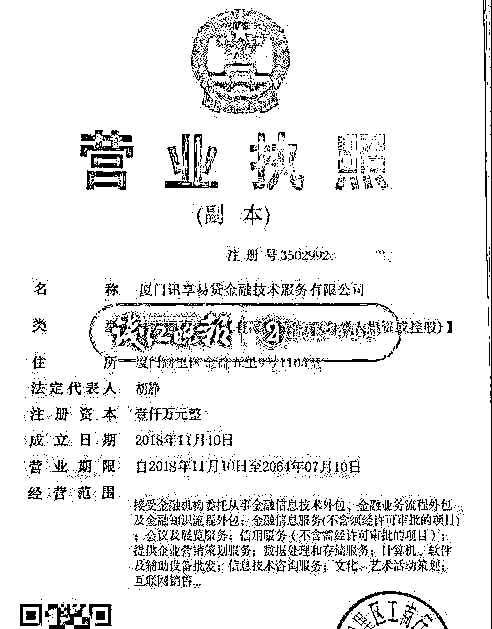
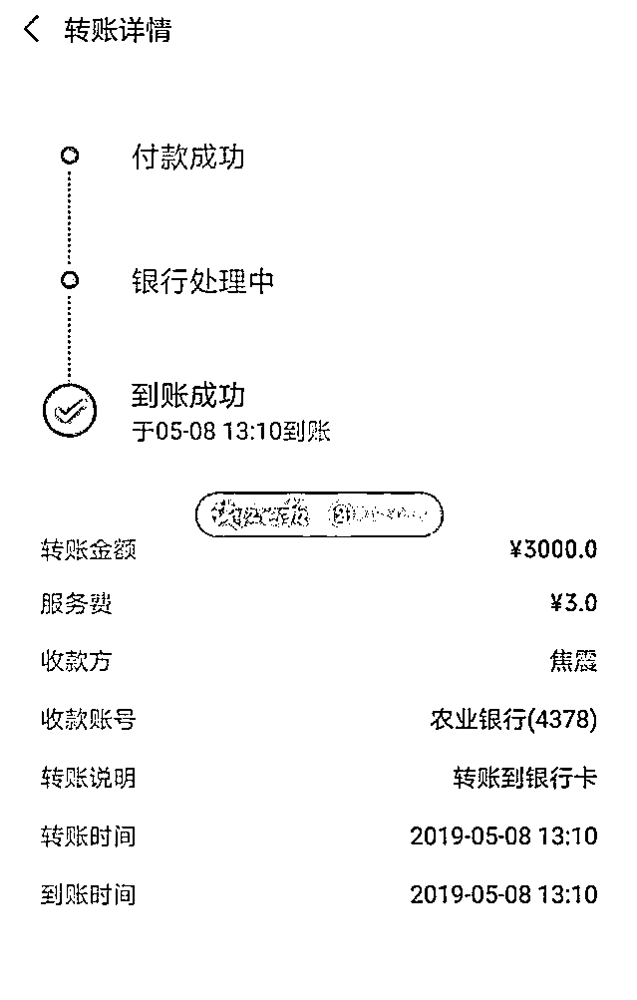
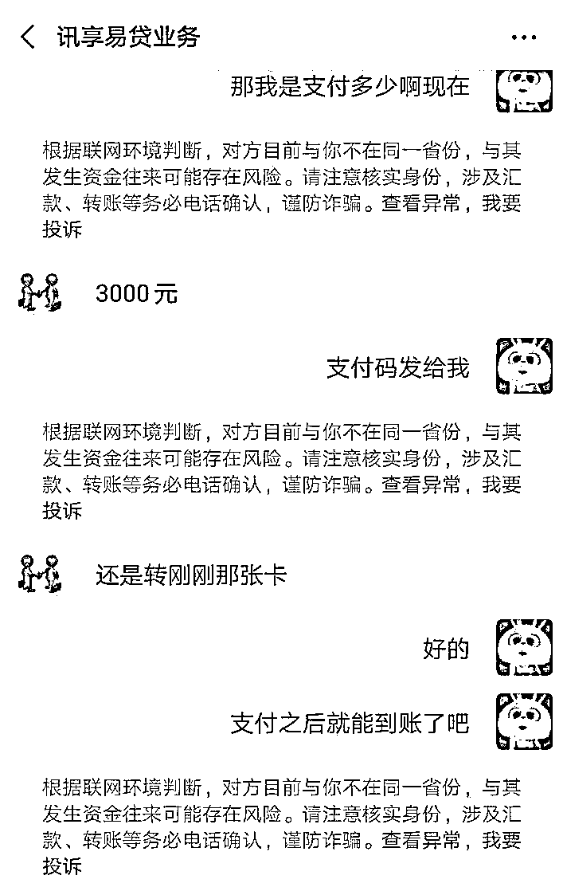
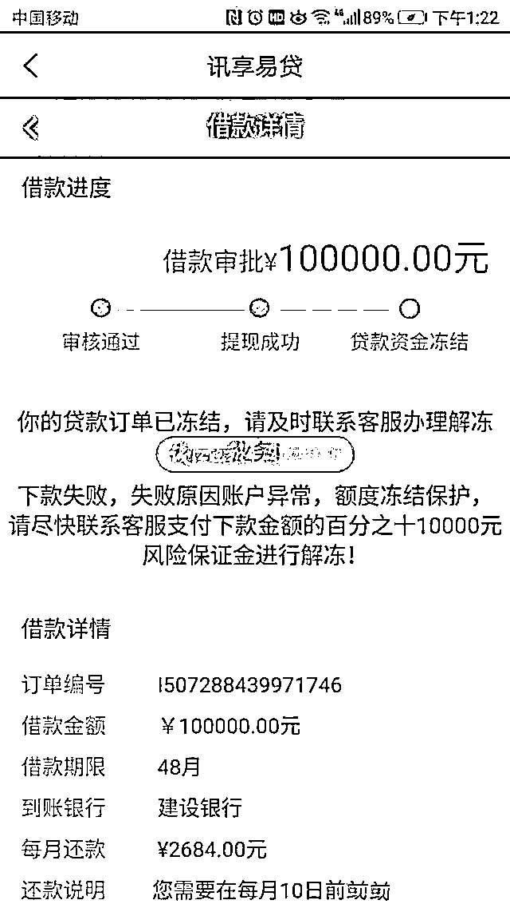

# 6 次诈骗提醒，微信直接中止操作，小伙为何还是被骗 6000？

> 原文：[`mp.weixin.qq.com/s?__biz=MzIyMDYwMTk0Mw==&mid=2247507711&idx=4&sn=c647c0b1e30f562911e1c6f29c21049a&chksm=97cb15c7a0bc9cd145def979933f30030d322d2330fd41dadd2f068e8a455c5b78c3402fcd87&scene=27#wechat_redirect`](http://mp.weixin.qq.com/s?__biz=MzIyMDYwMTk0Mw==&mid=2247507711&idx=4&sn=c647c0b1e30f562911e1c6f29c21049a&chksm=97cb15c7a0bc9cd145def979933f30030d322d2330fd41dadd2f068e8a455c5b78c3402fcd87&scene=27#wechat_redirect)

“警察同志，快帮帮我，我的钱被骗子骗走了！”

一男子慌慌张张地冲进了派出所的值班室。值班民警其马上询问了这名男子事情的原委，这名男子姓郭，他遭遇了一起网络借贷名目下的诈骗案件。

让民警唏嘘的是，在被骗的过程中，尽管已经收到系统弹出的多次交易提醒，但男子急于拿钱选择视而不见，最终还是跳入骗子的陷阱。

天下掉下个大馅饼，借贷客服主动找上门

台州玉环市的小伙子小郭手头紧，想要借五万元，于是通过网上某一平台申请了贷款，但是在填写了个人信息后却被平台拒绝了他的贷款请求。

小郭以为这样就没戏了，谁知道第二天就接到了一个电话，称可以帮他申请贷款，只需要简单几个步骤。

本来希望破灭的小郭被突如其来的“好运”砸中，而且还可以不需要繁琐的程序，他惊喜地连连答应，马上按照电话中的要求添加了客服人员的微信。

客服人员十分“专业”，介绍自己的工作后，将借贷公司营业执照、自己的身份证、本人照片都发送给了小郭证明其公司确实存在。

小郭看了后深信不疑，于是按照客服的要求下载了客服提供的平台软件，提出了自己想贷款五万元的要求，并询问了关于贷款的还贷利息等。

客服人员解惑了小郭的疑问后，最后却有些为难，告诉小郭，五万有点少，这样审批过程比较复杂，不如申请贷款金额高一点，这样批下来的几率更大一点，速度也快一点。

曾经被借贷平台拒绝过一次的小郭实在不想再接到“贷款失败”的通知，于是跟客服说：“那就申请十万元的贷款额度吧！”

借贷连环套一套接一套，看到 6 次防骗提醒仍然跳入陷阱

提交了贷款申请后，不一会儿，手机里就跳出了一条“审核通过”的通知。小郭不知道接下来应该怎么把借贷的钱提到自己的账户，于是又去询问了客服。

但是这时候客服告诉他，这笔贷款需要 3000 元的手续费，“只需要 3000 元，我就可以马上提到我的十万元吗？”得到了客服人员肯定的回答后，小郭就通过微信向对方的银行卡转账了 3000 元。

过了几分钟，客服人员告诉小郭，他申请的十万元已经提现到账平台了，但是要打到小郭的银行卡里还需要 3000 元手续费。

听到这个消息的小郭无法接受，生气地质问客服，刚才没有告诉他还需要这样的步骤，只告诉他只要一开始支付 3000 元手续费，到账后才需要额外的手续费。

“耐心”的客服向小郭解释了账款已经发到了平台，只需要一步小郭就可以拿到自己的贷款了。小郭很无奈地只好答应了。

这个时候，微信已连续给小郭发送了 5 次诈骗提醒。但是小郭熟视无睹，一心想拿到自己申请的贷款，不顾一直跳出来的防骗提醒，又继续通过微信转账试图往客服的银行卡转账了 3000 元。

这时，微信平台认为其交易存在风险，直接中止了小郭的操作。但是小郭直接无视微信的再一次风险提醒，仍然从自己的手机银行上向客服转账了 3000 元。

没拿到贷款却损失了 6000 块，他说自己实在急着拿到贷款

原本以为按照客服操作，钱很快就能到账了，但没想到，转账后，平台页面却跳出了新页面，平台说小郭申请的银行卡号码不对，导致申请贷款过程冻结。要想解冻，需要联系客服办理解冻业务，并交付百分之十的风险保证金 10000 元。

看到这个页面，小郭的心态就崩了，这个时候他才从十万元的美梦中醒来，他甚至发现客服给的平台已经打不开了，这才彻底意识到自己上当受骗了。“我只是急着要拿贷款，没想到贷款没拿到，结果还被套了 6000 元，真是赔了夫人又折兵。” 

知道了来龙去脉的民警十分无奈，这又是典型的一起因为贪图方便和便宜而上当受骗的诈骗案例。但是民警万万没想到经过六次诈骗提醒还是被小郭无视，仍然跳入了骗子的陷阱。

警方提醒

如果想要借贷要到正规渠道、银行等国家正规金融机构办理。还未放款就急着索取手续费的一定是诈骗。如遭遇贷款诈骗，借款人要第一时间报警，将被骗情况等信息提供给公安机关，协助公安机关做好止付工作，减少损失。

来源：钱江晚报，平安范县，利箭在行动

← 向右滑动与灰产圈互动交流 →

