# 疯抢茅台大战役，牛鬼蛇神全出动

> 原文：[`mp.weixin.qq.com/s?__biz=MzIyMDYwMTk0Mw==&mid=2247507795&idx=1&sn=a6a4c0d442e621a7e997e37d171c2ed7&chksm=97cb146ba0bc9d7d8ade926a5ffe04945d0ba4b4cd0c1e648bac46f99945e38f5a692fbb846d&scene=27#wechat_redirect`](http://mp.weixin.qq.com/s?__biz=MzIyMDYwMTk0Mw==&mid=2247507795&idx=1&sn=a6a4c0d442e621a7e997e37d171c2ed7&chksm=97cb146ba0bc9d7d8ade926a5ffe04945d0ba4b4cd0c1e648bac46f99945e38f5a692fbb846d&scene=27#wechat_redirect)

“酒是用来喝，不是用来炒的。”话是这样说，但是资本赋予了茅台金融属性，只要茅台一直保有稀缺性，转手一瓶能赚上好几百，抢茅台、炒茅台就会一直存在吧？

**     抢茅台大战，这些年轻人为何入局？**

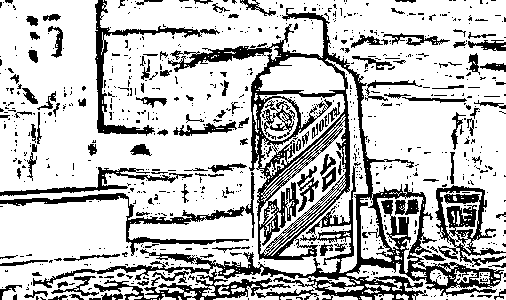

2020 年 12 月 10 日，天猫超市、京东等网商平台官方宣布将有数十万瓶平价飞天茅台入市，只不过，和重大网络产品一样，需要抢。有人说，这是茅台的又一次自我营销，给追捧者布了一个局；也有人说，就算是个局，只要有切实的好处，入了又何妨。

**悄然间，这个抢白酒的局已经摆了一个月，你入局了吗？**

除了传统的经销商渠道，茅台启动跟商超、电商等渠道的合作模式之后，“平价”飞天茅台不仅成为了各大平台的引流工具，更成为这些平台吸引用户开通会员的一大手段。 

500ml 的 53 度飞天茅台，官方指导零售价为 1499 元，但是在零售市场上，最高能够卖到超 3000 元。平价抢到后，转手卖给中间商，至少能赚几百。

所以茅台现在已经变成不少年轻人最新的理财方式，毕竟抢到就是赚到。

在抢茅台的妙招上，网友们也是各种路数花样层出不穷。专业“黄牛”们用抢购脚本和软件的降维压制就不说了，普通用户抢购更多就是拼手速。

但就是在拼手速这件小事上，也是有千差万别的，跟网友们的脑洞比起来二十年的麒麟臂恐怕也不够用。

抢茅台上演：筋膜枪大法

近日，就有网友在社交平台展示使用筋膜枪抢茅台的操作，引起了围观和讨论。

曝光的视频显示，有网友将筋膜枪放到手指上方，利用筋膜枪的高频振动，来提升手速，以此提高抢购成功几率。

好家伙，“黄牛”看了都要直呼“内行”吧！

有此操作的还不止一个，不知道这些网友到底抢到没？

这种抢茅台的方法，也引起电商平台的注意。

1 月 14 日，天猫超市官方作出回应，表示此方法不可靠，并存在身体受伤的可能，希望广大网友理性购物。同时提醒消费者，使用抢购、黄牛等软件存在隐私、财产安全等多种风险，一些抢购软件可能暗藏木马病毒。

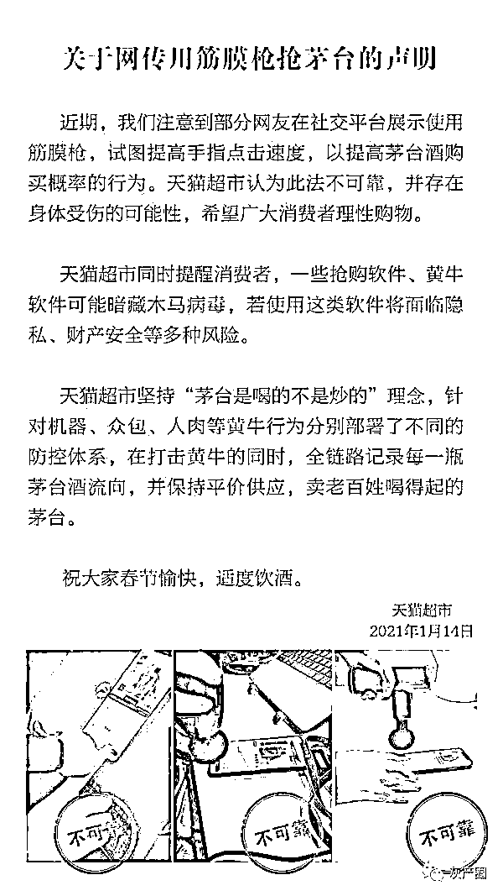

还有淘宝售卖的所谓抢茅台（物理）神器

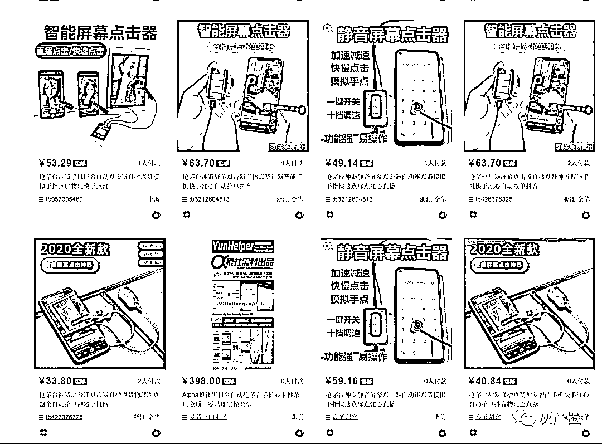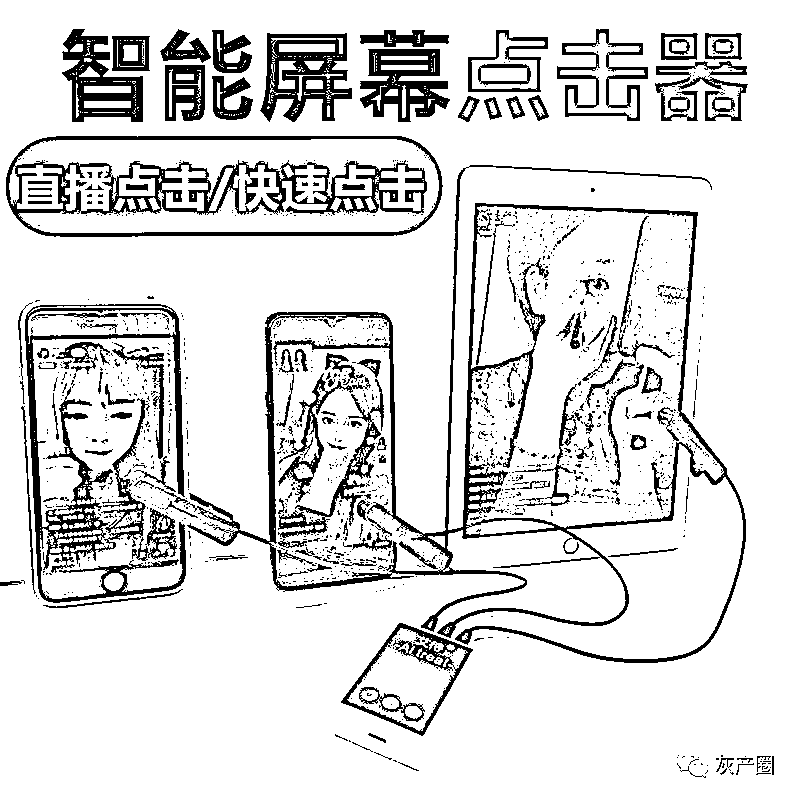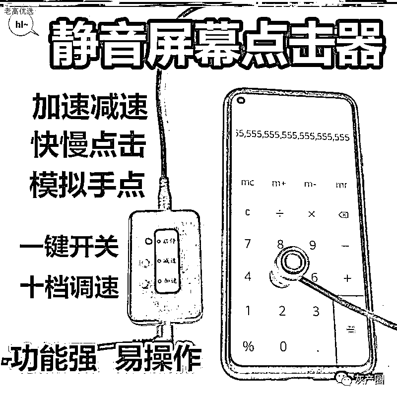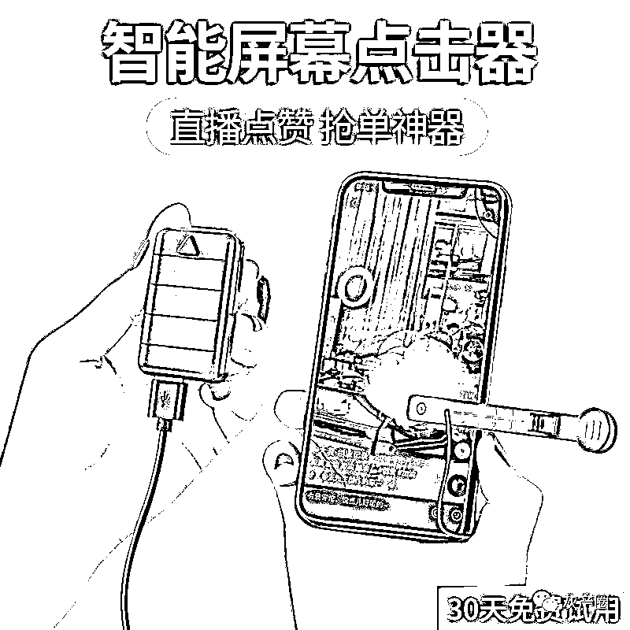天猫还强调，坚持“茅台是喝的不是炒的”理念，针对机器、众包、人肉等黄牛行为分别部署了不同的防控体系，在打击黄牛的同时，全链路记录每一瓶茅台酒流向，并保持平价供应，卖老板姓喝得起的茅台。

翻译一下就是，用了你也抢不到。。。

软件代抢“尖货”飞天：个人隐私已泄露

**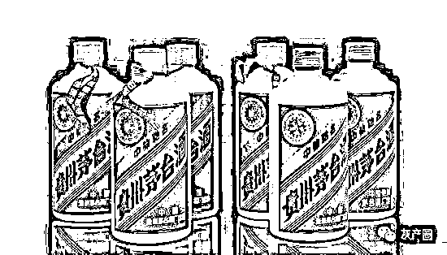**

在众多攻略的加持下，很多人仍抢不到平价飞天茅台，会将目光转向黄牛。

在与提供某大润发代抢服务黄牛沟通时，我们了解到，每抢到一瓶收费 200 元，全国均可以抢，如果是两个号的话，平均抢中率在 30%。

在京东上代抢飞天茅台的黄牛表示，抢购账号有一定要求。具体来讲，除了是 PLUS 会员，综合分要大于 103 分，且为有经常消费的优质号。每中一瓶收费 400 元。

通常操作是黄牛为申请“上车”的人提供授权码，后者将授权码输入到某网站后会生成二维码，再然后，用京东 APP 扫码二维码登陆即可。

每一天的抢购，委托代抢的人（未抢购成功）都需重新扫码登陆，并索要新授权码。而这样的方式，实际上，其将账号等相关信息告诉了黄牛。

且我们注意到，除了代抢服务外，还有各种软件脚本（代抢软件）风靡于撸茅党圈子之中。一些并没有使用过的人在微信群里询问，“脚本管用吗”“有谁用这个中过”“会不会黑号”……

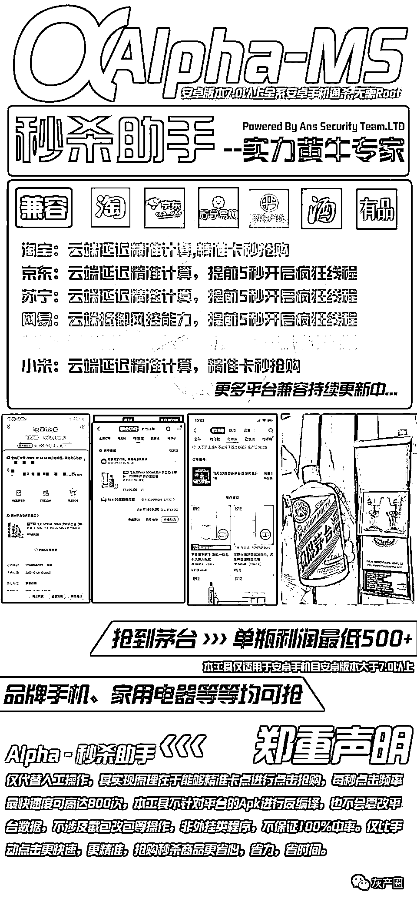

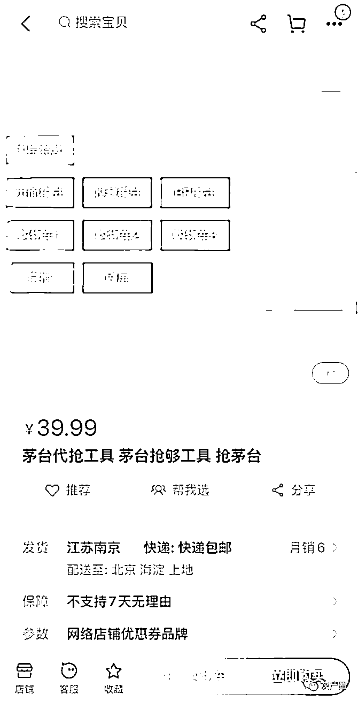

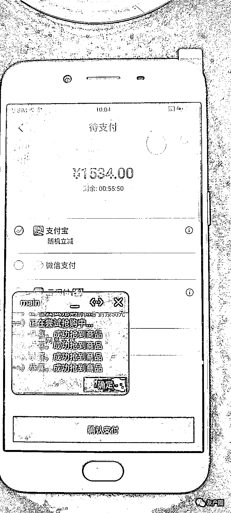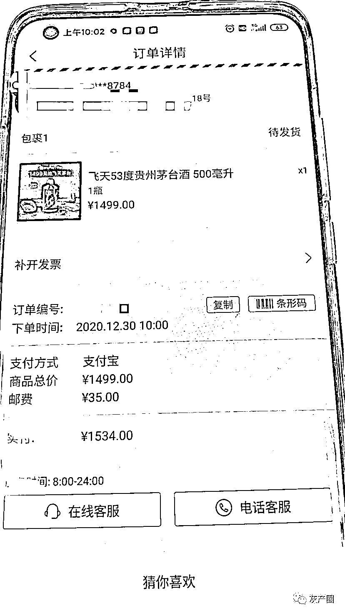

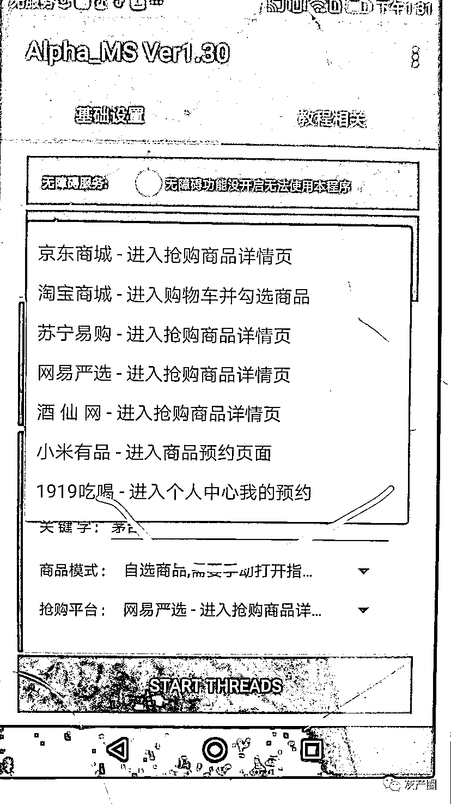

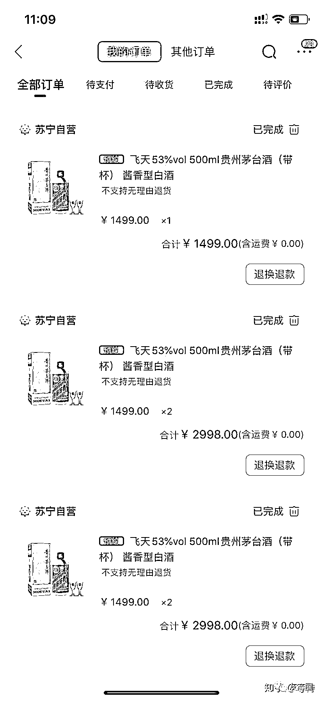　

某黄牛在群里发布宣传海报显示，该抢购软件兼容淘宝、京东、网易严选、苏宁易购等，主要是代替人工操作，其原理在于能够精准卡点进行点击操作。

该软件还宣称，每秒点击率最快速度可高达 800 次，不涉及截包改包等操作，非外挂类程序，不保证 100%中率，仅比手动点击更快速。

于此而言，天猫超市 14 日声明中提到，一些抢购软件、黄牛软件可能暗藏木马病毒，若使用这类软件将面临隐私、财产安全等多重风险。

对于机器、众包、人肉等黄牛行为，天猫超市分别部署了不同的防控体系，打击黄牛的同时，全链路记录每一瓶茅台酒流向。

另我们了解到，去年末，贵州茅台全国经销商联谊会上，茅台集团董事长高卫东表示，严肃整治和处理“高价、变形高价”扰乱市场秩序的行为，并加快反黄牛系统研发工作。

人海战术：高校组织学生抽茅台

网上一条微博则爆料称，位于该市的辽宁广告职业学院准备组织学生到商场去取中奖的茅台酒，涉及的区域包含于洪区、皇姑区华润万家 3 家店。

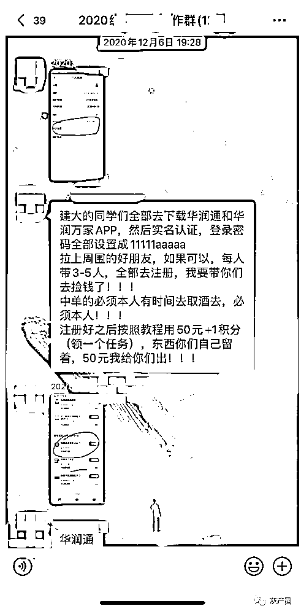

一名该校学生称，2020 年 12 月 6 日开始，班长传达学生处通知，要求学生实名注册华润万家 app，然后去抽奖 1499 元一瓶的茅台酒。1 月 8 日，班长通知，中奖者 9 日上午乘坐学校专车去取酒，交回学校后，可以获得 50 元奖励。

因为一条曝光微博，班长紧急通知停止取酒行动。1 月 10 日，该校学生处处长杨帅告诉记者，学校没有这个事儿发生，疫情期间，学校一直封闭管理，学生不能外出。

**聊天截图：**

学生抽奖注册须统一密码 报完名发截图给班长统计

1 月 10 日，记者联系上微博发布者小苏（化名）。他说这个活动从 2020 年 12 月 6 日开始，班长在班级群直接传达学生处通知。

“让我们下载华润万家 app，然后实名注册，每个人必须用统一指定的密码。”小苏说，注册完就让大家去抽奖，抽中一瓶茅台酒只需要支付 1499 元，“现在外面一瓶都可以卖到 3000 多元了，中奖算是低价购买，学校会把钱转给抽中的同学。”

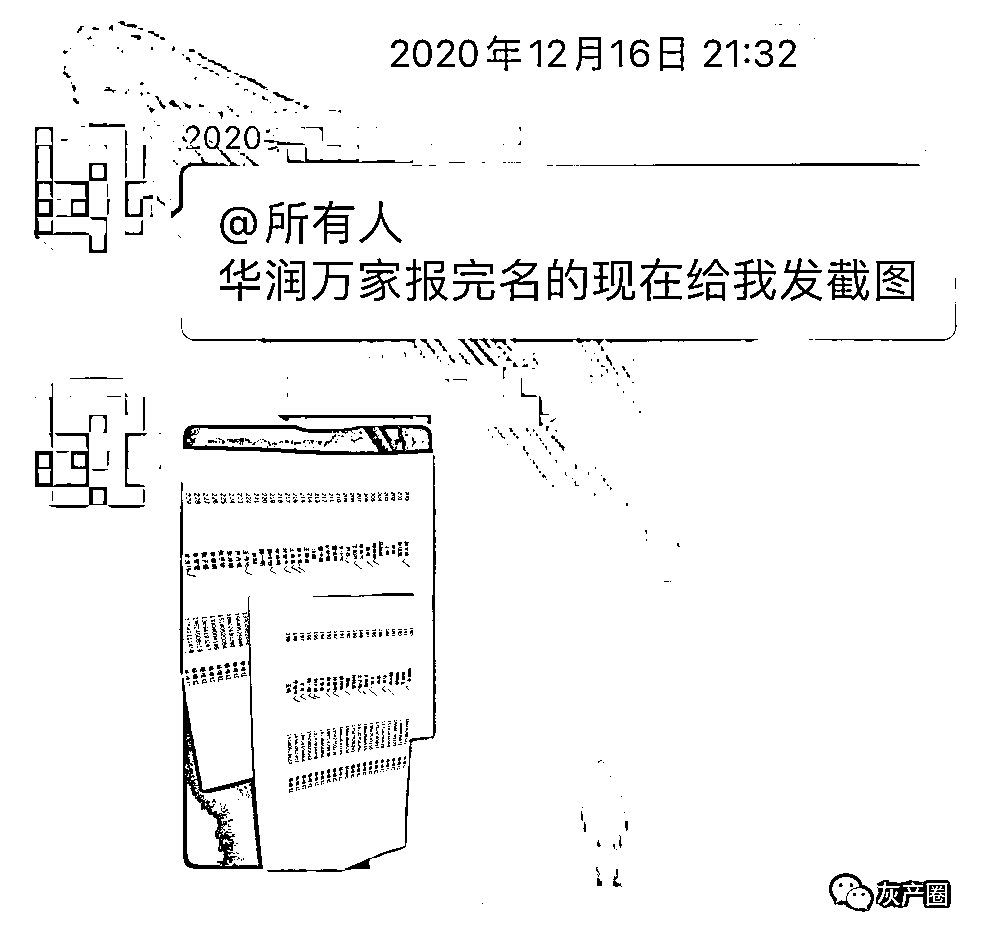

小苏提供的聊天截图显示，该校 2020 级一个 120 多人的班级里，晚上 7 点半后，一名学生@所有人，让大家“现在注册”，要求注册后马上完成实名认证，然后要发截图，并称“上边有要求，统一密码，实名认证，看个视频就行”。

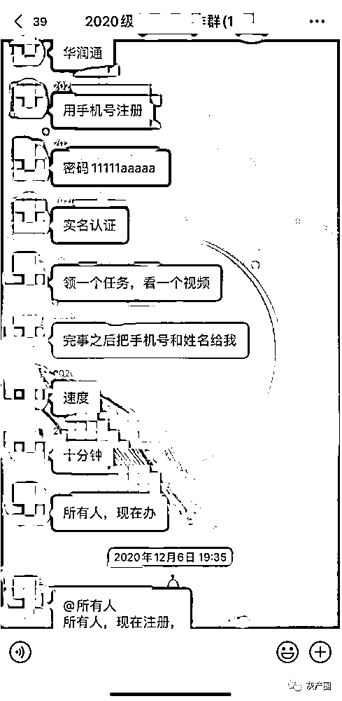

小苏说，群内发言的是班长，他嘴里的“上边”是校学生处。班长要求大家在课后完成，“带有强迫性，所有人都用一个密码，不注册班长还在群里点名。“小苏提供的截图证实，班长确实在群里说：”没给我发的，等着我点名呢吗？现在给我发，九点不发我就发名单点名了。“

小苏说，这项注册和抽奖从 2020 年 12 月 6 日一直持续到 12 月 16 日，“所有班级有 800 多人参加，100 多人中奖。“

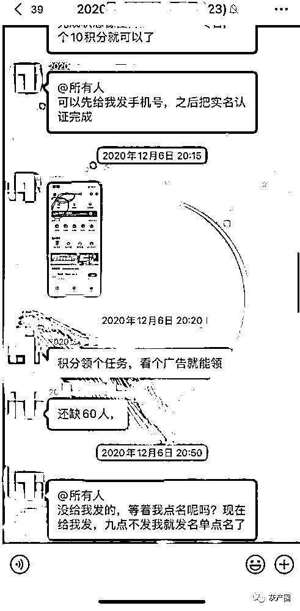

**中奖学生：**

**取酒后可以获得 50 元钱 前一天突然通知取消**

1 月 10 日，一名中奖学生告诉记者，本来通知 1 月 9 日取酒，但是 9 日上午突然通知取消了，“听说是因为有人发了微博。“

这么学生说，中奖买酒的钱是学校出的，酒取回来要交给学校，“完事儿了，会给我们 50 块钱，我们也没多抵触，学生都是小孩嘛，也没啥事儿。“

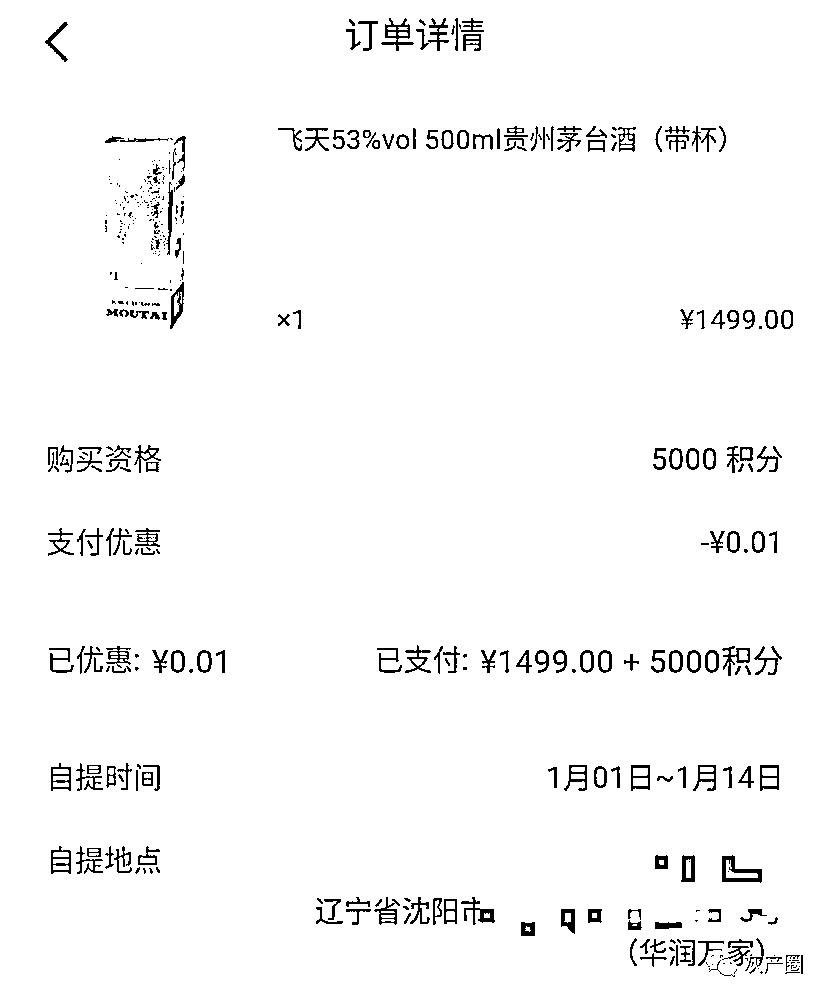

该校另一名学生则表示，沈阳疫情这么严重，还组织学生去取酒太冒险了，可能是取酒时间快到了，因为规定的时间是 1 月 1 日至 14 日，“学校开学就封闭的，突然通知统一坐车出去，学生肯定是办不到的，只有学校领导才行。“

一个 21 人的群聊里，班长@所有人：“明天早上九点之前停车场集合，跟随学校车去领酒，不可以不去，看好你们中奖的店铺，别走错了，收到回复。“随后，班长发出了一张中奖名单截图。

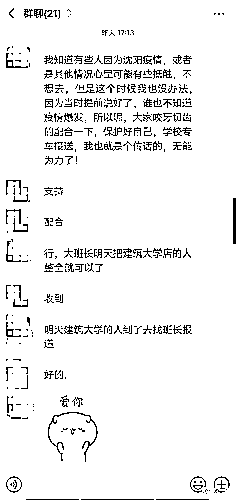

据介绍，这个聊天发生在 1 月 8 日下午，当时班长还在群里发消息：“我知道有些人因为沈阳疫情，或者是其他情况心里可能有些抵触，不想去，但是这个时候我也没办法，因为当时提前说好了，谁也不知道疫情爆发，所以呢，大家咬牙切齿的配合一下，保护好自己，学校专车接送，我也是个传话的，无能为力了。“

1 月 10 日，这位班长在电话里告诉记者，他就是一个普通学生，传一下话，“其他的我不想接受采访。“

**校方回应：**

没有这个事儿发生 可能是学生组织活动

1 月 8 日晚，一个名为“华润“的 24 人微信群里，名称为”学生处宋 xx“ 的人说：”因为疫情原因，所以明天取酒活动取消，请各班负责人通知一下本班的学生。“

1 月 10 日，该校学生处处长杨帅回应称，有派出所联系学校，学校查了一下，“没有这个事儿发生，我们了解的情况，这两天没有人外出，疫情期间封校管理，没人出去。可能有学生组织活动，想外出，我们没同意。“

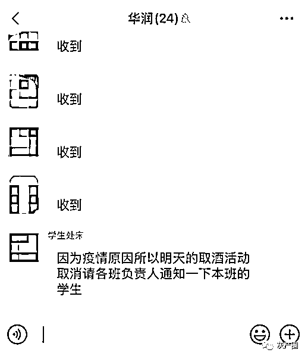

杨帅说，网上传的信息都不属实，“我找了那个被截图的班长，他们是自发想出去取酒，可能是学生一个自己的活动，学生自己可以得到一点好处，但不是学校组织的。“

对于聊天截图其他信息，如统一设密码等要求，杨帅均回应称“没有没有“，”今天调查的，没有发生，这种事肯定是查无实证的。“

10 日下午 3 时许，知情人介绍，学校正在追查微博发布者，有学生被叫到学生处谈话。

最后

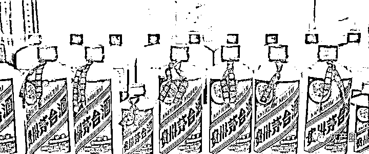

为了抢茅台，可谓是神仙打架：黄牛，学校，羊毛党全体齐出动，各路牛鬼蛇神都出来抢茅台了！搞得我们也蠢蠢欲动，算了，还是老实写文章吧！

**附上：**

**年底发横财指南，只能帮到你这了！**

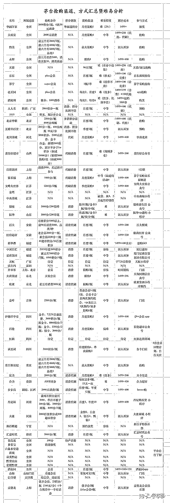

← 向右滑动与灰产圈互动交流 →

