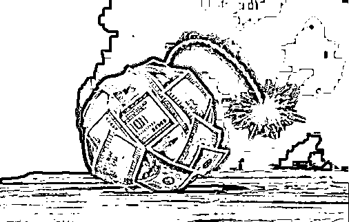
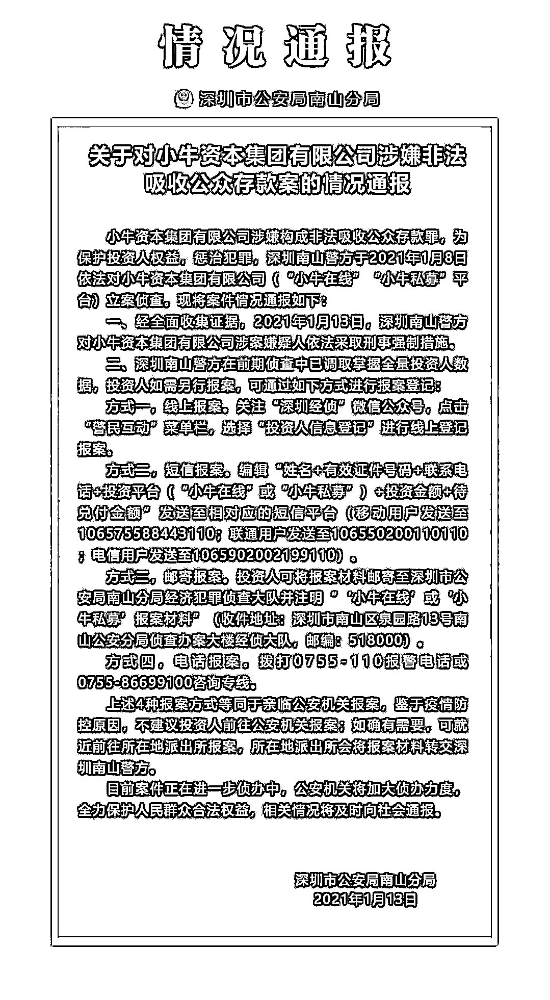
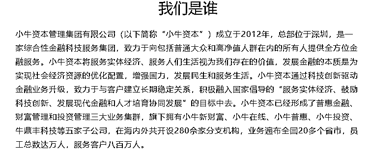
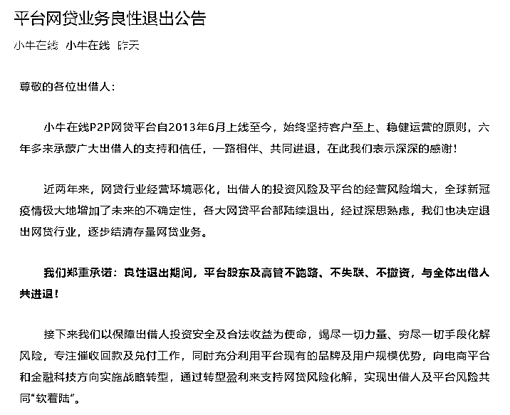
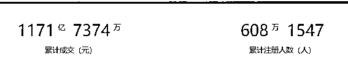
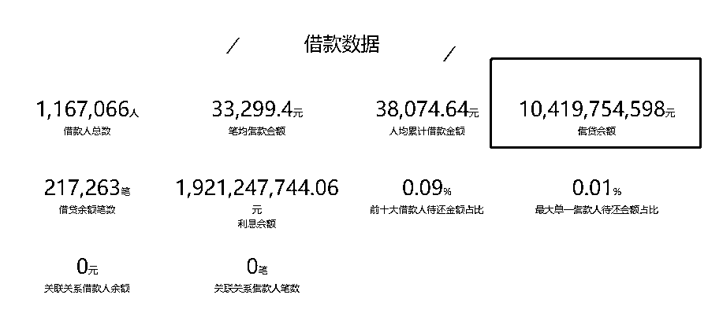
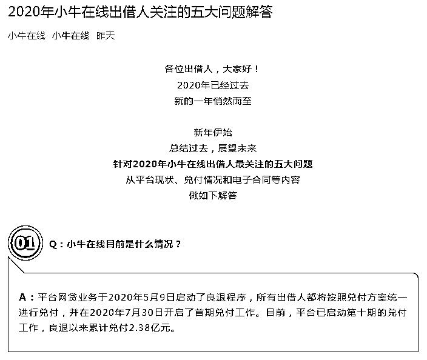
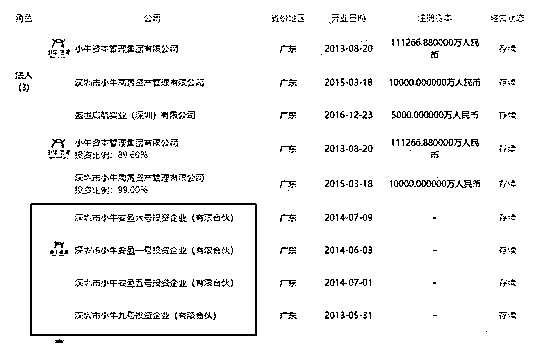
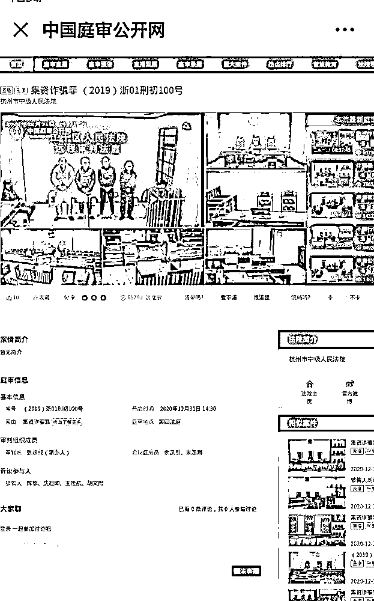

# 2800 亿——中国最大庞氏骗局崩了！

> 原文：[`mp.weixin.qq.com/s?__biz=MzIyMDYwMTk0Mw==&mid=2247507795&idx=2&sn=f76849a97b5bfa4ddcf8e8fce8cec512&chksm=97cb146ba0bc9d7d460b7a81dc2741da2c135fa52a35e63b52480ae619bb178aa726aa57fc72&scene=27#wechat_redirect`](http://mp.weixin.qq.com/s?__biz=MzIyMDYwMTk0Mw==&mid=2247507795&idx=2&sn=f76849a97b5bfa4ddcf8e8fce8cec512&chksm=97cb146ba0bc9d7d460b7a81dc2741da2c135fa52a35e63b52480ae619bb178aa726aa57fc72&scene=27#wechat_redirect)

苟延残喘了半年多之后，广东最大的 P2P 平台之一——小牛资本，终于还是爆了。

小牛资本爆雷

深圳南山警方对嫌疑人依法采取刑事强制措施

1 月 13 日，深圳南山公安发布通报称，小牛资本集团有限公司涉嫌构成非法吸收公众存款罪，为保护投资人权益，惩治犯罪，深圳南山警方于 2021 年 1 月 8 日依法对小牛资本集团有限公司("小牛在线”"小牛私募”平台)立案侦查。经全面收集证据，2021 年 1 月 13 日，深圳南山警方对小牛资本集团有限公司涉案嫌疑人依法采取刑事强制措施。

小牛资本官网介绍，其成立于 2012 年，旗下平台包括小牛普惠、小牛在线、小牛新财富、小牛投资和牛鼎丰科技；涉及普惠金融、财富管理和投资管理业务。2020 年 10 月 23 日，中基协公告称，注销 7 家机构私募基金管理人登记，其中包括小牛投资。公开资料显示，小牛投资是小牛资本旗下私募，头部 P2P 平台小牛在线的兄弟公司。

半年前曾宣布良性退出

结果 100 多亿只兑付了 2 亿多

2020 年 5 月 9 日，小牛在线在其微信公众号发布《平台网贷业务良性退出公告》，称自公告发布之日起，平台将停止发布任何新标及停止计息，并关闭出借人开户、充值、投标等功能；同时，自公告发布之日起，暂缓兑付，待兑付方案经全体出借人公开投票表决通过以后，按照兑付方案启动兑付工作。

当时小牛在线表示，近两年来，网贷行业经营环境恶化，出借人的投资风险及平台的经营风险增大，全球新冠疫情极大地增加了未来的不确定性，各大网贷平台都陆续退出，经过深思熟虑，我们也决定退出网贷行业，逐步结清存量网贷业务。我们郑重承诺：良性退出期间，平台股东及高管不跑路、不失联、不撤资，与全体出借人共进退！

小牛在线于 2013 年 6 月上线，总部位于深圳，公司实控人为小牛资本集团董事长彭铁。2018 年 6 月，小牛在线出现逾期。

官网信息显示，小牛在线平台累计成交额 1171 亿 7374 万元，累计注册人数达 608 万，目前借贷余额 104.2 亿元。

值得注意的是，小牛在线公众号在此前一天（1 月 12 日）还曾对外披露出借人关注的五大问题解答。

关于兑付进展，小牛在线方面表示，自 2020 年 5 月 9 日宣布良退以来，平台已启动第十期的兑付工作，良退以来累计兑付 2.38 亿元。而根据平台宣布良退时（2020 年 5 月 9 日）披露的数据显示，彼时其借贷余额为 104.2 亿元。这也就意味着，平台退出半年多以来，其兑付比例仅为 2.28%。

小牛系幕后掌控人彭铁

**据此前证券时报报道，草根出身的平台做到千亿级规模，放眼业界都实为罕见，而这一切的背后，有一个关键人物——彭铁。**

**公开资料显示，彭铁 1976 年出生于湖南邵阳市的一个小乡村，是家中六个兄弟姊妹的老幺，邵阳师范毕业，后去湖南大学读书，中山大学金融学研究生。**

**其最被人所知的个人从业经历则是担任过佳兆业金融投资有限公司总裁，隶属于香港上市公司佳兆业集团。2012 年，成立小牛资本，在创办小牛在线之前，彭铁曾参与创办了网贷平台人人聚财，负责风控方面的业务，之后离开创办了小牛在线。而 2015 年，彭铁率领小牛在线重新入股了人人聚财，但在 2017 年再次退出。**

**根据天眼查数据显示，彭铁围绕着小牛资本管理集团有限公司打造出了一个巨大的金融帝国，与他产生控制关系的公司多达 88 家，有些小牛旗下的小公司甚至没有命名，直接以数字代号一、二、三代指。**

****

**值得一提的是，其在股权投资中最大的特点并不是参股，而是控股，投资占比基本在 80%以上，拥有绝对话语权。彭铁个人持有小牛资本 89.6%股权，旗下板块小牛在线、小牛金服、小牛普惠、小牛新财富、小牛投资等公司都占据 100%股权。**

**“彭铁是一个个人能力很强，有野心，眼光独到的人，对公司有着很强的控制欲，当时小牛在线发展态势很猛，也有 VC 机构想投资入股，但因为价格谈不拢，以及他不愿意稀释股权，所以就错过了，再到后面风投也不敢进来了。其实大家私下都喜欢叫他铁哥，身上还带有江湖义气。”一位前小牛内部人士如此评价彭铁。**

**************已有多个 P2P 头部平台创始人被判无期**

**1 月 4 日，从中国庭审公开网获悉，2020 年 12 月 31 日，杭州中级法院经远程开庭对浙江佐助金融信息服务有限公司（下称“佐助公司”）涉嫌集资诈骗一案进行一审判决，被告人王旭航、胡文周均被判处无期徒刑，剥夺政治权利终身，并处没收个人全部财产。**

****

**王旭航是“牛板金”创始人，佐助公司董事长；胡文周系该案资金主要使用人之一。**

**“牛板金”P2P 网贷金融平台是“佐助公司”旗下平台，2015 年 11 月上线运营。2018 年 7 月 3 日晚，“牛板金”在其官网发布项目逾期公告，称 9852.2251 万元的借款项目发生逾期。同年 7 月 4 日，创始人、CEO 王旭航发布公开信称，项目逾期原因是行业环境恶劣，出现风险事件导致挤兑。**

**2018 年 7 月 6 日，杭州市公安局江干区分局发布关于“牛板金”涉嫌非法吸收公众存款案的通报。2019 年 7 月 15 日，江干公安分局发布案情通报称，依法对佐助公司涉嫌集资诈骗案立案侦查。至当时警方通报时止，公安机关已将犯罪嫌疑人王旭航、胡文周等 9 人移送至检察机关审查起诉。**

**杭州中院审理查明，2015 年 8 月 25 日，王旭航等人出资成立浙江佐助金融信息服务有限公司，同年 11 月 20 日在网上成立“牛板金”P2P 网贷金融平台。被告人王旭航、陈鄂等，利用实际控制的公司在“牛板金”平台发布期限 1 天~365 天不等的借款标的，通过公开宣传保本付息，支付年化利率 7%~15%投资收益为诱饵，向社会不特定人员非法集资。2017 年 7 月，王旭航等人将“佐助公司”以 8 亿元的价格转让给王戎（另案处理）控制的公司。同年 8 月起，王旭航等人明知“牛板金”平台存在大额代偿金额无法兑付，仍伙同王戎控制的公司在“牛板金”平台发布借款标的进行非法集资。经审计，2015 年 11 月 20 日至 2017 年 7 月 3 日期间，“牛板金”平台累计吸收 17.8 万余人共计 391.4 亿余元，还本付息 355.3 亿余元，剩余本金 36.1 亿余元。至案发，造成 4.28 万人实际损失 38.7 亿余元。**

**2020 年 12 月 23 日下午，广州市中级人民法院，对广州 P2P 第一案礼德财富集资诈骗案，进行了判决。幕后主使林捷鹏被判处无期徒刑；董事长郑彦森被判处 15 年有期徒刑。**

**礼德财富成立于 2013 年 6 月，是目前中国服务历史较长的互联网金融信息平台之一。在广东 P2P 平台中排名第三，有良好的声誉，接举报前该平台并未发生资金链断裂问题，一切正常运营。**

**2018 年 7 月 23 日，礼德财富官网发布重要公告称，“非常抱歉地告诉大家，部分项目逾期，礼德财富实际控制人郑彦森目前暂时失联”，平台将停止发标，保持正常运营。**

**2018 年 7 月 27 日，礼德互联网金融信息服务有限公司被广州市公安局立案侦查。**

**经警方查证，“礼德财富”在未经有关部门批准的情况下，通过媒体广告等公开宣传方式，向社会不特定公众销售固定收益为 7.8%-15%不等的 30 天至一年期质押担保理财产品（主要是玉石质押），共吸收资金约 13 亿元，涉及投资人约 1.7 万人。**

**案发前，主要犯罪嫌疑人郑彦森潜逃境外。**

**2018 年 8 月，公安部赴柬埔寨开展缉捕工作，最终成功将郑某森缉捕归案。**

**来源：中国基金报 **

********

**← 向右滑动与灰产圈互动交流 →**

****