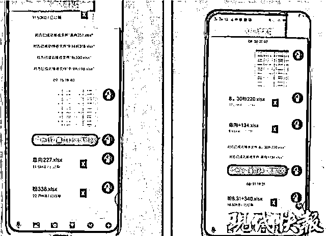
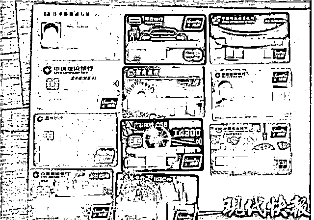

# 诈骗群里的专业“气氛组”，演技吊打一线小生

> 原文：[`mp.weixin.qq.com/s?__biz=MzIyMDYwMTk0Mw==&mid=2247507795&idx=3&sn=43387a4016fd8ab2326d08bcf97d122f&chksm=97cb146ba0bc9d7dec829ad37b0c65d650d6339153b8c7c5e4748a67b87890950b75a9e53f1a&scene=27#wechat_redirect`](http://mp.weixin.qq.com/s?__biz=MzIyMDYwMTk0Mw==&mid=2247507795&idx=3&sn=43387a4016fd8ab2326d08bcf97d122f&chksm=97cb146ba0bc9d7dec829ad37b0c65d650d6339153b8c7c5e4748a67b87890950b75a9e53f1a&scene=27#wechat_redirect)

如今，电信网络诈骗犯罪变得愈发产业化，分工更为细化，甚至出现了一种名为"气氛组"的组织，专门为投资理财类诈骗平台吸引粉丝、营造声势。

而每拉一个潜在受害人进入微信群，都能得到上游诈骗团伙的人头费。

近日，苏州高新区警方成功打掉一个"气氛组"网络黑灰产业团伙，共计抓获嫌疑人 19 人，端掉作案窝点 12 处。

*△"气氛组"内部交流*

电话邀请入群：资深股民被骗 50 余万

2020 年 8 月份，苏州市民黄女士来到高新区分局狮山派出所报案称：自己"炒股"亏了 50 余万，感觉自己被骗了。

据了解，2020 年 7 月时，黄女士接到一通电话，对方推荐其加入股票群，称群内有专业老师免费股票行情走势，还会传授股票知识并推荐牛股 。爱好炒股的黄女士便加入了这一名为"老刘论股"的微信群。

据黄女士回忆，自己进群后，群里每天都热闹非凡，老师和学员都在讨论股票投资知识，且内容较为专业。可没过几天，群里的老师称现在股票不好做，推荐大家在一款交易平台上交易，买涨买跌都能赚钱。随后几天，陆续有群友在微信群里展示自己完成老师的"新手盈利布局"后在该平台赚了多少钱。

黄女士一看群友们陆陆续续都赚到了钱，就也加入了这个行列，打算投入一万元试水。此时立即有一名平台助理加了黄女士微信，为其提供平台注册和"代充"服务。所谓的"代充"，就是扫描助理提供的微信或者支付宝收款二维码进行转账。

"在第一笔投资尝到甜头之后，我便又陆续投入了十几万元，期间老师称投资有赚有亏是很正常的，关键在于坚持，要紧跟他的布局。可我投入的金额越多却赔的也越多，直到账户里的 50 多万几乎快赔光了，再去找老师和股友讨教翻盘的方法时，却发现均已被对方拉黑。"如梦初醒的黄女士之后向公安机关报警。

犯罪愈发产业化：拉人进群即给 180 元人头费

接到报警后，高新区分局抽调精干警力成立专案组开展侦破工作。通过大量的数据碰撞比对，侦查员最终掌握了和被害人黄女士联系的客服张某的真实身份，并以此为突破口，逐步明晰了该团伙的涉案人员构成情况，而收集到种种线索均指向广东省某市。

专案组立即决定兵分两路，一组继续留守苏州研判分析，另一组奔赴广东走访调查，线上线下同步推进侦查。经过一个月艰苦卓绝的侦查工作，犯罪嫌疑人张某等人背后的幕后人员廖某，廖某的幕后老板钟某也逐渐进入侦查员的视野。

2020 年 9 月 16 日，高新区警方在当地警方的配合下，兵分十二路同时统一收网，当场抓获嫌疑人 18 名，另有 1 名嫌疑人慑于压力于当日至当地公安机关投案自首。至此，该"气氛组"犯罪团伙的嫌疑人全部到案，诈骗平台也被捣毁。

"如今，电信网络诈骗犯罪的流程化、组织化和产业化色彩愈发浓厚，各环节分工更加明确，也由此催生了一条地下黑灰产业链，气氛组团伙就是整个链条的第一个环节。"

该起案件中，犯罪嫌疑人钟某、廖某等人就是专门为上游以投资理财为名实施诈骗的团伙进行吸引粉丝、营造声势的"气氛组"。

2020 年 3 月份，钟某、廖某购买了大量二手手机、电话卡等工具，在广东省某市一幢写字楼内租下两间办公室，并以招聘客服的名义招进人员 13 名，人员到位后，钟某对她们进行了相应的话术培训，而客服就负责按照话术打电话给像黄女士这样经过系统随机拨打电话后筛选出来的股民粉，客服每"吸一个粉"（即有人加入微信群）就可以获取 30 元的人头费，而钟某则可以从上家那里获得每个粉 180 元的好处费。

"气氛组"成员披着股友的马甲，每天活跃在群里。其实，这些"股友""客服"文化程度普遍不高，但他们或多或少都接受过一些股市方面的培训，并会按照统一的话术进行对话，显得十分专业，从而骗取受害人信任。他们采用广撒网的方式，到处电话邀请像黄女士这样的受害人进群。

目前，嫌疑人钟某、廖某等 4 人因涉嫌诈骗罪已被依法逮捕，另有人因涉嫌诈骗罪被依法取保候审，案件正在进一步侦办中。

来源：鹿头社，反诈骗先锋，现代快报

← 向右滑动与灰产圈互动交流 →

