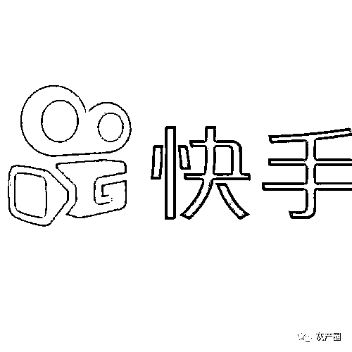
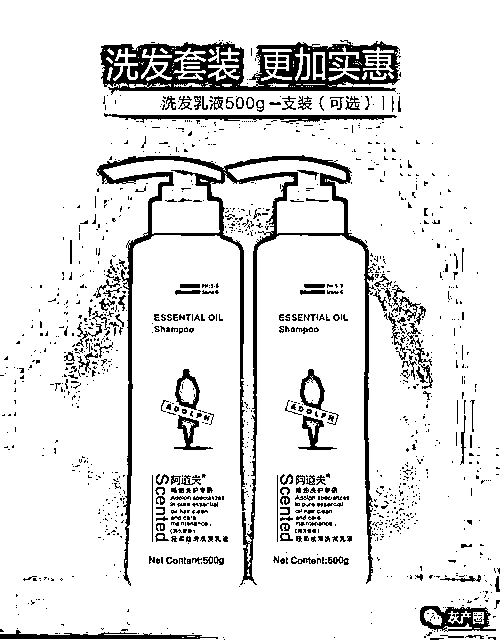
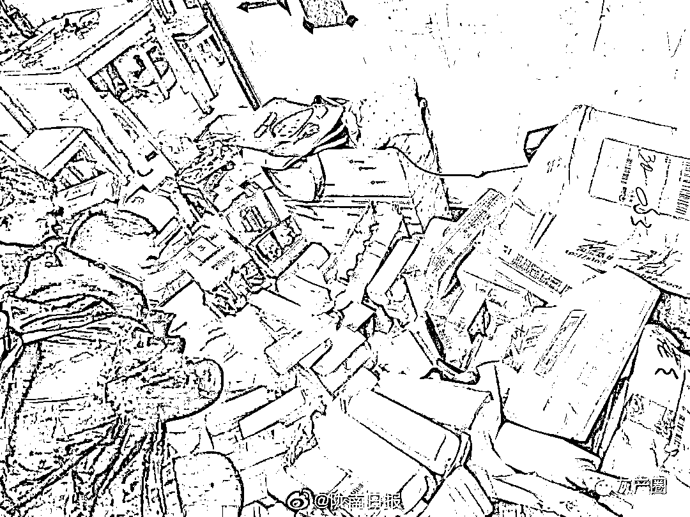
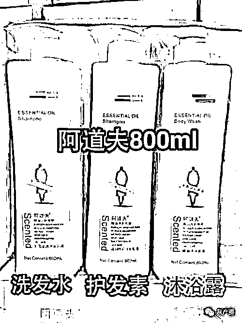
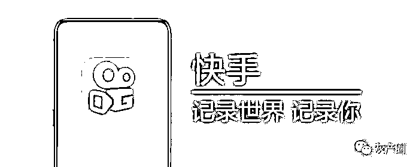
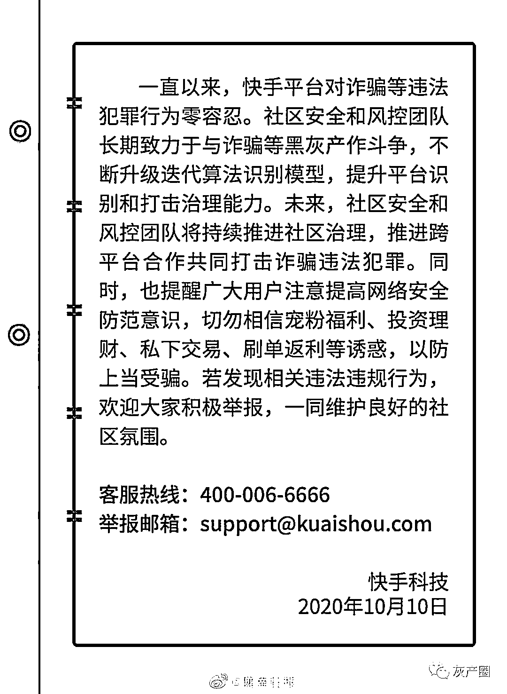

# 你在快手买的“阿道夫”，很可能是假的！

> 原文：[`mp.weixin.qq.com/s?__biz=MzIyMDYwMTk0Mw==&mid=2247507795&idx=4&sn=2396c990f893656527475493837b35dd&chksm=97cb146ba0bc9d7db55674e80e4748ffea10b403a631be0227b15920378a0da56110d4202ac0&scene=27#wechat_redirect`](http://mp.weixin.qq.com/s?__biz=MzIyMDYwMTk0Mw==&mid=2247507795&idx=4&sn=2396c990f893656527475493837b35dd&chksm=97cb146ba0bc9d7db55674e80e4748ffea10b403a631be0227b15920378a0da56110d4202ac0&scene=27#wechat_redirect)

明知快手账号因售假被封禁，仍不断购买新账号继续售假。2020 年 12 月 18 日，快手协助南京警方将在平台售假“阿道夫”洗护产品的犯罪嫌疑人成功抓获，并依法采取刑事强制措施。这是快手电商 2020 年以来联合警方打假的又一起案件。 

夫妻居家售假被抓

2020 年 11 月，快手客服接到多个用户举报，快手平台上某商家销售的阿道夫系列产品为假货。为了保护消费者权益，维护快手电商健康秩序，快手官方联合“阿道夫”权利方对该商家账号已销售出的商品进行鉴定。经权利方鉴定确认，快手上该商家售卖的“阿道夫”系列洗护产品均为假货。

快手配合警方通过数据分析与关联，发现与此账号关联多个快手小店，而该批快手号的背后人是河北省邯郸市的苏某、王某。随后快手协助消费者向其所属地南京警方报案。

2020 年 12 月 18 日，南京市建邺公安分局在邯郸市抓获售卖假冒阿道夫洗护产品的嫌疑人两名，现场查获假冒阿道夫 400 余瓶，作案手机设备十几部，售假金额近百万，其中国庆期间 60 余万元。

微信添加“总代理” 售假被封仍不停手

据嫌疑人苏某和王某夫妇供述，今年 6 月，苏某在微信群中添加了一个自称是“阿道夫总代理”的账号。双方约定，“阿道夫总代理”负责发货和售后，苏某负责直播销售，售卖价格三瓶一套 59.9 元（每瓶 800ml 的规格，消费者自主搭配洗发水、护发素或沐浴露），远远低于市场价格。

苏某告诉民警，开一场直播大概 2-3 个小时，直播中使用样品讲解，以“阿道夫”去油去屑的功能和超低的价格为卖点，配合观众互动，讲解识别真假“阿道夫”的方法，引导消费者下单购买。到 7、8 月份时，因被消费者投诉“售假”，苏某的账号被快手官方封禁。到了 10 月，为了继续赚钱，苏某又重新申请了账号继续直播。仅国庆期间，夫妻俩每天直播一到两场，共卖了一万多单，共三万瓶左右。

目前苏某和王某已被依法采取刑事强制措施，案件正在进一步办理中。

持续打击黑灰产售假 半年处置售假商家 3000 多户

## 

据快手方面协助调查的工作人员介绍， 夫妻二人售假得逞主要通过以下手段逐步完成：

**通过灰产购买账号（或手机号），借用老家亲戚、邻居的身份证实名认证；在直播时通过灰产购买虚假人气，让直播看起来人气很旺；待引来真实人气并产生订单后，从广东汕头代发货；单一账号在爆单后因产生投诉，账号会被封禁处罚；嫌疑人再重新购买账号，重复以上操作。**

“买卖账号，买卖虚假人气等，这些都是快手平台持续打击的黑灰产。”快手电商治理相关负责人表示，该商家的不法行为干扰了快手电商正常推广和营销秩序，甚至对平台其他合规商家的声誉造成不良影响。

据介绍，2020 年 5 月以来快手已累计处置售假商家 3000 多户，累计处理利用黑灰产账号销售劣质商品的团伙账号 2000 余个。未来，快手电商将进一步升级风控抓取模型，细化召回涉嫌售假的商家明细，拓宽违规收集渠道，提高劣质电商处置效率，为快手电商打造良好的营商环境和坚实的秩序基础。

一年累计处置涉黑灰产账号上千万个

据了解，在目前大部分的黑灰产链中，机器人账号的质量和数量很大程度决定了黑灰产的投入产出比。

据社区治理相关负责人介绍，在限制批量注册机器人账号方面，快手平台除了通过各类技术手段进行识别、“打标”、跟踪、排查外，还结合用户的场景行为进行甄别，并在内容发布、评论、观看直播等各个业务场景做进一步筛选，以及时发现、处置机器人账号。针对刷粉、刷播放量等行为，2020 年已累计处理相关涉黑灰产账号千万以上。其中 2020 年 11 月处理的涉黑产违规账号已超百万个。

未来，针对黑灰产帐号的不法行为，快手除了在风控侧进行有效识别和处置外，还将加强在互联网生态层面的治理，同时积极推动跨平台合作，共同打击黑灰产等违法犯罪，持续加强与公安、法院等部门的合作，从法律层面对平台黑灰产犯罪进行有效打击。

来源：中国新闻网

← 向右滑动与灰产圈互动交流 →

