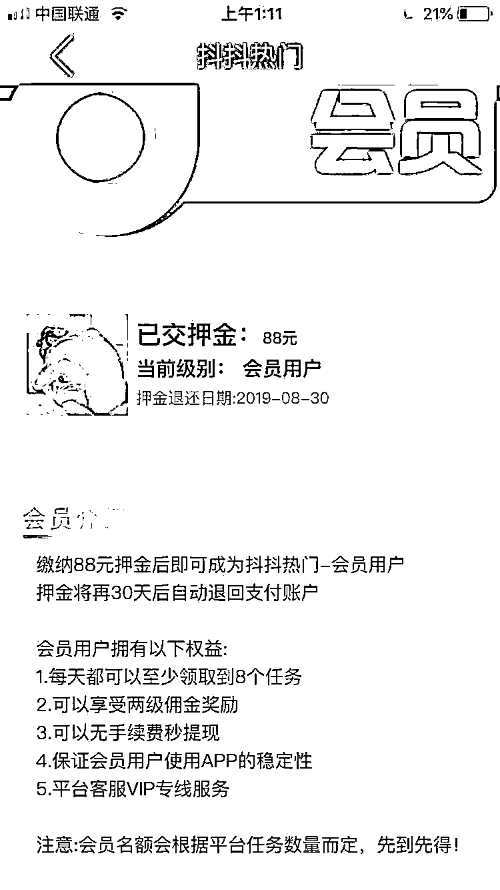

# 最新网络兼职骗局，抖音、快手用户注意了……

> 原文：[`mp.weixin.qq.com/s?__biz=MzIyMDYwMTk0Mw==&mid=2247507823&idx=1&sn=be0d797d0396c132632e8b9bbdb2acd4&chksm=97cb1457a0bc9d41af5ce6e272fe9448a83eadb56a0558f74941e0863ae94e78a7e31fd03c6b&scene=27#wechat_redirect`](http://mp.weixin.qq.com/s?__biz=MzIyMDYwMTk0Mw==&mid=2247507823&idx=1&sn=be0d797d0396c132632e8b9bbdb2acd4&chksm=97cb1457a0bc9d41af5ce6e272fe9448a83eadb56a0558f74941e0863ae94e78a7e31fd03c6b&scene=27#wechat_redirect)

**如果你还是觉得“刷单”骗局**

**只局限于“为淘宝店铺刷好评、刷销量”**

**那么，我想说**

**不再滥用生僻字和表情符号**

**而是话锋一转，讲起了成功学**

**每句话还都有点道理？****？**

**还有的态度高冷**

**“想加入就加入，不想加入就删除”**

**看上去格调还蛮高？**

**这回骗子确实有装的理由**

**因为刷单 APP 已经上线了**

**而且涉及的都是最流行的短视频软件**

****

**“抖音刷赞”骗局！** 

**快来了解一下**

**虽然 APP 跟上了时代的步伐，但是套路依然是那个路数。**

**无论是微博、微信还是 QQ 都是需要加群，添加老师的噢！**

**在家躺着看看抖音** 

**还能赚钱**

**是不是有点心动？？？**

****

**特别是还有**陌生的****“朋友”****

**在抖音评论里分享“亲身获利经历“**

**然而！** 

**“刷单”这个形式再怎么披上画皮、七十二变**

**背后 100**%****都是骗子**在疯狂敛财**

**而骗子敛财的两种套路**

**永远都不会有什么变化**

****

**入群以后看到都是别人的提款明细**

****

**三十、五十也是一顿午饭钱啊**

****

**认真签到还有奖励呢**

****

**先交 132 元来试试**

****

**什么？还得交！**

****

**那就再交 138 元要不前面的也白交了**

****

**无论是刷单平台还是刷单 APP**

**都是一个收费然后拉黑跑路的套路**

****

**只要认****出套路**

**就能认清骗局**

****

1 套路：“滚雪球”

被骗者加入“刷单兼职”后，骗子会派发任务让被骗者自行垫钱“刷单”。一开始，骗子会按照约定给一到两单的报酬。

等到被骗者尝到甜头之后，骗子就会以“系统故障”“刷单延时”等借口要求被骗者多次刷单，而被骗者垫付大量金额之后，骗子既不会再支付报酬，也不会退还本金。

2 套路：拉人头

遇到这种套路的人会发现，“刷单组织者”虽然也派发“刷单任务”，但更大的兴趣在于“拉人头”。

骗子会给告诉新加入者，想要“兼职”，先交“会费”“押金”，并且如果能拉来更多的人加入，获得的报酬就更高。

其实骗子的目标除了被害者的用来刷单的本金之外，还有“会费”等费用。

**老生常谈的网络兼职诈骗，其套路无非就是交会费、做任务，鼓励“收 徒”式的拉人头获利，最后的结果是自己被骗，可能还坑害了朋友；要不就是沦为骗子的帮手，继续拉人头，自己越陷越深。**

** 该类诈骗受众人数多、传播范围广、迷惑性强，反诈中心提醒大家要提高自我防范意识，不要轻信“抖音”“快手”等短视频平台上带有营销、兼职等字样的视频，更不要轻易向对方转账汇款，如发现被骗要立即报警。**

**其实**

**就算“刷单兼职类骗局”再变化多端**

**但经过这些年铺天盖地的反诈骗宣传**

**很多人看到“刷单兼职广告”的第一反应**

**是“天上不会掉馅饼”**

**总会保留一点戒备心**

**而让很多被骗者防线崩溃的**

**正是那些看起来“无利害关系”**

**实则用心险恶的现身说法**

**下次你的“朋友”“熟人”**

**说自己“刷单日入 800”**

**或网上有人说自己赚钱的“亲身经历”**

**多想想这背后的真相**

**可能是骗子凭骗术日入八千、八万！**

**警方提示**

**广大网友要提高自我防范意识，**

**不要轻信“抖音”“快手”等短视频平台上**

**带有营销、钱款等性质的视频，**

**更不要轻易向对方转账汇款，**

**如发现被骗应立即报警！**

**来源：茂名公安，反诈骗先锋**

****

**← 向右滑动与灰产圈互动交流 →**

****