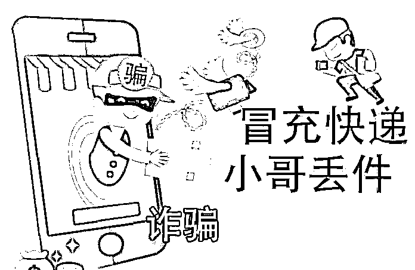
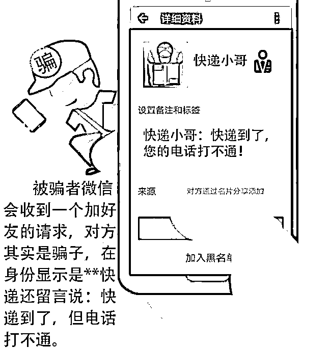
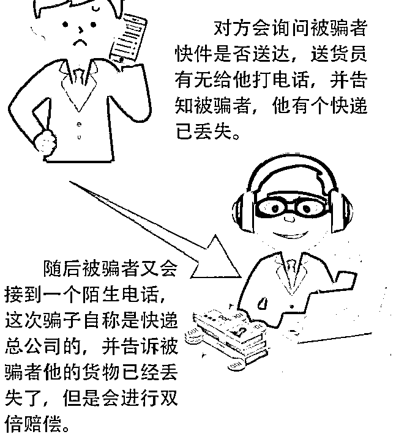
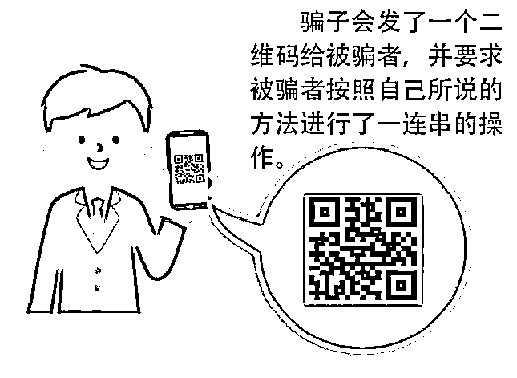
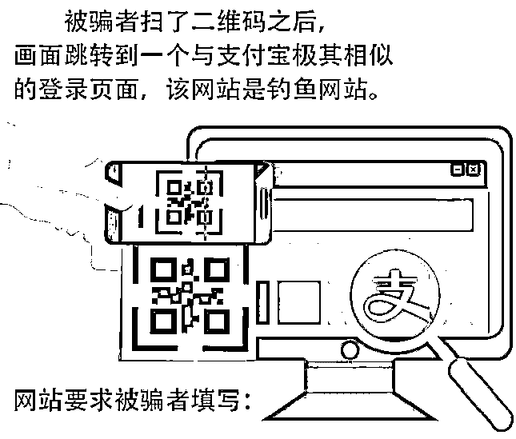
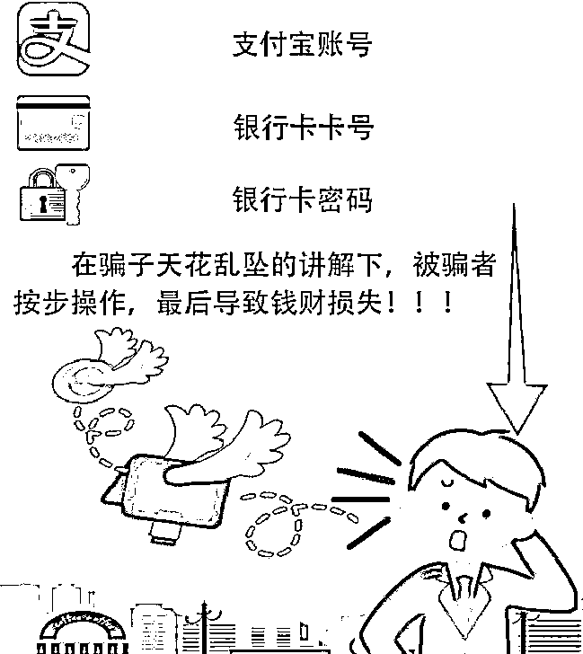
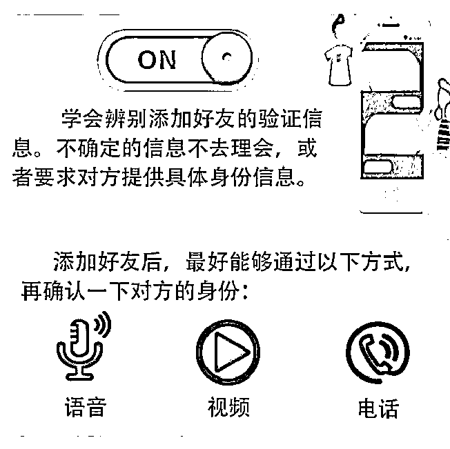
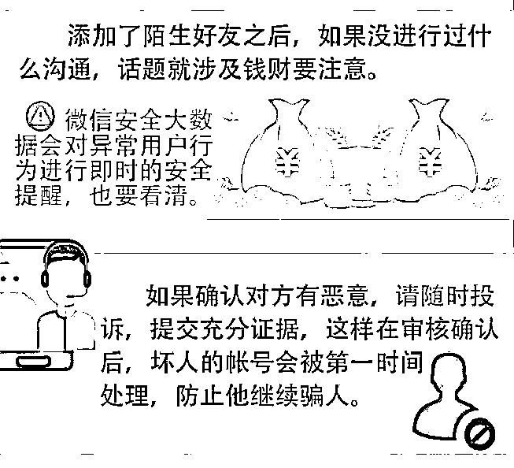
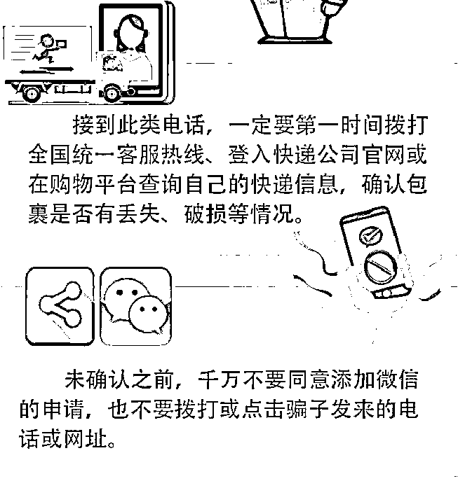
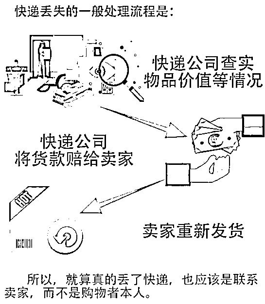

# “不小心弄丢了你的快递，加好友给你赔偿吧”，你信你就输了！

> 原文：[`mp.weixin.qq.com/s?__biz=MzIyMDYwMTk0Mw==&mid=2247507823&idx=2&sn=15b7ebc87906b166e9e6ccd540286e49&chksm=97cb1457a0bc9d4167f5302c71396ded51ea7b9c89da44a0bc6e62dabb9c5350375c24db2742&scene=27#wechat_redirect`](http://mp.weixin.qq.com/s?__biz=MzIyMDYwMTk0Mw==&mid=2247507823&idx=2&sn=15b7ebc87906b166e9e6ccd540286e49&chksm=97cb1457a0bc9d4167f5302c71396ded51ea7b9c89da44a0bc6e62dabb9c5350375c24db2742&scene=27#wechat_redirect)

**“不小心弄丢了你的快递，**

**加好友给你赔偿吧！”**

双节期间，岁末年初，忙碌了一年的你们，是不是也开始为家人筹备过年的礼物了？由于网上购物种类齐全，配送方便，各大电商平台成了广大人民群众的购物首选。

但需要注意的是，近期来已经连续发生“快递丢失”类电信网络诈骗案件，因此大家在接到有**自称是快递公司的人员****说你选购的货物因为种种****原因导致货物丢失，并愿意给你赔付损失的时候，一定要多长几个心眼。**

****

**    家住绵阳北川辖区的张女士，到公安局报警称自己被一自称快递保险公司的工作人员骗了。**

**经查实：张女士于当天接到自称快递保险公司工作人员的陌生电话，称其网购的包裹丢失，要对张女士进行赔偿，但需要走流程，随后与张女士电话沟通中，工作人员要求张女士提供支付宝账号，加为好友后，对方又以**“走赔付流程****”为由给张女士提供了一个二维码，最后****张女士通过几次扫码、验证操作，最终张女士支付宝余额宝内的 2 万多元钱被转走。**** 

****

**   民警在这里要提醒大家的是，在这类骗局里，不法分子假冒快递员，以货物丢失为由，扰乱受害人心绪。**

**随后顺势提出理赔，这时受害人为了减少损失就会主动供自己的手机号、银行卡号等信息，并轻易扫描对方提供的二维码等，最终落入不法分子的圈套。** 

****

**    在“快递丢失”类骗局中，不法分子不仅假冒快递员，还冒充电商平台客服作案。就在张女士遭遇诈骗的前几天，家住北川的王女士也接到了一个陌生来电，对方自称是某宝电商平台客服。**

**   和张女士一样，王女士也遇到了“快递在运输途中丢失，我们会进行理赔”的套路。但不同的是，**不****法分子通过微信互加好友,向王女士发送来自某银行理财 APP 的验证码****，几经忽悠后，王女士通过网银转账的方式向****对方银行卡账户、微信转账支付等方式，被诈****骗了 10 多万元。****

********

********

****如何防范类似“快递丢失”的骗局？警方建议，首先，电商平台自身拥有安全保障系统，大家在接到所谓“货物丢失”的客服或者快递电话时，要通过官方渠道确认核准，无论是自称快递公司还是网店的陌生来电，一定要回拨对方的官方电话核实。****

******对陌生人要提高警惕，不要轻易相信对方的说辞。其次，不要随意扫描“客服”或者“快递员”提供的二维码或者点击陌生链接;也不要轻易泄露验证码及密码等信息。****** 

********

****   同时，也可以下载腾讯手机管家，开启骚扰拦截功能，对骚扰诈骗电话进行有效拦截;通过号码举报功能，将骚扰电话进行标记，避免其他用户遭遇骚扰及财产损失。****

********

****实际上，除了“快递丢失”类诈骗外，还有更多花样百出的网购骗局令人防不胜防。譬如，快递货到付款，优品变劣品；网购后“订单异常”；****

****假冒正规购物 APP 等。在此特别提醒广大群众，在春节来临之际，对此类骗局务必提高警惕，以免上当受骗。****

********

******     警方温馨提醒：******

****     凡是网购后店家主动要理赔或退款的，很可能是诈骗！接到退款电话后，一定要先向实际店铺卖家核实情况，不要轻易加陌生人的微信为好友，不要随便点击陌生人发来的链接，而且，商家退款并不需要你向其他平台借款。****

****     最重要的是，银行卡密码、验证码是资金安全的最后一道防线，千万千万千万不要随意填写（重要的事情说三遍）！群众若是不小心被骗或接到疑似诈骗的电话，应该立即拨打 110 报警处理。****

********

****完**** 

****来源 绵阳市反诈中心，熊猫反诈，利箭在出击****

****************

****← 向右滑动与灰产圈互动交流 →****

********