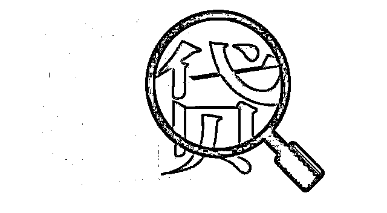

# 卡号永远“输错”的网贷诈骗！

> 原文：[`mp.weixin.qq.com/s?__biz=MzIyMDYwMTk0Mw==&mid=2247507823&idx=3&sn=13eccff90b4d14f6ff3e71cd60b61566&chksm=97cb1457a0bc9d41a811b8838a01411b13adf2f2d27af2dc3031a200bd13b413f1ba14a37ee9&scene=27#wechat_redirect`](http://mp.weixin.qq.com/s?__biz=MzIyMDYwMTk0Mw==&mid=2247507823&idx=3&sn=13eccff90b4d14f6ff3e71cd60b61566&chksm=97cb1457a0bc9d41a811b8838a01411b13adf2f2d27af2dc3031a200bd13b413f1ba14a37ee9&scene=27#wechat_redirect)

“请问你有贷款需要吗？”、“网络贷款日息低至......”、“无需抵押、利息超低、放款超快” ......对于这类网贷推销电话，业内并不陌生，尤其是近段时间，网贷推销层出不穷，成为了电信网络诈骗重灾区。

**诈骗手法**

网上很多“无抵押、无担保，正规公司、极速放款”的广告，上面都有留下联系方式，当你开始网络办理贷款时，甚至可以收到对方发来的现金支票和银行交易流水。

看起来好像一切都很正规的样子，但对方会忽悠你卡号输错，要缴纳一定的保证金、手续费、包装费、冻结费、风险保证金、备用金、保险费等等等等否则不放款，一旦你把钱打过去，对方就立即把你拉黑。

这种贷款诈骗主要是盗刷银行卡团伙跨界作案，他们会让你登录一个看起来很正规的网站，先搜集你的个人信息，随后以验资为由让你把钱打到自己账户，然后要求你提供银行卡号及短信验证码。

　　

这类诈骗常常是假客服在帮你办理贷款期间，从繁琐的手续过程中骗到你的个人信息和银行卡信息，等贷款放款之后，再把你贷到的款项盗刷走。

甚至还有一些骗子，以你流水不足，偿还能力不足等借口，让你在储蓄卡里存一笔大额款项以证明自己的还款能力能，而骗子早已在你申请的时候就骗取了你的个人信息，在你存好这笔款项之后，骗子就将这笔钱盗刷一空。

　　

这类套路，骗子会冒充银行职员，声称有内部渠道可快速放款，实质上是拿你的身份证件去申办信用卡。信用卡申请成功后，他们会用你的手机激活信用卡，然后用 POS 机刷完信用额度，将这些钱都骗到他们的腰包。

　　

这类套路，骗子号称银行里有熟人，或以花钱消除征信污点为由进行诈骗。个人征信由中国人民银行征信中心统一管理，没有人或者机构可以洗白个人征信。

　　

套路贷，是所有网贷诈骗里面最狠毒的一个，骗子通过制造银行流水、签订合同来固定合法证据，然后故意制造违约，让你还不上款，再拿着之前签订的合同征收高额罚息，往往几个月就会欠款上百万。在你背上高额贷款后，再顺便侵吞你的房产、车辆等一切财产。

**警方提示** 

不应轻信各类电话、短信、社交软件等形式的贷款广告，贷款前以任何理由先交手续费、保证金、利息费、解冻费等费用的，一定是骗子。

若真有借款需求，建议消费者去正规银行、网络平台申请，以防被骗。

来源：武汉市反电信网络诈骗中心

← 向右滑动与灰产圈互动交流 →

