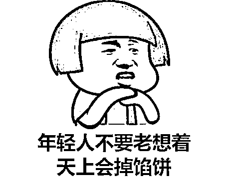
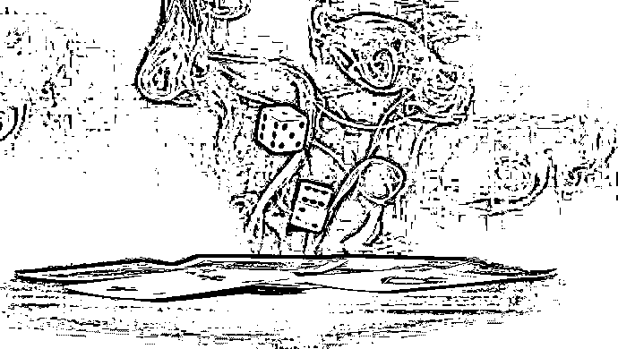
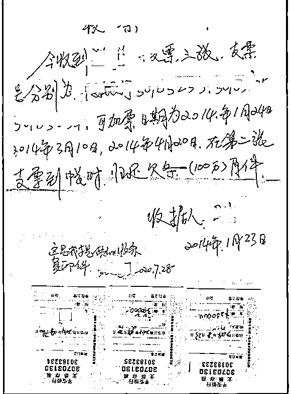
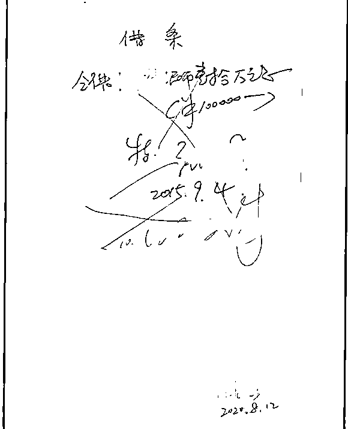
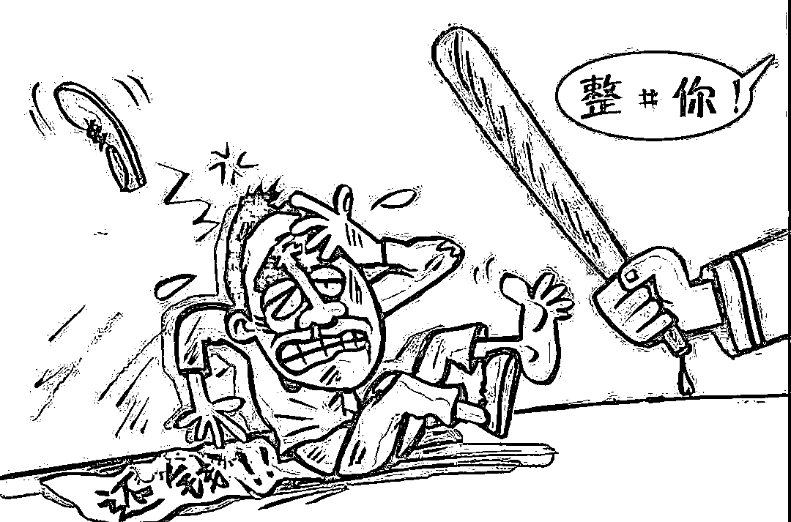
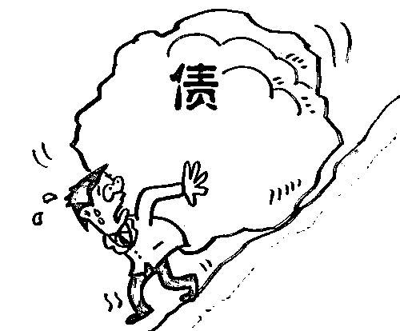
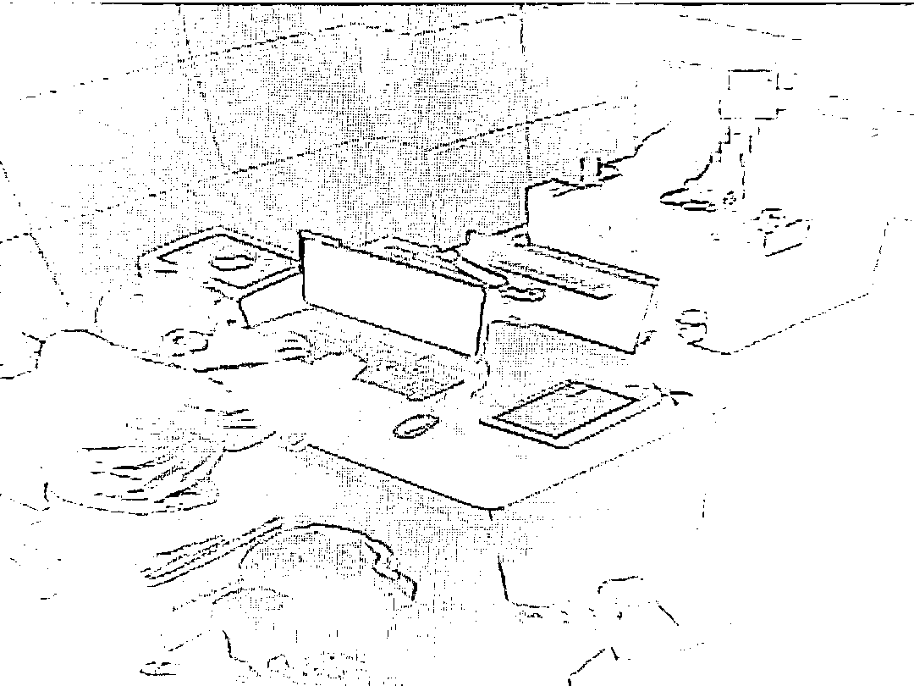
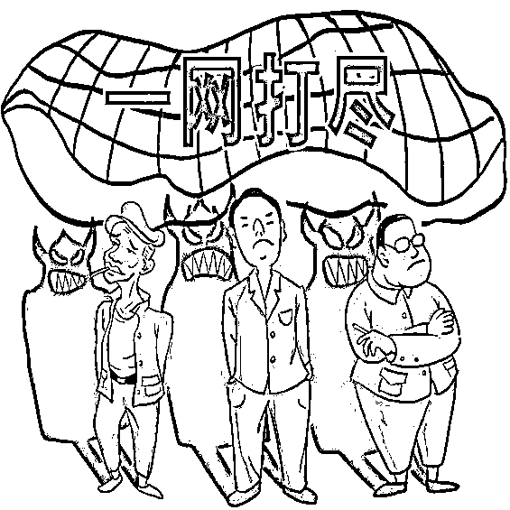

# 几天内欠下 480 万！多人参加“免费境外游”，回来后却倾家荡产...

> 原文：[`mp.weixin.qq.com/s?__biz=MzIyMDYwMTk0Mw==&mid=2247507854&idx=2&sn=13ec134cf3edc8413ecc787a1adf62ea&chksm=97cb14b6a0bc9da087d145c57d8f8e6c408a2b663db77ed45a21ae66aa6fe02ffec7ca8429c0&scene=27#wechat_redirect`](http://mp.weixin.qq.com/s?__biz=MzIyMDYwMTk0Mw==&mid=2247507854&idx=2&sn=13ec134cf3edc8413ecc787a1adf62ea&chksm=97cb14b6a0bc9da087d145c57d8f8e6c408a2b663db77ed45a21ae66aa6fe02ffec7ca8429c0&scene=27#wechat_redirect)

只有熟人才能参加

包往返机票

承担一切食宿费用

如此**“免费境外游”**

是不是听上去就很诱人？

谁知这竟然是

**在境外摆开“杀猪局”**

有些人短短几天就欠下几百万 

**“免费境外游”幌子下** 

**暗藏的究竟是什么玄机？**

**几天欠下 480 万**

**被追赌债不敢报案**

2014 年 4 月

在嘉定马陆镇做生意的孙先生

经人介绍

与好友赵先生、王先生参加了

一个**私人组织的境外 3 日游旅行团**

介绍人表示

这个团只有相熟的人才能参加

包往返机票，并承担一切食宿费用

抵达境外当晚

**孙先生等 3 人即被带到一家赌场**

**并被告知当地赌博并不违法**

赌桌上博弈的刺激感

很快就让 3 人把旅行抛诸脑后

直到回国前

3 人才愕然发现自己

**已欠下赌场 458 万元的巨额赌债**

****

**3 人私下合计后发现**

**这 3 天都是只输不赢**

**随即怀疑赌局是早就被人安排好的**

可是，他们的护照来之前就被已收走

在当地也人生地不熟

被逼无奈之下

他们只得写下一纸**“还款承诺书”，**

**才获准回国**

孙先生等人回国后刚下飞机

就立刻被犯罪团伙成员控制

**他们被带往机场附近的银行**

**办理虚假流水转账并写下借条**

不仅原本的**赌博欠债被“洗白”**

**成了私人借贷欠债**

金额更被垒高到了 480 万元

之后的日子

孙先生尽管陆陆续续

归还了 240 万元欠债

可团伙成员依然三天两头上门追讨

该犯罪团伙一方面

通过起诉方式追讨债务

另一方面通过破锁开门

堂而皇之地住进了孙先生的别墅

孙先生的两位朋友也同样被逼得东躲西藏

犯罪团伙还撂下狠话

欠债还钱有凭有据

**孙先生等人又是在境外参赌背上的赌债**

**只能选择沉默不敢报案**

**报案后又突然撤案？**

**犯罪团伙：只要撤案就可退还 220 万**

2019 年 6 月

上海市公安局嘉定分局陆续接到

“境外免费游”被骗陷入赌局的相关报案

警方通过梳理相关举报线索后发现

该犯罪团伙已于 2015 年被迫收手

但被追债的受害人仍然陷于各种滋扰中

**正当警方成立专案组开展紧锣密鼓侦查时**

**举报人又主动撤案**

还称这是正常的借贷纠纷

在这样关键的节骨眼上

被害人选择报案后又重新撤案疑点重重

警方从孙某等人前后矛盾的陈述中

抽丝剥茧发现有人存在妨害作证嫌疑

警方由孙某等人扩线追查

发现本市某企业白领张先生和任先生

也有“境外免费游”经历

**后来也有被非法拘禁并被殴打的情况** 

经过深入调查

警方发现孙某等人突然撤案是有原因的

犯罪团伙为逃避打击

给孙某等人开出

**只要撤案让警方停止调查**

**就可退还 220 万元钱款的“条件”**

****

孙某等人面对团伙成员

巧舌如簧的蛊惑和威逼利诱

不禁心旌摇荡

向警方传递了错误的信息

专案组于是通过外围调查取证

最终，所有的线索都指向一个人：夏某 

**涉案赌债 3000 多万元**

**夏氏团伙瞬间崩塌**

夏某在常人眼里

是个光鲜亮丽的企业家

身价号称上亿

但谁也不知道

夏某靠什么发家致富

经调查，夏某的女儿于 2013 至 2015 年间，长期来往于境内外“做项目”，案件各环节中都浮现她的身影。这背后，正是夏某和前妻黄某的操控，他们的亲属也深入参与其中。**这个所谓的“境外免费游”，以及境外赌场内的赌厅，正是夏某包下来，并由其女儿出面签订合同并负责日常经营。**

经过逐一排查该犯罪团伙人员架构、分工，警方于 2020 年 7 月 20 日一举抓获包括夏某、黄某在内的 17 名团伙成员。

经查，该团伙专门在国内**物色经济条件优厚、喜欢追求刺激的老板或是家中有房屋拆迁的年轻人等**，**通过“境外免费游”为诱饵，招揽他们去赌博，再通过操控赌局的方式逼迫被害人写下巨额欠条**。

警方经过排查，**目前共找到 20 名被害人，涉案赌债金额 3000 多万元**。夏氏团伙通过开设赌场、非法拘禁、敲诈勒索、寻衅滋事、妨害作证等犯罪手段非法获利 1000 多万元。警方共查封该团伙非法所得房产 8 处、车辆 7 辆，冻结个人账户 16 个、公司账户 4 个。

经审讯，夏某称自己曾经到境外参与赌博有过类似经历，竟然从中获得“灵感”，遂于 2013 年至 2015 年之间组织了这个境内外联动的“杀猪局”，并用威胁、恐吓、非法拘禁、“软暴力”讨债等方式积累巨额非法财富

 目前，夏某等相关涉案嫌疑人已移送嘉定检察机关起诉。

**警方提醒**

**↓**

**天下没有免费的午餐**，此类所谓的“免费游”背后暗藏玄机，一旦上了对方的“贼船”就很难下来，伴随而来的可能就是人生的悲剧。

**赌博害人害己**，特别是在这种赌局中，从来没有所谓的“人生赢家”，广大市民一定不要轻易相信，否则陷入泥沼必将难以自拔。

*来源 ：警民直通车上海、上观新闻、东方网*

← 向右滑动与灰产圈互动交流 →

