# 年流水 1.77 亿，斗鱼直播间涉赌？

> 原文：[`mp.weixin.qq.com/s?__biz=MzIyMDYwMTk0Mw==&mid=2247507884&idx=1&sn=05948aa9ef8b9a838ced3516ff137e15&chksm=97cb1494a0bc9d82b9a07d19a098f41c4a8b76eb0b15e35b790ad1a38ff51c06954eb79be1e2&scene=27#wechat_redirect`](http://mp.weixin.qq.com/s?__biz=MzIyMDYwMTk0Mw==&mid=2247507884&idx=1&sn=05948aa9ef8b9a838ced3516ff137e15&chksm=97cb1494a0bc9d82b9a07d19a098f41c4a8b76eb0b15e35b790ad1a38ff51c06954eb79be1e2&scene=27#wechat_redirect)

斗鱼相关负责人：“我们所有的（抽奖活动），都是要跟监管部门汇报才会上线的。”

“马上要爆了！爆了还有 1 个 5 万！还有 20 秒钟，5 个 1 万偷塔！” 

斗鱼直播平台的“长沙乡村敢死队”的直播间里，一位主播声嘶力竭地吼叫着，其迸发的激情，堪比电视购物频道的主持人。

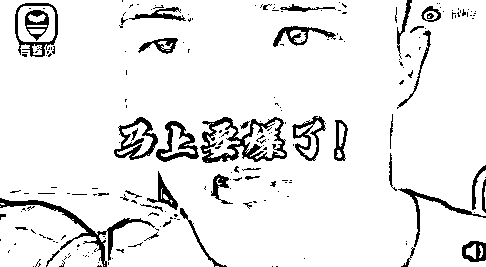

仅听他喊的话，“偷塔”、“爆了”诸如此类的词句，你会以为他是个游戏主播。

然而，这个名为“长沙乡村敢死队”直播间，却**被网友称为“斗鱼最大的赌场”、“直播聚赌发明家”。**

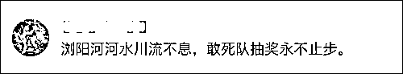

据中国青年网短视频官方微博@青蜂侠 Bee 1 月 15 日消息，“长沙乡村敢死队”长期利用斗鱼平台的各种抽奖规则，进行涉嫌赌博的活动。

[`v.qq.com/iframe/preview.html?width=500&height=375&auto=0&vid=s322185z6nk`](https://v.qq.com/iframe/preview.html?width=500&height=375&auto=0&vid=s322185z6nk)

视频来源：@青蜂侠 Bee

此类活动的运行规则是，用户在一段时间内购买指定道具，即可参与价值 1000 元到数万元的虚拟货币的抽奖。

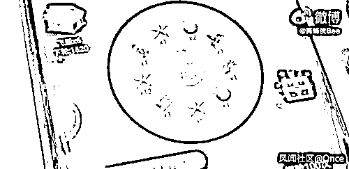

抽奖结束后，“长沙乡村敢死队”再通过支付宝或“背包商人”等第三方渠道，等额购买虚拟货币来兑现奖金。

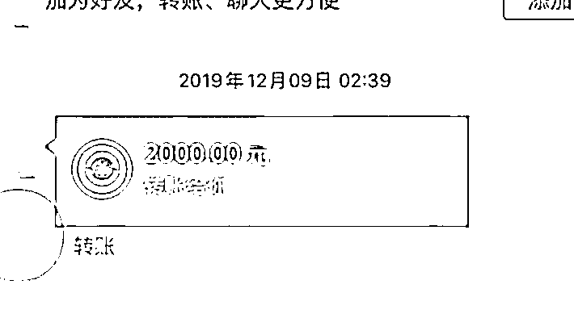

“长沙乡村敢死队”运营人员部分变现记录 举报人提供 截图自@青蜂侠 Bee

此外，“长沙乡村敢死队”直播间，还有另外一种“筹码”更贵的赌局，用户可花费 100 到上千元来参加奖品数万元的抽奖活动。

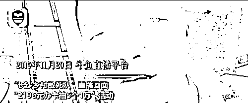

“2196 元办卡抽 5 个 1 万”活动

“长沙乡村敢死队”直播间的主播戏称这种门槛更高、专为多金用户开放的抽奖活动，是“给大哥们回口血。”

因为直播间通常是在晚上 10 点开始抽奖，“长沙乡村敢死队”的抽奖活动的公开暗号为“10 点经济课”。

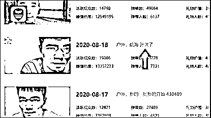

不少青少年沉迷于这种抽奖活动中，**有人半个小时不到，就疯狂下注 30 万元。**

去年 8 月，“长沙乡村敢死队”还开通了专门用于抽奖活动的小号“雷田食府”，直播房间号为 941266。第三方直播平台数据显示，**“雷田食府”仅开播 9 天，流水竟高达 1383.5 万元。**

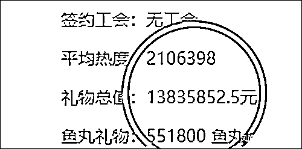

而“长沙乡村敢死队”直播间，**2020 年一年的收益礼物高达 1 亿 7 千多万，日流水最高达到 1300 万。**

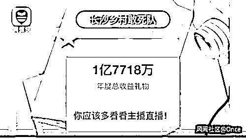

斗鱼直播平台信息显示，“长沙乡村敢死队”直播间的粉丝有 210 多万人，类型属于“户外”。该直播间的官方认证信息为“湖南本土生活文化类直播带头人。”

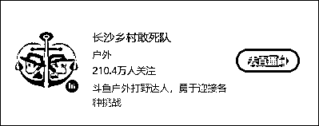

此外，“长沙乡村敢死队”还入选了斗鱼直播平台 2020 年度十大巅峰主播。

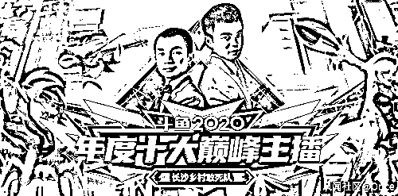

在 1 月 16 日的斗鱼直播“2020 鱼乐盛典”的颁奖现场，斗鱼方面给“长沙乡村敢死队”的颁奖辞是这样的：“他们是立足于湖南本土生活的户外主播，他们性格淳朴，为水友们呈现的也是淳朴自然、原汁原味的乡村生活。他们的直播轻松诙谐，又有着大无畏的创新拼搏精神，勇于尝试多元化的内容，挑战不可能。积极的心态和不懈的努力，让他们一步一步走向了今天的成功。”

[`v.qq.com/iframe/preview.html?width=500&height=375&auto=0&vid=m3221gci5q1`](https://v.qq.com/iframe/preview.html?width=500&height=375&auto=0&vid=m3221gci5q1)

视频来源：@青蜂侠 Bee

1 月 18 日，斗鱼相关负责人就“长沙乡村敢死队”涉嫌聚赌一事，作出回应。

该负责人称：**“我们所有的（抽奖活动），都是要跟监管部门汇报才会上线的。”**

值得一提的是，“长沙乡村敢死队”并非首位被曝涉赌的斗鱼主播。

据中国青年网 1 月 14 日报道，去年斗鱼头部主播“彡彡九户外”(本名付海龙)，被曝涉嫌万人聚赌。

据第三方数据平台“头榜”统计：2020 年“彡彡九户外”在停播 117 天情况下，年收益仍高达 1.1416 亿元。

中国青年网报道称，**去年 11 月，“彡彡九户外”(本名付海龙)已于去年 11 月被警方采取强制措施。**

而对于“彡彡九户外”涉赌一事，斗鱼相关负责人曾回应称：“‘彡彡九户外’直播间有关行为并非赌博，而是属于商业领域的有奖销售行为，依据《反不正当竞争法》，只要抽奖金额不超过五万，就既不违法，也不违规。”

对此，相关部门尚未表态。

根据启信宝信息显示，无论是“长沙乡村敢死队”隶属的湖南鱼小丸网络科技有限公司，还是“彡彡九户外”控股的成都九途文化传媒有限公司，武汉斗鱼鱼乐网络科技有限公司均有参股。

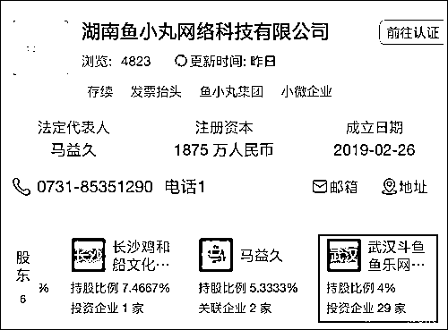

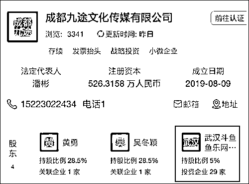

截图自启信宝

斗鱼方面的回应，让很多网友不满。

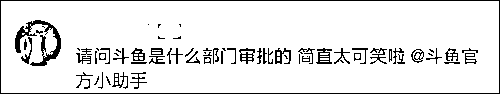

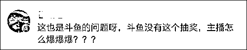

还有人直言，斗鱼平台靠着打擦边球攫取流量，赚流水。

也有人疑惑：平台上的付费礼物抽奖活动，到底算不算赌博呢？

据《检察日报》2020 年 9 月 21 日报道，以刷礼物为门槛进行有偿抽奖、付费抽奖，遵循以小博大机制，与赌博行为如出一辙，但是否涉嫌犯罪还需要依法准确定性。

根据两高 2005 年《关于办理赌博刑事案件具体应用法律若干问题的解释》规定，组织 3 人以上赌博，抽头渔利数额累计达到 5000 元以上的、赌资数额累计达到 5 万元以上的、参赌人数累计达到 20 人以上的，都属于刑法规定的“聚众赌博”。

而以营利为目的，在计算机网络上建立赌博网站，或者为赌博网站担任代理，接受投注的，属于刑法规定的“开设赌场”。

以直播间抽奖的相关金额来看，很容易达到上述规定数额，认定聚众赌博似有依据，但现实中要认定用户充值或礼物为赌资，却有些困难。

主播用游戏玩法精心包装赌博方式，用巧妙的话术引导观众充值、打赏，间接下注，双方心照不宣地以刷礼物方式获取抽奖资格，与正常获取人气流量的营销式抽奖难以分辨；主播不直接与观众进行虚拟币交易，赌博结果出来后，通过间接“刷礼物”，转移到别的交易平台进行现金兑换，直播平台已经无法跨台监督。这些都为发现赌博行为、定性赌博犯罪带来不小的难度。

当务之急是要进一步揭露通过直播实施网络赌博犯罪的方式，明确入罪标准，加大涉赌案件办理力度，通过典型案例将直播间付费抽奖的赌博本质公之于众。同时，厘清直播平台的作用，若有为赌博犯罪提供帮助或暗中纵容的，应依法以共犯论处，倒逼平台强化管理，加大对直播抽奖行为的监控和处理。

截止到发稿，**斗鱼官方尚未就此事作出正式回应。**

而涉事的“长沙乡村敢死队”直播间的主播“马弱鸡”，今日在斗鱼平台网站社区发布了一封“请假信”，**声称自己身患抑郁症，近期将减少出境时间。**

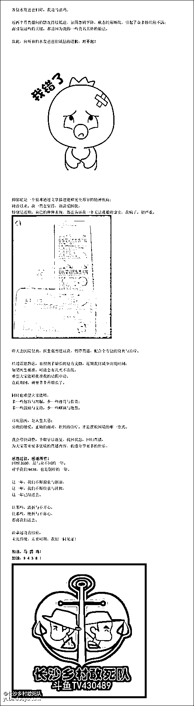

来源:观察者网风闻社区

← 向右滑动与灰产圈互动交流 →

