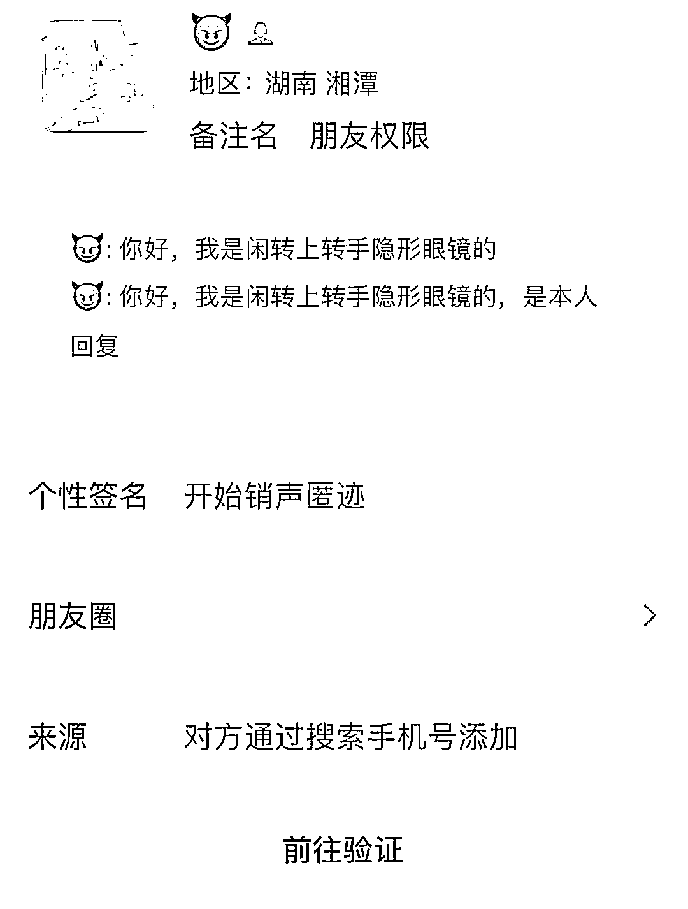
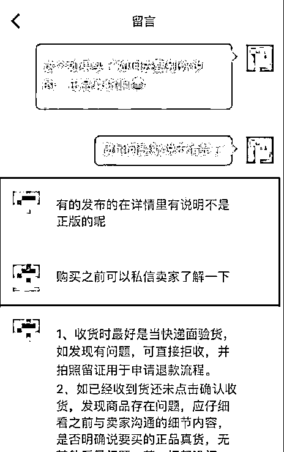
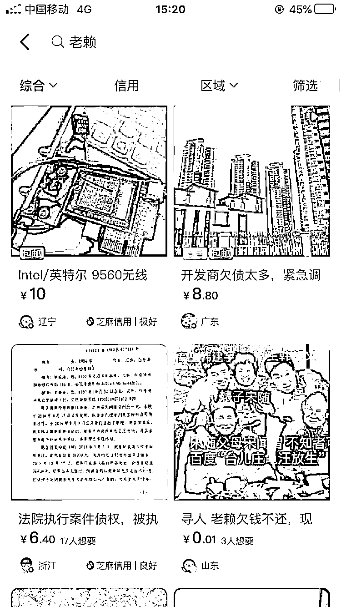
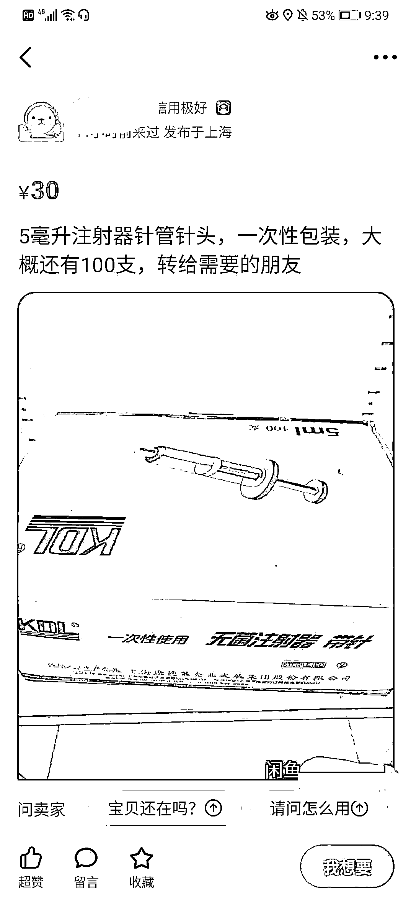

# 买卖假货，钓鱼诈骗…闲鱼、拍拍、闲转等 12 家二手交易平台将被集中约谈

> 原文：[`mp.weixin.qq.com/s?__biz=MzIyMDYwMTk0Mw==&mid=2247507884&idx=3&sn=aa217c97602b09a4955be722a0f732e1&chksm=97cb1494a0bc9d82a11d3fe962f0730d33cb9b714551fe9c785b2284898f27d340fec6668e6b&scene=27#wechat_redirect`](http://mp.weixin.qq.com/s?__biz=MzIyMDYwMTk0Mw==&mid=2247507884&idx=3&sn=aa217c97602b09a4955be722a0f732e1&chksm=97cb1494a0bc9d82a11d3fe962f0730d33cb9b714551fe9c785b2284898f27d340fec6668e6b&scene=27#wechat_redirect)

把不用的东西在二手平台转卖

已经成为年轻人一种新的生活方式

但由于门槛过低、管理不到位

频频出现买卖假货、盗版网课、

内容涉嫌色情低俗、钓鱼诈骗、

非法销售“赃物”等乱象

来看一组权威调查

江苏省消保委近日开展网络二手交易市场消费调查，选取包括闲鱼、转转、闲转、拍拍、58 同城、找靓机、花粉儿、心上、只二、红布林、万表、爱回收在内的 12 个平台。

调查发现，一些二手交易平台暗藏陷阱，买卖假货、钓鱼诈骗，甚至有二手交易平台成为色情交易引流平台。

具体调查结果

1\. 二手交易套路多

超 9 成用户交易中有过糟心经历

问卷调查结果显示：

○过半数消费者遇到信息不透明、实物与照片不符情况。

○近三成消费者反映二手交易退货难，职业卖家充斥平台。

○近半数交易脱离平台付款，6.8%用户未追回资金。

从闲置转卖到批量卖货

体验调查同样发现

职业卖家在二手交易平台的现象

较为普遍

某平台卖家甚至表示其就是商家

产品要多少有多少

此外，脱离平台付款、私下交易，大大增加了买卖双方的交易风险。体验调查发现，仍有部分平台的卖家故意引导消费者脱离平台进行线下交易。

2\. 假货冒充二手物品现象仍存在

部分平台涉嫌默许售假

调查发现，二手交易平台上的商品信息五花八门，二手交易规则明确禁止发布的信息和商品在平台上仍频频出现，甚至部分平台涉嫌默许售假。问卷调查结果显示，17.1%的消费者遇到“假货、盗版”问题；10.2%的消费者遭遇“出具涉假鉴定报告”问题。

体验调查发现，12 个二手交易平台均明确规定禁止发布假冒商品信息，否则平台将做下架产品、限制交易、封禁账号等处理。但是，部分平台该规定尚未落实到位，销售假包、假表、假鞋等现象依然存在，甚至还有平台面对售假行为姑息纵容，默认该行径合理。

在闲转、花粉儿等多个二手交易平台，商品销售页面商家直接标明“高仿”“复刻”等字样。体验员在一平台购买一款注明“高仿”字样的 Dior 口红，卖家明确说明不是正品。

收货后商品包装简易，包装盒是破损的，口红有缺口，分量轻，体验人员怀疑产品包装是使用过的真品包装盒，与客服私聊中询问到是否是高仿，卖家明确回答不是真的。但这些标题和聊天中明确的售假信息，平台并没有进行监测，或进行相应处理。

3\. 盗版、低俗、烟、枪等

禁止发布内容频现

二手交易平台虽然明确规定禁止发布涉及人身隐私、色情低俗、侵犯他人知识产权等商品信息，但是，在体验调查中，仍然发现盗版网课、盗版影音、低俗漫画、名牌产品空瓶等相关信息，甚至有二手交易平台成为色情交易引流平台。

体验人员还发现，有平台卖家发布刷单炒信等违法违规的广告、以“公布老赖”为由上传个人信息、办假证等相关内容，而平台公约明确禁止发布此类内容。

同时，电子烟、药品等在二手交易平台仍然存在。部分平台虽然屏蔽了药、医疗器械、烟、枪支、活体动物等关键词，但是，换个搜索方式或者直接浏览页面依然会出现相关信息推送。

4\. 奢侈品、电子产品类产品

二手平台回收、鉴定服务待提高

在本次体验中，奢侈品二手交易平台有红布林、花粉儿、心上、只二、万表，在物品所有权、估价、鉴定等方面存在争议。

○二手平台回收、寄卖业务引争议

只二寄卖规定由卖家自主定价，但平台规定若 7 日内未给定价，将默认放弃物品所有权，交由只二处理。若寄卖期间届满后 30 天内未作出任何操作，默认放弃闲置物的所有权，授权交由只二处理闲置物。

○鉴定资质不一

本次体验调查中，奢侈品类二手平台均宣称正品保真，多重鉴定。但是，在体验调查发现，奢侈品二手交易平台鉴定资质不一，有些平台有合作的第三方鉴定机构，也有些平台只有自己的鉴定机构、团队。

○估价低

平台在 APP 页面注明定价分别是依据自主研发系统+市场价格、大数据+市场行情，但具体价格区间、报价明细没有公示，消费者缺乏衡量标准，再加上平台鉴定均是平台自有的鉴定中心定价，平台处于主导地位。

体验人员将一台 2015 款 macbookair 回收体验，在某平台估价后，平台给出 1377 元的价格，远低于同一时间在 apple 官网 Apple Tarde In 换购计划中获得的估价 2200 元，价格差了近 1000 元。

**江苏消保委建议**

一是尽快出台互联网二手交易平台相关标准。

进一步完善包括信息发布、用户资质审核、退换货规则、资金安全及消费者权益保护内容。

二是强化平台监督管理责任。

二手交易平台作为交易中介，不应当睁一只眼闭一只眼，只追求发展而忽视平台生态建设。

三是完善二手交易信用评价机制。

对于买卖双方夸大宣传、隐瞒关键信息、虚假交易等不诚信和违法违规行为，应当纳入诚信评价体系，将违规记录计入个人诚信档案。

四是健全售后服务机制。

应当参照执行 7 天无理由退货等售后服务，以避免职业卖家打着二手闲置的名义逃避 7 天无理由退货规定，损害消费者合法权益。

五是消费者应强化消费维权意识。

提醒消费者在选择二手交易平台消费时，应当尽可能保障自身合法权益，避免踩“坑”。如遇消费问题，可拨打 12315 进行投诉举报。

《中国消费者报》记者获悉，江苏省消保委计划在本月底对闲鱼、拍拍等调查涉及的 12 家二手交易平台开展集中约谈，就信息发布机制及审核处理规则、售后服务流程及处理机制等内容进行探讨，并与相关行业协会、企业制定团体标准，进一步保护消费者合法权益，更好地规范网络二手交易平台的市场秩序。

来源：中国消费者报·中国消费网

← 向右滑动与灰产圈互动交流 →

