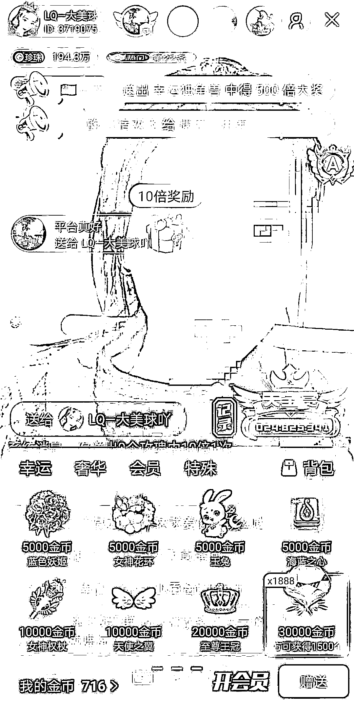
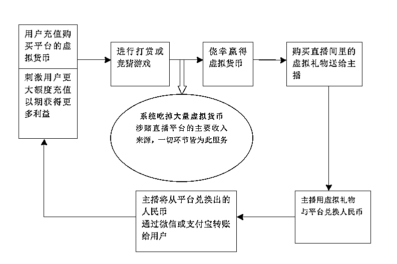
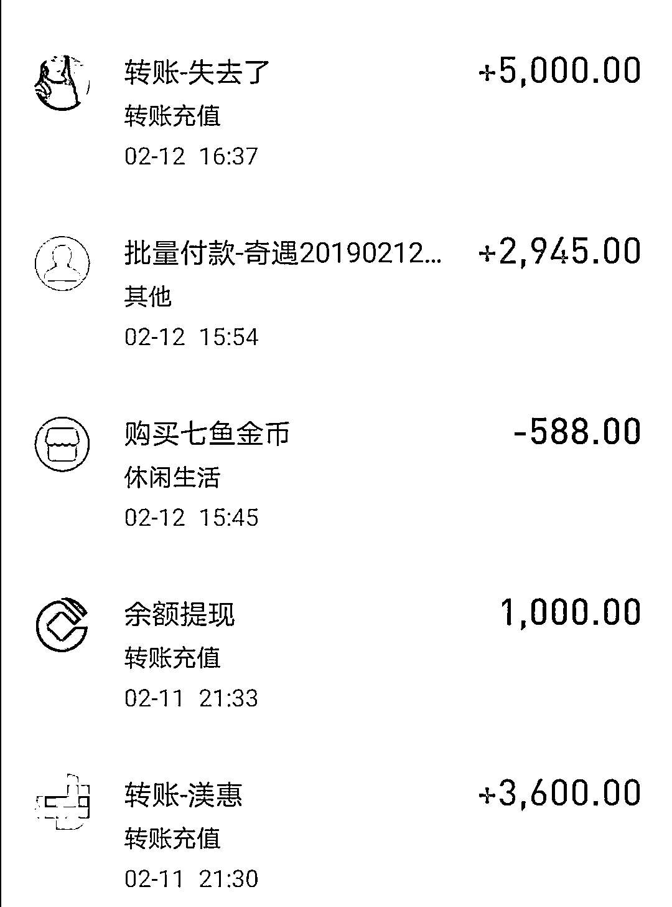

# 多少人在网络直播平台上输掉了未来！

> 原文：[`mp.weixin.qq.com/s?__biz=MzIyMDYwMTk0Mw==&mid=2247508057&idx=1&sn=f3b1e98166cae25d1cb1422c657a3c1a&chksm=97cb6b61a0bce2771653230dae933b06b1071a5a71333dbebf9b007c54bc8eb73f077d133cf0&scene=27#wechat_redirect`](http://mp.weixin.qq.com/s?__biz=MzIyMDYwMTk0Mw==&mid=2247508057&idx=1&sn=f3b1e98166cae25d1cb1422c657a3c1a&chksm=97cb6b61a0bce2771653230dae933b06b1071a5a71333dbebf9b007c54bc8eb73f077d133cf0&scene=27#wechat_redirect)

                                     （王军口述，草果整理）

在人们的普遍认知里，网贷和网络直播本是两个并不相关的行业，有着各自的利益地盘。殊不知，这两个看似并不相关的行业，如今却通过一种媒介勾连了起来。像两个密谋好利益分配的狩猎者，合力挖设出一个连环陷阱。捕猎对象，就是直播平台上的普通用户。这个媒介就叫变相赌博。

时至今日，如果仍将网络赌博狭隘地理解成有着明显赌场特征的赌博网站或赌博 APP，就太乐观了。随着网络直播的兴起，更准确地说，是随着直播平台上虚拟货币奖励机制的出现，赌博已经以一种全新的形式更隐蔽地“合法”伪装了起来。加之行业话语权的极力粉饰和掩盖，入局之前，你根本不会意识到隐藏于社交、娱乐幌子后面的是怎样一个精心设计的陷阱。不要以为只要没有赌博意愿，不登录直观易辨的赌博场所，就能避免重大财产损失。移动互联网时代，危险就潜伏在身边，很近很近。

如果你不想成为网赌+网贷这个连环陷阱中的猎物，不想像我一样众叛亲离，将原本幸福的生活过成了一场悔不当初的悲剧，就请耐心看完我的经历。

即便对网络直播不甚了解的人，也大概知道，秀场直播和游戏直播平台主要的营收来自于用户打赏。但这种建立于荷尔蒙基础之上的赠予式经济模式，有着诸多不可避免的天花板。其中最重要的两块，一是用户体量日趋饱和，二是用户消费逐渐理性。加之监管收紧截断了大部分低俗流量渠道。秀场直播和游戏直播的营收瓶颈愈发凸显。

显然，常规途径无法帮助直播平台突破这两个刚性障碍。那么，刺激存量用户进行非理性消费就成了众多秀场直播和游戏直播直播平台的主要钻营方向。具体做法是在正常打赏中加入特殊设计，从而使打赏成为令用户欲罢不能的精神毒品。这个特殊设计，就是虚拟货币奖励机制。而我，不幸成了这一机制的牺牲品。导致我倾家荡产的这个直播平台，叫奇遇直播。

* * *

**01  隐藏于打赏背后的直播陷阱** 

本文的目的，是要让更多人看清网络变相赌博陷阱的构建逻辑，所以，在讲述我的亲身经历之前，需要先对奇遇直播基于虚拟货币奖励机制的运营模式做个简要剖析。

在“奇遇直播”的直播间里，虚拟礼物分三种，分别为：幸运礼物、奢华礼物、特殊礼物。当用户给主播打赏“幸运礼物”，有机会获得系统奖励的虚拟货币。奖励幅度高达数千倍。比如，用户给主播打赏一个价值 10 人民币的虚拟礼物，中了千倍奖励，便能获得价值 10000 元人民币的虚拟货币。类似“奇遇直播”这样的平台上，主播和用户均称这种能够中奖的打赏为“刷奖”，称参与“刷奖”的用户为“刷客”。

直播平台方均众口一词称，虚拟货币奖励机制的设计初衷，是为了增加打赏的互动性和娱乐性。当然，接触过网络直播的人无不心知肚明，这不过是平台方摆在明面上的诡辩说辞，而背后的真实目的有两个，其一是建立成瘾机制捆绑用户刺激消费，其二是在成瘾机制的基础上构建起变相赌博陷阱最大化收割用户财富。 

仅从以上“奇遇直播”打赏的简短介绍中，也不难看出虚拟货币励机制直接改变了打赏性质，将用户单纯的打赏引导成了为获得更多虚拟货币而进行的打赏，即刷奖。那么，在这个基础上，平台方又如何完成赌博链诱导用户将虚拟利益变成现实利益呢。也可以这样问：用户为何要参与刷奖，中奖所获的虚拟货币能做什么？

表面上看，虚拟货币可以购买虚拟礼物送给主播，增加主播对用户的好感。而隐藏于这一表象之下的却是虚拟货币的变现交易。用户参与打赏的真实目的，是为了赢得更多虚拟货币变现成人民币。在“奇遇直播”平台上，存在着两条变现渠道。

第一条渠道是通过主播变现：用户在刷奖环节赢得虚拟货币后，兑换成“奢华礼物”送给主播，主播用收到礼物按 75%的提现比例从“奇遇直播”平台方提现出人民币，再通过支付宝或微信转账给用户。

注意，主播收购用户虚拟货币的现金来自平台方，也就是说，平台方利用主播这一中间环节，巧妙实现对所发行虚拟货币的回收。从而完成了虚拟货币和人民币的双向兑换

第二条变相渠道是直接从平台提现：用户通过简单的注册，成为名义上的主播，开加密直播间给自己打赏幸运礼物刷奖。同理，中奖后将虚拟货币兑换成奢华华礼物打赏自己，便能以主播的身份从“奇遇直播”平台方提现出人民币。

接下来，我要开始讲述我在这个直播平台上的惨痛经历了。

* * *

 **02   我是如何一步步被奇遇直播培养成了赌徒**

2017 年，网络直播大火，身边朋友都在谈论，我也没忍住好奇，下载了几个直播平台。其中就有“奇遇直播”。现在回想起来，可能是宿命吧。老天要摧毁一个人的幸福多么轻而易举啊，不过是让你在手机屏幕上轻轻点击一下，就那么一下，你就打开了一扇地狱之门，而自己却全然无知。

一开始，我只是在直播间里聊天，跟主播逢场作戏，一次充值几十元，多的时候也就一二百元，全当娱乐。

我经营着一家小规模的安装公司，收入还算过得去。如果仅止于单纯打赏，自会适度控制消费，这钱也花得起。归根结底，事情就坏在“刷奖”上。这一奖励机制打破了正常的消费逻辑，使我充值的虚拟货币在打赏过程中有不减反增的可能。如此一来，单纯的打赏自然就染上了获利的色彩。

比如，我充一百元人民币，正常情况，只能获得与一百元对应的虚拟货币，并且在消费过程中只会不断减少。可奇遇直播的奖励设计，使我花一百元充值的虚拟货币在消费过程中可能不减反增。基于人天性的逐利心理，用户难免会被奖励所吸引。我也一样，不自觉地奔着那颗看似有利的诱饵去了。奇遇直播”成功将我引入了陷阱的第一步。

渐渐地，我发现出奖似乎有规律可循，比如先送些小礼物“暖房”，再送价值高点的礼物更好中奖；19 个礼物一组比单个礼物好中奖……可没几天，规律又有了变化，成了 99 个一组更好中奖。在规律变化和“被发现”的过程中，中奖胜出的意愿也一点点变得强烈起来。平台通过包括托儿营造氛围在内的各种手段，释放出投入越多回报越高的信息。潜移默化中，我开始被一种好胜心驱使着，从一次充值几十元到几百元，金额随着好胜心的增强而增加。目的也从打赏主播转变成了对中奖的追逐。

三个多月下来，我在“奇遇直播”充值了差不多两万元人民币。是稍微多了点，但以我当时的经济条件来说完全能够承受，这笔非正常消费并没能引起我的警觉。而且，平台刷奖氛围很热烈，直播间里满是爆奖的特效，并不时飘过某某用户中了大奖的提示飘条。群体效应，即是蛊惑也是危险的最好掩护。就像人置身于一种传销的氛围中，不知不觉便失去了对事物的正确判断能力。我像泡在温水里的那只青蛙，对渐渐逼近的危险无知无觉。

陷阱显出端倪是我中大奖的那次。有个比较要好的主播告诉我，价值 30 元人民币一个的“宝钻”其他用户已经填进去不少了，一直没出奖。根据她的经验判断，系统很可能会爆出高倍奖励。我依言充了 1000 元去刷“宝钻”，还真让主播给说中了，结果爆出了差不多价值 5000 多元人民币的虚拟货币。主播在微信里给我说可以把虚拟货币换成人民币。按照主播的引导，我把赢到的虚拟货币换成直播间的奢华礼物送给了主播，很快，主播就用礼物从平台提现出 5000 元人民币，通过支付宝转账给了我。

5000 元虽然不算个大数，可毕竟我也在平台花了两万块钱了，如果能用这种方式把钱赢回来也挺好。因为是合法直播平台，起初我以为这种特殊操作只是“奇遇直播”为吸引流量而采取的返利促销方法。

 “天上不会掉馅饼”是连小孩都会挂在嘴边的自我警告，可真临到自己身上，贪欲让人往往只看到利益，而忘了危险。5000 元的获利让我尝到甜头，我咬钩了。为获得更多虚拟货币变现，单次充值金额从几百元提高到了上千元。

蹊跷的是，加大刷奖力度后，原本以为摸到的规律似乎又不好使了，本该出奖的时候偏偏不出。但 5000 元的“铁证”摆在哪里，越是不出奖，我越不信邪。我开始被“就快要出奖了”的心理牢牢控制着，充值金额和刷奖金额不断加码，从上千元变成了上万元。

这类直播平台把用户的心理研究得烂透，知道一直打，用户疼狠了会跑。所以采取打一棒给一个枣儿的策略，让用户以为前面一定还有甜头。于是，后来我陆续中过一些奖：6 千元，1 万元，2 万元……“

奇遇直播”间歇性抛出的利益诱饵，让我愈发坚定地认为只要用对方法，摸到了一定的出奖规律，回本不是没有可能。侥幸心理推着我朝及时止损完全相反的方向越走越远，我彻底陷入有一种赌徒心态，固执地只看到赢，而忽略了输。其实，与中奖获利相比，我投入的是 6 万、10 万、20 万。损失越大，就越钻进死胡同，小赢的经验被回本的渴望放大，使赢的甜头，远比输的教训要顽固得多。

一段时间后，我已经深谙“奇遇直播”门道，和其他刷客一样，经过简单注册后自己开直播间刷奖提现。偶尔通过主播返现，也是念及“旧情”，顺便帮主播过任务。到这个阶段，主播在这条赌博链里的作用已经不那么重要了，用户们进入了和奇遇直播平台方直接对赌的模式。银行卡上的数字锐减得更快，单次充值都万元起。

到这个程度，我已完全清楚自己不是在观看直播，而是在和直播平台进行赌博，甚至隐约预计到了最终可能会吞下苦果。但已经来不及了，巨额损失如同一股强劲的吸力，紧紧吸住我无法回头，只能寄希望于中奖回血。

现在当然知道，所有此类直播平台的虚拟货币奖励机制都脱不开欺诈本质。无论是刷奖、抽奖、还是竞猜游戏，均由后台控制着出奖概率和输赢。从技术上讲，可轻易实现每个 ID 的针对性操作。也就是说，与运气、概率以及自以为摸到的规律没有半点关系，用户如同棋盘上的旗子，后台才是下棋的那只手。大数据甚至根据用户的下注习惯，将所谓规律变成更牢固的圈套。输是必然的，赢只是系统引诱你进入更深陷阱的诱饵。可人在损失压力和贪欲双重蒙蔽下，这种理性认识太微弱了，一闪而过。损失越大，赚回来的念头越固执得可怕。结果毫无悬念，不到一年时间，我在“奇遇直播”里输掉了近 200 万元人民币。

“奇遇直播”不止刷奖一种收割暴利的手段。之前开设了一款名为智勇三国的竞猜游戏，30 秒一局的游戏，每名用户可下注价值 6000 元人民币的虚拟货币，输多赢少。随着竞猜游戏涉赌被媒体频繁曝光，“奇遇直播”下架了智勇三国，以“转盘抽奖”和“天赏”取而代之。尤其这个所谓的“天赏”奖励，更是令“奇遇直播”用户们恨之入骨又欲罢不能。

原本刷幸运礼物，一次最多中奖价值几万元人民币的虚拟货币。天赏把奖励额度提得更高。最高一次，有人中过价值近 20 万元人民币的虚拟货币。这让已经损失了巨额财产的我们似乎看到了回本的希望，从而更加疯狂。完全不去分析，中如此高额奖励，会不会是是平台的托儿。为争夺“天赏奖励”的最高奖“天宝”，包括我在内的用户们陷入了一种匪夷所思的魔障状态，价值 30 元人民币的虚拟礼物，一组就送出 520 个、1314 个、1888 个，数万元人民币瞬间便被系统吞噬殆尽。

天宝奖励倒是中过，最多一次中过 1 亿多的虚拟货币，提现了 9 万多元人民币，却付出了近 40 多万元人民币的代价。损失越惨重，越陷入饮鸩止渴的恶性循环。终于有一天，我充值时收到提示信息：“您的银行卡余额不足。

左：天宝奖励 中：单日部分充值截图    右：群聊记录 

400 多万元人民币啊，十年的奋斗积累，就这样荡然无存。如果是一个正常人，这个时候应该彻底醒了。可那时我完全输红了眼，赤贫带来的不是醍醐灌顶，而是破罐子破摔的拼死一搏。因为公司的壳还在，我开始向银行贷款，透支信用卡，额度用光了，就向网贷伸手。“奇遇直播” 可以用信用卡、花呗充值，并链接着网贷渠道。人性之恶，在这个披着社交娱乐合法外衣的所谓互联网新兴行业发挥到了极致，毫无底限可言。

不再描述过程了，结果是我输光了积蓄，卖了新房，还背了将近 80 万元的贷款。其中 40 万元是网贷。纸包不住火，爱人知道后，气疯了。我从未见过她那样，爱人是做教育工作的，原本文文静静的女人，一边嚎哭，一边歇斯底里地撕打我。我抱着头一言不发，任由她撕打咒骂。刚满四岁的儿子吓得不知所措，本能地站在那里放声大哭。我的心像被一把很钝的刀一片片在剐，一辈子都没体会过的难受。

很多次我想到了死，想去杭州跟开设“奇遇直播”的公司拼命。可每次看儿子乖乖小小的模样，我黑洞一样心里，就会有一点暖暖的光慢慢浮起来，真是舍不得。还有我妈，我豁出去一走了之，她怎么办。以前条件好的时候没注意到我妈的衰老，前几天我妈说有两颗牙可能保不住了。我闷着头，说那就去医院看看吧。嘴上说着，但我拿不出治牙的钱来。没人能体会那种屈辱和痛苦。一贫如洗之后，80 万的贷款，像一座山，死死压得我一点办法也有，气都喘不过来。每晚都被噩梦惊醒，精神处于崩溃状态。照镜子时，看见的是一张满眼血丝的死灰一样的脸。我不认识自己了，镜子里分明是一具行尸走肉。

爱人是我从高中到大学的同学，有感情基础，到目前没明确提出离婚，只是看我的眼神像看一个陌生人。很多个晚上我不敢回家面对她，在大街上游荡。有时儿子会打来电话：“爸爸，你在哪呀，咋还不回来。我想听你讲故事。”没人能体会那种顷刻就汹涌起来的悲哀，我感觉身体里那点支撑游荡的力气都突然被抽掉了，蹲在路边靠着树。因为街上偶尔还有行人，只能用手捂住嘴巴，把哭声闷在喉咙里，像一只垂死挣扎的野兽。

* * *

**03  话语权掩盖下，陷阱旁边你甚至看不到一块警示牌**

这辈子最后悔的就是下载了奇遇直播。准确地说，是不该好奇去看什么网络直播。如果你反诘我，那么多人都在看直播，他们怎么没像你这样。那说明根本没意识到网络直播平台上的变相赌博有多泛滥。我不是我，而是我们，这个“我们”可能体量庞大到你难以想象。话语权死死扼守着舆论通道，你所看到的风平浪静是经过粉饰和掩盖的，只是“他们”想让你看到的。

在“奇遇直播”的时候，我去过另外几个直播平台，主播推荐我过去的，无一不涉及变相赌博。我在另一个叫夜空直播的平台上，也输了差不多 50 万元人民币。夜空直播更露骨，用户可以自己给自己打赏礼物，然后直接在平台上提现。连变相的遮羞布都扯掉，毫不掩饰地组织赌博。即便如此，依然运营数年而安然无恙。

 

网络直播的各色用户群，组成一张点线相连的大网，总有信息从不同方向传递过来。于是我知道，落入变相赌博陷阱的绝非小众。虚拟货币奖励机制+主播变现模式早就在网络直播领域遍地开花。从头部直播平台到腰尾部直播平台，鲜有不向这块灰色利益伸手者。

这些直播平台上的主播，掮客一样，不停地发微信、朋友圈引诱人去刷奖赌博。同时，主播也是平台的受害者，很多人也刷奖、参与竞猜游戏，同样输得倾家荡产。仅我知道的，在夜空奇遇、海马、嗨够这些直播平台上，输掉上百万的主播就有好几个。带我去夜空直播的那个主播，也输了一百多万元，其中几十万的网贷。有一次，她直播时当众割颈自杀，幸亏被及时抢救过来。我现在都还清晰记得那个血淋淋的画面，特别可怕。

这些主播即可怜也可恨。越输越离不开平台，要靠着平台还网贷，最后都成了平台的奴隶，为了自己活，满嘴假话套路，引诱人不断往陷阱里跳。

好好的女孩，在涉赌直播平台待久了，价值观也彻底扭曲了。只讲利益，不论是非。她们再清楚不过，那些大哥们最终会是怎样一种悲惨下场。却被利益完全擦掉了内心的是非界限。前几天，一个涉赌直播平台主播的侄子过生日，她发了条朋友圈：“快快长大，我带你做直播”。

将一种伤天害理的行当视为正当职业，视为努力奋斗，是如今变相涉赌直播平台上主播们的普遍心态。形成这种心态的一个重要原因，是因为这些直播平台长期“合法”存在。

不说主播了。后来我建了个微信群，把奇遇直播和夜空直播的十三个用户拉进来，大概算了一下，总共输了一千多万元人民币。大家在群里商量着报警，一些人只是嘴上说说，其实不敢。因为参赌也要承担法律责任，而且输掉的钱也要不回来。输了几十万还有机会缓过来的人就自认倒霉了。我打电话报了警，但是没用。想亲自去杭州报警，却拿不出这笔费用。

我认识的另一个用户也输了几百万，倒是去杭州报警了。那边很多直播公司都在这么干，一说人家就知道是怎么回事。接警的人进去商量了一会儿，出来说他的行为属于赠予，够不上刑事，让他找律师起诉直播公司。律师说，这属于刑事案件，律师起不了什么作用。他像个皮球，在两只脚之间来回几趟，一无所获。想向上级监管部门举报，不知道该去哪儿。好容易想到一个部门，结果在门口就叫门卫给打发了。绝望了，他说要不是因为输光了，也想开这个这样的直播平台。抢钱一样，太安全了。

* * *

**04** **嘘，别出声，大家都有肉吃**

如果世上有后悔药，我要求不高，只要能回到输光了还没贷款的时候就可以了。在奇遇直播里，我输掉了过去、当下、和未来。这还不够，我被奇遇直播像残渣一样吐给了网贷陷阱，今后每活一天，都要向网贷平台付费，我的日子成了租来的。前几天，朋友的父亲住院，让我还钱，可我哪里拿得出来。人家曾好意帮我，现在我却成了老赖。这几个月把这辈子想都没想过的难听话都听完了，也只能受着。尊严被自己糟蹋得稀碎。

回想这出悲剧的始末，我确是出演了主角，个人应承担重要责任，可仅仅是我个人的责任吗。谁搭建的剧场？谁导演的剧情？大大小小的直播平台在长达数年的时间里，通过变相的形式源源不断制造着一场又一场的人间悲剧，又何以能安然无恙？我想，这是一个需要社会深思的问题，即便有了答案也未必能解决。我不希望任何人复制我的悲剧，可悲哀的是，根源问题得不到解决，就必将还有难以计数的人步我的后程，开启你们一生想也不曾想过的噩梦。更令你们绝望的是，在噩梦中，你们的喉咙会被行业话语权掐得死死的，发不出丁点声音。

大环境使然，媒体的堕落，远比你们想象的严重。对网络直播的这一灰色地带，媒体持两种态度：其一，哎呀妈呀，这是敏感信息，不能曝光，至少不能过曝光。其二，平台没有责任呀，是主播和用户的私下交易嘛。

可是，如果你要说，“喂喂，你看看清楚啊，稍微变个花样，用户就可以直接从平台方把虚拟货币反向兑换成人民币。”

那么你得到的回答可能就是这样的：“啊啊？你说啥，听不清。”

如果你再追问：“谁提供的赌博场所？谁设计的赌博模式？谁通过欺诈方式获取了最大的利益？回收虚拟货币的资金由谁提供？谁掌握着利益的绝对分配权？”。那么，你就连装傻的啊都听不到了。

娱乐至死的时代，媒体依附娱乐混饭吃，即轻松又安全，不香吗？谁还会傻到去做逆势的刺头为你们铁肩担道义。虽有极个别良知媒体喊出过真相：看呐，太不像话了，这不是公然劫掠吗？不要把主要矛头指向主播和用户了，根在直播平台的模式和机制上。直播平台才是最大的获利者。

可是，资本只需打个响指，众多媒体吹鼓手的金喇叭就铺天盖地响起来。那点微弱的异样喊声，自然迅速淹没于腔调华美的花式洗白中。也就是说，你在陷阱旁边，甚至看不到一块警示牌。

他们说，境外的网络赌场不能去哦，有大陷阱。境外的赌博 APP 不能玩哦，也有大陷阱。至于这里嘛，他们微微一笑，不置可否。于是你以为没有危险，毫无戒备地走过去了，结果吧唧一声掉了进去。他们赶紧把现场整理如初，然后面面相觑，以指压唇：嘘……

             来源：一寸天涯 作者：草果

← 向右滑动与灰产圈互动交流 →

