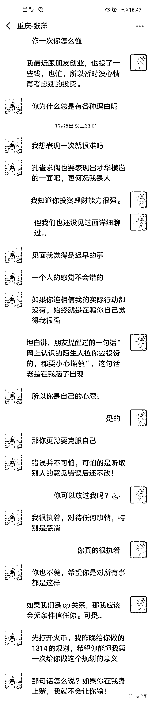

# 当虚拟货币遇上杀猪盘，骗子高兴的说：“ 这猪太好养了！”

> 原文：[`mp.weixin.qq.com/s?__biz=MzIyMDYwMTk0Mw==&mid=2247508057&idx=2&sn=b46c171526db4c436db574afd326e1c7&chksm=97cb6b61a0bce277f327b0176a0e6a5759d59afbcc9ed541695c4e96a40943e908cd6b31c39c&scene=27#wechat_redirect`](http://mp.weixin.qq.com/s?__biz=MzIyMDYwMTk0Mw==&mid=2247508057&idx=2&sn=b46c171526db4c436db574afd326e1c7&chksm=97cb6b61a0bce277f327b0176a0e6a5759d59afbcc9ed541695c4e96a40943e908cd6b31c39c&scene=27#wechat_redirect)

> 以下经历来自某网友@向日葵投稿，请耐心看下去。

2020.11.2 加到骗子的微信

2020.11.7 晚上就被诱骗投了 4 万。

就 6 天时间，怎么就这么快轻易相信一个网络认识的陌生人了呢？

是你思想太天真单纯无知？还是初次尝了甜头就放下警惕心了？

凭什么一个陌生人要带你赚钱，带你赚钱他有什么好处？

投资用的 app 到底是否靠谱呢？

怎么没有去查更多的信息才做决定呢？

往日的冷静和理智都去哪了呢？

被骗后一段时间都还真的以为骗子也是个受害者，相信他的房和车都被银行收走了，也相信他后来借的 100 多万也投进去亏掉了，如果是正常人，可能这么玩吗?

 被骗后一个多月才去报警，还有用吗？一分一毛都是血汗钱，就这么不懂珍惜啊？

各位，捂好自己的钱袋子吧！！！

骗子心里肯定高兴极了，正跟身边的“同事”调侃呢：

“这猪太好养了！只用 6 天时间就杀到 4 万！这过程特别顺利！！要是遇到多一些这种猪多好啊！”

各位，如果有人跟你聊天时无意中提到“做投资”“看行情走势”“收益不少”“教你赚点零花钱”等等的话，十有八九是个诈骗分子，你千万千万要小心谨慎！！

现在不知他们又正在骗着谁了，又同时养着一大群猪，等时机成熟就杀！

希望我这篇文章发出去能有多一些人看到，没遇到过“杀猪盘”的就要提高防范意识；正在猪圈里面的就赶紧把骗子删掉或反杀骗子；遇到过的就调整心情，赶快从阴影中走出来，继续勇敢面对生活！

祈祷这个世界的骗子都不得好死！

← 向右滑动与灰产圈互动交流 →

