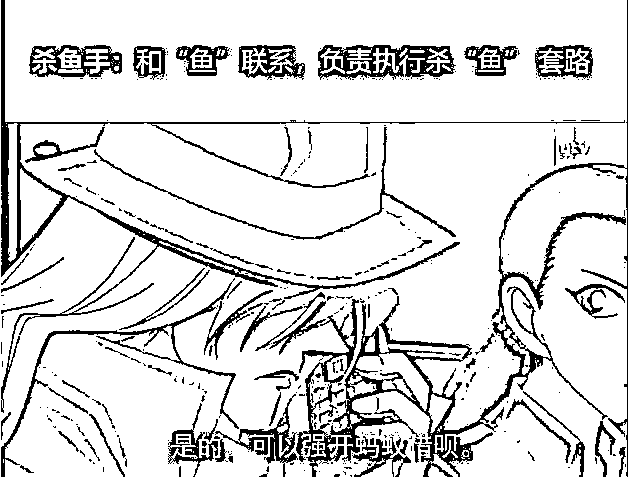

# 杀猪盘，杀鱼盘，电信诈骗如何将人拖入深渊的？

> 原文：[`mp.weixin.qq.com/s?__biz=MzIyMDYwMTk0Mw==&mid=2247508057&idx=4&sn=c18c74108c9fa7e69a2f4fcc0daaf819&chksm=97cb6b61a0bce2773cc55909b1c556630317b14e837945f5cd881f7cee123e358db436d06997&scene=27#wechat_redirect`](http://mp.weixin.qq.com/s?__biz=MzIyMDYwMTk0Mw==&mid=2247508057&idx=4&sn=c18c74108c9fa7e69a2f4fcc0daaf819&chksm=97cb6b61a0bce2773cc55909b1c556630317b14e837945f5cd881f7cee123e358db436d06997&scene=27#wechat_redirect)

“网络电信诈骗”是指违法犯罪分子利用手机短信、电话、传真或互联网等通讯工具，或发布虚假信息、设置骗局，对受害人实施远程非接触式诈骗、非法侵占受害人财物的犯罪行为。如今，电信诈骗的手段越来越多样，很多人也表示越来越难防。本文作者分析了电信诈骗的流程和步骤，帮助大家预防受骗。

**作者：**莫向外求

**—————— BEGIN ——————**

如果说互联网技术的崛起，给当代社会带来了积极进步的一面，让人类可以看到光明的未来。

那么，电信诈骗就是光明的衍生品。

作为 PM 的我们，要客观理性的看待电信诈骗，通过分析其原理，帮助更多的人避免“踩雷”。

电信诈骗的原理十分简单，就是通过上瘾模型将受害者一步步拖入深渊。

下面我将通过对目前已经出现的三种“盘”进行分析，帮助大家了解其流程和步骤，以便能提早预防受骗：

## 

## **杀鱼盘**

“杀鱼盘”主要是指“信用卡提额、贷款诈骗”，骗子在网上发布信息称，可以提高信用卡额度、强制开通蚂蚁借呗、黑户“洗白”来吸引受害者上钩，随后通过发布虚假链接，诱骗受害者通过花呗等付款。

其步骤通常为以下三步：

### **1. 撒鱼饵**

骗子通过在社交游戏网络平台发布虚假广告，称可以提高信用卡额度，快速开通网络借贷，吸引那些急于用钱的人注意。鱼儿一旦动心，钓鱼手就开始试探。

这个步骤符合上瘾模型中的触发过程。通过虚假广告触发有需求的受害者，将其吸引，骗其上钩。

### **2. 钓鱼**

当鱼儿上钩之后，他会让你提供支付宝借呗额度、余额等信息，先看能骗多少钱。随后再以提额失败为由，让鱼儿完善几笔交易流水，并贴心地让鱼儿使用支付宝绑定一张没钱的银行卡来支付，这样既能留下交易流水记录，账单又会因为余额不足无法支付成功。

这个过程又符合上瘾模型中的行动过程，通过一些简单的操作，打消“鱼儿”的顾虑，取得“鱼儿”的初步信任。

### **3. 杀鱼**

最后，杀鱼手找链接手根据鱼儿花呗额度量身打造付款链接。

前两次，杀鱼手会让鱼儿用没钱的银行卡支付，一般显示支付失败，鱼儿这时候会放松警惕。

到了第三次，杀鱼手就发来链接让鱼儿选择用花呗支付，鱼儿没有防备点击支付，钱就购买了一些虚拟商品。

这个过程就符合上瘾模型中的付出行为：

受害者在前几次的操作中已经投了不少时间和精力，同时也没有物质损失，以及对骗子产生了信任；在最后一次付款后，才知道自己被骗，这时钱已经到了骗子的口袋，悔之晚矣。

## 

## **杀鸟盘**

“杀鸟盘”主要是指刷单诈骗、兼职诈骗，骗子通过发高薪兼职信息吸引受害者参与，再通过套路不断鼓动受害者投钱代刷，最终骗取所有投资钱财。

通常为以下五个步骤：

### **1. 买饵料**

“买饵料”主要是指购买一些公民的个人信息，为杀鸟做准备。

买饵料讲究的是精准，大学生、待业人员、宝妈这些是主要诈骗对象，因为这些群体中傻白甜、呆萌闲的比较多，这样才能提高“杀鸟”的成功率（想不到骗子也会对受害者进行用户画像）。

### **2. 挂鸟网**

指的是通过群发短信，58 同城、网页搜索、抖音、QQ 群等网络平台发布虚假广告，骗“鸟”加 QQ，并开展洗脑工作。

此过程符合上瘾模型中的触发过程。

### **3. 喂鸟**

指的是让受害者拍下第一单，比如付款 120 元，返款 125 元给鸟，让鸟赚 5 块钱，让鸟信以为真的可以赚钱，取得鸟的信任。

这个过程显然符合上瘾模型中的报酬反馈，受害者一旦尝到了甜头，就将会深陷其中，难以自拔。

### **4. 醉鸟**

让鸟再拍第二单，价格一般在 200 左右，一般是让鸟直接扫码付款，或者通过在微信群发红包的形式付款。

杀鸟手以返款需要时间为理由，诱骗鸟继续接单。

这个过程就与上瘾模型中的“付出”行为高度契合，受害者支付越多，将会陷的越深。

### **5. 杀鸟**

鸟儿刷了几单后，因为已经投入了比较多的钱，杀鸟人或者诱骗或者直接威逼恐吓，称不按照任务刷单，之前的投资都会没有。

很多鸟害怕后会一直刷单直到清醒，不少鸟儿被骗资金数以十万计。

一旦鸟醒，杀鸟人就直接拉黑删除。

直到此时此刻，受害者才意识到自己被骗，但一切都已经太晚。

## 

## **杀猪盘**

“杀猪盘”主要是指通过婚恋平台、社交软件等方式寻找潜在受害者，通过聊天发展感情取得信任，然后将受害者引入博彩、理财等诈骗平台进行充值，骗取受害者钱财的骗局。

“杀猪盘”的开始一般都是和“高富帅”“白富美”的“美好邂逅”，实际上……

杀猪盘通常为以下四个步骤：

### **1. 猪槽**

所谓“猪槽”，指的就是一些交友工具。通过婚恋网站、即时通讯工具等筛选易上当人群，假意与受害人谈恋爱——不管你是男的女的，也不管你是 20 岁还是 80 岁。

在确定恋爱关系后，通过让受害人参与到网络赌博或所谓的商业投资中骗取钱财。

这个过程契合了上瘾模型中的触发行为：通过外部触发，给受害者一种“幸福来敲门”的感觉。

——殊不知，此时的受害者在这群人严重就是“猪”。

### **2. 喂猪**

“喂猪”指的是按周聊天剧本，与“猪”培养感情。

骗子往往将自己包装成“高富帅”或者“白富美”的理想伴侣形象，把“猪饲料”（聊天剧本的套路）导入“猪槽”，和受害者谈情说爱，每天固定喂养，迷惑受害者的心智。

这个过程符合上瘾模型中的行动、报酬和付出行为：受害者往往在这段“恋情”中付出了很多时间，同时也收获了“爱情”，使得受害者越陷越深（越养越肥）。

### **3. 杀猪**

骗子等到“猪”长到膘肥体壮的时候，就开始磨刀子了。

他们往往会让受害者看到自己搞网络赌博、投注彩票、金融投资赚钱的样子，连哄带骗让受害者也参与投资，并不断加大投资力度，等到投入资金达到一定规模，就猛地一刀，直接拉黑走人。

到这个时候，已经是多说无益、欲哭无泪了。

## 

## **总  结**

互联网世界充满了各种各样的光明，也有形形色色的黑暗。电信诈骗的技术手段并不高明，但它就是能一直祸害许多人。

在此，希望各位读者能通过本文了解到电信诈骗的模式，避免上当受骗。

同时也劝戒各位 PM，不要尝试做相关方面的技术开发。

一个好的商业模式，绝不是以“骗”为基础。

要想设计出使自身快速实现庞大规模、可持续竞争优势的商业模式，除了攫取时代的流量红利之外，还需要做更多对产业、对社会更有益的努力和改变。

← 向右滑动与灰产圈互动交流 →

