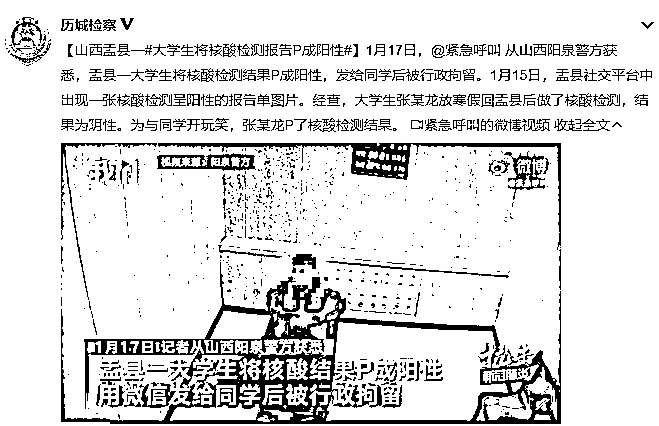

# 可恨！这钱怎么敢挣？复印店老板卖假核酸报告获利 200 元

> 原文：[`mp.weixin.qq.com/s?__biz=MzIyMDYwMTk0Mw==&mid=2247508126&idx=3&sn=bbde69fb16e87557942ba592d2b7b82b&chksm=97cb6ba6a0bce2b06b10ed40062fa62edf2cd0a18934a2cda4405861c071c2da6cf5b6b35037&scene=27#wechat_redirect`](http://mp.weixin.qq.com/s?__biz=MzIyMDYwMTk0Mw==&mid=2247508126&idx=3&sn=bbde69fb16e87557942ba592d2b7b82b&chksm=97cb6ba6a0bce2b06b10ed40062fa62edf2cd0a18934a2cda4405861c071c2da6cf5b6b35037&scene=27#wechat_redirect)

近日，山西大同公安接举报后调查发现，大同倍加造村一复印店老板魏某岗，**通过修改名字及身份，****出售核酸检测报告！**1 月 18 日中午，大同市公安局云州分局倍加造派出所接到举报称：在倍加造村内有一复印部出售制作的核酸报告。接到举报后，派出所立即联合分局刑警大队展开对复印部的调查取证。复印部老板魏某岗对其出售变造的核酸检查报告一事供认不讳。经过调查，嫌疑人通过修改名字及身份的方式出具核酸报告 11 份，从中获取 200 元钱利润。依据《中华人民共和国治安管理处罚法》第五十二条之规定，公安机关依法对其处以行政拘留 15 日，并处罚款 1000 元的处罚。目前该案现在进一步调查中。

**将核酸报告 P 成阳性，多人被行拘**

记者检索发现，疫情出现以来，曾有多人因篡改核酸报告被处罚↓

网友：可恨，可恶！

**篡改核酸报告，零容忍！**

来源：中国青年报

← 向右滑动与灰产圈互动交流 →

# 

> 原文：[`mp.weixin.qq.com/s?__biz=MzIyMDYwMTk0Mw==&mid=2247508126&idx=4&sn=f082a5dad60a6209d9dd8f91f422d725&chksm=97cb6ba6a0bce2b0854331bd1b65f8c458027224f5d51c22561711a2472a6ced31725a34627a&scene=27#wechat_redirect`](http://mp.weixin.qq.com/s?__biz=MzIyMDYwMTk0Mw==&mid=2247508126&idx=4&sn=f082a5dad60a6209d9dd8f91f422d725&chksm=97cb6ba6a0bce2b0854331bd1b65f8c458027224f5d51c22561711a2472a6ced31725a34627a&scene=27#wechat_redirect)