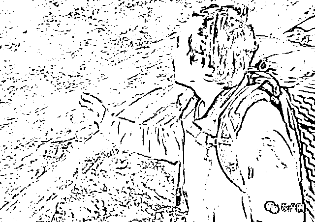

# “西藏冒险王”疑似被害？网友对视频做降噪处理，同伴被质疑

> 原文：[`mp.weixin.qq.com/s?__biz=MzIyMDYwMTk0Mw==&mid=2247508193&idx=2&sn=7eb34b350132f953326273f14da82a75&chksm=97cb6bd9a0bce2cf365500013a24320e43c38b087ae37b0ad56dd892ea5a9560f949381a1a6d&scene=27#wechat_redirect`](http://mp.weixin.qq.com/s?__biz=MzIyMDYwMTk0Mw==&mid=2247508193&idx=2&sn=7eb34b350132f953326273f14da82a75&chksm=97cb6bd9a0bce2cf365500013a24320e43c38b087ae37b0ad56dd892ea5a9560f949381a1a6d&scene=27#wechat_redirect)

前段时间，一条网红不幸去世的消息在互联网上刷屏了。去世者是 ks 上的一名网红，其账号名称为“西藏冒险王”。

此网红平时的视频内容就是给网友拍摄一些西藏地区冰川的美景。因为取材新颖，去的都是人迹罕至的地方，抓住了大众的猎奇心理，西藏冒险王的视频受到不少网友的喜爱，在 ks 上收获了 100 多万的粉丝。

然而，就在前不久，网上突然传出了西藏冒险王去世的消息。另外，事发当时的视频也被曝光了出来。视频中我们可以看到：西藏冒险王跑到一处河边拍摄，失足掉到了湍急的河水里，随后便被大水冲走。

不少粉丝在听到这个消息后，都表示非常伤心，替这位网友的家人感到惋惜。另外，据相关报道显示：事发后，有关部门在附近的河流中打捞，但并未找到西藏冒险王的尸体。

网络是有记忆的，但网络也是健忘的。在事情大面积曝光后的几天，网友也就逐渐将此事淡忘。就在最近，网上有突然传出了针对此事的报道：当时与西藏冒险王同行的还有他的一位同伴，该男子的网名为“小左”。网友质疑西藏冒险王的去世，是小左有意为之。

一时间，“谋杀”的说法在网上传得沸沸扬扬，小左也深陷到了舆论的声讨声中。质疑的声音越来越大，参与的人也越来越多。西藏冒险王的弟弟、表哥等人都跑到了当地，配合当地警方查找疑点，并在网上发布了视频。

另外，曾参加《探险中国》的救援队长，针对西藏冒险王去世的事件在网上发视频，说出了自己的几点质疑：

首先，西藏冒险王在 20 号就已经遇难，为什么到 26 号才对外公开消息？

当时救援队曾经问过小左，小左给出的回答是：当时人已经不在了，我不知道怎么和他的家里说，怕说出来，他的家里人会难受！

另外，小左自述，在西藏冒险王遇难后，自己曾经扔给对方一个桶对其进行救援。但经过救援队长的现场考察，并没有发现这个桶。

事情为什么会在几天之内发生这样反转，曾经的同伴小左，为什么突然就成了千夫所指的“凶手”？这一切还得从网上的几段视频说起。

在西藏冒险王遇难的消息发出后，粉丝第一时间就关注到了他的同伴小左。在小左手机里保存的视频当中，有一段 19 号拍摄的视频，而西藏冒险王遇难的时间恰好为 20 号。在这段视频里，小左拍摄了陪着两人一起冒险的大黄狗，而小狗则表现得很惧怕小左。面对小左的拍摄，全程都在瑟瑟发抖。

第二段视频也是在 19 号拍摄的，有人对小左的这段视频做了降噪处理，期间听到的声音让人不寒而栗。降噪后的视频可以清楚地听到小左的声音：好重啊，这家伙，还在流血（还没有死）……

另外，视频中似乎还传出了男子沉闷的喘息声，很像人在受伤之后发出的声音。

就是因为这几段视频，将小左推到了风口浪尖，各大账号疯狂转发。

被置身于舆论中心的小左也在其社交平台发长文，对此事进行了澄清。表示：所谓的降噪视频是在 9-12 号录制的，之所以在 19 号才发布出来，就是因为之前没有网。

事情发展到这一地步，无论小左如何解释，似乎都显得很无力。不少西藏冒险王的粉丝依然在网上斥责小左，打着所谓伸张正义的样子，评论到：疏而不漏……

最后，我们想说的是：

网红经济下，流量代表的就是利益。带节奏的这些网红，打着所谓的“讨公道”的立场，利用死者的名声，利用“无知”网友的良知，故意制造舆论，是不是为了自己的利益呢？

先不管这一套“阴谋论”是否成立，面对生死这样的大事，我们是不是应该更加相信有关部门的调查判断？如果事情水落石出，施暴者自然会受到应有的制裁。作为一个粉丝，我们是不是应该反思一下。我们的好心，是不是成为了有心人利用的工具？

如果有一天真相大白，小左与此事并无关系。那每一个参与此事的网友，是不是都是网络暴力里的“施暴者”？小左受到的伤害，又将由谁来弥补？天灾面前我们无能为力，但现在我们做下的“恶”，到时候一句“对不起”就了事？是不是太过轻松了一点？那些靠着冒险王的死来大肆炒作的所谓亲友？良知何在？良心何安？

大家对此事有什么看法？

（知乎网友就该事件展开热烈讨论，可以去围观一下：https://www.zhihu.com/question/440226087）

← 向右滑动与灰产圈互动交流 →

