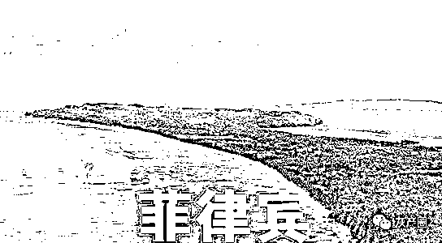
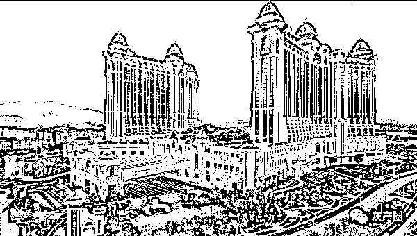
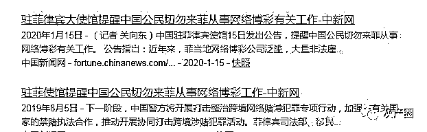
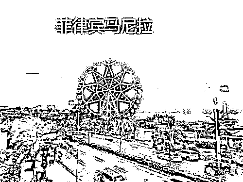
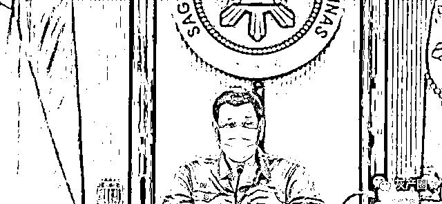

# 专门针对中国人，割十万中国人的韭菜，菲律宾黑产到底有多恐怖？

> 原文：[`mp.weixin.qq.com/s?__biz=MzIyMDYwMTk0Mw==&mid=2247508193&idx=3&sn=d2924d62c0f802da462bb54c541540f3&chksm=97cb6bd9a0bce2cfd33b19a36c7e9f495f072ed98a6aa2804ae56d76fca711a21465f5488d89&scene=27#wechat_redirect`](http://mp.weixin.qq.com/s?__biz=MzIyMDYwMTk0Mw==&mid=2247508193&idx=3&sn=d2924d62c0f802da462bb54c541540f3&chksm=97cb6bd9a0bce2cfd33b19a36c7e9f495f072ed98a6aa2804ae56d76fca711a21465f5488d89&scene=27#wechat_redirect)

专门针对中国人，割十万中国人的韭菜，菲律宾黑产到底有多恐怖？

拥有超过 47 万从业人员的博彩产业，被誉为菲律宾四大收入来源之一，到底有多疯狂？

横行成长的菲律宾赌博业

由于谐音的关系，菲律宾的博彩业被称为“菠菜业”，从事博彩的人也被称为“菜农”。尽管欧美有些国家把赌博视为合法行为，但与博彩业和谐相处的国家恐怕只有菲律宾一个。

有些人把菲律宾博彩业的繁荣归咎于西班牙和美国的殖民统治，坦率地说，尽管这对菲律宾来说是一场巨大的灾难，但博彩业泛滥的锅却并不是西班牙人和美国人的错。

根据历史文献记载，在西班牙殖民统治菲律宾之前，赌博业就已存在。在去菲律宾的途中，麦哲伦船队发现在巴拉望岛上有一场斗鸡赌博。

菲律宾斗鸡行业去年发生过一起重大事件：一名警察在搜查赌博现场时，被斗鸡公司的工作人员割断动脉，当场死亡。实际上，斗鸡作为菲律宾最常见的赌博方式，一直被视为国粹，为了提高斗鸡的战斗能力，菲律宾人常常在进行斗鸡活动时将刀绑在鸡脚上。就这样，刚刚提到的菲律宾警察被斗鸡划伤动脉死亡，实际上是被斗鸡脚上的刀片划伤动脉。

公鸡一直是菲律宾人奉若神明的东西，几乎每一个村庄都有专门的斗鸡场，甚至诞生了各种各样的斗鸡规则。早在西班牙殖民统治时期，对菲律宾斗鸡现象也是睁一只眼闭一只眼，心想忙于斗鸡无人反对也是一件好事。

然而，慢慢地，西班牙人觉得不对，几乎菲律宾所有的男人都喜欢斗鸡这样的赌博活动，虽然西班牙的殖民统治需要菲律宾人来做，但他们却整天游手好闲，跑去斗鸡，给西班牙的统治带来严峻的挑战。

因此，当时菲律宾出现了奇怪的一幕：西班牙，一个不公正的殖民统治方，整天忙于帮助菲律宾人戒毒，而菲律宾人却反对这样的行为。

命令、执行、惩罚，总之就是西班牙人用来帮助菲律宾人戒掉赌瘾的各种手段，结果发现根本没用。再加上西班牙本来就有赚钱的打算，所以到了后期，逐渐默认了菲律宾的赌博行为。

当美国从西班牙手中夺回了对菲律宾的殖民统治权后，美国满怀信心地准备帮助菲律宾人戒赌，在美国人看来，帮助菲律宾人戒赌是件很容易的事。但此时冷眼西班牙只想说一句：你们还太年轻！

就像西班牙预料的那样，美国人帮助菲律宾人戒赌很快就以失败告终，实际上从这两次失败的“戒赌”经历中可以看出，赌博这个东西已经渗入了菲律宾人的骨髓。

受打击的美国人不再严厉禁止菲律宾人赌博，而是逐渐把赌博作为慈善事业的一种方式来进行。

在一般国家，丧葬活动都是一项严肃的仪式，但对菲律宾人来说，这又是一场赌博。在菲律宾，无论何时举行葬礼，都会有大批赌博者前来，而这些赌博者大多与死者的家人毫无关系。

遇难者家人可以从庄家那里得到一定的分成，而这一部分通常作为安葬费用。要想赌博，菲律宾人甚至会选择买尸体，然后举行一场假葬礼。

从亚洲来看，菲律宾人的月收入确实很低，但他们对消费的看法却很奇怪。一旦这些钱拿到，马上就会花完，把它们存起来甚至会被认为是道德犯罪，所以菲律宾人是否能赢钱已经不再是他们赌博的必要理由了。

02,000 中国人受雇于菲律宾赌博业？

在菲律宾赌博日益猖獗的情况下，中国曾劝告菲律宾立即取缔网络赌博，但杜尔特认为赌博业是可以赚钱的，并将此建议置之不理。

尽管菲律宾许多官员对赌博业持暧昧态度，但也有不少有识之士鼓吹要取缔赌博业，而提倡取缔赌博业的菲律宾官员多为华裔。

菲律宾的博彩从业人数一直是个悬而未决的谜团，官方统计数字为 13.5 万人，但也有机构称，菲律宾的博彩业从业人数实际上已达到 47 万人以上，甚至有超过 10 万中国人参与其中。

对博彩业，菲律宾政府的态度一直都很复杂，在鼓励博彩业发展的同时，对博彩许可证的发放也进行了严格限制。但这里面却有一个奇葩的规定，一张正式牌照下可以允许存在 5 个子牌照，这在一定程度上促进了博彩业的发展。

因此菲律宾的博彩公司总是想办法用子牌照相这一漏洞来使自己的赌博行为合法化。如前所述，菲律宾的博彩业雇佣了很多中国人，但实际上我国一直对赌博采取严厉的打击态度，那么菲律宾的博彩业又如何雇佣中国人呢？

经过 40 多年的发展，中国已从一个落后的农业国家蜕变为世界第二大经济体，菲律宾与中国加强经济合作将从中获益良多。因此只要有中国人来菲律宾工作，菲律宾官员基本上都会慷慨发放签证。

但实际上，许多来菲律宾工作的中国人却被博彩业的虚假广告所欺骗，这些虚假广告说他们月入过万，不需要高学历。

能打字，会说普通话，月薪过万，这样的招聘信息你会相信吗？有些人甚至抱着侥幸心理去相信这样的宣传，但他们却不知道自己会在赌博业这张大网里受尽千辛万苦。

一家名叫索莱尔东方集团的菲律宾知名博彩公司，在热火朝天的日子里，每天最多要工作 14 个小时，如果不能完成所谓的生意，一顿毒打就在所难免，外界称之为“东方监狱”。

许多中国人刚加入菲律宾赌博业不久就开始退缩，结果却被告知要支付一大笔离职费。亦非没有在菲律宾博彩行业工作过的人，曾有过逃亡的念头，但一般都会被抓回来受罪，然后拍个视频向家人索要高额赎金。

沉溺于菲律宾的赌瘾

在禁毒问题上，菲律宾总统杜尔特一直保持着零容忍的态度，并因此获得了“铁血禁毒”的头衔，但在戒赌方面却显得力不从心。

入世后，虽然菲律宾经济逐渐步入正轨，但去年的一次暴发却暴露出经济的致命缺陷，即缺乏主导产业。

在首都马尼拉的吕宋岛，在 2020 年 3 月 15 日开始封城，这一下子就切断了菲律宾的财源，因为仅吕宋岛就占据了该国 GDP 的 70%以上。

到了最后一步，杜尔特在 2020 年 5 月 1 日重新启动了吕宋岛的博彩业，这也让菲律宾想要摆脱博彩业变得更加困难。

政府的财政收入在菲律宾一直是个捉襟见肘的问题，因此历届政府都在计划利用博彩业来增加财政收入。菲律宾博彩收入约占 GDP 的 8%，但在政府的支持下，仍有许多博彩公司想方设法逃避纳税。

据菲律宾官方公布的数据，赌博公司在 2019 年向政府缴纳了 8.61 亿元人民币的税款，占菲律宾政府总税款的不到 1%。

同时，在菲律宾，博彩业的野蛮发展也带来了严重的社会问题，如跨国界洗钱等一系列犯罪，使菲律宾政府不得不付出沉重代价来消除这些影响。

尽管明知故犯，但博彩业就像一种一味不可理喻的毒药，至少对许多依靠博彩租金生存的房地产公司来说是不可舍弃的。

最近几年，菲律宾许多官员要求对博彩业进行严厉打击，但当该国经济因博彩业爆发而遭受重创时，这一说法似乎瞬间就消失了。

← 向右滑动与灰产圈互动交流 →

