# 收到这种短信立即删除，有人点进去结果一万元没了...

> 原文：[`mp.weixin.qq.com/s?__biz=MzIyMDYwMTk0Mw==&mid=2247508193&idx=4&sn=dc2e7df608ae67cb304aafc2e89eef37&chksm=97cb6bd9a0bce2cfa61156c8b64841bea963d3933690227601127489d6577093db23686f83ae&scene=27#wechat_redirect`](http://mp.weixin.qq.com/s?__biz=MzIyMDYwMTk0Mw==&mid=2247508193&idx=4&sn=dc2e7df608ae67cb304aafc2e89eef37&chksm=97cb6bd9a0bce2cfa61156c8b64841bea963d3933690227601127489d6577093db23686f83ae&scene=27#wechat_redirect)

滴滴……

XX 市商业局给你发来一条短信

个体信息失效？

延时补录将停业？

还要受处罚？

**真的，假的？**

网警告诉你

**如果你一下被短信唬住**

**不假思索就点击链接**

**很有可能掉入不法分子的圈套哦！**

**真实案例**

**1 月 19 日，南通启东市的个体工商户刘某和张某就被这种诈骗短信骗取了人民币 1 万元。刘某是经营五金工具的，18 日中午，突然收到来自“市商业局”的陌生短信，短信上称：您所经营个体信息已失效，请在 1 月 17 日前进入某网站完成补录，延时将停业被处罚。****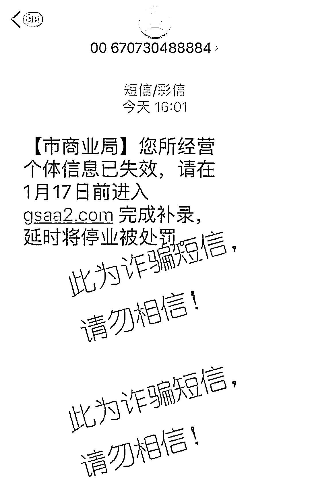****收到短信的刘某慌了，立即点进短信内的链接，进入网站，再根据网站提示先后填写了手机号码、身份证号码、姓名以及银行卡等基本信息后，立马就收到银行卡被转走 1 万元的短信提醒。刘某这才意识到这是电信诈骗，随即报警，但为时已晚。****当天下午，张某也同样收到此类短信，点进钓鱼链接，输入自己的基本信息后，银行卡被转走 1 万元。******

**如今人们的反诈意识在不断提升，但各种名义的诈骗使人防不胜防，难辨真假。让我们再来看看还有哪些短信链接不能点！**

****01****

******积分换礼品**。这类信息基本每个人都会收到。****

****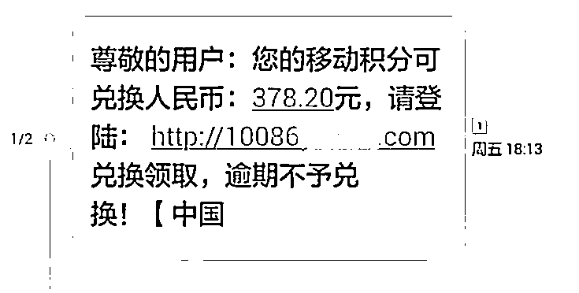********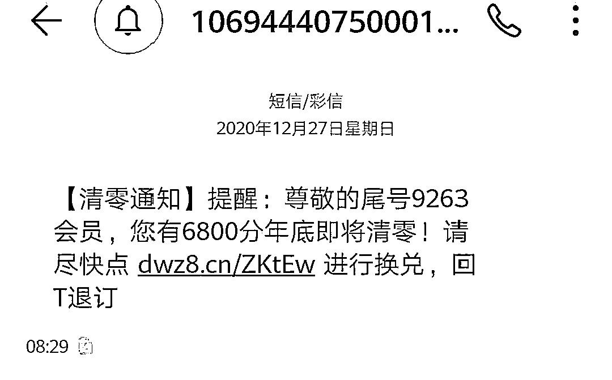****

******02******

********ETC 卡失效重新认证。**有车一族最近大概率会收到。******

****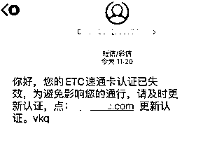********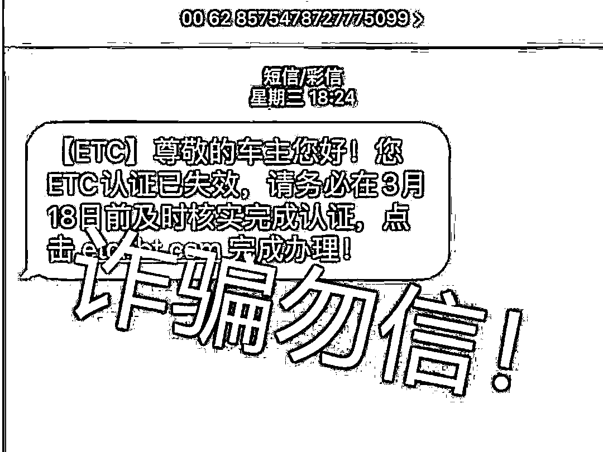****

******03******

********营业执照、个体信息失效、经营权确认。**个体工商户最近大概率会收到。******

****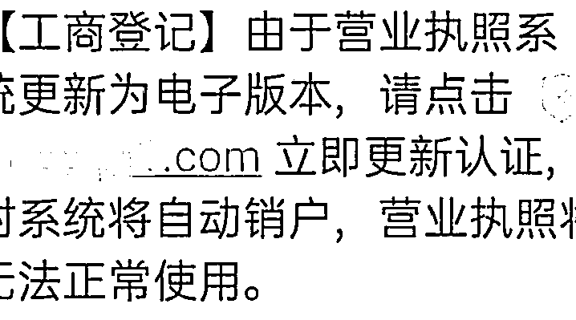********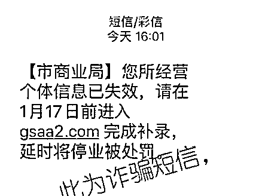**** ****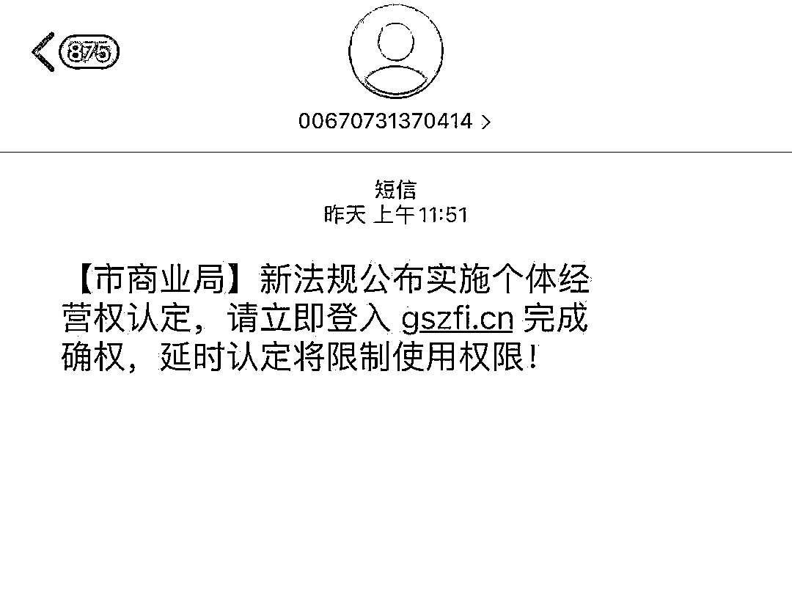****

******04******

********新冠疫苗预约登记。**这类信息基本每个人都会收到。******

****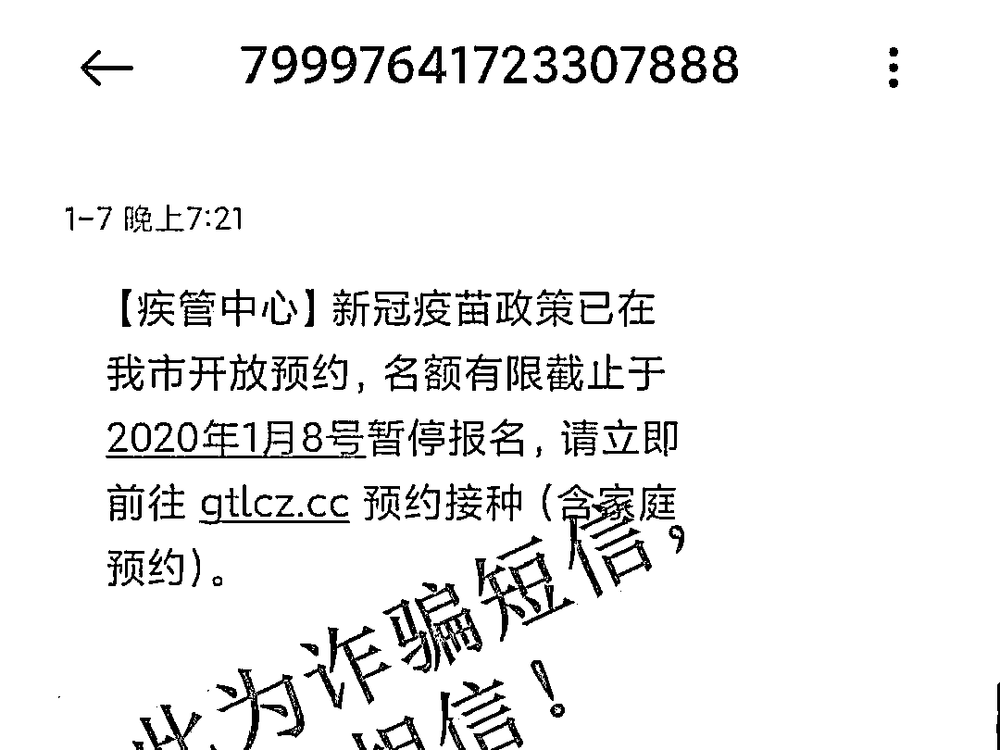****

******05******

********冒充银行以电子密码器失效、失信等为由**。银行理财客户大概率会收到。******

****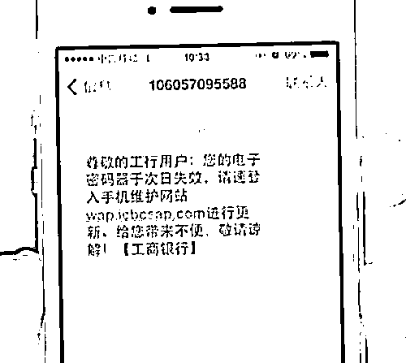********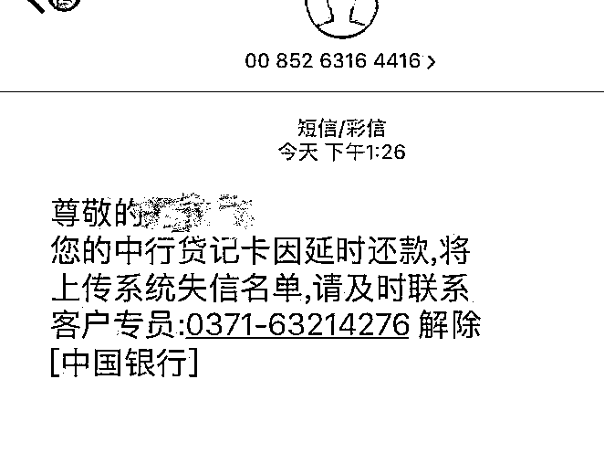****

******06******

********信息解冻。**特定人群会收到。******

****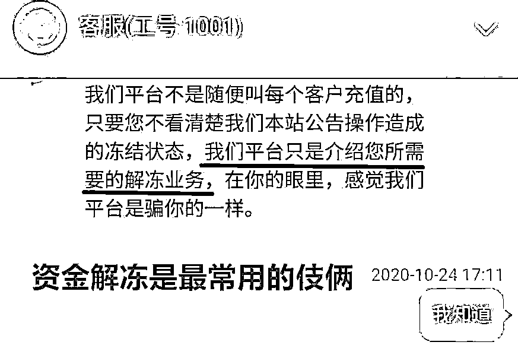********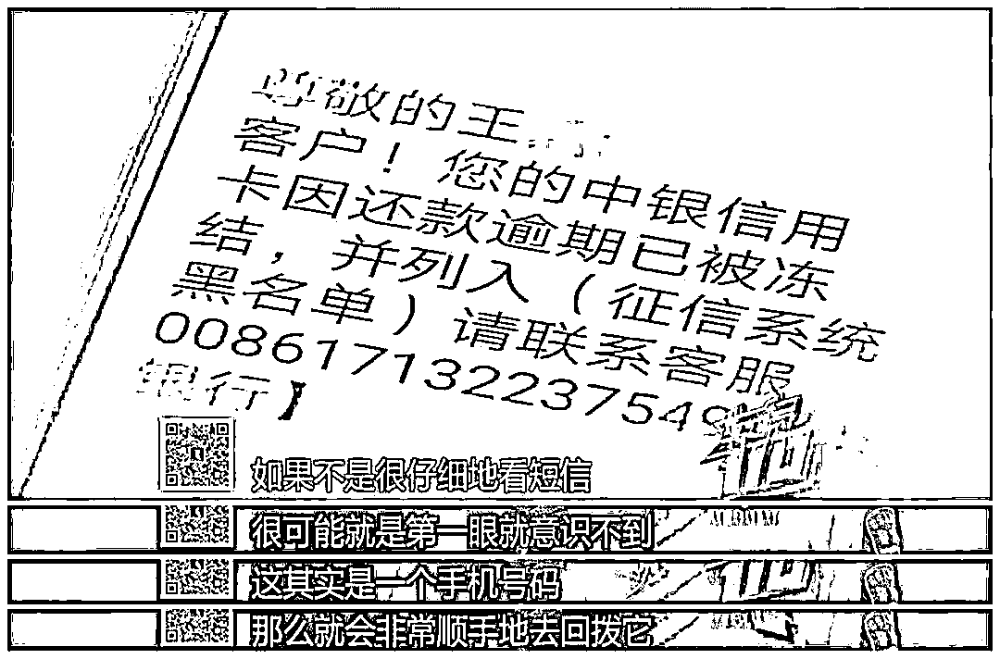****

******07******

********房产电子证书未签署。**准备房屋交易的人群极易收到。******

****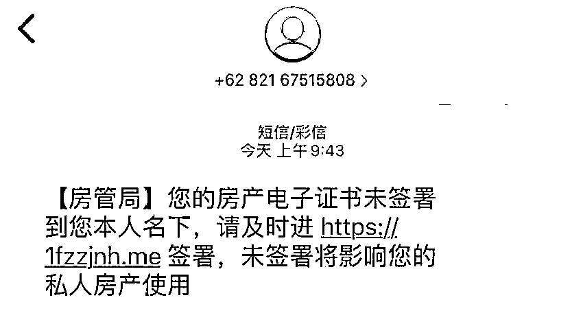****

******08******

********冒充电信公司诈骗。**移动通讯用户极易收到。******

****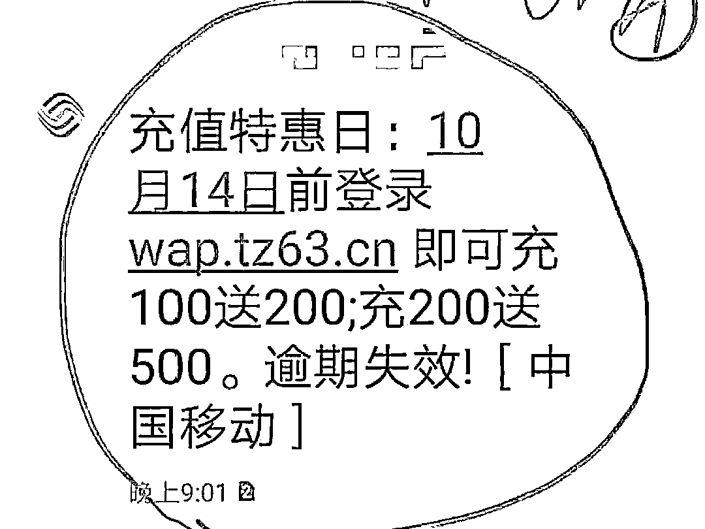****

******09******

********信用贷款额度提升。**急需要使用资金的人群极易收到。******

****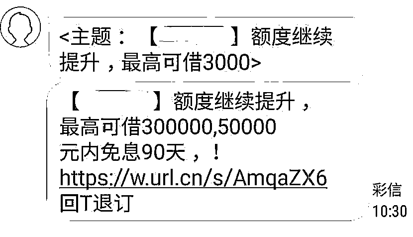********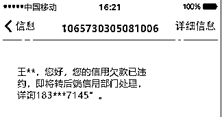****

******10******

********混进家校联络群。**学生家长大概率会收到。******

****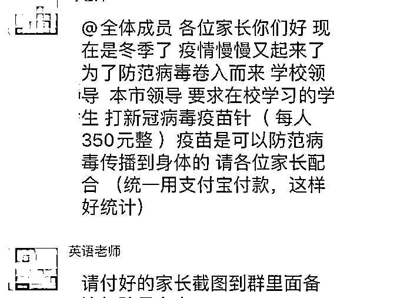****

******友情提醒******

********01********

******从上面的各种骗局我们可以发现，骗子的诈骗短信一直紧跟时事，当人们对新政策新规定一知半解的时候，趁机用钓鱼短信来诈骗。******

********02********

******对这些花样繁多又与时俱进的骗局，我们最好的防御手段就是不轻信。不要轻易将银行卡相关的短信验证码透露给陌生人，不要点击不明网址链接。******

********03********

******保持怀疑！多方核实！拒绝对任何来历不明的人和网站透露个人信息！做到这几点，就能保住诸位打工人的钱。******

******来源：南通网警 江苏网警******

************************

******← 向右滑动与灰产圈互动交流 →******

************