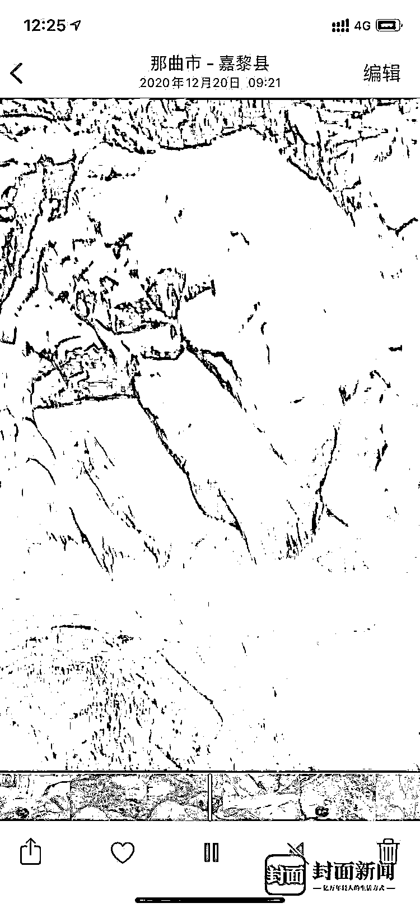
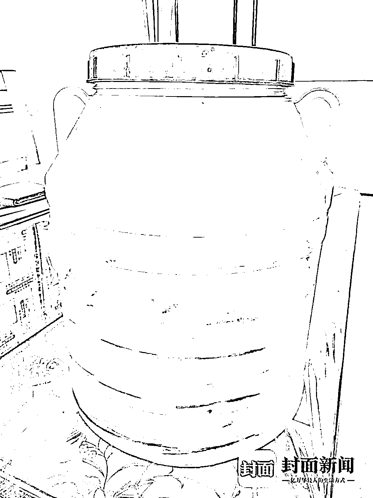
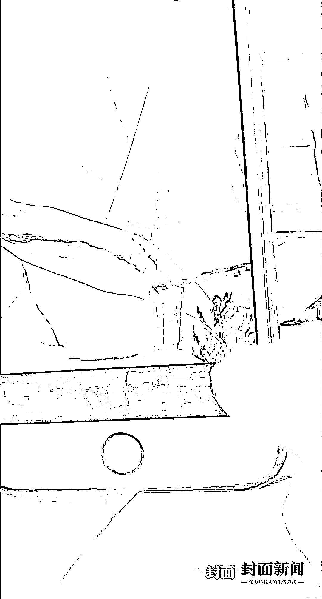
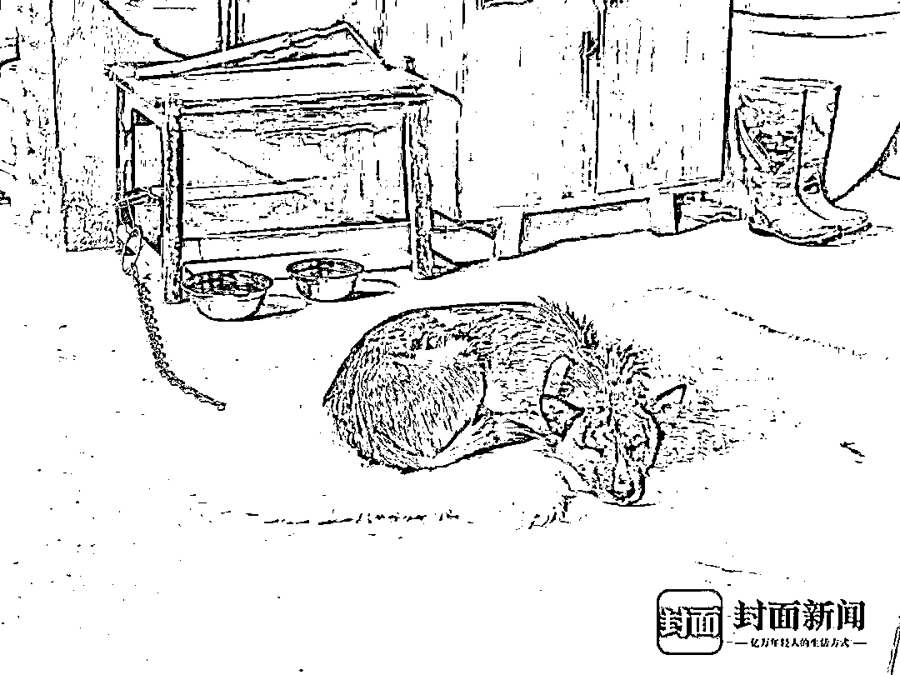

# 警方介入诡异视频！"西藏冒险王"家人发现一个细节

> 原文：[`mp.weixin.qq.com/s?__biz=MzIyMDYwMTk0Mw==&mid=2247508224&idx=1&sn=032045c1333c6dab40071991f15192ec&chksm=97cb6a38a0bce32e7ec403e0db77ecd07529ec7729c8d61d07c58183df0192266984d0637f4a&scene=27#wechat_redirect`](http://mp.weixin.qq.com/s?__biz=MzIyMDYwMTk0Mw==&mid=2247508224&idx=1&sn=032045c1333c6dab40071991f15192ec&chksm=97cb6a38a0bce32e7ec403e0db77ecd07529ec7729c8d61d07c58183df0192266984d0637f4a&scene=27#wechat_redirect)

父亲王东病了，弟弟王龙陪着去了成都；母亲何帮琼一个人守着家。家里，还有那只从西藏带回来的狗——“土豆”，以及曾常年使用的一只密封桶。“西藏冒险王”王相军本人却仍在失联中！

1 月 22 日，有网友在王相军生前最后一段视频中发现诡异声音“好重啊，这家伙还没死”，让王相军家属也起了疑心。

“小左说的落水的时间，与视频拍摄时间对不上。”1 月 24 日，王龙发现哥哥的手机相册显示，王相军落水时间为 2020 年 12 月 20 日 9 点 21 分，而小左称王相军落水时间为当天的 11 点左右。

**谜团背后，唯一能给出答案的，是小左——这个跟着西藏冒险王，在高原上，同行 33 天的江西籍男子。**西藏嘉黎县警方称，已注意网传疑点，并将赴四川展开再调查。

王相军与小左在一起的合影

[`v.qq.com/iframe/preview.html?width=500&height=375&auto=0&vid=i3223wt31kj`](https://v.qq.com/iframe/preview.html?width=500&height=375&auto=0&vid=i3223wt31kj)

@沸点视频

◆

**视频拍摄时间与落水时间对不上**

◆

“王相军有四部手机，出事时，王相军自己身上有两部，另外两部在小左那里，其中一部拍下了王相军落水的视频。”王相军的母亲何帮琼说，事发后，王龙从拉萨出发去了现场，在第三天，见到小左后，小左把两部手机交给了王龙。

目前，王相军的这两部手机仍由王龙保管。

**王龙称，他打开王相军的手机相册，找到那段时长为 32 秒的落水视频，播放时显示：落水的瞬间发生在 2020 年 12 月 20 日 9 点 21 分。**

而小左在直播中称，当天他拍摄王相军落水视频的时间，大概是 11 点左右，“具体时间不太确定”。**为什么事发时间和王相军手机播放视频显示的时间差了一个多小时？小左解释称：“因为手机在没信号的地区，拍摄的时间会有错乱”。**

“小左说的事情经过，我不敢完全确定是不是真的。”王龙说，他曾当面对小左提出过质疑，“小左说他没有说谎”。

那么，网传的降噪视频，是否与王相军落水相关？

“网传的视频，原视频降噪后，确实能听到一些声音，我也不知道是怎么回事。”王龙证实，王相军手机里显示，**网传降噪视频的原视频，拍摄时间是 2020 年 12 月 10 日。**

“我们现在对这件事保留态度，不敢说是意外，也不敢说不是意外。只有警方调查清楚后才晓得。”王龙透露，他们通过代理律师，已经与西藏嘉黎县警方作过沟通，也提出了一些待解疑点，“嘉黎县警方回复说，近期会派民警到四川展开调查。”

王龙播放视频时的手机截图

◆

**诡异视频与难解的疑点**

◆

王相军失联后，何帮琼每天都在劝自己不要想儿子，但又忍不住要翻看他以前的视频。最近几天，网传的那段降噪视频中出现诡异声音，让她心烦意乱。 

“王相军出事那天，王龙在拉萨。第三天才见到小左。那几天发生了什么，**都是小左在说，我们也不知道具体是怎么回事。**”何帮琼认为，小左说的一切，她“不知道该不该信”。

“王相军探险失踪事件存在疑点”，“王相军疑似被害”——有网友将王相军本人发布的最后一段视频降噪，发现背景里有疑似人声：“好重啊，这家伙，还是没有死……”

这段视频长约 56 秒，发布于 2020 年 12 月 19 日，拍摄者在冰洞中行走。和王相军以往视频不同，这段视频没有解说，没有配乐，只有环境声和喘息声。

视频在网上传开后，不少网友惊呼“细思极恐”。更有网友猜测，视频中，抚摸冰川的那只手，可能是小左的。还有网友将视频倒放，“感觉看起来是被拖着走的”。

王相军经常带着出行的其中一个密封桶

“小左说，他救过王相军，自己也落水了，后来爬上了岸。**王相军有七八年的冰川探险经验，小左都能上来，为什么他不行？**”何帮琼分析称，王相军和拴着绳子的桶也不见了，“那么多人都没找到，那，到底到哪里去了？那么大个桶，又是密封了的，应该会漂在水面上，怎么会找不到呢？”何帮琼说。

几天前，王龙把其中一个密封桶带回了家。这种桶，王相军有两个，以前经常绑在摩托车上，一边一个，装衣服和生活用品。

◆

**小左“官宣”与他的多次发声**

◆

2020 年 12 月 26 日，王龙通过王相军的视频账号发布消息称，2020 年 12 月 20 日，他的哥哥“长眠”于依嘎冰川瀑布之中，“他痴迷于冰川，最终也献身于冰川……这里是他最好的归宿”。同一天，小左也发布视频，配文“冒险王永远离开了我们……“，配文前面加上了“官宣”字样。 

小左称他落水后是靠这条冰缝爬上岸的

此前，即 2020 年 12 月 25 日，小左发布一条视频，配有文字：“直到现在我内心都无法接受，你就这样长眠于此，你的生命虽短暂却足够璀璨，一路走好……”这段视频的配文，有“同伴死去的第五天”的表述。

2020 年 12 月 27 日，小左又接连发布两条视频，其中一条内容包含“2020 年 12 月 20 日，我在十三村等待警察过来处理”；另一条视频的配文是：“我们深知自己热爱的事情有多冒险，大家也不要相互攻击了，更不要恶言相向，我发这些都是给陪伴关心我的朋友一个交代”。

2020 年 12 月 29 日，小左再一次通过视频方式，呈现了一张文字截图，内容标题为《请不要扭曲事实真相》，讲述了王相军落水过程，以及他本人施救的过程。小左在结尾说：“谁想发生这种意外啊！何必让我一个活着的人更痛苦”。

今年 1 月，小左还多次通过直播方式对相关情况作出解释。

针对降噪视频中的诡异声音，小左称：**“那个视频的意思是他（王相军）在那边遇害了。完全是无稽之谈。原视频是我们一起相约去恰青冰川，时间是 2020 年 12 月 9 号至 12 号，有 5 个人 4 条狗……**当时王相军一个人在里面录视频，其余人都出去在外面等他。”

小左最近一次直播，是 1 月 23 日晚。“如果我有问题，警察肯定把我抓了”，“我相信警察不会冤枉一个好人，也不会放过一个坏人”**，小左在直播中表示，他不想理会那些对他有恶意的网友**，他认为“有些人想炒热点”，“每一个字眼都去抠，每一件事情都去怀疑”。

**对话同行者小左**

**◆**

**不想再谈及此事**

**◆**

1 月 23 日，封面新闻记者联系上小左。他表示，自己不想再谈此事，此后再也不接电话。此后，记者尝试通过短信与其联系，截止发稿，小左没有回复。 

1 月 23 日晚，小左出现在网络上。这是诡异降噪视频之后，小左第一次通过直播对降噪视频进行了解释。

小左称，他的手上有疤痕，但这个视频中的手没有，“大家不要去相信炒热度的人……降噪这个视频，是我们在（2020 年 12 月）9 号到 12 号之间拍的，19 号才发出来。一些库存视频，我们都会在没有网之前把它发一遍，因为进山之后就没网了”。

**对于网友怀疑小左谋害王相军一事，小左回应称，“我最好的朋友逝去，我本来就很痛心，我自己也是死里逃生捡回一条命……”**

小左说，施救时，他也掉下去了，当时王相军有密封桶可以扶着，于是自己先踩着水下岩石上的耳朵，用手插进冰缝爬上了岸。然后，他让王相军从自己爬过的地方上岸。期间，自己曾用三脚架去拉王相军，哪知失败了，之后才去叫救援。

“最开始是一个有 80 多万粉丝的博主，在直播间造谣，让大家觉得我在谋杀，他靠造谣的短短几天，涨了十多万粉丝……还有很多无良的人，利用这件事情募捐。”小左说。

◆

**空巢母亲与生病的父亲**

◆

“王相军天天给你吃牛肉、吃排骨，在我这里，就只有吃狗粮哦！”1 月 23 日，“西藏冒险王”老家——广安邻水县，母亲何帮琼正在给“土豆”喂食。这栋去年才完工的四层楼新房里，只有“土豆”和何帮琼居住。“土豆”是一条狗，是跟着儿子王相军在高原上的那条狗。 

这段时间，何帮琼将“土豆”照顾得很好，专门给它分配了一个房间，为它铺了羊毛毯子。“土豆虽然回家了，但是它又不能说话……”说到这里，何帮琼禁不住落下泪来。环顾四下，前年才修好的四层楼房里，只剩下何帮琼一个人。

王相军失联后，父亲王东去了拉萨，等了半个多月，没有结果。最终，王东一病不起，只好回到成都，住进了医院。弟弟王龙是陪着王东回来的。还把“土豆”带了回来。因为要照顾父亲，王龙于是把“土豆”送回了邻水。王龙回来，没给母亲多说什么，又急匆匆去了成都。

**王东目前也联系不上小左。“打电话，发微信，都不回，我觉得小左可能在骗我们。**”王东说，一开始，他是相信小左的，“毕竟我儿子出事时，我们都没看见，所以他说什么我们就信什么。”

王相军没有考驾照，曾在网上征集驾驶员。“小左给我说，是我儿子主动找上他的，一个月给几千块钱。我想，我儿子在直播里征集驾驶员，应该是小左看到后主动找我儿子的才对。”

时至王相军失联，王相军和小左一起在西藏探险，共计 33 天。

王东说，**之前六七年，王相军都是一个人出去，从来没出过事，偏偏这次出事了，“这里面有原因”。**

“土豆”已被王龙送回四川老家

2019 年，王相军出资 30 余万元，把老家两间老屋改造成了四层楼房，面积 100 余平方米。当然，王相军很少住。

王东回忆，最后一次通电话时，王相军还提起要装修房子，说把房子装修好，一起在新家过个年。

2009 年，19 岁的王相军出门务工失联。2017 年，家人与他相认。此后，王相军只有 2018 年和家人一起过了个年。

来源:封面新闻

← 向右滑动与灰产圈互动交流 →

