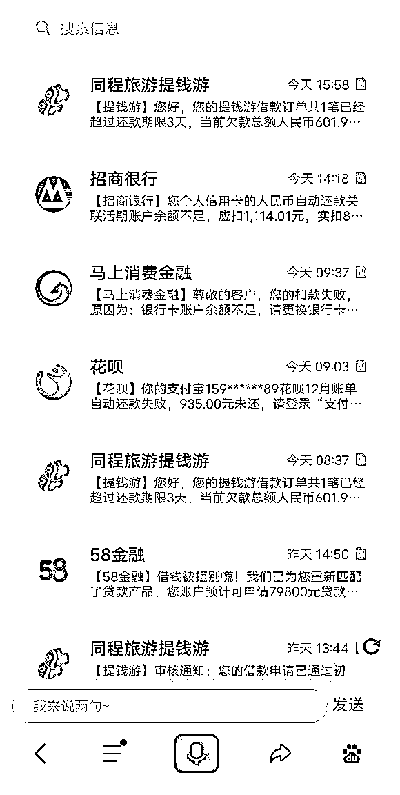

# 我“卧底”了一家催收公司，和那些欠债的年轻人聊了聊

> 原文：[`mp.weixin.qq.com/s?__biz=MzIyMDYwMTk0Mw==&mid=2247508224&idx=2&sn=309b6dac99cd8d13167e39eb1fb843c0&chksm=97cb6a38a0bce32e8fc277b98864b094a3eb0998812e79b340188bf73faad16f9ef3b21b87ef&scene=27#wechat_redirect`](http://mp.weixin.qq.com/s?__biz=MzIyMDYwMTk0Mw==&mid=2247508224&idx=2&sn=309b6dac99cd8d13167e39eb1fb843c0&chksm=97cb6a38a0bce32e8fc277b98864b094a3eb0998812e79b340188bf73faad16f9ef3b21b87ef&scene=27#wechat_redirect)

> 网贷放大了人性中不可捉摸的一面。

网贷无处不在，借钱越来越容易。负债群体的数量也在逐年上升。

汇丰银行曾发布一份调查报告，中国 90 后的负债总额接近 22 万亿元，人均负债 12.79 万元。人们惊讶于这个数字的庞大，而那些困在债务之中的人更是第一次发现，还有更多的人比自己下水还深。

这个话题很快上了热搜，也很快被其他话题淹没，但我仍想知道这些负债的是什么人？他们又为什么会逾期？

提交过征信记录和体检报告后，我顺利入职北京一家催收公司，正式成为一名催收员。

在我接手的案子中，年轻人占了一半的比例。他们是创业者、赌徒、刚毕业的上班族，他们在公司系统中被统称为“债”。

一旦成为“债”，很少有人能够逃脱追踪。即使换号，催收公司仍然有很多办法找到你。

通过物业公司、通讯公司、社区居委会等一切你留下踪迹的地方，在你的每一个社会网络节点里，公司总能找到你。

大多数逾期的人，债务都不止一笔。**有时他们为了摆脱一个系统中的“债”，而成为另一个系统中的“债”，直到全线崩溃。**

01

 作为一种隐秘又无孔不入的工种，职业催收常与“暴力”、“逼迫”等标签一起出现在公众视野。

我所入职的这家“信用管理公司”从事催收已有 10 年之久。**公司承接的业务基本涵盖了所有信贷渠道：信用卡贷款、车贷、蚂蚁花呗、微粒贷以及其他小额贷。**

公司一位主管告诉我，自从 2019 年央视 315 晚会曝光催收乱象之后，整个行业都受到压力，公司也禁止拨打债务人的通讯录。直到今年风头逐渐过去，这一限制才悄悄解除。

对大多数人来说，催收不必走到暴力那一步。“当他身边的每一个都知道他欠钱不还的时候，这个人基本上就完了。”主管说。

这一点从公司部门结构上也不难发现：**线上催收员占整个员工比例的 9 成，剩下的一个部门是实地调查部，即线下催收。**

工作时，私人手机是严令禁止使用的。每个部门都有一个带锁的箱子，专门保管员工手机。

经过 5 天的职业培训，交过手机之后，我被分到了微众银行催收部，面对的客户主要是微粒贷逾期的债务人。正式上岗第一天，主管从系统中抽出 141 个逾期在 3000 元以下的案件给我。这些客户预留的电话基本都打不通，而因为“额度过小”抽成有限，其他信控员也不愿浪费时间。

当然，主管也没有指望我能把这些“烂尾债务”追回来：“先打打电话熟悉一下流程。”

我发现，这份名单上年龄最小的是 23 岁，最大的是 45 岁。其中，90 后占据了一半以上。因此，这些年轻人也成为我观察的重点。

电话打到第 21 个时，我问了一个信控员都会问到的问题，这些人如果实在不还怎么办？带我的师傅，也是我们组为数不多的一位“资深信控员”，给了我一个避重就轻的答案，只要能联系上，就不怕他不还。

前不久，带我的师傅就碰到了一个久讨不还的案子。那是一位来自陕西某贫困县的债务人，最后实地调查员在当地一家医院找到了他，当时他刚做完心脏手术。

调查惊动了他的父母。他们恳求宽限一个月，最后压缩成三天。三天后，父母借齐了 45000 元，帮他解决了这笔债务。

事后，这位 32 岁的债务人向公司投诉在其生病期间追讨，但不了了之。“追讨投诉和债清投诉是完全不一样的。如果是追讨中，任何一起投诉都很严重，但债务结清后，随便他怎么投诉，因为公司的目的已经达到了。”师傅说。

02

 公司办公室面积并不大，一扇常关的玻璃门将这里分割成两个世界。**门外是行政区，环境安静，气氛轻松；门内是另一个世界，充斥着怀疑、质问和威胁。**

我第一次进入这个世界时，一个催收员正在和债务人通话。催收员的情绪表现在音量上：“（高声）你现在能处理吗？（怀疑）你现在能处理？（提高音量）我是问你现在能处理吗？” 

“催收不是客服。”第一天培训时，老师就提醒我们：“你们就是金融界的司法警察”。

尽管语言攻击是被禁止的，但你不要期待接到催收电话时对方会讲礼貌。当然，你可以选择挂掉电话，后果是更多的电话。

公司规定，每一笔债务，催收员每天最多可以打 5 次电话，超过次数，将面临辞退、扣除全月绩效等惩罚。而在实际操作时，主管告诉我电话最多不能超过 8 次。“规定不是万能的。”他说。

在第 2 次派给我案件中，单笔的数额已经有了明显变化，最大的一笔是 24 万，逾期 2 年半。前面 3 位同事的催收调查显示，“债”（公司对债务人的统称）在河南有 3 家公司，分别是一个印刷厂，一个混凝土厂和一家水果店。

这位“债”自称因为新冠疫情，“前两个厂都黄了，欠了很多钱。”只有一家水果店还在维持，一时还不上。

还有一条被标注为“敏感”（一般只有投诉过或身份比较特殊的案子才会标注为“敏感”）的信息显示，曾经有一位催收员把电话打给了他 12 岁的女儿，结果遭到“债”的投诉。

“除了正常投诉，一天打来 40 多个电话，打完就挂。”一位接手过这起案件的催收员告诉我，“这就是他这个案子‘情催’的敏感点，也是我们的施压点。”

情催又叫情感催收，是利用债务人对家人的顾忌来催收；另一种是法催，适合那种文化不高，或者法律知识匮乏的客户，包括但不限于“上报征信”“出行受限”“列入失信被执行人”等等。

“有时候你可以说得严重一点，反正干我们这行就是连吓带骗，要不然不可能要到钱。”这位同事说。

03

 公司规定每天每位催收员至少要拨出 40 个电话。这些电话大多数不是拒接就是停机。

旁边一位入职一年多的同事告诉我，**每批案子的电话接通率不到 5%。**事实也的确如此，在我的案件库中，“暂时失联”和“完全失联”是两种最常见的标签。因此大部分时候，催收员的功夫都花在了如何找到债务人上。

我打通的第一个电话，是河北一位 29 岁的装修工，而真正的债务人是他的妻子。

“她正在一家幼儿园做助教，工作很忙，接不了电话。”这位装修工解释说。这是一笔 3 万元的案子，至少有三位以上的催收员接手过，但都没有完成还款。

我很想知道为什么过了一年半，他们夫妻仍还不上这 3 万元。他客气的语调中甚至有一点恭敬的意味。

3 年前，他和妻子承包了当地县城的一个快递站点，一开始每个月能赚一万多块钱。但不到半年，县城陆续出现了好几家快递点，竞争太激烈，每年的承包费也在上涨，他们很快入不敷出。

“后来员工的工资都发不起了，才从微粒贷上借了 3 万元发工资，但快递点后来还是倒闭了，最后赔了七八万。”他说。

今年又赶上疫情，上半年妻子一直没有工作，直到最近才找到一份幼儿园助教的工作，每个月 2500 元。“我们不是不想还钱，但是现在确实困难，要不然也不会欠这么久。”我听到，电话那头，他又点上一支烟，嘬了一大口。

“父母有没有可能帮您把这笔钱还了，毕竟现在每个月都有罚息…”还没等我说完，他话风一变，每个字都加重了语气，“请你们不要再给我爸妈和我岳父岳母打电话了，他们都年纪大了，又没有退休金，拿不出钱。”

我这个新手顿时很尴尬，我试图反驳，但他显然觉得我在撒谎。催收记录显示，公司一共给他和妻子打过 54 通电话。

最后，他告诉我别人还欠他一笔装修费用，大概 2 万元左右，年底应该能要下来，到时候会先把微粒贷还上。

挂完电话，我立刻走到主管的工位上，询问为什么会给他的父母打电话。因为按照规定，在债务人可以联系到的情况下，是不能向任何第三方追讨的。

主管显然更相信他的说法，“可能是其他公司的人打的，债权人有时会把案子同时委托给很多家催收公司。”

对这起债务，我在催收记录中写道，“债的爱人还款态度积极，承诺年底先还一部分，希望不再打扰家人”。

▲一位资深催收员正在一边查看客户信息，一边电话催收

王飞翔摄

04

**创业失败是很多年轻人逾期的原因，但赌博也是重灾区。**我接手的另一个案子就是如此。

网贷放大人性中不可捉摸的一面。被公众打上“吸血”标签的网贷机构和被视为洪水猛兽的催收公司固然需要约束，但在网贷中，人心的黑暗一面同样值得审视。

接电话时，28 岁的债务人正在浙江一家模具厂做保安。他逾期的金额看起来不值一提，只有 2600 多元，但已经逾期一年多。

在他的描述中，一年前，哥哥因为赌博欠下 80 万，直到七八个催收人员堵到家里。他们报警后，前来调查的警察告诉他这是经济纠纷，对方没有使用暴力，让他们自己想办法。

“当着他们的面，我把手机上微信、支付宝、京东、拍拍贷能借的全都借了一遍，最后还了 7 万，他们才走。”他说。

后来，催收员又上门，这次换了一拨人，但方法还是一样。这位债务人一共帮哥哥还掉 10 万元。家里已经待不下去，他和父母一起来到浙江打工，哥哥则至今在外躲债，下落不明。

“你在微粒贷只差 2000 多元，一个月的工资足够还了，如果再不还可能要上征信。到时候你回家都买不了火车票。”我劝他说。

“我的征信早烂了，上个月刚把信用卡的 5000 还了，还有京东、蚂蚁借呗的好几万等着还。”他说。

接下来的聊天中，他大部分时间在吐槽分期乐等小额贷。他一共借了 3 万，结果要还 4 万，而且越还本息越多，“早知道不还了”。

**系统显示，他尚有 5 笔外债未结清。主管对于此类债务早已司空见惯，“这种人已经活不起了。”**

赌徒们一般又把催收员称为 “狗催”。在询问一个债务人这个称呼来源时，他给了我 8 个字：**死缠烂打，没有底线。**

2020 年 12 月 8 日，这位网贷全面逾期债务人却转而做起了“狗催”。用他的话说，“趁征信报告还没显示，提前打入狗催内部”，也因此“活成了自己最不喜欢的样子”。

高中没毕业，他就去了广东打工，接触到“时时彩”。刚开始一把赢一两万，“比我两个月的工资还多”，后来一败再败，直到输掉了家里给他准备买车的钱后，他才发现自己前后一共输了 60 多万。

在得到这份工作前，他身上只有 300 元，跑外卖的电瓶车也被偷了，手机里每天收到十几条各种扣款失败和提醒还款的贷款短信。

他 2020 年 10 月份整理的一份债务清单显示，包括借呗、京东白条、安逸花在内的未还网贷一共 3 万元。母亲和朋友通过借呗借给他 7 万元，再加上亲戚借款，总体债务达到 70 万。“人生彻底失败了”。

培训第一天，他一边学习着催收话术套路，一边被催收怼着，“太讽刺了”。他发来一张通话记录截图，从早上 8 点半到下午 4 点，他一共拒接了 6 个催收电话。

新工作带来的好处也是显而易见的。2020 年 11 月份，蛋壳公寓资金链断裂导致大面积违约，甚至发生租户自杀的极端案例，引发政府高度关注。2020 年 12 月 15 日，公司系统提醒，凡涉及蛋壳公寓的债务人，一律停止催收。

他活学活用，将自己描述成一个被“蛋壳公寓”坑了的租户。由此暂时躲过几起催收风波。

这位“技术型债债务人”还告诉我，他也曾经通过使用侮辱性词汇故意激怒催收员，事后再投诉至网贷平台，因此获得过半年多的“催收豁免权”。

新的工作只是他想要翻本的筹码。在经历过一次次“洗白”（输完本金）之后，他仍然相信，打工还不够还利息，要上岸还得继续赌。

▲上述债务人每天都会受到逾期提醒还款的短信记录

受访者供图

05

**系统里的大多数人债务不止一起，在这些案子的描述中记录会特别注明“共债”（指其他债务）数量。有时他们为了摆脱一个系统中的“债”，而成为另一个系统中的“债”，直到全面逾期。**

一位 95 年的酒店前台是我接手的案子中唯一的女债务人。系统显示，她的共债规模是 5 个，信用卡 3 个，网贷 2 个，负债近 10 万。在我打了十几个电话之后，终于从居委会那里辗转联系到她。

一般而言，公司不允许直接向第三方透露债务人的情况，但带有暗示性的词汇是被鼓励使用的，当你提到“有一笔银行业务没有处理”时，通常情况下，对方很快就明白。这既是向“债”施压的一种方式，也是联系到他（她）的有效办法。

电话中，她对自己负债的原因语焉不详，汇总完其他同事关于她的信息后，我大致拼凑出这个年轻女孩是如何掉入债务陷阱的。

2018 年大学毕业后，她做了地产销售，但一直没有“成单”。每个月 2000 多元的底薪已经难以维持生活。于是她有了第一次借款、第二次借款……数额从几千到几万元不等。

中间有段时间，作为长女，她不仅负担弟弟的学费，还帮家人还了一笔 2 万元的借款。“我在平台借的钱越多，贷款额度就越高。”在微粒贷平台，她目前的额度是 4 万 5，已经全用了。此外还有借呗、百度有钱花、信用卡的借款。

从去年开始，她换了一份酒店前台的工作，每个月 6000 多元的工资，除去开支所剩无几。其中一个意外的信息是，她从来不知道罚息的比例会超过利率的 50%。她也从来没有计算过。

与其他同事相比，我接手的这些案子没有太多的戏剧性。但他们才是困在信贷网络里的年轻消费群体中最常见的人。他们是银行报告上的一个数据，也是和大多数人一样的普通人。

我很难不去同情那些努力工作依然负债累累的人，但问题和答案同样明显：谁来为他们埋单？

*作者：王飞翔 编辑：刘海川来源：界面新闻（ID：wowjiemian）*****

*← 向右滑动与灰产圈互动交流 →*

**