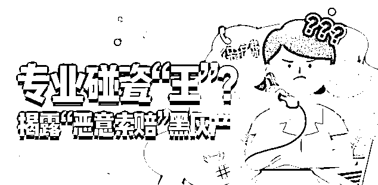
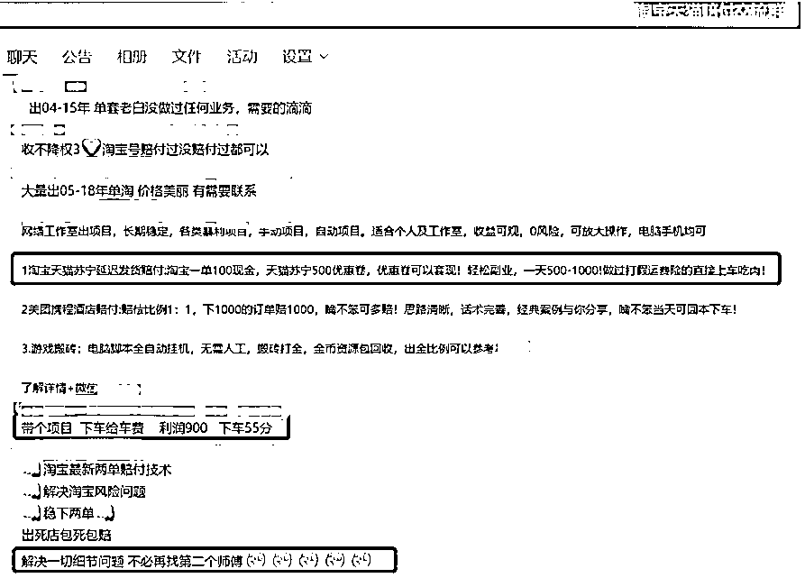
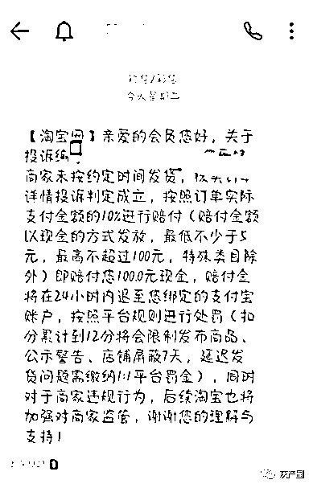
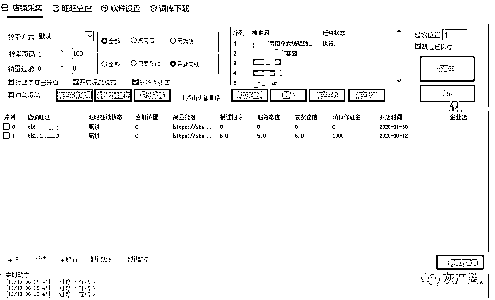
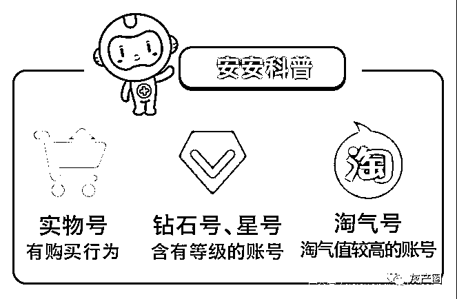

# 专业碰瓷“王”团伙作案？揭露“恶意索赔”黑灰产

> 原文：[`mp.weixin.qq.com/s?__biz=MzIyMDYwMTk0Mw==&mid=2247508258&idx=2&sn=7135c10dbcaf92d5caef008aebaf0260&chksm=97cb6a1aa0bce30c52a7639c2f702380b55107338297f1d9b2e14394063813a2b26f5b62ea9f&scene=27#wechat_redirect`](http://mp.weixin.qq.com/s?__biz=MzIyMDYwMTk0Mw==&mid=2247508258&idx=2&sn=7135c10dbcaf92d5caef008aebaf0260&chksm=97cb6a1aa0bce30c52a7639c2f702380b55107338297f1d9b2e14394063813a2b26f5b62ea9f&scene=27#wechat_redirect)

根据公安部通报的全国公安机关打击整治利用信息网络实施黑恶势力犯罪专项行动有关情况，其中就通报了几起恶意索赔犯罪案件，日常在对案件溯源的过程中也发现诈骗人员从事**恶意索赔**的不法行为。

广东章某强恶意索赔犯罪案件

2020 年 11 月，广东广州公安机关成功打掉章某强恶意索赔犯罪团伙，抓获犯罪嫌疑人 13 名。经查，犯罪嫌疑人章某强通过传授犯罪方法、集体恶意索赔等手段发展骨干成员 30 余名，并不断招揽在校学生、社会闲散人员发展下线，组建网络社团“大猪组”，**以大量恶意评论、差评、灌水、向市场监督管理部门投诉**等手段，要挟网店商家，索要“保护费”“赔偿款”。

通过研究发现，恶意索赔方式也发生了一些变化：**从恶意“打假”到“死链”赔付**。通过对此类手法的分析，**一方面帮助商家避免被恶意索赔，另一方面提醒参与者存在的风险，特别是很多被以网赚的名义拉去”打店”的学生群体。**

恶意索赔手法介绍

### **恶意“打假”**

假借打假之名，通过购买、持有众多非本人实名电商平台账号，批量购买目标商品，再以商品存在瑕疵、宣传用语使用“极限词”等借口，向商家强行索要相应“补偿”，若商家不妥协，则以大量差评或向电商平台、监管部门投诉为要挟，实施敲诈勒索犯罪。

### **“死链”赔付**

淘宝天猫为了提高购物体验，消费者下单购物后，商家必须在约定的时间内发货，超时消费者有权投诉卖家，卖家需要赔偿给消费者资金补偿。

**“死链”也称“死猫”**，指的是长期无人运营的店铺，自然也就无法发货，这样买家就获得了“赔偿款”，也就是扣除卖家开店缴纳的保证金。

恶意索赔黑灰产业运作

从事恶意索赔黑灰产人员，想要获得赔付就涉及到如何获取“死链“和”淘宝账号“，因此衍生出了专门爬取”死链“和售卖可获得赔付的淘宝账号产业链。

### **“死链“抓取**

使用特殊工具，针对指定商品关键词抓取店铺信息，对店铺阿里旺旺账号的在线状态进行实时监控，从而发现长期无人管理的店铺，获取目标店铺。以某工具为例：

**1、店铺采集：**

①选择商品的搜索方式，如“销量从高到低”、“价格从低到高”

②选择店铺类型，如“淘宝店”、“天猫店”

③卖家在线类型，如“只要在线”、“只要离线”

④导入想要爬取的商品关键词、选择店铺类型，如淘宝店、天猫店

⑤抓取到指定商品、阿里旺旺离线的店铺，同时获得店铺的商品、服务态度、消保保证金、开店时间等情况

**2、旺旺监控**

通过以上方式发现店铺后，对这些店铺使用的旺旺 ID 进行在线状态实时监控，即可获取目标店铺。

账号贩卖

据了解到目前淘宝风控纠察主要依靠索赔记录、下单账号、付款账号几个维度，因此应对淘宝的风控的办法就是将自身伪造成真实用户，于是衍生了各类可用于索赔的淘宝账号。

**1、风控策略**

n 账号/行为因素，指账号是否发生了索赔

n 下单账号关联因素，指下单账号是否与索赔账号存在关联

n 付款账户因素，指付款账户是否与索赔账号存在关联

**2、淘宝账号类型**

目前白号、实物号价格 30-50 元，主要用于用为赔付申请；钻石号、淘气号价格在 100 元以上，指的是仅使用手机号注册，未实名也没有购买记录的账号。

## 

安全课堂

对于电商平台的商家而言，若店铺长期不运营，建议将店铺商品下架处理或将商品进行价格限制，防止他人恶意下单，或者将店铺关闭；若频繁遭遇恶意赔付，可联系电商平台进行协商处理。

恶意索赔有风险！从目前已掌握的情况看，**恶意索赔中使用的账号、关联的支付账号都可能受到电商平台的风控限制，可能会影响账号的使用**。同时，2019 年 12 月淘宝起诉“职业吃货”第一案胜诉，这意味着“职业索赔”行为将受到规制，行为严重者可能涉及违法违规。

来源：360 手机卫士 网络侦查研究院

← 向右滑动与灰产圈互动交流 →

