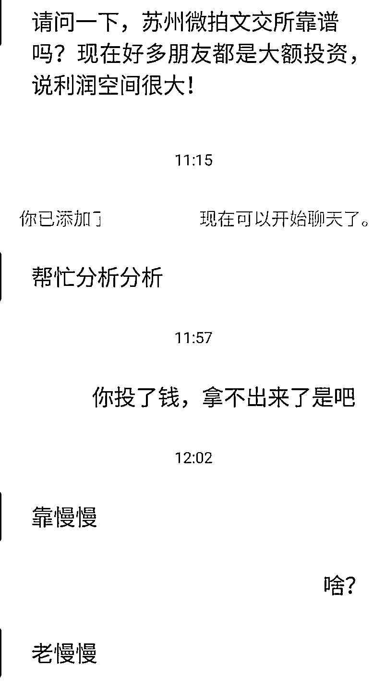
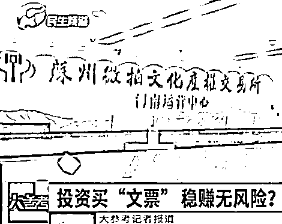
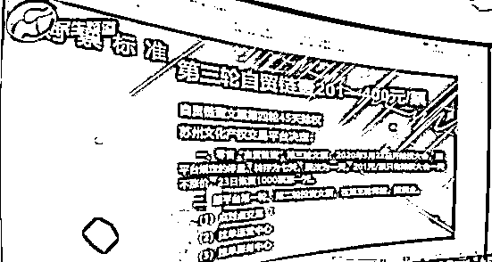
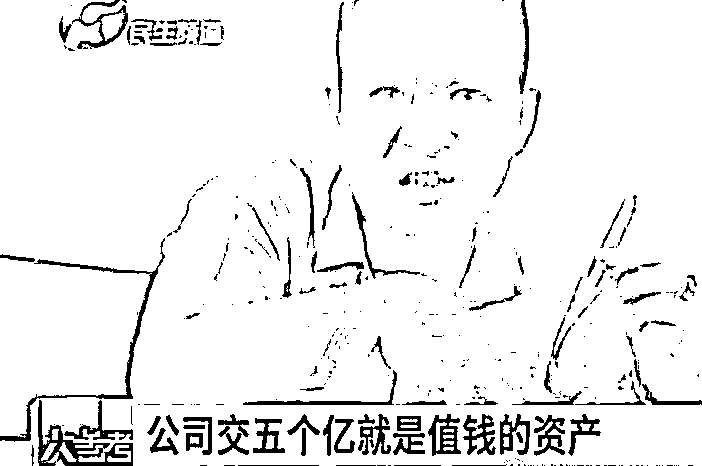
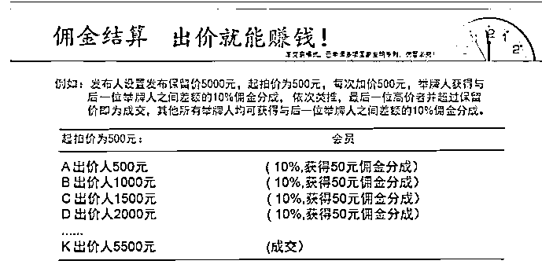
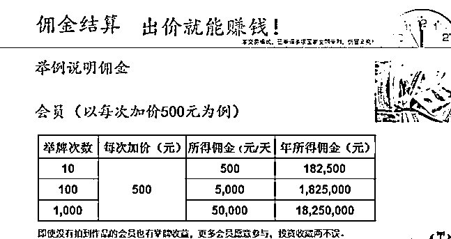
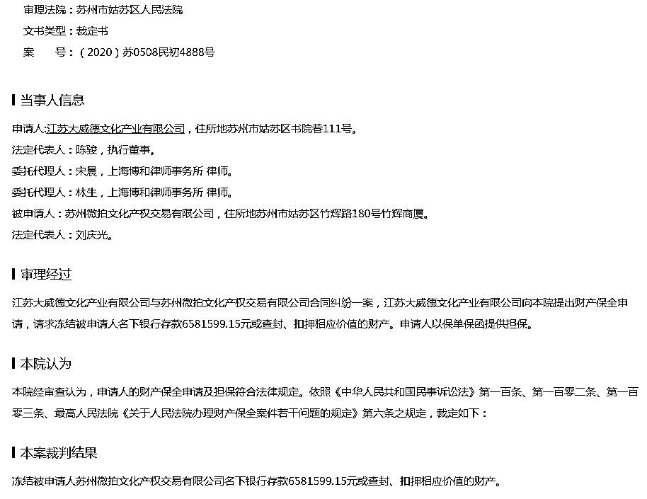

# 投资 1 万一年之内挣 100 万？苏州微拍文化被法院冻结 658 万元！

> 原文：[`mp.weixin.qq.com/s?__biz=MzIyMDYwMTk0Mw==&mid=2247508258&idx=3&sn=b0fe4c558b98336f094779bd88963928&chksm=97cb6a1aa0bce30c448588c39d9368c3df407cb9fc7f6d2f1bdc4ab4ab00652ff4ad4e67091a&scene=27#wechat_redirect`](http://mp.weixin.qq.com/s?__biz=MzIyMDYwMTk0Mw==&mid=2247508258&idx=3&sn=b0fe4c558b98336f094779bd88963928&chksm=97cb6a1aa0bce30c448588c39d9368c3df407cb9fc7f6d2f1bdc4ab4ab00652ff4ad4e67091a&scene=27#wechat_redirect)

近日小编接到网友反馈“苏州微拍文交所”返利变慢了：

“本金安全，风险为零的前提下，让大家绝对实现暴富的，各位真正的财富就要来临了，我们应该拿出什么样的状态，来迎接它呢？

让我们高举我们的双手，热烈鼓掌 5 秒钟。”这么好的事到底在哪？这还得从郑州小赵的父亲投资的一个项目说起。 

“父亲告诉我了一个投资钧官窑文物的项目，投资 1 万元一年之内就能挣 100 万元。”小赵说，这些钧官窑的投资，并不是直接购买实际物品，而是通过手机下载一个软件，直接在里面充值，填单子直接购买。全程都没有见到钧官窑实物。 

这一切也让小赵心里面犯了嘀咕。小赵认为投资一般都会有风险的，但它这个宣称只会涨不会跌，感觉这玩意是个诈骗，并不是他说的那样。

8 月 14 日上午，根据小赵提供的线索，记者来到郑州市高新区教育科技产业园。进门之后，发现这家公司门口写着“苏州微拍文化产权交易所河南运营中心”，而进入会场却发现讲座的人员自称世诺国际集团的员工。

[`v.qq.com/iframe/preview.html?width=500&height=375&auto=0&vid=g313843zof1`](https://v.qq.com/iframe/preview.html?width=500&height=375&auto=0&vid=g313843zof1)

一位钧官窑推广人员在讲台上讲到，“今天作为我们世诺集团，作为我们苏州微拍的一个会员，就算我们不去推广，依然可以有这样一个躺赚的收入，就可以保证我们每个人，他都是稳赚不赔的。” 

记者在会场现场发现，参加听课的人员多数都是老年人。而且不少老人还投了钱进去，少的有四五千元多的有六万元。那么，这种投资究竟是什么呢？

随后，记者见到了一位姓张的经理。张经理告诉记者，他们投资的是禹州的钧瓷。是国家定的官窑，每年以 30%以上的往上涨。公司交了价值 5 个亿的资产和 5 千万元的保证金，苏州文交所（文拍所）才给我们发行这个自贸链壹的原始“文票”。

对方解释，每一份“文票”价值 200 元左右，所对应的都是钧瓷。一旦买了“文票”，后面就等着挣钱就行了。 

张经理说，花 200 元买一票，然后一个月出钱时就变成两票，4 票、8 票、16、32、64......七轮下来就翻到了 64 倍。如果要卖掉就挣到 12800 元，不想卖掉可以进入二级市场，进入二级市场就能挣到 50 万元。

说的挺好，可是这些东西为什么会涨价呢？对于记者的问题，张经理却没有正面回答，只是告诉记者这是先机。

这些所谓的“文票”对应的钧官瓷有没有实物呢？张经理告诉记者，实物马上就到了，到了之后就能看到。记者又问到那你咋知道值这么多钱，由谁来判定值这个钱的时候，张经理说是国家定的。记者问有没有证书之类时，张经理回答道有证书。当再被问到在什么地方的时候，张经理却表示“你不要涉及”。

嘴里说有实物，结果什么都没有展示。到底是真的没有，还是压根就是个幌子呢？

不过，对方还表示除了投资能挣钱，还可以通过“拉人头”的方式挣钱。张经理说到，直推一个人就能拿到 10%的提出。例如，我拉来一个人加入，并投 5 万多元购买 200 票，则自己就能赚到 5000 多元。他推荐一个人加入并投资，我还能拿 5%的间接提成。

记者在一张“世诺国际集团公司奖金制度” 上显示，除了直推奖和间推奖外，当自己的业绩做到 50 万元以后就可以成为团队领导人，团队领导人可以拿到团队业绩 5%的奖励；当团队业绩达到 150 万元，就可以拿到 4%的团队业绩奖；团队业绩达到 300 万元拿 3%；团队业绩达到 1000 万元以上，就可以成为公司合伙人，合伙人可以获得更大的奖励。

“拉人头、分级抽成提取佣金的这种情况符合传销的特点，已经涉嫌构成传销了。“赵世峰律师告诉记者，如果交易的物品并不真实存在，交易的场所也是这个公司虚构的，这个公司只是以此为幌子，来骗取受害人的钱财拒不返还，就有可能构成集资诈骗罪。

8 月 17 日，《民生大参考》栏目通过电视台报道后，记者再次来到“苏州微拍文化产权交易所河南运营中心”的办公场所。记者看到没有老人在现场。

[`v.qq.com/iframe/preview.html?width=500&height=375&auto=0&vid=j3138rixo1l`](https://v.qq.com/iframe/preview.html?width=500&height=375&auto=0&vid=j3138rixo1l)

随后，记者采访了郑州市高新区大学城市场监督管理所所长庆某。该所长告诉记者，经过调查发现这个公司注册地在郑州航空港经济综合实验区，对其下达了责令改正通知书，限期 30 天内将公司经营地址变更到高新区。同时检查现象时发现墙上挂着交易所也是不太合适的，我们已经责令其改正，停止相关的经营活动。

这家公司声称在推广过程中可以以“拉人头”的方式进行抽成，这样行为是否涉嫌传销呢？

所长庆某表示，“现场检查时发现一张世诺公司的奖金制度，其他的证据我们正在调查核实，如发现有涉嫌传销行为，我们将依法依规进行处理。对公司逐步进行调查，发现如果涉及到其他部门的，我们该移交的就移交，该移送的就移送。

[`v.qq.com/iframe/preview.html?width=500&height=375&auto=0&vid=v3138n0kq3i`](https://v.qq.com/iframe/preview.html?width=500&height=375&auto=0&vid=v3138n0kq3i)

**我们再来复盘一下苏州微拍文化产权交易的模式：**

****

****

**▲ 微拍文交的模式**

**苏州微拍文交公司董事长刘庆光介绍，微拍文交平台包括四个部分的参与者，第一、产品发布者，通过微拍文交平台能够使藏品快速流通；第二、经纪运营商，可以大量发展会员及发布艺术品专场，所发展的会员成交额经纪运营商另有 15%佣金竞价分成，可常年持续收益；第三、会员，每次举牌均有下一个举牌人之间差价 10%的佣金竞价分成，即使没有拍到作品也有收益；第四、艺术品拍得者，可以得到保真价格优惠并有升值空间的艺术收藏品，未来出售或随时二次挂牌再交易获得更大收益。**

**出价就能赚钱？微拍文交平台是通过什么来实现的？一位玩微拍的会员李先生向颜值君解释，比如艺术品发布人设置发布保留价 5000 元，起拍价为 500 元，每次加价 500 元，举牌人获得与后一位举牌人之间差额的 10%佣金竞价分成，依次类推，最后一位高价值并超过保留价即为成交，其他所有举牌者均可以获得与后一位举牌人之间差额的 10%佣金竞价分成，也就是“出价就能赚钱”。**

****

**▲ 微拍文交被冻结 6581599.15 元的法律文书**

**根据裁判文书网显示，9 月 25 日，江苏大威德文化产业有限公司向苏州市姑苏区人民法院提出财产保全申请，请求冻结微拍的公司主体苏州微拍文化产权交易有限公司名下银行存款。经法院审查，江苏大威德文化产业有限公司的财产保全申请及担保符合法律规定。依照相关法律规定裁定冻结苏州微拍文化产权交易有限公司名下银行存款 6581599.15 元或查封、扣押相应价值的财产。**

**来源：防骗小豆豆，河南电视台民生大参考栏目，世直研，中国裁判文书网，鹰鉴，利箭在行动**

********

**← 向右滑动与灰产圈互动交流 →**

****