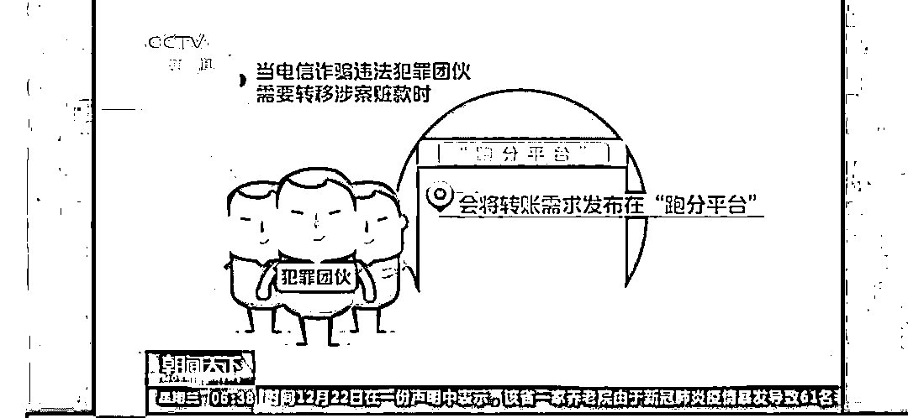
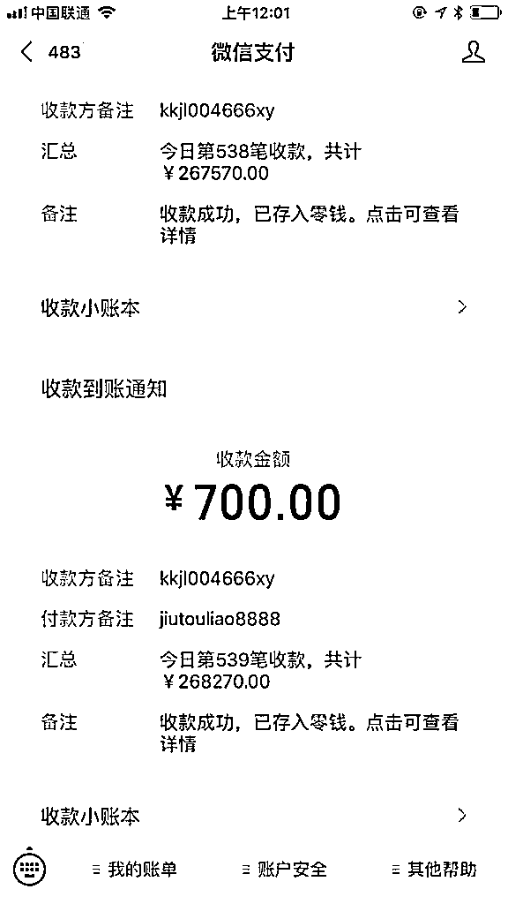
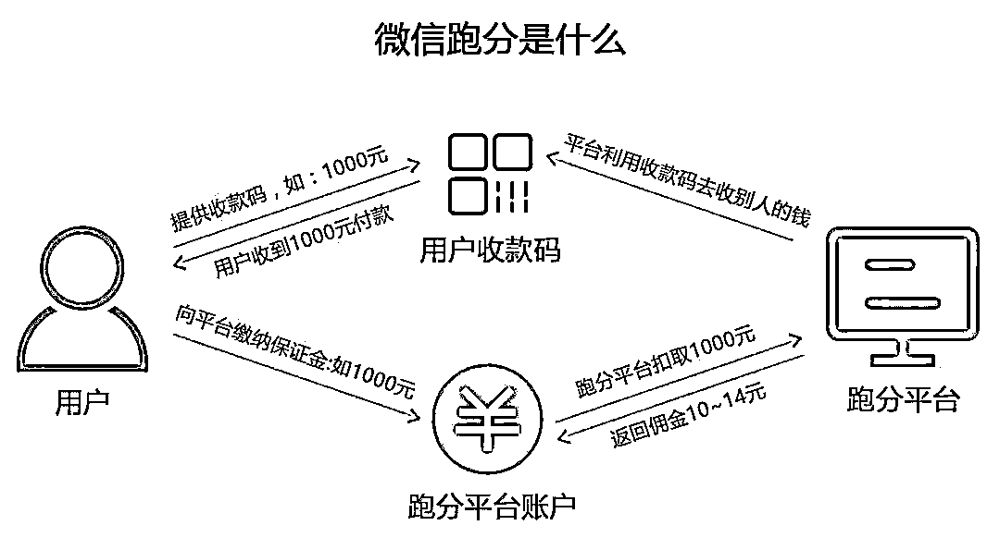
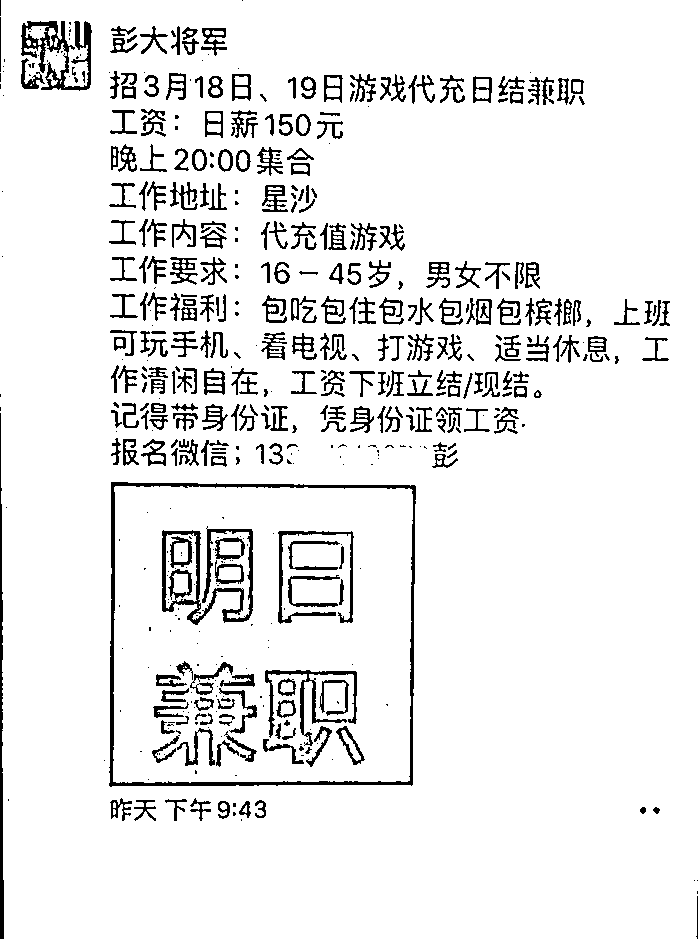
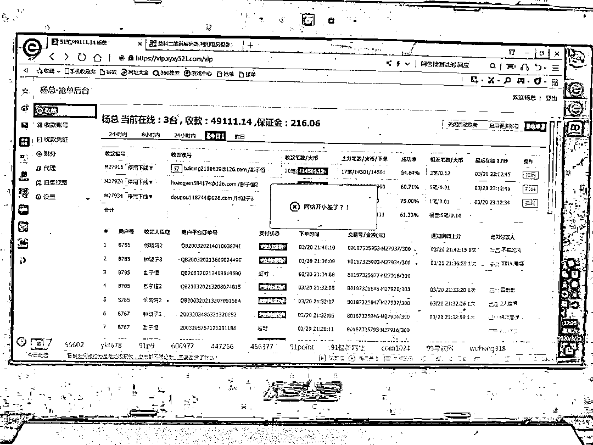
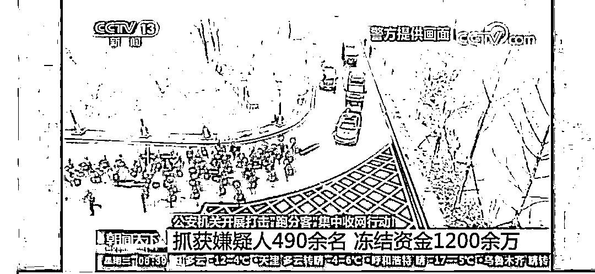

# 490 余名“跑分客”被抓，这样的兼职千万不能做！

> 原文：[`mp.weixin.qq.com/s?__biz=MzIyMDYwMTk0Mw==&mid=2247508258&idx=4&sn=0b702bd600089cfd5a76062afb59d367&chksm=97cb6a1aa0bce30c4433b3a181648441e3fc58c8c9a749f204710e93b77905eddacb6650fea9&scene=27#wechat_redirect`](http://mp.weixin.qq.com/s?__biz=MzIyMDYwMTk0Mw==&mid=2247508258&idx=4&sn=0b702bd600089cfd5a76062afb59d367&chksm=97cb6a1aa0bce30c4433b3a181648441e3fc58c8c9a749f204710e93b77905eddacb6650fea9&scene=27#wechat_redirect)

12 月 22 日，在公安部统一指挥下，北京、河北、江苏、安徽等 24 个省区市公安机关同步开展集中收网行动，依法严厉打击为电信诈骗提供转账服务的“跑分客”违法犯罪活动。

各地共抓获违法犯罪嫌疑人 490 余名，扣押冻结涉案资金 1200 余万元。

[`mp.weixin.qq.com/mp/readtemplate?t=pages/video_player_tmpl&action=mpvideo&auto=0&vid=wxv_1664039998725111820`](https://mp.weixin.qq.com/mp/readtemplate?t=pages/video_player_tmpl&action=mpvideo&auto=0&vid=wxv_1664039998725111820)

近年来，一些电信网络诈骗违法犯罪团伙为逃避打击、快速转移诈骗赃款，打着“互联网共享经济”的幌子，雇佣技术人员开发用于转账洗钱的网络工具，并称其为“跑分平台”。

该平台一方面为诈骗团伙发布非法转账需求提供渠道，另一方面以高额佣金为诱饵吸引大量人员通过该平台协助转移赃款。

这些在“跑分平台”上注册会员的人被称为“跑分客”，他们主要通过上传个人收款二维码等支付账户信息协助转账，其行为已成为电信诈骗犯罪链条中一个重要环节。

经查，当电信诈骗违法犯罪团伙需要转移涉案赃款时，会将转账需求发布在“跑分平台”供“跑分客”抢单。

在“跑分客”抢单成功后，诈骗团伙将其提供的收款二维码等发送给诈骗受害人，诱骗受害人将钱款扫码转账至“跑分客”账户中，再经多个不同账户层层转账，最终转至诈骗团伙指定账户。

在赃款转移过程中，由于涉及账户众多、流向复杂，给公安机关侦查打击、追赃挽损工作造成困难，对受害群众造成严重财产损失。

据悉，随着“断卡”行动深入推进，各地各部门重拳出击、打防并举，向非法开办贩卖电话卡、银行卡违法犯罪活动发起凌厉攻势。

电信诈骗团伙获取作案用电话卡、银行卡的难度进一步增加，其转移赃款的方式受到极大限制，从而将“目光”转向“跑分平台”。

**（网路配图）**

这样看似诱人的“跑分”网络兼职项目，**其实背后蕴藏了极大风险**，一不小心就容易落入犯罪分子的圈套，**成为其实施违法犯罪的帮凶。**

**所谓“跑分”**就是利用银行卡、微信或支付宝的收款码，为别人进行代收款，随后赚取佣金。

一般来说，佣金的比例在 1%到 2%之间，也就是说，接一个 10000 元的“跑分”项目，可以赚取 100 元到 200 元。

由于招募者宣称来钱快、回报高，不少年轻人特别是在校大学生参与其中。

“跑分”平台打着兼职招聘的旗号，招揽群众出借自己的支付账户，通过搭建平台网站，以类似网约车“抢单”的模式进行运作。 

这些租赁来的支付账户被大量用于电信网络诈骗、赌博、色情等违法犯罪活动进行收款，其实就是洗钱。

一些不明就里的年轻人参与此类“兼职”，在承担经济损失风险的同时，还将可能按帮助信息网络犯罪活动罪的定罪量刑标准，负相应法律责任。

为拉拢更多“跑分客”协助转移赃款，“跑分平台”声称，每完成一笔转账就发放相应赃款金额 1%-1.8%的佣金。

面对高额佣金，越来越多的“跑分客”参与其中，甚至形成团伙作案。

针对电信诈骗违法犯罪活动新特点新情况，公安部组织开展深入研判分析，并在掌握大量犯罪事实和证据基础上，部署对“跑分客”违法犯罪团伙开展集中抓捕行动，有力打击了此类违法犯罪活动。

公安部有关负责人表示，针对“跑分平台”“跑分客”开展集中收网，是深入推进“断卡”行动、全链条打击“两卡”违法犯罪活动的重要举措。

公安机关将继续保持严打高压态势，重拳出击、多措并举，会同相关部门进一步强化源头治理和惩戒措施，全力斩断非法买卖“两卡”黑灰产业链条，切实维护人民群众合法权益和良好社会秩序。

反诈民警提示：

警惕“跑分”陷阱，注意保护个人隐私信息，珍惜自己社交账号的使用权，不要轻易被网络上不切实际的高额利润所诱惑，更不要因为一时图利，随意出租出借自己的身份信息、个人账号、支付账户等，以免沦为犯罪分子实施违法犯罪的工具。

来源：终结诈骗

← 向右滑动与灰产圈互动交流 →

