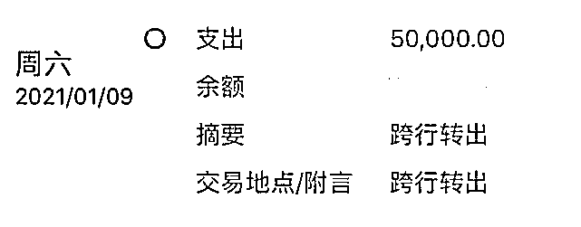

# 女白领婚恋网上结识“精英男”，9 天被骗 56 万！

> 原文：[`mp.weixin.qq.com/s?__biz=MzIyMDYwMTk0Mw==&mid=2247508327&idx=1&sn=714d1189e173dad5eb9b95fec932c7d7&chksm=97cb6a5fa0bce349200beb290acb9579d40fc56af9bc34d2f5809b5decd830162a63305147b1&scene=27#wechat_redirect`](http://mp.weixin.qq.com/s?__biz=MzIyMDYwMTk0Mw==&mid=2247508327&idx=1&sn=714d1189e173dad5eb9b95fec932c7d7&chksm=97cb6a5fa0bce349200beb290acb9579d40fc56af9bc34d2f5809b5decd830162a63305147b1&scene=27#wechat_redirect)

1 月 9 日，吕静（化名）再度向网站缴纳 5 万元保证金。图/受访者供

2020 年 12 月下旬，37 岁的北京姑娘吕静通过婚恋网站与一名男子相识，短短 7 天，在对方的感情攻势下，吕静与其确定恋爱关系。随后，在男子诱导下，她参与了一个“回报率很高”的货币交易项目，并在起初阶段就尝到了甜头。

然而，就在吕静携资金大举入局后，账号却突遭冻结，无法提现。网站客服仍以各种理由诱其追加资金，寻求“解冻”。1 月 3 日到 1 月 11 日，短短 9 天时间，吕静被骗 56 万。

报警后，她第一次知道杀猪盘的概念，且有众多女性与其有相似遭遇。“我这只猪养挺快的，也挺肥的”，她止不住自责，北漂十年，本打算回河北老家买套房，积蓄却被骗光，这场遭遇让她对爱情彻底失望，“这一生都不想结婚了。”

她也郁闷，即便已经报警，并向婚恋网站客服反映了受骗经历，但该男子的账号依然显示在线。为何仅需填写手机号就能实名认证，平台方究竟有没有尽到信息审核义务？

对此，该婚恋网站公关告诉潇湘晨报记者，只有根据警方出具的笔录信息，才能判定用户是否存在违规行为，并进行封号处理。关于实名制，根据工信部的规定，用户在注册时用的手机号就已经实名，用户通过支付服务或会员等渠道支付时也是实名制。

湖南睿邦律师事务所刘明律师表示，手机号和银行账户均可以出售、外借，并不能确定用户真实身份。在网站承诺实名制的前提下，应尽到审核义务，若用户因此遭受损失，平台应当承担一定责任。

目前，北京市朝阳区王四营派出所已受理此案。

**01**

**“百分百盈利”**

吕静在北京从事教育培训工作，近几年，在父母催婚下，她注册了多个婚恋网站的账号，系统经常给她发送匹配的男性信息。工作忙碌，吕静不常登陆，也没在意。直到 2020 年 12 月下旬，一名男子的资料吸引了她。

“37 岁、176、居住在北京朝阳”，个人资料显示，该男子离异单身，有 5 年感情空缺，有车，高收入，IT 人士。头像是男子的大头照，瘦长脸，白衬衫，干净利落，是吕静喜欢的成熟类型，她决定加上微信先聊聊。

男子比她想象中主动的多。

准时的日常问候，共同的爱好追求，每晚聊到凌晨一两点，黑夜里，孤独的心被抚慰，两人很快确定了关系。第 7 天，男子开始叫她“宝贝”“老婆”，甚至问她要出生年月，让家人帮算生辰八字。

在吕静看来，该男子是个合适的结婚对象，真实年龄只大她一岁，有房有车，定居北京，在中关村从事工程技术工作。但她没做好更进一步的准备，打算多聊会儿。

在精心铺垫的套路下，吕静迅速掉入吞金陷阱。

没几天，男子发来一个网址和一套账号密码，让吕静帮他充值购买一种叫“美国指数”的虚拟货币。工作使然，金钱交易引起了吕静的警惕。男子告诉她，钱已经在银行卡账户了，只要充值到平台账号并购买就能迅速盈利。

吕静点开网址，浏览器立刻发来“欺骗性网站警告”。男子哄她，这正是网站维护的重点，可以多换几个浏览器试试，吕静用另一台不常使用的手机成功登陆，帮男子购买了 20 万元的虚拟货币。24 小时内盈利，15 分钟提现，2 分钟到账。吕静第一次发现赚钱居然这么容易。

在男子的解释里，他所从事的工程技术工作，接了维护该网站的项目，但签署了保密协议，要住进宿舍，且不能带手机，只能辛苦吕静在每天中午 1 点至 1 点 15、晚上 9 点至 9 点 15 帮他充值购买，这两个时间段没有技术维护，百分百盈利。

男子告诉她，第一次接触网站时，他只充值了 10 万，经过不断充值盈利，积攒到了 100 多万。并展示了账户余额，这让她深信不疑。

几次购买后，吕静也心动了。她尝试注册账户，绑定银行卡，并充值了 1 万 9 千块钱，盈利了 900 多，第二次又充值了 7 万多，继续盈利。

吕静记不清是第三次还是第四次，充值到 18 万时，账户余额显示不能提现。她连忙给客服打电话，对方称，网站中级会员通道维护，维护好就可以正常提现了。这跟男人说过的维护网站“恰好对上”，她决定先等等。

此时，男子仍亲切热乎地跟吕静聊天，他告诉吕静，打算把钱提现后捐 8 万块钱给老家盖祠堂，“保佑咱们小家平平安安，健健康康。”吕静觉得，这话简直说到心坎里了。

**02**

**“充了保证金才能提现”**

“我这么小心，这么谨慎，还是一步步落入骗子圈套。”得知被骗后，吕静不停自责。

两天后，提现再被拒绝，吕静致电客服，客服回复称，检测到吕静使用的 IP 登录了两个帐号，所以都被冻结了。

吕静急忙告诉男子，并不断地自责、道歉，男子不仅没有怪她，还安慰她，尽管这时“他的账户被冻结了 130 多万”。

客服称要“百分百充值余额才能解冻，男子鼓动她，“维护平台很多年了，从不做没把握的事”。对于此时的吕静来说，这个“权威人员”是她将钱追回来的“唯一稻草”。顾不上多想，她从信用卡中套现了 18 万充入账户。

还是不能提现，客服解释，冻结时两个账号已绑定在一起，需在 24 小时内将两个账户解冻才能提现。男子称，短时间内不可能凑够 130 多万。客服又提供了第二个解决办法，充值 5 万元保证金将两个账户解绑，就可以提现了。

吕静充了钱，提现却被拒绝，“因为检测帐号存在违规，第三方出钱系统为防止洗钱不放款，需等待 15 个工作日，或者充值 5 万块钱进行人工审核。”

吕静托男子找“内部人员”咨询下，对方咨询回来告诉她没问题，可以充。

次日，吕静再借 5 万元充进账户。提现却再遭拒绝，这次理由是“周末人工审核较慢，需等待 15 个工作日”。

吕静越发感到不安，套进去的钱越来越多，提现却遥遥无期。直到男子成功提现，她打消了疑虑，又接连两次充值 5 万元，等来的还是那句话“再等 15 天”。

**03**

**“杀猪盘”**

“一步步按规则来，为什么还是不能提现，连续 4 次充值 5 万元保证金，却次次被推迟。”1 月 11 日下班回家后，吕静打电话给北京市朝阳区王四营派出所报警。

警察告诉她陷入了杀猪盘骗局。这是一种通过线上交友来诱导受害者投资赌博的电信诈骗方式。诈骗团伙一般购买境外服务器搭建赌博网站来实施犯罪活动，一旦收到钱，会被第一时间分多次转走，很难追回。

第一次听说杀猪盘就发生在自己身上。在吕静 37 年的人生中，她自恃谨慎沉稳，从不网恋，从不相信网络投资理财，却在甜言蜜语和巨大利润双重包裹下失去理性，1 月 3 日到 1 月 11 日，短短 9 天内被骗 56 万。

她开始复盘相识过程中的疑点：男子从未给过她手机号，理由是“只有工作手机，没有私人手机”；过快亲切，相识第七天，男子开始称呼她“老婆”，并提出见家长；两人从未见过面，男子也从不接视频电话；不同于其他网站客服服务差、回复慢，该网站客服回答向来准确且迅速。

警察告诉吕静，跟她聊天的男人可能同时兼具多个身份，也可能不是同一个人。

“我遇到的骗子骗术很高明，不直接让我进行投资，会给我下套引导投资，他把赚钱的方法和收益明晃晃展示在我眼前，这是最真实的东西。”当天报完警后，吕静跟男子要身份证，对方将照片遮住发给了她。吕静质疑,“你这照片还能只发一半？”，男人回复，“最基本的信任还是要有的。”第二天她将男子身份证发给警察，确定是假证。

**04**

**实名注册**

吕静报警并向婚恋网站反映问题至今，对方账号仍显示在线。婚恋网站客服告诉她，需上传相关证明至婚恋网站 qq，会反馈至相关部门，至于是否注销账号，则会反馈至安全中心，安全中心会根据实际情况处理。

吕静质疑，为何仅需填写手机号就能实名认证，平台方究竟有没有尽到信息审核义务？

该婚恋网站介绍显示：2012 年率先实行实名制，依托使用全国公民身份认证中心对会员身份进行认证，是中国实名婚恋网领跑者。

1 月 22 日，潇湘晨报记者注册该婚恋网站账户时发现，仅需填写手机、验证码、昵称、性别、生日后即注册成功，随后可选择完善基本资料、我的照片、自我介绍、详细资料和个人喜好。但即便不完善，也可以给用户发送消息。

对此，婚恋网站工作人员告诉潇湘晨报记者，根据国家相关部委和公安部门的规定，用户使用手机实名制和支付通道实名制的行为，就证明了用户已完成了实名。此外，平台还利用视频形式对用户进行人脸识别，避免骗子冒用、盗取相关信息，实行诈骗。

如果警方已判定并立案，一旦收到警方的调案信息，网站会提供该用户所有在平台上的通讯信息、登陆信息、行踪轨迹等，然后进行全面封锁，直接加入黑名单。

湖南睿邦律师事务所刘明律师表示，手机号和银行账户均可以出售、外借，并不能确定用户真实身份。除手机号外，实名认证应包括身份证件核对、人脸识别等关键步骤来确定身份信息。在平台承诺实名制的前提下，应尽到审核义务，若用户因此遭受损失，平台应当承担一定责任。

**05**

**“不想结婚了”**

被骗后，吕静在网上查询杀猪盘新闻，并加入了一个受骗者群聊，里面有近 40 个人，都遭遇过杀猪盘骗局。最多有人被骗 70 多万。

通常，杀猪盘会选择特定人群下手。吕静总结了自己被选中的原因，“大龄剩女，有一定经济基础，对爱情有幻想，着急结婚。”

她试图用在新闻上学到的手段将钱追回，装模作样地讨好男子，跟他道歉。但终于按捺不住心中的气愤，跟对方坦白已经报警。而男子仍在试图挽回吕静的心，“等我出来，我们见面你就会相信我了。”但吕静已疲于应对，她将证据搜集好全部交给了警察。

被骗的 56 万中，有 10 多万积蓄，30 多万信用卡套现，吕静原本计划用这笔积蓄在河北老家买套房子，现在希望都落空了。她不知道怎么办，从早上睁开眼，满心都是欠款怎么还，没心思化精致的妆容，洗个脸就出门上班。

“我这个猪养的挺快的，也挺肥的，所以说我现在恨自己恨得都没法说了，抬不起头来做人。”事发后，吕静不停地后悔自责，这场骗局也让她对爱情失去期待，“这一生都不想再结婚了。”

目前，北京市朝阳区王四营派出所已受理此案。

*来源 | 潇湘晨报 *记者 | 高媛

← 向右滑动与灰产圈互动交流 →

