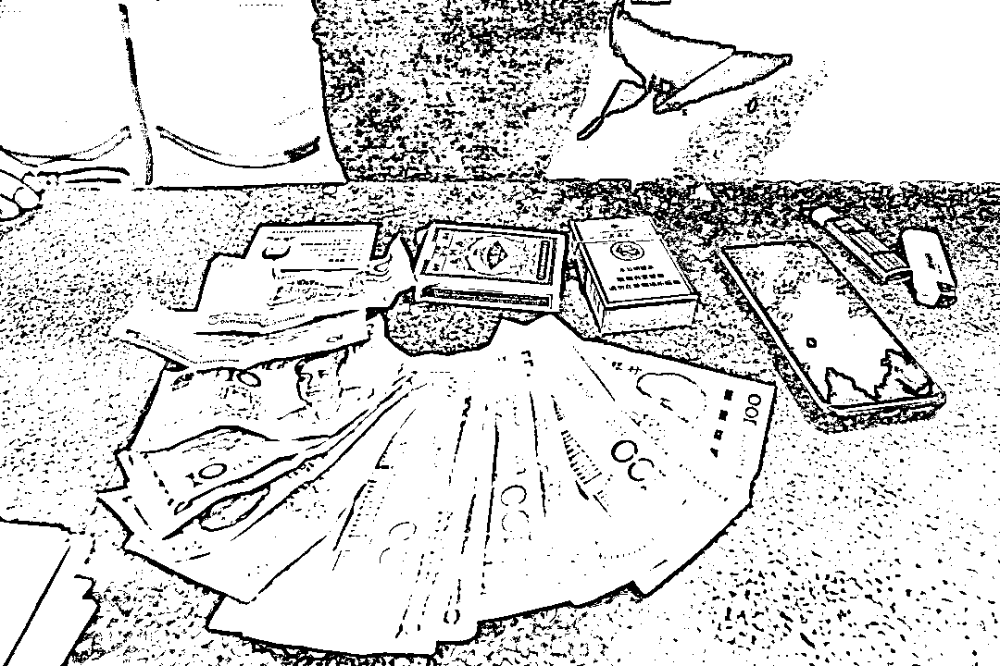
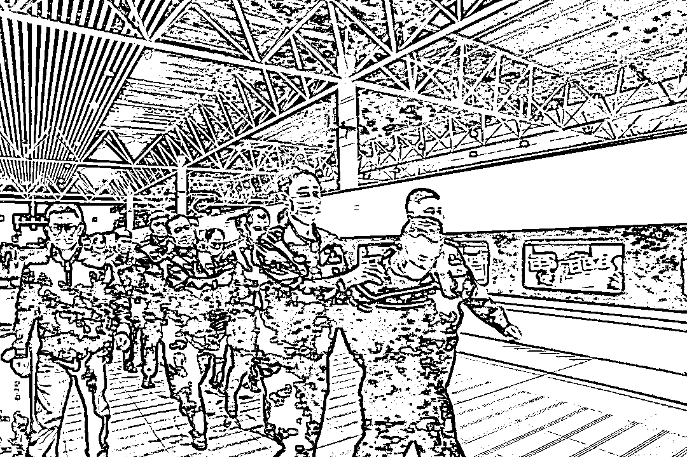

# 火车上有人约你干这事，千万别答应！

> 原文：[`mp.weixin.qq.com/s?__biz=MzIyMDYwMTk0Mw==&mid=2247508327&idx=2&sn=53e58f70086540978f3657389ec38a84&chksm=97cb6a5fa0bce349a0547a28f5a2aeb9a4198b7c5289553b717e8dfad2f8f5d661ccdd924fdf&scene=27#wechat_redirect`](http://mp.weixin.qq.com/s?__biz=MzIyMDYwMTk0Mw==&mid=2247508327&idx=2&sn=53e58f70086540978f3657389ec38a84&chksm=97cb6a5fa0bce349a0547a28f5a2aeb9a4198b7c5289553b717e8dfad2f8f5d661ccdd924fdf&scene=27#wechat_redirect)

近日，在公安部铁路公安局指挥下，全国十余地铁路公安机关统一收网，成功摧毁一个以“在火车上邀人打牌”为主要手段的大型“杀猪牌”诈骗犯罪集团。目前，该案已抓捕犯罪嫌疑人 67 名，受害旅客或达 1400 余名。 

[`v.qq.com/iframe/preview.html?width=500&height=375&auto=0&vid=k3222qw1zuk`](https://v.qq.com/iframe/preview.html?width=500&height=375&auto=0&vid=k3222qw1zuk)

犯罪嫌疑人如何将旅客诱入“杀猪牌”陷阱？“杀猪牌”中“老千”如何挖坑？春运回家路上，旅客为避免上当受骗应注意哪些方面？新华社记者为此走访了有关部门。

一局牌八九个“炸”
受害人半小时输光一月工资

2020 年下半年起，多地火车站派出所陆续接到乘客报警，称在卧铺列车上有人邀约打“斗地主”赌博，受害人往往先赢后输，在临近到站下车约半小时左右快速输掉几千元至数万元不等。

在广州打工的湖南衡阳人王先生称，自己乘卧铺火车回老家期间，有名陌生男子来邀请他和同车的另一名乘客一起打“斗地主”消磨时间。

“当时就叫我赢点‘饭钱’，顶多百把块钱，况且两个人不像一起的，我想着娱乐娱乐也没关系。”王先生回忆说，刚开始牌局是输赢 5 元每局，自己手气不错赢了点钱。很快，输的两人提议“加码”。

据王先生说，“加码”后自己手气仍非常好，“大王”“小王”不断，这让他彻底放松了警惕。当列车临近衡阳，王先生即将下车时，手握 3 个“炸弹”的他，认为自己胜券在握。谁知两名对手却有 5 个“炸弹”，王先生兜里的 4000 元工资输得只剩下几十元，只得悻悻下车。

2020 年底，家住湖南长沙的龙先生乘坐 K1376 次列车出游。车上一名陌生男子和他拉了几句家常后便邀请他打牌“娱乐”。龙先生的牌面“顺风顺水”令他很快同意牌友的“加码”建议。没想到他很快“转胜为败”，身上带的旅游费用也输掉近半。

“我当时脑子里已经一片混乱了，根本不知道自己已陷入骗局”，他回忆说，幸好有邻座一名老人提醒劝阻，自己才避免更大损失。

家住合肥的黄先生乘坐 K1154 次列车时也有相似经历，牌局先赢后输，损失惨重。据他回忆，列车临近到站时，牌友声称肚子疼要上洗手间，一转眼就不见了踪影。

2020 年 11 月 11 日，广州铁路公安局衡阳公安处民警在衡阳火车站抓获 3 名涉嫌诈骗犯罪嫌疑人，当场搜出诈骗赃款及作案工具等物品。（通讯员 莫玉鑫 摄）

“杀猪牌”套路深手势、暗语等
圈套防不胜防

在公安部铁路公安局指挥下，广州铁路公安局衡阳公安处“6·8”客车系列诈骗专案组调查发现，“杀猪牌”骗局背后是一个多达 60 余人的诈骗团伙。他们流窜在全国各地火车上，涉案金额达 340 余万元。诈骗团伙成员多为亲戚或同乡，他们两两结伴，在火车上佯装陌生人，设“局”约人打牌行骗。

民警告诉记者，嫌疑人有一套专门针对“旅客”的话术：问“到哪里下车”，是为判断距离，估算诈骗时间；问“做什么工作”，是为初步知晓旅客的经济能力；问“铺位是否下铺”，是为方便借口自己在其他车厢，直接在受害人铺位打牌。

记者还了解到，**嫌疑人会利用洗牌、记牌、发牌等手法，加上打手势、说暗语等方式控制牌面，实施诈骗。**

做牌。所谓“做牌”，就是犯罪分子采用在洗牌、抽牌、出牌过程中换牌、套牌等手段，按自己的需要将手牌发给同伙或对手，从而控制整个牌局输赢走向的“诈术”。

暗语。记者从一名嫌疑人处得知，他们一般说“出牌”，就是要同伴出单张；说“打牌”就是要同伴出对子；说“好牌”就是要同伴出三张的；“点”则是要出炸弹，“松”是不要的意思。

手势。犯罪分子还会趁受害人不注意时以秘密手势传递信息。办案民警告诉记者，伸一根手指意思是要单牌；伸两根手指则是要打对；伸三根手指头意为要打三带一；伸四根手指代表要同伴出炸弹。

2020 年 11 月 12 日，广州铁路公安局衡阳公安处民警在衡阳东高铁站接到南昌铁路公安局抓获后转送过来的 6 名涉嫌诈骗犯罪嫌疑人。（通讯员 莫玉鑫 摄）

警方提醒：“挂彩”打牌涉嫌赌博
切勿参与、避免被骗

办案民警发现，仅 2020 年上半年，该团伙乘车轨迹遍布全国铁路 505 个区间，涉及车次达 689 趟次，作案范围广。广州铁路公安局衡阳公安处组织 40 余名精干警力，持续半年开展走访调查。

“嫌疑人属流窜作案，反侦查意识很强。他们还有老乡群，每半个月互换一次作案线路。”广州铁路公安局衡阳公安处刑警支队侦查员马秀云说。

在公安部铁路公安局统一指挥下，广州铁路公安局衡阳公安处协调联系哈尔滨、北京、成都、济南等 11 个铁路公安局的 17 个公安处共同开展走访调查工作。截至 2021 年 1 月 13 日，警方共抓获犯罪嫌疑人 67 名。

北京市华泰律师事务所合伙人邓佩律师表示，依据刑法第二百六十六条，诈骗公私财物，数额较大的，处三年以下有期徒刑、拘役或者管制，并处或者单处罚金；数额巨大或者有其他严重情节的，处三年以上十年以下有期徒刑，并处罚金。数额特别巨大或者有其他特别严重情节的，处十年以上有期徒刑或者无期徒刑，并处罚金或者没收财产。

她还提醒说，在列车上“带彩”打牌，特别是金额成千上万元，本身就已违反《中华人民共和国治安管理处罚法》，涉嫌赌博，受骗的被害人同样可能面临法律惩处。

春运将至，警方提醒广大旅客，乘坐火车出行时切勿参与任何赌博活动，如发现上当受骗，应及时报案，避免更大损失。

来源：新华社

← 向右滑动与灰产圈互动交流 →

