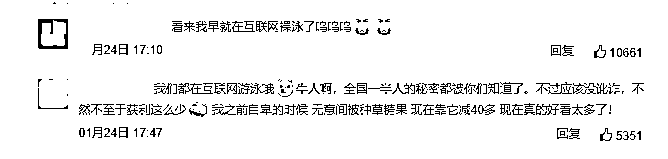
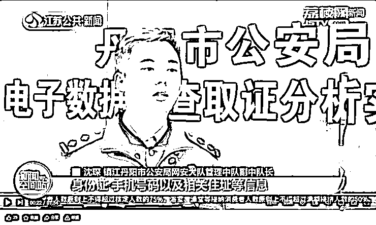
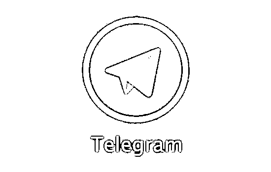
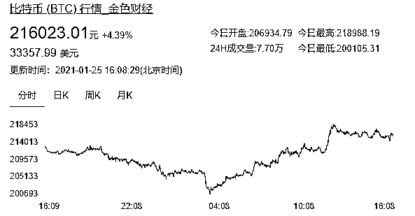
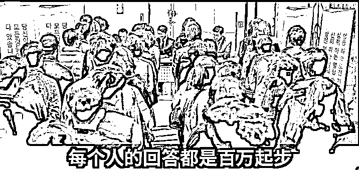

# 30 人，贩卖 6 亿个人信息，涉及 10 多个省市，获利 800 万！

> 原文：[`mp.weixin.qq.com/s?__biz=MzIyMDYwMTk0Mw==&mid=2247508327&idx=3&sn=a0c2e78fdba442afd3a0b96f3586d5fd&chksm=97cb6a5fa0bce349a85cca8bedfcc37cf12afd7e384bd16ef791b3864c6e382515e71d573685&scene=27#wechat_redirect`](http://mp.weixin.qq.com/s?__biz=MzIyMDYwMTk0Mw==&mid=2247508327&idx=3&sn=a0c2e78fdba442afd3a0b96f3586d5fd&chksm=97cb6a5fa0bce349a85cca8bedfcc37cf12afd7e384bd16ef791b3864c6e382515e71d573685&scene=27#wechat_redirect)

这可能是迄今为止范围最大的个人信息贩卖案了。30 人利用境外聊天软件和区块链虚拟货币收付款，共贩卖个人信息 6 亿余条，涉及 10 多个省市，且贩卖信息中包含数据种类繁多，涉及姓名、身份证号、联系方式、家庭住址、银行流水等众多信息，获利 800 余万。

此消息一出，网友们都不淡定了：

我直呼好家伙，贩卖了几乎半个国家的个人信息，太可怕了。

不用怀疑我也是其中之一。

还有网友悲哀的表示：我简单的算了下，6 亿条公民个人信息，获利 800 万，我的个人信息还不到一分钱，互联网时代，我的个人信息哪里还有隐私？

不过，更多网友关心的还是这个犯罪团伙是如何骗取 6 亿条公民信息的？

你的个人信息是如何被交易的？

据锦江丹阳警方介绍，这个犯罪团伙是通过境外聊天软件 Telegram 贩卖公民信息的。

我们先来看一下 Telegram 是什么来头？

根据百度百科的介绍，Telegram 是一款跨平台的即时通讯软件，用户可以相互交换加密与自毁消息，发送照片、影片等所有类型文件。它与 WhatsApp 等软件功能类似，允许一对一聊天和群聊，但还允许公众人物建立“频道”，向关注者广播，加入公共群聊的人数可以多达 20 万。

该软件由俄罗斯兄弟尼古拉•杜洛夫和帕维尔•杜洛夫于 2013 年创办，后者还是俄罗斯知名社交网站 Vkontakte 的创始人。2018 年 3 月，Telegram 称其月活用户已达 2 亿。

值得注意的是，这个软件是继 Parler 下线后川粉们的“聚集地”。

根据英国《每日电讯报》1 月 11 日报道，特朗普的线上支持者正涌向 Telegram，后者 10 日成为了美国下载量第二大的应用程序。

根据数据公司 Sensor Tower 的消息，从国会大厦骚乱 6 日发生到 10 日，Telegram 在美国的安装次数约为 54.5 万次，几乎是一周前同期的三倍。在 Parler 周一“下线”之前，该平台已经有帖子敦促用户改用 Telegram。

Apptopia 的数据则显示，Telegram 在美国拥有约 700 万月活用户。10 日 ，它的日下载量从平时的约 3.4 万至 6 万次，飙升至逾 13.3 万次。

除此之外，这款境外聊天软件自 2015 年以来，一直难以逃脱 “为恐怖分子提供庇护所” 的指控与质疑。

2015 年巴黎恐怖袭击之际，因被指控恐怖分子正是利用其加密通讯指挥交换彼此行动，Telegram 为此封杀了几个 ISIS 私密小组以及 78 个相关公共宣传频道。但在清理 ISIS 公开频道的额外声明中，该公司仍然表示：

“虽然我们确实屏蔽了恐怖分子(如 ISIS 相关的)机器人和频道，但我们不会屏蔽任何一个和平表达异见观点的人。”

2018 年 4 月，由于 Telegram Messenger 拒绝向俄罗斯情报部门 FSB 提交用户的加密秘钥被俄罗斯封杀。

此前，大批乱港分子使用具有加密性的 Telegram，通过多个聊天群组在非法集会中“迅速动员”，这些群组通常任何人都可以访问，参与者使用假名。

嗯？我似乎发现了什么？

再来看下搞钱方式。

根据警方的介绍，犯罪团伙是利用虚拟货币交易的。

但这里要注意的一点是，区块链不等于虚拟货币。

提到区块链一定离不开比特币，那么区块链和比特币的最大区别是什么呢？简单来说，区块链是记账本，而比特币就是钱。

按照现在的市值，一个比特币就相当于 3.3 万美元。

所以，你知道犯罪分子为什么会盯上虚拟货币了吧，一个很重要的原因就是为了搞钱。

其次，警方并未披露此次个人信息贩卖案究竟是因个人隐私泄露还是犯罪分子利用区块链的概念进行诈骗。

个人隐私泄露的原因不外乎三种：

黑客入侵企业数据库；

个人设备被植入木马病毒；

内部人员里应外合出卖数据。

那么，如果犯罪分子使用的是更高级别的骗术呢？比如利用区块链的概念拉你入局。

区块链诈骗套路多

区块链诈骗出现的一个很重要的原因就是传统的骗术已经骗不过大多数人了，甚至还有可能被大妈骂到精神崩溃。

俗话说得好，万事不决，量子力学。

传统项目已经满足不了骗子们的需求，现在都是披着高科技的皮，尤其喜欢用“量子”、“纳米”、“区块链”这些概念。

无论你是什么身份，多数人总有成功的欲望，且存在知识盲区。而骗子们往往利用的就是这点。

同时，虚拟货币本身又存在一些神秘感，也因此吸引了不少人关注，毕竟谁都想过一夜暴富这种美梦。

值得注意的是，这个犯罪团伙是 2020 年 5 月被警方发现的，直至落网警方用了六个月的时间，目前还暂未公布该团伙具体的作案时间。截止案发，全国数十个城市已有 6 亿个人信息被贩卖，那么，如果时间更长，那么，后果将不堪设想。

事实上，近几年，利用区块链实施诈骗的也不在少数。

2019 年初，盐城市公安局在日常网络巡查中发现一个名为“PlusToken”的平台疑似搞网络传销，随即成立专案组。

警方查明：自 2018 年 5 月至 2019 年 6 月，陈某、丁某、彭某等人架设搭建“PlusToken”平台，发展会员 200 余万人。

除境内会员外，还有不少境外会员，层级关系高达 3000 余层。

在一年时间里，这个平台吸收会员比特币、以太坊币等数字货币 948 万余个，按当时市场行情计算，折合人民币总值 500 多亿元。

其中大部分数字货币被用于发放会员“拉人头”奖励，还有部分被变现用于陈某、丁某、彭某等人日常开销和个人挥霍。

这也是国内首起利用区块链技术、以数字货币为交易媒介的特大跨国网络传销犯罪案。

仅 2019 年，全国共关闭境内新发现的虚拟货币交易平台 6 家，分 7 批技术处置了境外虚拟货币交易平台 203 家，通过两家大的非银行支付机构,关闭支付账户将近万个，微信平台上关闭宣传营销小程序和公众号接近 300 个。

这数字不可谓不大。

此前，澎湃新闻还据此采访了银行相关人员总结出了四大骗钱套路：

套路一，将“区块链”“去中心化”“开放源代码”等技术宣称为自家虚拟币的技术构造；

套路二，编造故事、设计模式吸引投资者眼球；

套路三，涉众诈骗特征明显，兼具多种违法犯罪特征；

套路四，交易平台服务器放置在境外，境内行骗、境外数钱，为提前跑路做好准备。

总之，各种一夜暴富的神话背后都有可能藏着骗局。

但不管是区块链还是其他什么高大上的名词也好，都是新瓶装旧酒。

但直到今天，上当受骗的人依然很多。所以我们要搞清楚的是，骗到人的不是骗局本身，骗局本身往往并不复杂。真正蒙蔽受骗者的，是让他们不相信这是个骗局的技巧。

也许，这世界上没有不被骗的人，只有还没被骗的人。我们不过是骗子织就的那张大网里的，漏网之鱼。

来源：安全圈

← 向右滑动与灰产圈互动交流 →

