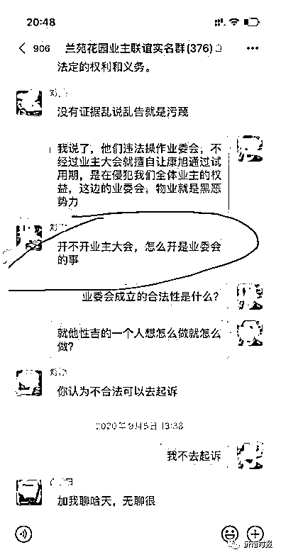
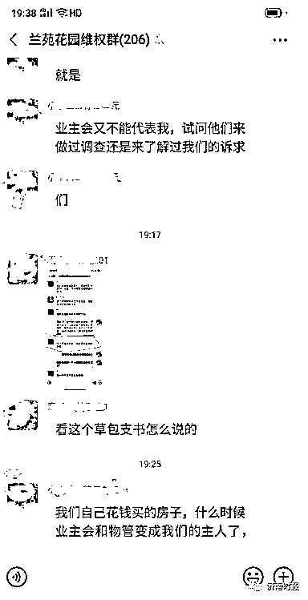
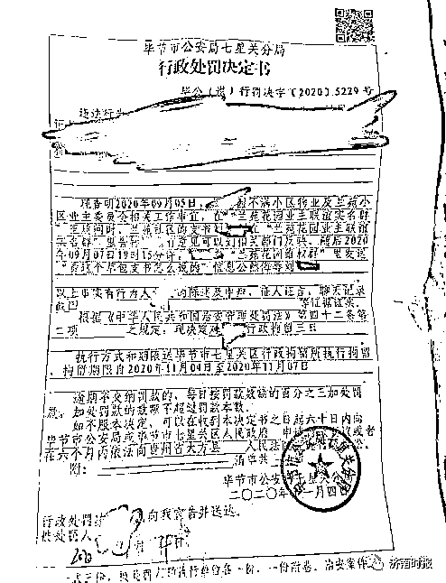
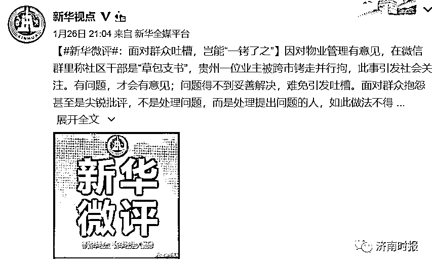

# 女子骂社区书记“草包”被拘 警方：撤销处罚，停职调查

> 原文：[`mp.weixin.qq.com/s?__biz=MzIyMDYwMTk0Mw==&mid=2247508373&idx=1&sn=d9804a72803e7c9e319f14727d3ce4e4&chksm=97cb6aada0bce3bb15c73d73ed368a3e7388dd3c9214e520a5fed2eee896a0e537207d7e349e&scene=27#wechat_redirect`](http://mp.weixin.qq.com/s?__biz=MzIyMDYwMTk0Mw==&mid=2247508373&idx=1&sn=d9804a72803e7c9e319f14727d3ce4e4&chksm=97cb6aada0bce3bb15c73d73ed368a3e7388dd3c9214e520a5fed2eee896a0e537207d7e349e&scene=27#wechat_redirect)

近日，贵州省贵阳市的任某反映，她因不满社区支书刘某在小区业主群的回应，而骂了对方是**“草包支书”**。随后，刘某报警，任某被毕节市七星关区洪山派出所民警用手铐铐到了毕节市，并被行拘 3 日。

1 月 26 日晚，@毕节公安 发布通报，依法撤销七星关分局对任某作出的行政处罚决定。

因群内骂“草包支书”被警方跨市拘留

据任某反映，她是毕节市兰苑花园小区的业主。2020 年 9 月 5 日，她在小区业主群质疑业委会不召开业主大会便擅自让新物业公司通过试用期的行为时，当时也在群里的洪山街道兰苑社区支书刘某对其质疑回应说：“开不开业主大会，怎么开是业委会的事。”

任某对刘某的这个回应十分不满，将刘某的回应截屏发到了业主们的一个维权群里，并在下面跟了一句“看这个草包支书怎么说的”。就因为这句话，刘某向毕节市公安局七星关分局洪山派出所报了警。

任某说，说过“草包支书”之后，她就回到了贵阳的家中。到了 2020 年 9 月中旬，毕节市洪山派出所民警打电话传唤她到毕节去，但她认为洪山派出所使用电话传唤不符合公安机关异地传唤的规定。因而她要求对方先跟其所在的辖区派出所联系。

过了一个多月后的 2020 年 11 月 3 日，洪山派出所再次跟任某联系，任某则要求对方联系她所在辖区的派出所处理。

当天下午 5 时左右，她回到家中后，发现门口有人鬼鬼祟祟的，就打电话报了警。等出警民警来到她家向她询问情况时，洪山派出所的民警跟着走了进来，在其未做任何反抗的情况下直接给其戴上了手铐。

随后，任某被从贵阳带到毕节。

由任某提供的一份《毕节市公安局七星关分局行政处罚决定书》可以看到，2020 年 11 月 4 日，她因 2020 年 9 月 7 日 19 时 15 分许，在兰苑花园维权群里发送“看这个草包支书是怎么说的”信息公然侮辱刘某，根据《治安管理处罚法》第四十二条第二项之规定，被毕节市公安局七星关分局决定行政拘留三日。

任某认为，自己被行拘三天很冤枉。因为在此次事件中，她并没有对刘某进行侮辱、辱骂的意向；退一步讲，即便侮辱了，该案也是自诉案件，应该由被侮辱人到法院起诉而非警方直接异地抓人。她还质疑，刘某的丈夫是一位毕节警察，在此案中是否按要求进行了回避。

被骂支书回应：原本只是想让她道个歉

对于任某反映的问题，洪山街道兰苑花园社区支书刘某介绍，她报警只是想把任某请过来，当面把事情说清楚。但派出所多次传唤她她不买账。任某既然不买账，她就对警察说，按照法律该怎么做就怎么做吧，之后，就没有过问。后来是派出所的工作人员告诉她，任某被行政拘留了三天，“我原本只是想让她给道个歉。”

至于任某质疑，她的丈夫身为警察是否在该案中按要求进行了回避，刘某说，丈夫虽然在公安局工作，但她回家从不说自己工作上的事情，丈夫也并不清楚自己报警的事情。

警方通报：撤销处罚，办案民警已停职

1 月 26 日晚，@毕节公安 微博发布消息通报称，依法撤销七星关分局对任某作出的行政处罚决定，案件涉及的派出所所长及办案民警已停职接受调查。

通报全文：

近日，《贵州女子微信群骂社区支书“草包支书”，被毕节警方跨市铐走行拘》的文章在网上引发关注，公安局迅速组织调查，现将有关情况通报如下：

2020 年 11 月 4 日，七星关分局对任某作出拘留 3 日的行政处罚决定，被处罚人任某于 2020 年 12 月 14 日向公安提起行政复议。经复议查明：任某在微信群侮辱他人的行为存在，七星关分局洪山派出所受案后多次通知任某到派出所配合处理，任某拒绝配合，七星关分局洪山派出所遂进行异地传唤。**经审查，该传唤程序违法，依法撤销七星关分局对任某作出的行政处罚决定，并责令七星关分局依法处理后续相关事宜。**

案件涉及的派出所所长及办案民警已停职接受调查。文中提及支书刘某某，其前夫赵某系七星关分局民警，刘某某与赵某已于 2014 年 7 月 10 日离婚。对于是否存在办关系案、人情案等违法违纪问题，七星关区纪委监委已经成立调查组介入调查，若涉及违法违纪问题，将依法依规严肃处理。

新华社：面对吐槽岂能“一铐了之”

“女子称社区干部草包被拘”，有问题，才会有意见；问题得不到妥善解决，难免引发吐槽。面对群众抱怨甚至是尖锐批评，不是处理问题，而是处理提出问题的人，如此做法不得人心，很不可取。群众的呼声就是改进工作的方向，用心用情用力破解百姓“急难愁盼”，何愁不能赢得群众点赞？

**对此，你怎么看？** 

**评论区见**

来源：广西法制日报@毕节公安、@新华视点、澎湃新闻、东方今报

← 向右滑动与灰产圈互动交流 →

