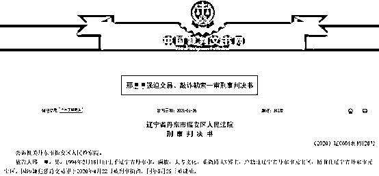
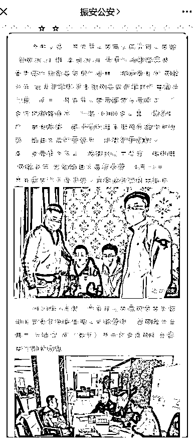
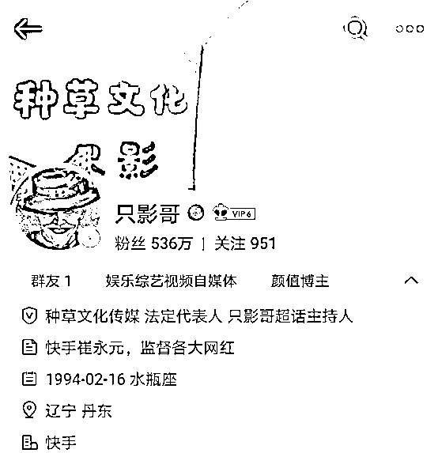

# 奇葩！27 岁微博大 V，竟然敲诈快手主播，法院判了

> 原文：[`mp.weixin.qq.com/s?__biz=MzIyMDYwMTk0Mw==&mid=2247508373&idx=2&sn=76d44900109448d0b0421b594d667b09&chksm=97cb6aada0bce3bb0a47fe4270adedb616df9913463c0ff6257206757787850d09f12a836056&scene=27#wechat_redirect`](http://mp.weixin.qq.com/s?__biz=MzIyMDYwMTk0Mw==&mid=2247508373&idx=2&sn=76d44900109448d0b0421b594d667b09&chksm=97cb6aada0bce3bb0a47fe4270adedb616df9913463c0ff6257206757787850d09f12a836056&scene=27#wechat_redirect)

一名 1994 年的微博大 V 邢某，坐拥数百万粉丝，却选择利用互联网组建“网络水军”，对快手主播实施敲诈勒索，强迫后者帮助进行“直播带货”牟利。最终受到了法律的惩处。 

 “网络水军”强迫交易勒索

多名快手网红主播受害

2020 年 9 月 11 日，丹东市公安局振安分局官方微信“振安公安”发布消息称，2020 年 4 月初，丹东市公安局网安支队接到北京快手科技有限公司报案称，某网络平台用户“只影哥”对快手平台的多名网红主播进行骚扰威胁。

警方侦查发现，邢某注册丹东某文化传媒有限公司，以开展“影视制作策划”、“经纪服务”等业务为掩护，打着“监督各大网红”的旗号，纠集多名“网络大 V”组成“网络水军”团伙，长期在自媒体平台针对快手平台的“网红主播”进行负面炒作。 

同时，该团伙以发起负面“集群炒作”和在直播平台发起恶意“人海投诉”等手段相要挟，迫使“网红主播”加入邢某组织的所谓“主播工会”，为邢某团伙“直播带货”牟利，被害人涉及快手平台多名主播。

警方经过一个多月的缜密侦查，横穿多省，成功破获这起涉嫌利用互联网实施敲诈勒索、强迫交易犯罪案件，主要犯罪嫌疑人邢某等 7 名涉案人员抓获归案，这也是当时破获的辽宁省第一起利用“网络水军”实施强迫交易勒索案。

2020 年 8 月 25 日，丹东振安警方将涉案人员移送检察机关起诉。

12 月 24 日，公安部在京召开新闻发布会，通报全国公安机关打击利用信息网络实施黑恶势力犯罪的十大典型案例，上述“辽宁丹东邢某鑫网络水军滋事犯罪案件”名列其中。

资料显示，经查，2019 年以来，邢某鑫等人打着“快手崔永元、监督各大网红”的旗号，纠集刘某鹏等 10 余名团伙成员，长期在新浪微博等自媒体平台针对快手直播平台的“网红主播”实施敲诈勒索犯罪，胁迫多名“网红主播”为其“直播带货”牟利。近一年时间，该团伙敲诈勒索多名“网红主播”，非法牟利近百万元，严重破坏了互联网正常秩序。

百万粉丝大 V 强迫直播带货

发布负面消息收删帖费

邢某出生于 1994 年 2 月 16 日，案发前也算得上是微博大 V 之一，在新浪微博上已有超过 500 万粉丝。

天眼查显示，邢某于 2018 年 11 月设立丹东某文化传媒有限公司，该公司注册资本 500 万元，邢某系唯一股东，并担任法定代表人。

2020 年 12 月 23 日，辽宁省丹东市振安区人民法院对本案作出一审判决。

以删帖为由强迫网红主播帮忙带货是邢某团伙获利的主要套路。

经法院审理查明，2019 年 9 月至 10 月间，被告人邢某利用自己微博网络大 V 的影响力，组织他人多次在网络上发布大胃王红某（被害人司某，快手账号名“大胃王红某”）的负面消息以及到快手官方举报大胃王红某，导致大胃王红某快手账号被快手平台多次禁播。

司某为了消除负面影响，联系到邢某解决此事，邢某以删帖为由强迫司某帮其在直播间直播“带货”，司某被迫答应。随后在邢某安的排下，大胃王红某于 2019 年 11 月 6 日、2019 年 11 月 19 日、2020 年 1 月 13 日分三次帮邢某直播“带货”，邢某共计违法获利 84.1 万元。

2019 年 10 月间，邢某利用自己微博网络影响力，组织他人在微博网络上发布大胃王阿某（被害人李某，快手账号名“大胃王阿某”）“吃驴鞭”等负面消息，李某为了消除负面影响，联系到邢某解决此事，邢某以删帖为由强迫李某帮其直播“带货”，李某被迫答应。

随后在邢某的安排下，大胃王阿某于 2019 年 11 月 5 日、2020 年 1 月 4 日分两次帮助邢某直播“带货”，邢某共计违法获利 10.6 万元。

此外，邢某等人还发布快手主播的负面消息，借删帖为名勒索收费。

2020 年 4 月初，被告人邢某、牛某等人，利用各自微博账号发布快手主播彭某致某女粉丝怀孕的相关负面消息。之后，被害人彭某为消除负面影响，联系牛某为其删帖，牛某与邢某商议后，二人以删帖为名向彭某索要 5000 元，随后将此消息删除。后邢某、牛星河各分得 1500 元。

2020 年 4 月初，被告人邢某伙同牛某等人利用各自微博账号发布关于马某、宋某卖假货的相关负面消息，并商议删帖价格不能低于 1 万元。

上述负面消息发布后，马某的朋友葛某帮忙联系删帖事宜，经过沟通，葛某转给牛星河人民币两万元。2020 年 4 月 18 日，葛某又单独联系邢某，支付给邢某人民币两万元，要求被告人邢某删除关于被害人马某、宋某的负面消息，以后别再发关于被害人马某的负面消息。邢某、牛某收到钱后便联系他人删帖，并支付一定的删帖费。

一审获刑两年

为证实上述指控，快手公司提供的关于 2019 年 9、10 月因微博负面舆情封禁“大胃王红某”账号直播权限相关情况的说明、“大胃王红某”账号封号数据一份、关于购买快币、快币兑换黄钻及黄钻提现的说明、“大胃王红某”PK 邀请、卖货信息，“大胃王阿某”PK 邀请、卖货信息，PK 刷礼物信息，转账记录，电子数据检测报告等证据。

一审法院认为，被告人邢某采取威胁手段多次强迫他人为其提供服务，情节严重；伙同他人以非法占有为目的，采用威胁的方法勒索他人财物，数额较大，其行为已经分别构成强迫交易罪、敲诈勒索罪，且敲诈勒索系共同犯罪,应予惩处。

被告人邢某一人犯数罪，应数罪并罚。公诉机关的指控成立。被告人邢某到案后如实供述自己的犯罪事实，系坦白，且其认罪认罚，可以从轻处罚。公诉机关的量刑建议适当。

最终，法院判被告人邢某犯强迫交易罪，判处有期徒刑八个月，并处罚金人民币五十万元；犯敲诈勒索罪，判处有期徒刑一年六个月，并处罚金人民币五万元，决定执行有期徒刑二年，并处罚金人民币五十五万元。

来源：中国基金报 编辑：舰长 

← 向右滑动与灰产圈互动交流 →

