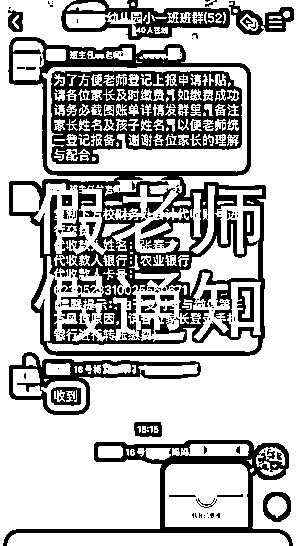

# 骗子开启“寒假模式”，家长群里收到这样的消息要注意了！

> 原文：[`mp.weixin.qq.com/s?__biz=MzIyMDYwMTk0Mw==&mid=2247508373&idx=3&sn=732ec13d8359092cc5150dabd34eb00c&chksm=97cb6aada0bce3bb51da56aea671a8a9a5e6db83ae5ed49a1c1ca9bd581d78c3f6f83ba4eb7b&scene=27#wechat_redirect`](http://mp.weixin.qq.com/s?__biz=MzIyMDYwMTk0Mw==&mid=2247508373&idx=3&sn=732ec13d8359092cc5150dabd34eb00c&chksm=97cb6aada0bce3bb51da56aea671a8a9a5e6db83ae5ed49a1c1ca9bd581d78c3f6f83ba4eb7b&scene=27#wechat_redirect)

2021 年刚刚过去十多天

而学生朋友们最期待的假期——

**寒假也马上就到了！**

****

从高校到中小学包括幼儿园

最近都在陆续放假

往年各学校都会利用放假前

布置假期各种安全教育工作——

防火、防盗、防诈骗

然而谁知道

**这假还没开始放**

**骗子已经先“动手”了**

事情是这样的

↓↓↓

“老师”发下学期收费通知

1 月 17 日下午 3 时 6 分，刚刚午休完的市民林先生在查看手机的时候，看到在自己儿子就读的幼儿园家校联系 QQ 群里，班主任林老师发送了一些关于 2021 年放假通知的具体事项及预收下学期学费的文档，**并提供了一个校财务处会计代收账号，让家长通过手机银行进行转账缴费，并及时将转账截图备注“家长+孩子姓名”发送群里。**

骗子的名字、头像和班主任一模一样

林先生看到，**发送上述信息的人的名字和头像都跟自己儿子班主任的一模一样**，而且有不少学生家长已经把转账截图发到群里了，林先生便点开了群里的《关于收放假相关事宜以及预收下学期学费安排通知》的文档。

据林先生报警时反映，文档里的主要内容是收取下学期的学费，一共是 3690 元，并提供了一个收款账号。**林先生于是用手机银行向该账号转账 3690 元。**

但是，当天下午 3 时 19 分，林先生看到自己儿子的班主任在 QQ 群里发送消息称：

**群里发送缴费通知的“班主任”是假的，**

**是骗子冒充的！**

**学校根本没有“预交学费”的工作！**

**让家长不要转账汇款！**

这时，林先生才意识到自己被骗了……

而在假老师开始发送诈骗信息、

真老师澄清事件之间的短短十多分钟里，

**与林先生有共同被骗遭遇的家长就有 5 人！**

****

根据蜀黍的分析

林先生遭遇的是典型骗术——

**冒充老师以缴交学费诈骗家长**

除此之外

现在还有所谓**“接种疫苗”、**

**“报名培训班”**等说辞

骗子事先盗用受害者子女的班主任或老师的 QQ 账号，随后在群内发送虚假缴费信息，利用家长未仔细核实信息真伪及发送信息者真实身份实施诈骗。

**据林先生回忆**

**其实骗子行骗过程中有很明显的漏洞**

虽然骗子在 QQ 群里的昵称和头像都与真实的班主任一致，但真实的班主任显示的是“群主”，而骗子没有任何的显示。林先生之所以当下立马转账，主要就是看到了有其他家长已经转账汇款，也就没有过多核实了。

**反诈知识延伸**

**以下三类骗术专盯寒假学生**

**1**

** 兼职刷信誉**

骗子通过网页、招聘平台、QQ、微信、短信、抖音等渠道推广兼职广告，以开网店需快速刷新交易量、网上好评、信誉度为由，招募人员进行网络兼职刷单。骗子利用话术诱骗被害人，在其提供的链接或者 APP 上进行购物付款操作，并承诺在交易后返还购物费用，并额外提成。一般在刷单过程中，被害人刷第一单时，骗子会小额返利让被害人尝到甜头，当被害人刷单交易额变大后，嫌疑人就会以各种理由拒不返款并将其拉黑。

**2**

** 返利链接**

骗子利用 QQ、微信、微博等社交工具发布信息，称有发红包返利活动（例如：发红包充 99 元返 200 元）拉人入 QQ、微信群，诱导被害人转钱，实施诈骗；或拉人入 QQ、微信群，以明星、网红粉丝福利、返利群等为名，让被害人认为是追星活动，诱导被害人在群内发红包或者点击群内链接付款充值等，最后将被害人踢出群，从而实施诈骗；或骗子通过加被害人微信、QQ，谎称和男（女）朋友分手并获得一笔赔偿金想要报复对方，让受害人发红包将会返还更多，从而实施诈骗。

**3**

** 网络游戏**

骗子在社交平台推广充值游戏币、游戏点卡优惠或优惠购买的广告，诱导被害人先付款，制作虚假的各种游戏界面和充值界面截图，发送截图给被害人获取信任，对其实施诈骗。骗子发布买卖游戏装备、游戏账号的广告信息，诱导被害人在架设的虚假游戏交易平台进行交易。‍

**警方提醒**

市民群众尤其是学生家长

在 QQ、微信或者其他聊天工具上

**收到任何要求缴费的信息**

**一定要通过电话等其他渠道**

**多方进行核实确认**

切勿贸然汇款

有任何疑问都可以拨打

96110 反诈劝阻专线进行咨询举报

来源：厦门市反诈骗中心 厦门日报社新媒体中心

← 向右滑动与灰产圈互动交流 →

