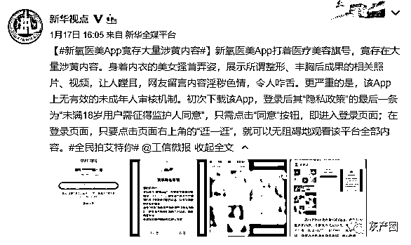
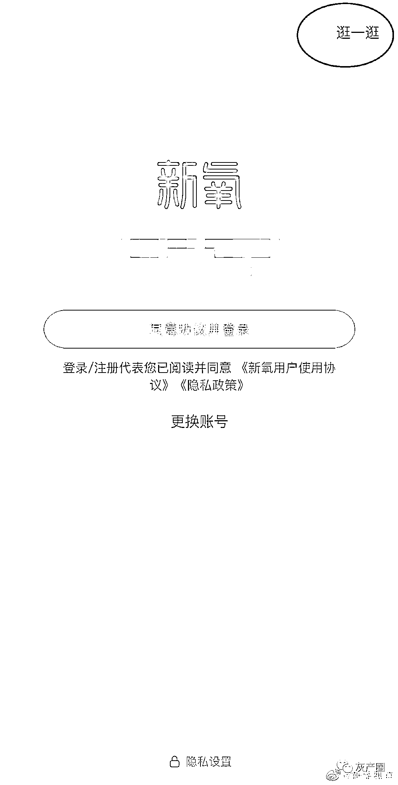
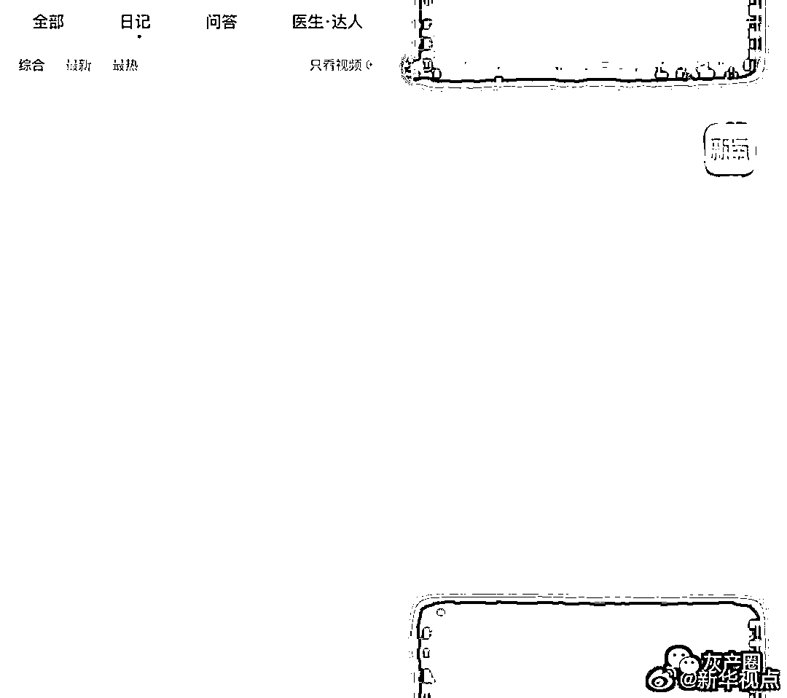
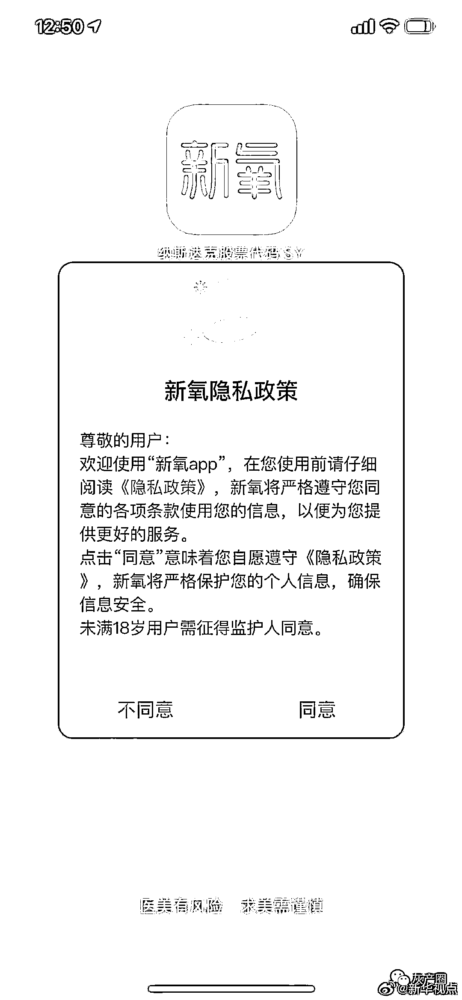
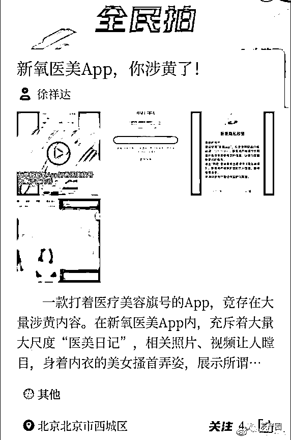
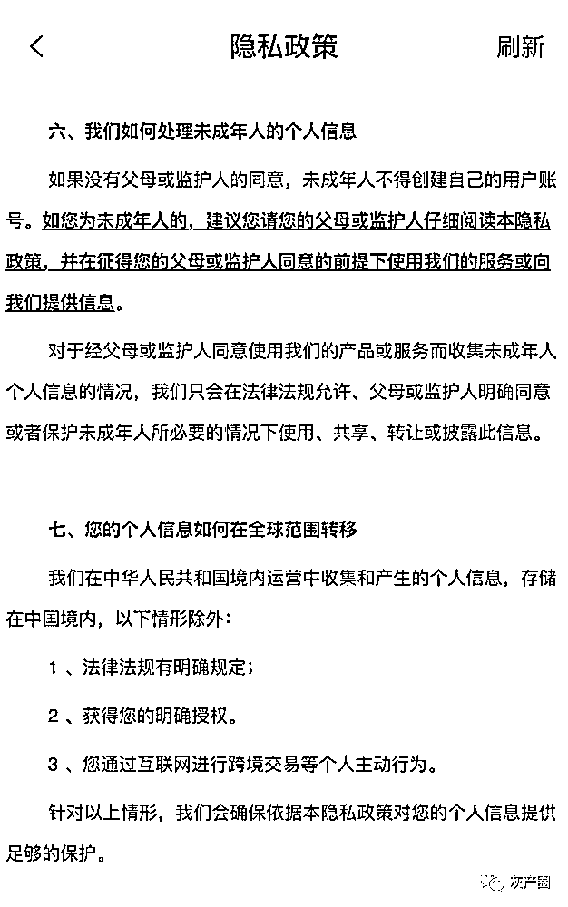
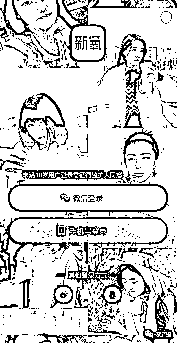
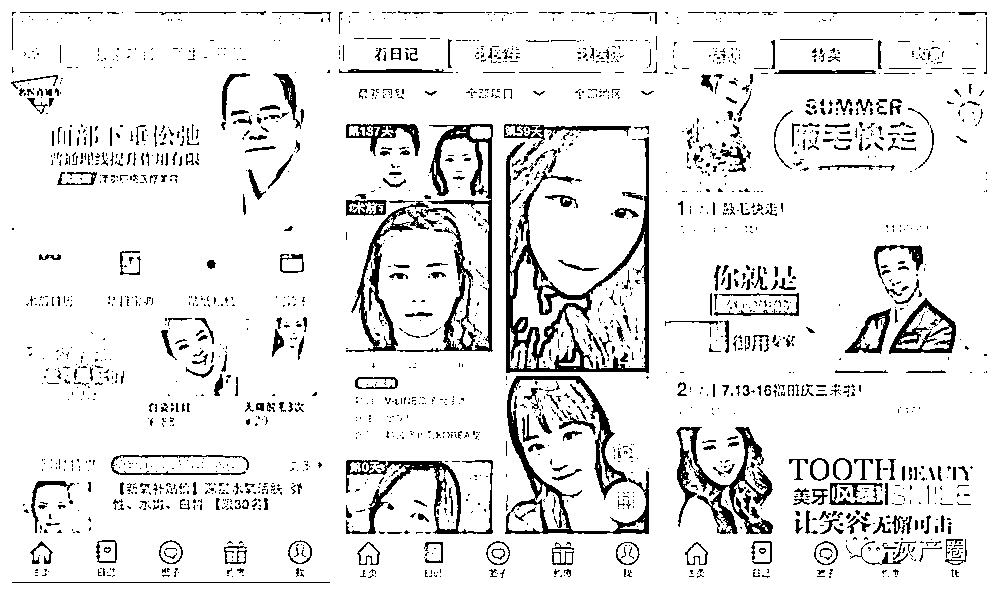
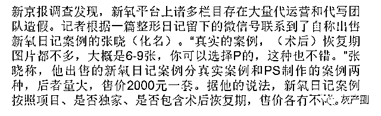
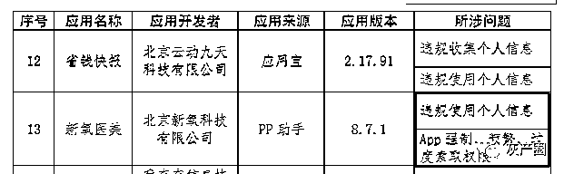

# 新氧医美 App 疑涉黄 整形日记被曝造假

> 原文：[`mp.weixin.qq.com/s?__biz=MzIyMDYwMTk0Mw==&mid=2247508373&idx=5&sn=7e6788bab940badd090c47cd10ba5abb&chksm=97cb6aada0bce3bb9513778083f5c2de7fae890c69b916b5bcfefa018316814e44f3e1981f03&scene=27#wechat_redirect`](http://mp.weixin.qq.com/s?__biz=MzIyMDYwMTk0Mw==&mid=2247508373&idx=5&sn=7e6788bab940badd090c47cd10ba5abb&chksm=97cb6aada0bce3bb9513778083f5c2de7fae890c69b916b5bcfefa018316814e44f3e1981f03&scene=27#wechat_redirect)

杨奇奇） 近日，新华全媒平台“新华视点”微博称，新氧医美 App 打着医疗美容旗号，竟存在大量涉黄内容。

身着内衣的美女展示整形、丰胸后成果的相关照片、视频，留言内容淫秽色情，且软件无有效的未成年人审核机制，未成年人也可随意观看该平台的全部内容，包括上述所说丰胸成果日记。

该微博称，初次下载该 App，登录后其“隐私政策”的最后一条为“未满 18 岁用户需征得监护人同意 ”，只需点击“同意”按钮，即进入登录页面；在登录页面，只要点击页面右上角的“逛一逛”，就可以无阻碍地观看该平台全部内容。

1 月 20 日，记者通过网友所说的登录方式发现，在点击“同意”后，在不登录的情况下，确实可以进入软件浏览所有内容，浏览网友分享的丰胸视频和图文。在丰胸整容日记的下方评论区，记者发现，部分留言内容明显具有性暗示，涉黄侮辱性内容公然出现在评论区内。

新氧医美 App 对于未成年人的权限有这样的描述，“如果没有父母或监护人的同意，未成年人不得创建自己的用户账号。如您为未成年人的，建议您请您的父母或监护人仔细阅读本隐私政策，并在征得您的父母或监护人同意的前提下使用我们的服务或向我们提供信息。”

  

1 月 21 日，记者删掉新氧医美 App 重新下载后发现，新氧医美已增加了“未满 18 岁用户登录需征得监护人同意”的页面，并出现了微信登录、手机号登录等登录方式。但当记者关掉手机新氧医美 App 重新进入，又可以顺利地进入平台浏览各种整容日记。在此过程中，记者一直使用飞行模式，以 wifi 上网进行操作。更重要的是，记者不用点击“未满 18 岁用户登录需征得监护人同意”就可以登录，也没有任何验证个人身份信息的页面出现。

记者即将发稿时发现，手机新氧医美 App 已修复了上述内容，只要点击任何内容，都会出现 “未满 18 岁用户需征得监护人同意”的页面，不登录无法查看。

整容日记是真是假？

据资料显示，目前新氧原创内容包括医美、护肤、健身、美妆、审美等领域，在新氧社区中用户分享真实接受医美服务过程与感受的“美丽日记”，累积量已超过 350 万篇。那么，这 350 万篇的日记是否真的全部来自于消费者的购买后体验？

早在 2019 年 7 月，就有媒体曝光，新氧平台入驻的部分医美机构存在销售违禁的肉毒素等药品行为，客户的“美丽日记”、评价也存在造假刷评现象。据媒体报道“他出售的欣阳日记案例分析分真实案例和 PS 制作两种，后者量大，售价 2000 元一套。据他的说法，新氧日记案例按照项目、是否独家、是否包含术后恢复期，售价各有不同。”

对此，记者随机点开了其中几篇消费后日记的发表者账号，发现其中一用户共发表了 18 篇日记，共购买了水动力吸脂、吸脂瘦全身、切开双眼皮和埋线提升四个项目，但四篇日记上的照片明显并不是同一个人。

另外，记者还发现新氧医美曾因涉嫌售违禁药、销售违禁的肉毒素被媒体曝光。新氧医美当时回应称，对触碰安全红线的机构“零容忍”，对违背真实性的信息、影响平台价值的行为“零容忍”，并对相关产品和机构采取了下架、封禁等处置措施。

2020 年 8 月 31 日，新氧医美 App 还曾因违规使用个人信息，App 强制、频繁、过度索取权限被工信部列入违规名单。

在此次事件中，由于新氧医美 App 的诸多漏洞，没有及时的对未成年人设立有效保护机制，也没有对发表内容有严格审核制度，一方面大量虚假整容日记使消费者无法分辨真实的整容效果，另一方面由于违规涉黄类留言，使真正的日记发布者名誉受到侵犯。

记者了解到，新氧医美 App 是一个集医美电商和社交为一体的平台，有需求的求美者可能会根据日记中的照片及视频作为参考，“种草”医美美容项目，自己选择整形美容的医美机构和医生。“美丽日记”的存在，对消费者的购买欲影响至关重要。而大量虚假的“美丽日记”，使消费者“种草”容易，更容易上当。

记者认为，新氧医美有责任和义务保护未成年人，为用户营造干净真实的社交环境和服务，对所有违规留言、涉黄现象严厉打击，对虚假日记、医美美容机构刷单现象应加强监管力度和深度，体现出互联网医美平台的社会责任感。

来源：中国经济网

← 向右滑动与灰产圈互动交流 →

