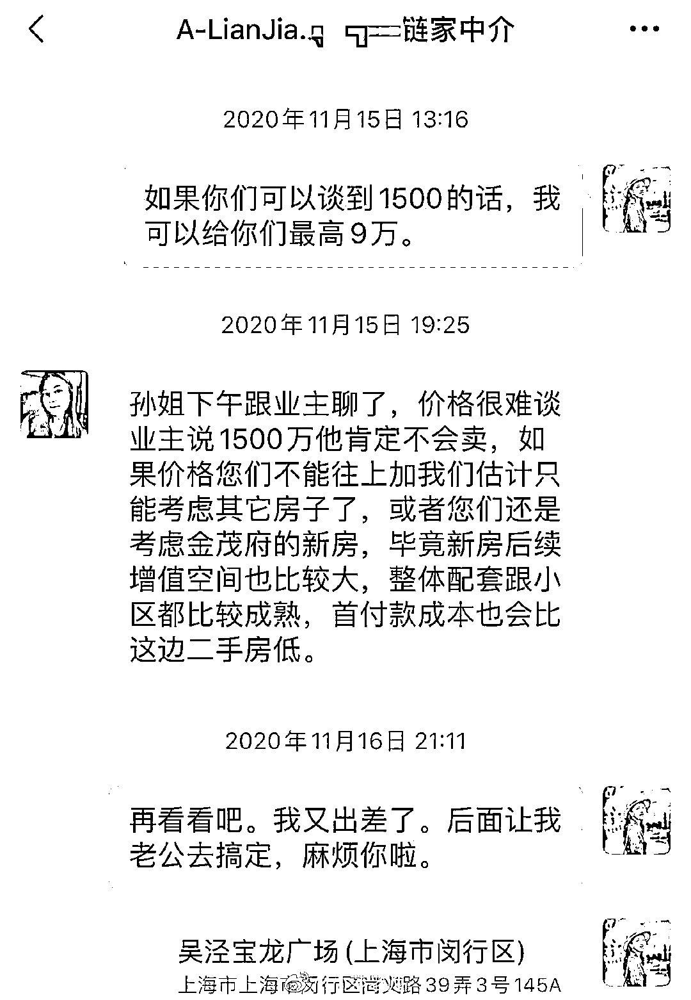
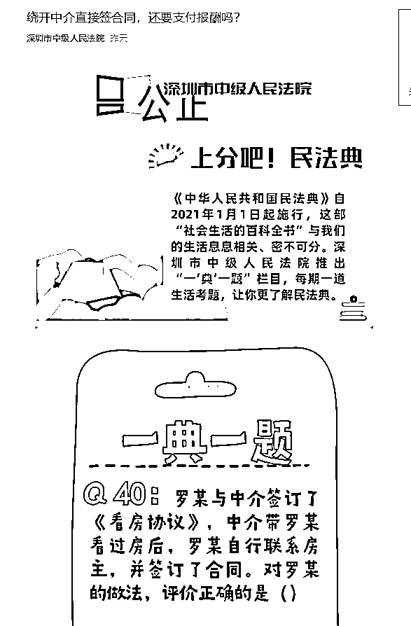
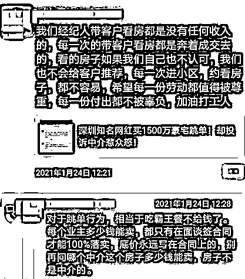
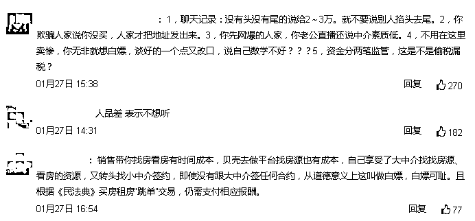
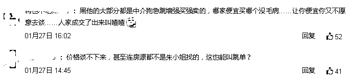
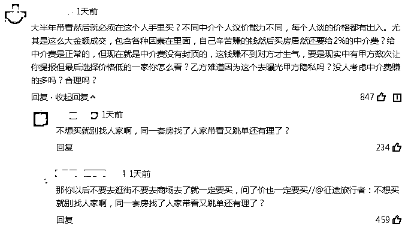
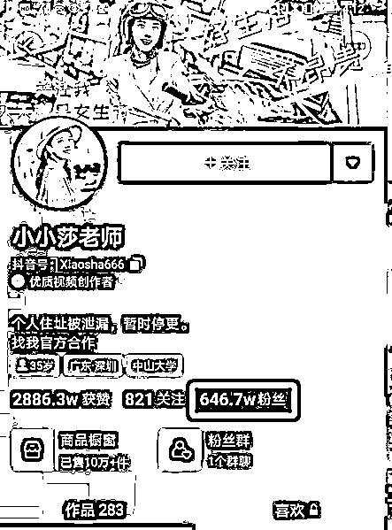
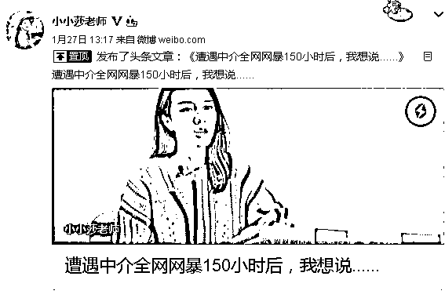
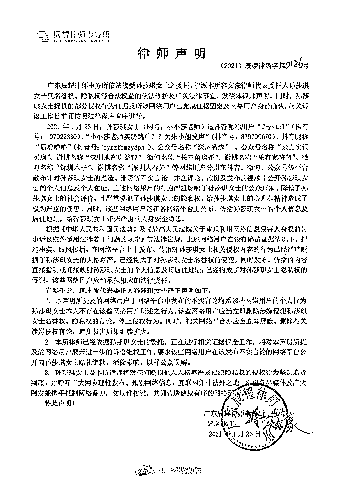

# 中介怒了！深圳网红买 1600 万豪宅竟跳单？协会：对跳单零容忍！最新回应

> 原文：[`mp.weixin.qq.com/s?__biz=MzIyMDYwMTk0Mw==&mid=2247508427&idx=1&sn=72ccd839ca86fb94bbcb91f04669e929&chksm=97cb6af3a0bce3e5aeece67d3a271d689aedb7ffa848100950bcd02cb76bdeea56bbe4f3ed31&scene=27#wechat_redirect`](http://mp.weixin.qq.com/s?__biz=MzIyMDYwMTk0Mw==&mid=2247508427&idx=1&sn=72ccd839ca86fb94bbcb91f04669e929&chksm=97cb6af3a0bce3e5aeece67d3a271d689aedb7ffa848100950bcd02cb76bdeea56bbe4f3ed31&scene=27#wechat_redirect)

到底有没有跳单？

近日，深圳一坐拥近千万粉丝的网红“小小莎”，花近 1600 万买房却被质疑跳单的事情在网上炒得沸沸扬扬。

中介一怒之下把这事曝光到了网上，引发了网红粉丝的大面积脱粉，网友把网红的抖音骂到一度关号。深圳市房地产中介协会发文：对“跳单”行为零容忍！

而小小莎也对此最新做出回应。

被质疑“跳单”的事件回顾

事情是这样的，链家的中介朱小姐为小小莎带看了一套报价 1620 万的房子，但双方并没有就价格问题达成一致。

小小莎的需求是：第一，把房价谈到 1500 万；第二，中介费低一点，别的家也有收 2-3 万的。

中介谈完的结果是：第一，房价是 1620 万，业主不同意降到 1500 万；第二，中介费要收 1%，也就是 16 万左右。

随后小小莎通过别的渠道，以 1568 万元的成交价、9 万元的中介费买下这套房。

朱小姐质疑小小莎这是“跳单”，将其个人信息曝光后。此事一出，中介从业人员集体刷爆该网红短视频留言栏，同时在朋友圈火速传开。  

小小莎因此一夜之间掉粉 100 多万，甚至被迫“关号”。 

中介怒了：相当于吃霸王餐

《民法典》明确禁止"跳单"

跳单，一般指买家跳开中介，利用中介提供的房源信息、交易机会，直接与业主达成交易，以达成省去大额中介费用的目的。

让她《民法典》第九百六十五条明确规定了“跳单”行为的法律后果：委托人在接受中介人的服务后，利用中介人提供的交易机会或者媒介服务，绕开中介人直接订立合同的，应当向中介人支付报酬。

以前的合同法中是没有关于“跳单”的法律规定的，只能依据双方合同约定。《民法典》新增中介服务合同的规定，并明确禁止“跳单”。

自 2021 年 1 月 1 日起，《民法典》生效后，即便合同双方未约定跳单行为，当事人构成“跳单”的，中介公司也可以根据《民法典》第九百六十五条的规定，直接要求委托人支付报酬。

因而，不少中介表示，小小莎的这种行为就是“跳单”，相当于吃霸王餐。

网上也刷屏该事件，有网友认为，销售带你找房看房有时间成本，自己享受了大中介找找房源、看房的资源，又转头找小中介签约，即使没有跟大中介签任何合约，从道德意义上这叫做白嫖，白嫖可耻。

但也有网友支持小小莎，认为哪家便宜买哪个没毛病……

深圳市房地产中介协会

对“跳单”行为零容忍！

随后，深圳市房地产中介协会也发文表示，对跳单行为零容忍！

文中表示，无论遵照法律法规，还是遵从公序良俗，雇佣他人服务，劳动付酬，天经地义。不然农民工兄弟集体讨薪的新闻为何每每让整个社会为之动容。对此，深圳市房地产中介协会已于第一时间关注此事件进展，如该客户“跳单”行为属实，深房中协会第一时间将其列入到“深圳市房地产中介行业失信客户名单”，即使她是百千万级网红，深房中协也都将启动维权程序，坚决维护我市房地产中介行业及会员的合法正当权益！

小小莎回应：我和链家没有签约 

等待法官判决

资料显示，小小莎在抖音坐拥超 600 万粉丝，在微博粉丝近 300 万，两个平台的粉丝合计近千万。

而抖音目前已经因此暂时停更。

 小小莎在 1 月 27 日作出最新回应：《遭遇中介全网网暴 150 小时后，我想说......》。

文中，小小莎表示，她没有和链家签订任何书面协议情况，这套房源也并非某壳系的独家房源。肯定货比三家。

而在随后，她遭到了隐私的暴露和网络的暴力。她认为，链家这是一边在拒绝帮客户压价、坚持收取高额中介费；一边因客户选择同行提供的低价服务，恶意中伤客户、泄露客户隐私，让客户不得不面对铺天盖地的舆论指责！

这对她的名誉和身心造成的巨大伤害，她也将正式提起诉讼，期待法院的公正裁决。 

对于“跳单”质疑，小小莎认为自己从没有做过“跳单”的事，也从不会拒绝为提供服务的人给予合理的报酬。

来源：中国基金报记者 吴羽

← 向右滑动与灰产圈互动交流 →

