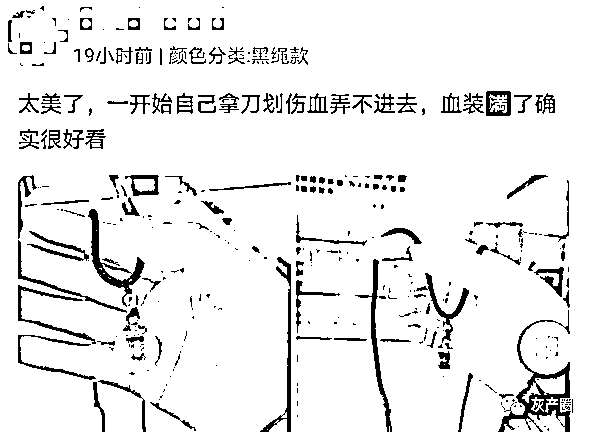

# 网红“血吊坠”，祸害了多少小姑娘

> 原文：[`mp.weixin.qq.com/s?__biz=MzIyMDYwMTk0Mw==&mid=2247508427&idx=2&sn=4e68b41a7c329d92bc97d037e87c429b&chksm=97cb6af3a0bce3e53112962b34ff7093aed0dc40ff1b2ed91f24b62bc23879b342c528699162&scene=27#wechat_redirect`](http://mp.weixin.qq.com/s?__biz=MzIyMDYwMTk0Mw==&mid=2247508427&idx=2&sn=4e68b41a7c329d92bc97d037e87c429b&chksm=97cb6af3a0bce3e53112962b34ff7093aed0dc40ff1b2ed91f24b62bc23879b342c528699162&scene=27#wechat_redirect)

都 2021 年了，居然还有人相信“血能消灾”这一说，甚至有女孩为此割腕取血。

前天，电商平台被爆出销售血吊坠。无良商家为了赚钱，甚至说如果女孩自残取血做吊坠，就可以为心爱的男孩挡灾一次。

那么，网红血吊坠到底是什么玩意，对人体有什么风险？

爱他，就要把血给他？

网红血吊坠，里边是空心磨砂玻璃，被商家称为特别的礼物，价格为数十元。

其使用方法，就是让女孩扎破手指后，将鲜血滴落进去，营造出红色吊坠的感觉，赠送给心爱的男孩。

为了“方便”消费者，有些商家还配赠廉价的针、吸管、止血贴等各种工具。如果还不懂怎么操作，还可以到商品首页展示制作流程视频。

面对“为什么要伤害自己”“不怕被感染吗”“为什么要这样”这类关切的询问，有买家直接回复“因为爱”“爱他”“能够帮他消灾”……

这是何等的丧心病狂！给他姨妈血不好吗？一个月一次不好吗？非要往自己身上扎一针。

自行取血很危险

先来说健康风险。

某宝排名靠前的商家，显示有 4000 人付款，个别商家甚至月销 1000。

其中也有人质疑过安全性的问题，但商家轻描淡写地称，一般在手指头上扎一下就行，不会有什么危险，刺破以后最好用酒精擦一下就行。

呦呵，事情真的如此简单吗？非也。

这些针、吸管是赠送的，来历不明，说白了，这些毫无卫生可言的工具，居然还真有人敢往手上、脚上扎。

要知道，进入人体的医疗器械，是有严格规定的。

根据《传染病防治法》及其实施办法的有关规定，医疗卫生机构使用进入人体组织或无菌器官的医疗用品必须达到灭菌要求。

但是，自行采血就算是自行消毒，也无法保证充分消毒。再有就是，割破、划破的伤口是不可控的，身体失去了皮肤保护屏障，严重时甚至会威胁到生命。

有医生表示，本身破坏皮肤屏障就有感染疾病的风险，如果多人混用器具，还有相互之间通过血液感染的风险。

自残行为不可取

再来说情感风险。

“血能挡灾”“血能消灾”……商家除了鼓励女孩滴血，还极力鼓吹“别的女孩都有了，你也必须有”的宣传语。

在商品的评论区，有大量买家晒出成品图。本来是血腥场面，却被描绘成了爱情的宣誓场，引来一波又一波的买家秀。

你以为拿自己的血，就能换来爱情吗，就能让爱情永驻吗？非也！

伤害自己换取他人的爱，这种血色浪漫，这不算爱情，而是绑架，用高大尚的话语来说，就是“情感绑架”。

这种感情发展到一定程度，很容易出现精神控制，说白了，就是 PUA，“这一切都是为了你，为了你好”。

一旦感情从“得不到的永远在骚动，被偏爱的都有恃无恐”，晋升为“得不到，毋宁死”，那么悲剧可能就会发生。

所谓的为爱自残，不过是一种暴力倾向。

最后想说，千万别被商家的话语蛊惑，别再残害自己了！爱一个人的方式有很多种，自残是最不可取的。

截止发文，相关商品已经下架。

来源：健康头条 APP

← 向右滑动与灰产圈互动交流 →

