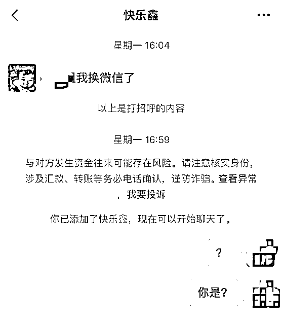
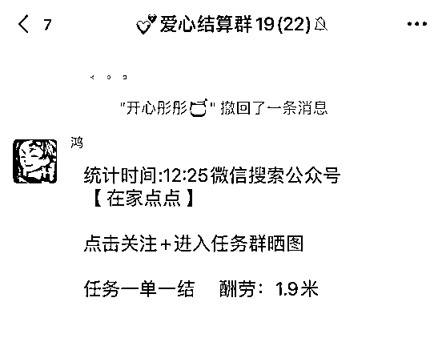
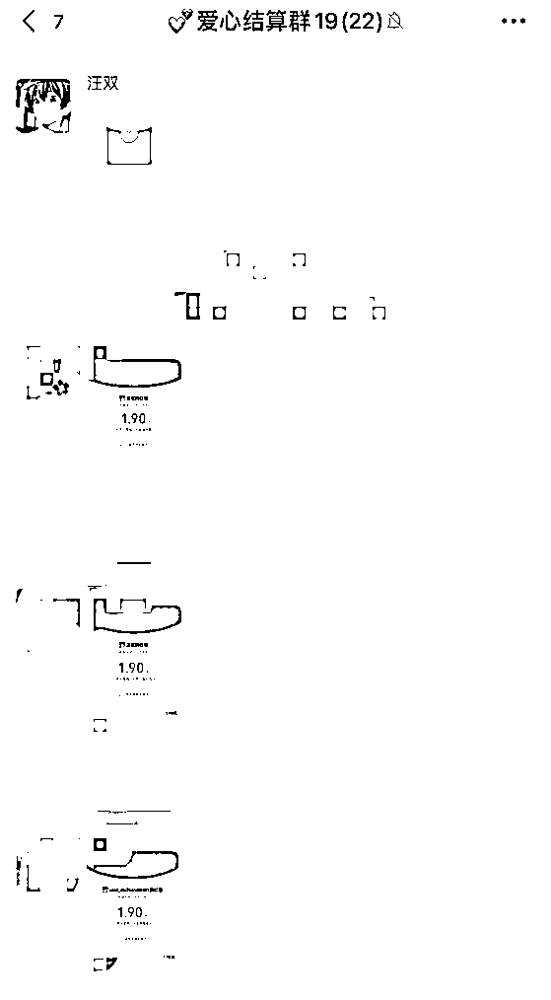
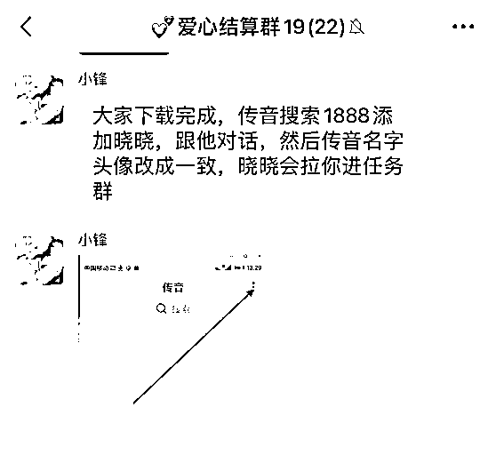
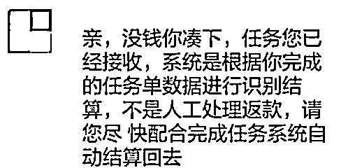

# 下血本！为拉“好兄弟”刷单，他竟把亲妹妹介绍给了对方......

> 原文：[`mp.weixin.qq.com/s?__biz=MzIyMDYwMTk0Mw==&mid=2247508427&idx=3&sn=c52278b2fb3723c895d452d3256d0f59&chksm=97cb6af3a0bce3e594b2cfe7daaadd79384f5b4e2169a260d1f84376dc7b69a023d3854b0922&scene=27#wechat_redirect`](http://mp.weixin.qq.com/s?__biz=MzIyMDYwMTk0Mw==&mid=2247508427&idx=3&sn=c52278b2fb3723c895d452d3256d0f59&chksm=97cb6af3a0bce3e594b2cfe7daaadd79384f5b4e2169a260d1f84376dc7b69a023d3854b0922&scene=27#wechat_redirect)

不知你是否也有这样的感受
微信好友名单里“躺着”几百人
但经常聊天的也就那几个

35 岁的饶某荣就是如此
好哥们王阳
就是他常聊的人之一
也是最积极的一个
感觉无论自己说什么
王阳都能接上话
默契度十足

久而久之
饶某荣都忘 

自己是什么时候添加的这个好友

他打心底里喜欢这个哥们 

直到有一天
……

10 月 7 日 13 时许，王阳向他推荐了一个刷单项目，说是很赚钱，想拉他一起干。

饶某荣虽然心动，但还是有一些犹豫，说自己再想想。王阳也没有过多劝说。

不久后，王阳说知道饶某荣一个人在外打拼也不容易，想把自己的亲妹妹王艳介绍给饶某荣认识，并帮助两人互加了好友。 

“王艳的性格跟王阳一样外向开朗，总是主动找我聊天。”饶某荣很喜欢这个漂亮温柔的女孩子。

平时两人都是聊聊生活，谈谈工作。某天，王艳“无意间”向饶某荣提起自己跟着哥哥刷单赚了很多钱，并兴奋地说刷单赚钱真的又快又容易。

饶某荣彻底相信了对方，并表示愿意和王阳一起做刷单赚钱。

饶某荣在王阳淘宝商铺“玫瑰园鲜花网”内，**下单了总价 3 万元的商品。** 之后王艳把他拉入到一个微信群“刷单赚大钱”，他通过群中的链接下载了**“罗马交易”APP**，并完成了注册。

随后，王艳声称帮他充值了 3 万元的资金，他根据王艳给的信息在该平台内购买了 3 万元的单。

到了 2020 年 10 月 17 日 10 时许，饶某荣再次进入该平台时，显示平台关闭。

饶某荣赶紧到王阳淘宝店铺申请退款。

王阳称平台内部出了点问题，可先给他转 2 万元，剩下的 1 万元等一个月后再转。

可承诺先退回的 2 万元，一直都没有到账。饶某荣时不时就联系王阳催款，但对方总是让他再等等。

期间，王艳也让他别急，钱总会退给他的。

到了 2020 年 12 月 14 日 10 时 34 分，饶某荣再次去催款时，才发现已被两人拉黑，无法联系上王阳及其妹妹王艳。

他感觉事情不对，赶紧四下查找联系方式，这时他才发现自己曾加入的微信群也早已解散，淘宝店铺也查询不到了。

“现在想想，他们兄妹俩可真是用心良苦啊～”饶某荣只能苦笑道。 

**但他们真的是兄妹俩吗？**

**这可说不定**

**骗子常常变换身份**

**一人分饰多角**

**一个人撑起了整部戏**

**所以啊**

**别天真了！！**

**哪有什么漂亮的妹妹**

**都是骗子为了引诱你上套**

**所挖的坑！！**

骗子的伎俩

**骗子假装熟人，加你的微信或 QQ，然后把你拉进刷单群。** 

**** 

**在群里下发刷单任务，并表示马上就能拿佣金，吸引目标群体进行刷单。**

****

**晒兼职收益，晒付款截图，骗取信任。**

****

**先在群里发布小额刷单任务，并立即支付佣金，让受害者尝到甜头。

之后，开始让受害者下载刷单 APP，并在 APP 内建群，下发大额刷单任务。让受害人付出成本不断加大，最后无路可退。**

****

**以“任务单未完成”为由拒退本金是刷单诈骗通用手段。由于此时已经付出巨大成本，所以会越陷越深，直到被榨干。**

****

**对于想回本又没钱的受害者，骗子会进一步介绍网贷平台，引诱受害人下载注册爱你贷款，结果越贷越多。

骗子化身收款人，对受害人进行威逼利诱，甚至言语侮辱，让其身心俱疲** 

所以啊
听反诈侠一句劝： **刷单就是违法，刷不得****！** 对于那些涉及 **提前“交纳定金”、“轻松日赚上百”、“要求先垫付资金”** 等网络信息
一定要做到**“不听、不信、不转账”。** 

来源：昆明反电信网络诈骗中心

← 向右滑动与灰产圈互动交流 →

