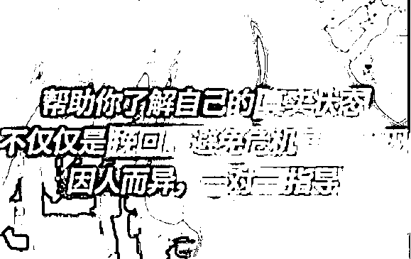
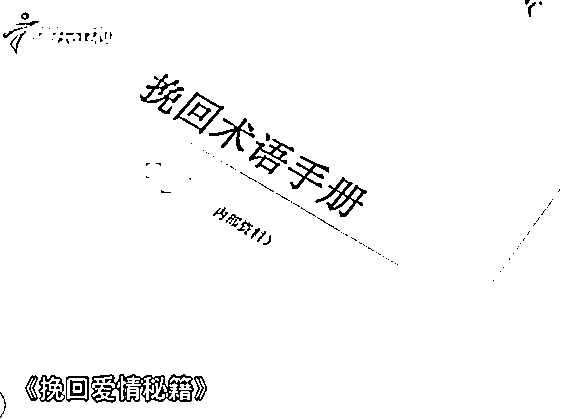

# 调教、洗脑、磨人.....《挽回术语手册》内部资料请勿外传

> 原文：[`mp.weixin.qq.com/s?__biz=MzIyMDYwMTk0Mw==&mid=2247508427&idx=4&sn=d9da1c93e38582f2daedd1c7b40523fb&chksm=97cb6af3a0bce3e591fbc7c9182bb8ee08700c23b63ff61b1d18c9aa8461678844028a566e40&scene=27#wechat_redirect`](http://mp.weixin.qq.com/s?__biz=MzIyMDYwMTk0Mw==&mid=2247508427&idx=4&sn=d9da1c93e38582f2daedd1c7b40523fb&chksm=97cb6af3a0bce3e591fbc7c9182bb8ee08700c23b63ff61b1d18c9aa8461678844028a566e40&scene=27#wechat_redirect)

美好的爱情

是每一个人都希望拥有的

但当大家奔走在追逐爱情的路上时

千万别“踩到坑”！

近日，一名女子为挽回前男友

轻易相信网络上的“大师”

最终被骗近 5 万元......

佛山“95 后”女生小梁（化名）

和男友感情出现问题后分手

可是，分手后小梁却始终忘不了对方

为了挽回这段感情

她尝试了很多办法

但其前男友似乎心意已决

无计可施的小梁正好在网上

看到一篇做“法事”的文章

还附有很多“作法”成功的案例

她仿佛看到了救星

赶紧加了对方的微信

向“大师”倾吐自己的烦恼

“大师”给小梁算了一卦

并表示她和前男友的姻缘线很模糊

建议做“法事”修补一下

当然，这需要支付不菲的费用

**一场法事就得数千元**

模拟对话

此时，小梁心心念念的

都是如何挽回前男友

支付了**约 14000 元**后

便把自己和前男友的

生辰八字、住址等信息都发了过去

等待“大师”作法

一周后，“大师”向梁小姐表示

“作法”效果不是很好

并询问其是不是犯了什么禁忌

梁小姐这才回忆起，自己吃肉破了戒

于是又支付了 1000 多元“认错费”……

事主部分转账记录

就这样

**“大师”以****还情债、斩桃花、放生等名义**

**分 14 次向梁小姐收取了约 4.8 万元**

但前男友仍然没有复合的意愿

而“大师”还在不断要求其付钱

小梁这才发现被骗

立即报警求助

想留住恋人

是许多人失恋后的第一想法

因此一些打着情感挽回为幌子的

“情感导师”、情感咨询机构纷纷上线

图源网络

挽回前任，原地结婚
分离小三，替你分忧
情感挽回率达 98%，最慢 10 天修复感情

他们业务遍布全国，专盯失恋男女 

声称只要交钱就可以挽回另一半的心

除了收取咨询费外

还会一步步套路当事人

忽悠你继续交钱

最近，小欣跟男友分手半年了

可还是走不出来

满脑子想的都是复合 

某一天 

小欣在视频平台看到一些挽回指导视频

视频中的老师自称是

情感咨询领域的高级导师

有丰富的挽回经验，可付费指导挽回

在老师勾画的复合蓝图中

小欣瞬间有了希望

虽然自己辛苦打工攒下来 1 万多元

但感情是无价的，小欣决定试一试

然而，付完费

老师却扔给小欣一份电子资料

美其名曰亲密关系之类的爱情指南

让小欣仔细研读，并在一周内写阅读心得

小欣一心想的是复合，哪有心思读书写作

只希望老师尽快给出方案

图源网络

面对小欣的疑惑和追问

**导师回复消息越来越慢了，而且越来越敷衍**

直到此时，小欣才明白过来

自己可能被骗了，上网一查

才发现类似的情感挽回服务

基本都不靠谱

男友没挽回，1 万多元打了水漂

这真的是一个极其悲伤的故事

这便是打着情感咨询名义的导师骗局

所谓量身定制的“情感挽回方案”

其实就是统一的话术模板

2020 年 10 月

湖北警方破获了一起情感咨询骗局

58 个人把自己包装为情感咨询师

从各种失恋男女中，共计诈骗了 200 多万

而这些所谓的“专业老师”

不少人原本的工作和情感、

心理等学术领域毫无关系

经过公司的“培训”后

就摇身一变成为了“情感专家”

打着情感挽回的幌子大肆敛财

可谓“一本万利”

感情是双方的事情

需要通过沟通来解决

盲目找大师“作法”

或找“情感导师”挽回

结果可能只是交了“智商税”

最贵的心灵鸡汤

都写在无良的情感咨询师的手册里

对于骗子来说

收割这群“痴男怨女”的韭菜“真香”

所以，我们要掌握防骗技巧

炼就识破骗局的火眼金睛

最后，给陷入情感问题

想要挽回的情侣们提个醒

1.心诚则灵，切忌“病急乱投医”，从而选择非法的、没有从业资格的付费情感咨询的机构和个人。

2.遇见机构的多次收费情况要小心，仔细判断是否存在不合理的地方，切忌越陷越深。

3.遭遇诈骗请保留相关证据拨打 110 或到当地公安局进行报警。

来源：中国警察网，利箭在行动

← 向右滑动与灰产圈互动交流 →

