# 手中的快递包别乱扔了！100 万份个人信息被卖 40 亿

> 原文：[`mp.weixin.qq.com/s?__biz=MzIyMDYwMTk0Mw==&mid=2247508499&idx=1&sn=bcbacc2adeedcad692a662fbdb3799bc&chksm=97cb692ba0bce03d6b6975c7080817197b8170d132ecf2db3e06310872f1f316a34f1146af24&scene=27#wechat_redirect`](http://mp.weixin.qq.com/s?__biz=MzIyMDYwMTk0Mw==&mid=2247508499&idx=1&sn=bcbacc2adeedcad692a662fbdb3799bc&chksm=97cb692ba0bce03d6b6975c7080817197b8170d132ecf2db3e06310872f1f316a34f1146af24&scene=27#wechat_redirect)

你听过信息泄露吗？

最近微博上的一个热搜得到了高达 2 亿的阅读量，30 人贩卖 6 亿条个人信息获利 800 万。

这么大量的个人信息被贩卖，到底这些信息被卖到了哪里？用来做什么了？他们是怎么得到的这些信息源？

网友们纷纷感到恐惧和愤懑，到底是怎么回事呢？

1

**花先生的生意**

为了弄清这一系列信息被贩卖的过程，记者首先潜入了所谓的信息贩卖群。

通过记者在一个买卖信息的 QQ 群中卧底熟悉后，终于记者联系到了一名叫做花先生的群主。

花先生向记者透露到自己手上有着大量的个人信息，并且这个群中的很多成员也都是从他手中拿的货。

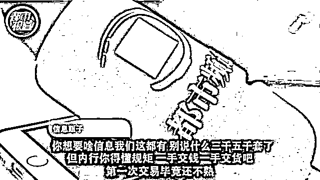

在记者多次表达出想要购买的意图后，花先生第一次跟记者交易就拿出了 5000 多套个人信息，而这些信息里全部都是我们非常重要的个人隐私。

身份信息，身份证正反面，手持身份证照片等等，这些信息涉及到中国的每一个省市，尤其是广西，广东，湖南，湖北等省成为了信息泄露的重要灾区。

当记者为此而感到震惊时，没想到花先生又拿出了自己所掌握的数据。

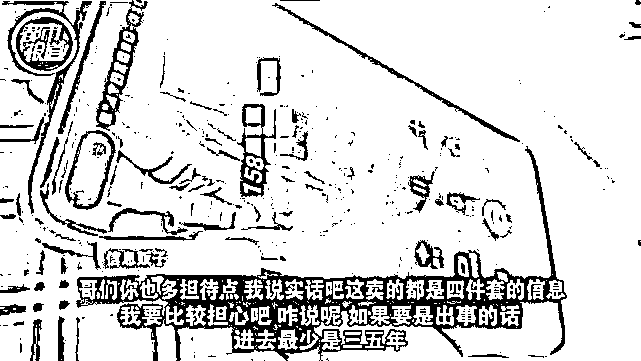

第一笔交易后，花先生给记者的个人信息更加隐秘，这在他们的行业中叫做四件套，并且这次的数量是 100 万套。

一份 4 件套就要 4000 元，这么算一下，100 万套可以卖 40 亿！

所谓的四件套包括：身份证，由身份证办理的手机卡，银行卡和开通网上银行的 U 盾。

之所以 4 件套这么值钱，是因为电信诈骗团伙可以利用他们进行电信诈骗，转账洗钱，逃避打击等一系列的违法犯罪活动。

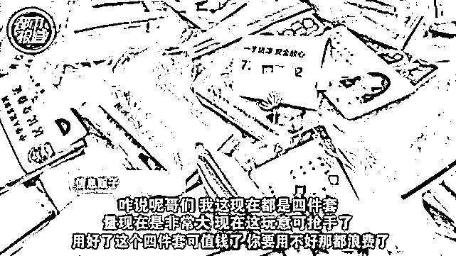

而最开始和记者在微信和 QQ 中进行交易的花先生，由于这一次交易的 4 件套很重要，他要求记者跟他在一个名为蝙蝠的聊天软件中进行。

记者打开软件后翻看了群内的内容，这一看把记者吓了一大跳！

**身份信息，车主信息，快递信息，业主信息，航班信息全部都能被贩卖，群里不仅有中国人，越南人，缅甸人各种境外成员也都混杂其中。**

这里俨然成为了一个疯狂的信息泄露王国。

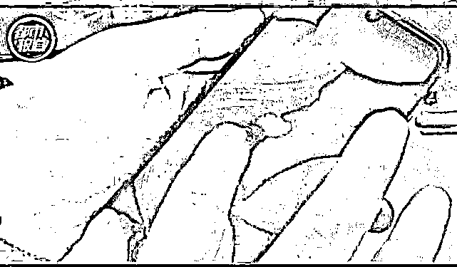

在记者和花先生确定好交易后，定在河南信阳作为取货点，没想到的是花先生高度警惕，进而要求更换取货地点到广西南宁。

为了获取花先生贩卖个人信息的关键证据，记者又连夜赶到了广西南宁。

对方寄过来一个 U 盘，里面是密密麻麻的文件夹，点开一个都有着完整的 4 件套信息，一个文件夹里就有 5 万多条个人信息。

你想买哪个就把哪个拍下来发给花先生，随后他会把实物给你邮寄过来。

这样信息贩卖的过程就完成了。

数以万计的个人信息被转卖到犯罪分子的手中进行着非法交易。

2

**贩卖信息的黑色产业链**

在和信息贩子交易时，记者们发现了一个规律：交易地点大多都在广西南宁。

记者带着疑问继续挖掘，却发现了更大的秘密。

2019 年国内的诈骗团伙转到境外设立窝点，冒充客服，贷款公司对境内群众进行刷单，贷款等电信诈骗。

广西发生**刷单诈骗 2300 多起，贷款类诈骗 5200 多起，成为了****电信诈骗的重灾区****。**

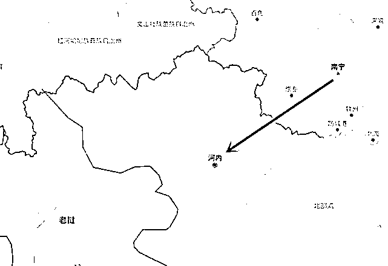

在被警方严厉打击后，这些团伙逃到了越南，老挝，缅甸。

为了交易的便利性，购买个人信息的大客户大部分都隐藏在广西边境地区，购买消息后带出境外，然后卖给犯罪团伙。

随后记者又发现，在邮寄快递的信息中，有一个转字。

根据地质，记者来到了广西凭祥市，在一个物流点，记者见到了一个工作人员。

虽然嘴上说着没有这样的事，但是通过记者的多次试探，这名工作人员还是给了记者指引让记者去凭祥市的物流园，这里表面上的物流业务暗地里却别有洞天。

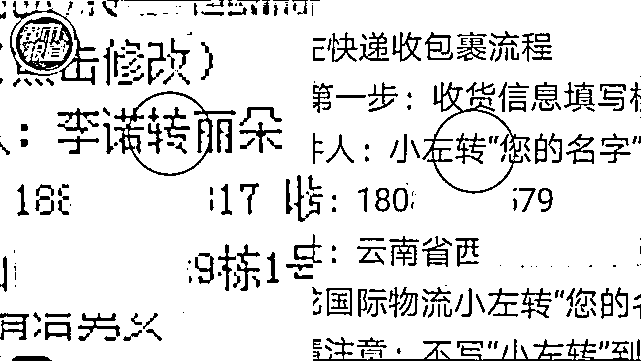

一位老板信誓旦旦的保证：**很多电信诈骗从我这走没关系的，很简单。**

他为什么如此自信呢？

因为这位老板有小路，也就是专门将货帮犯罪团伙带出国门的路。

**说白了，就是走私，这些老板利用和检查人员偶尔查货的习惯和检查人员打游击进而顺利完成出境。**

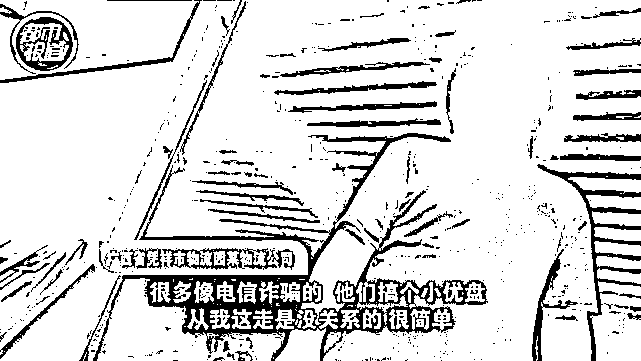

通过记者连续多日的调查发现，这已经成为了个人信息流向犯罪分子的主要渠道，也是为什么这些团伙大多来自境外的主要原因。

但是令人疑惑的是，这些信息到底是怎么来的？

多方打探后，记者联系到了一位专门搜集个人信息的出货者，他自称是软件工程师，开发的软件类似于网络爬虫。

也就是说一旦你在网络上留下痕迹，他们就能搜集到你所有的信息。

利用软件搜集个人隐私，本来就是违法行为，但在他们口中，这仅仅是抓取。

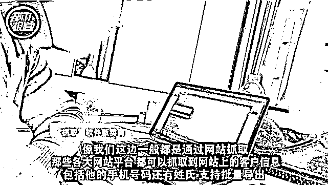

男子打开软件，就开始了搜集程序，十几分钟就能搜集上百条信息。

不仅仅能够搜集信息，还能提供私人订制服务，搜集到的信息进行细加工，你浏览过什么网站，关注的内容，都能轻松地分析出来。

说的直白点，你做了什么都会被记录下来。

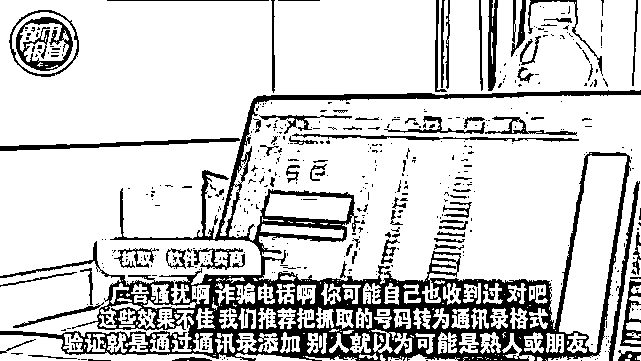

甚至将信息按照区域，职业，年龄整理好信息，在批量转卖出去。

无形中**搜集——倒卖——携带出境，**这样一条贩卖信息的黑色产业链就形成了，而他们心里也清楚这些信息都被用来做了什么。

这些信息大部分都被犯罪分子用于电信诈骗。

3

**严防信息泄露**

隐私泄露在大数据时代对于我们来说并不陌生，**甚至就在我们身边。**

近日内部员工与外部不法分子勾结，导致 40 万公民个人信息被泄露事件引发了社会关注，而作为当事人的圆通快递发表声明并对此道歉。

早在 2013 年就有媒体曝光，有近百万条圆通快递单个人信息在网络上可以被购买到，甚至具体信息还能 24 小时刷新。

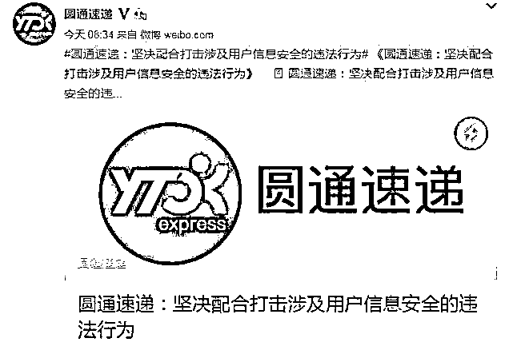

而在近期的督查案中，不法分子仍然与圆通快递多位内鬼勾结，通过有偿租用圆通员工系统账号盗取公民个人信息，在将信息倒卖到不同犯罪人员手中获取利益。

对此，圆通速递称，公司主动发现并且报案，犯罪嫌疑人已经落网。

但是在央视新闻频道《新闻 1+1》中主持人白岩松去发出了辛辣质问：**为什么圆通的回应给人一种我发现的，我报案的，我配合参与全过程的自我表扬感？**

用户在你的平台泄露了信息，你的内部管理出现了严重的问题，尤其在 2013 年就已经出现了信息泄露事件，如今只是道歉未免太过单薄。

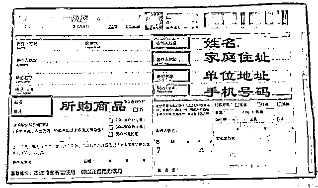

圆通打算接下来怎么整改？后续有哪些措施？怎么给用户一个说法？让用户安心使用你的服务。

治理信息泄露，不仅仅需要一方面的努力。

首先像圆通这样的信息储存平台应该及时监督整改网络安全管理措施，严防用户的个人信息和隐私泄露，及时的改进内部管理出现的严重问题，只有这样才能避免再次出现信息泄露问题。

而行政执法部门更应该跟进类似圆通这样出现信息泄露的平台的处罚，追究他们的管理责任，只有合理运用好法律武器，才能阻止违法行为再次发生。

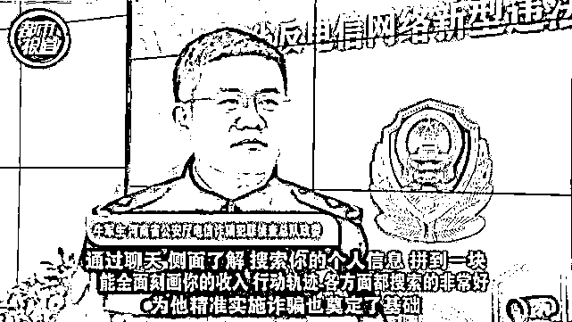

而目前来看，治理个人信息泄露的方法还不够锋利。

虽然有很多关于信息隐私的规定，但是由于取证困难，固定证据也困难，找到相关的违法链条也较困难，所以目前主要靠公安部门每年的专项打击来进行制裁。

而对于我们来讲，个人的信息与隐私一定要仔细保管与小心。

**当遇到让人脸识别，上交身份证件银行卡等重要信息时一定要仔细思虑后再做决定。**

为了保护我们的信息安全，在扔包装前一定要记得去掉快递单上的个人信息！

选择正规购物平台，谨防钓鱼网站，选择正规的快递公司，网购时使用化名。

对于身份证复印件这种敏感证件上要写明用途，简历资料只提供必要信息，不要轻易透露自己的个人信息，遇到不明好友添加，一定要加以小心。

而当我们真的遇到了疑似电信诈骗时，一定要找到警方，多加警惕

**只有用户，平台和执法部门齐心，才能加大打击公民信息的违法行为。**

**严防信息泄露，让我们自由而有隐私的生活在大数据时代！**

来源：安全圈

← 向右滑动与灰产圈互动交流 →

