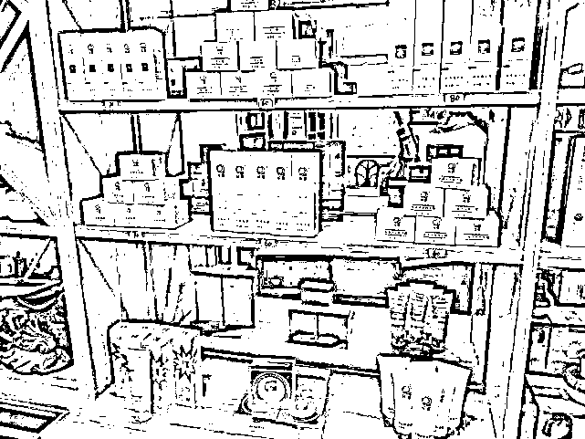
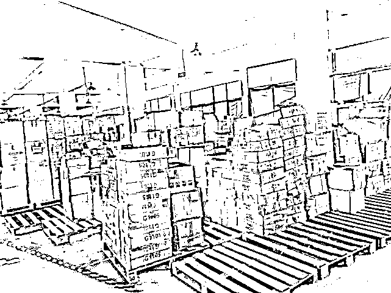
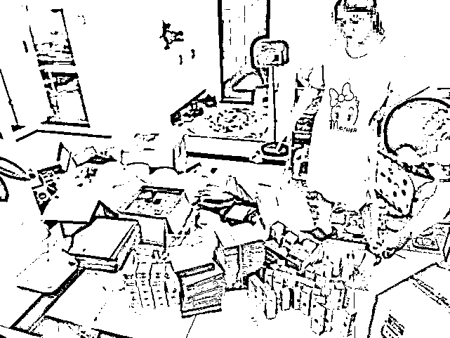
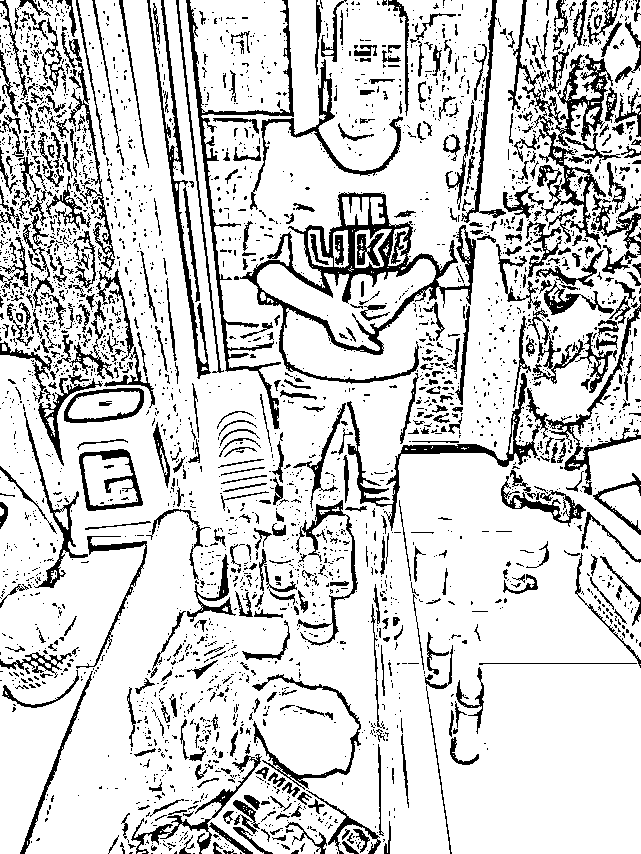
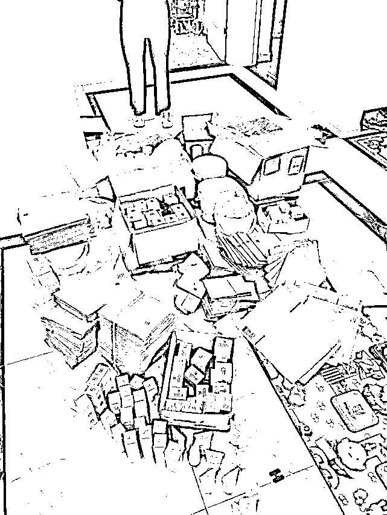
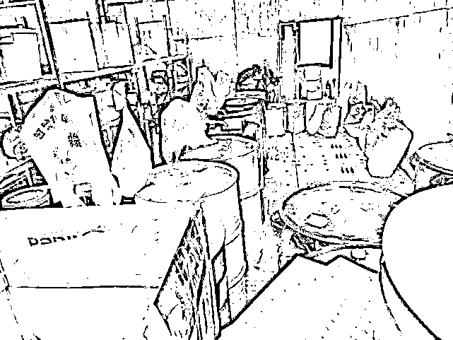
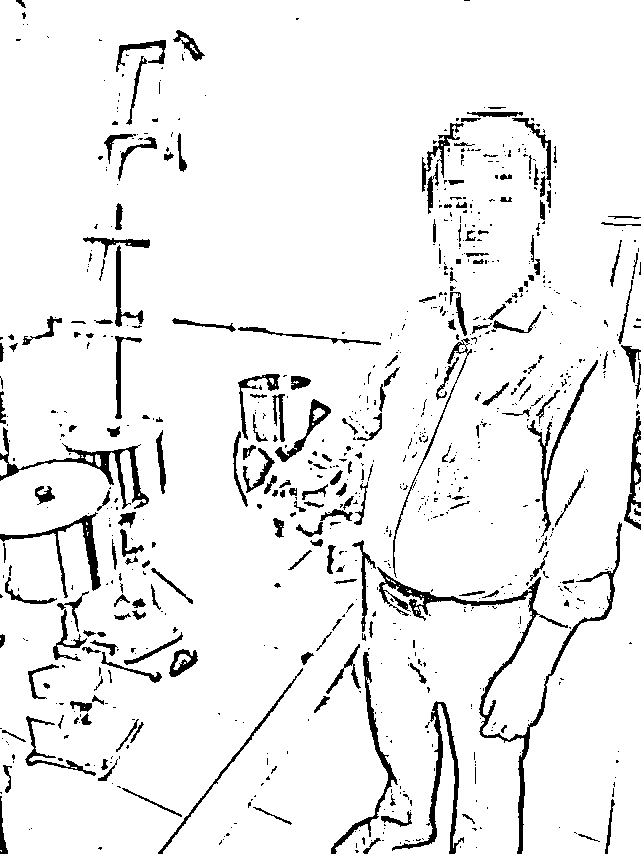
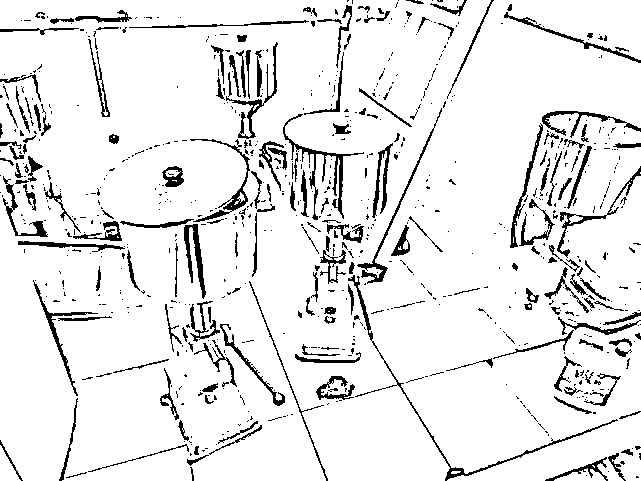
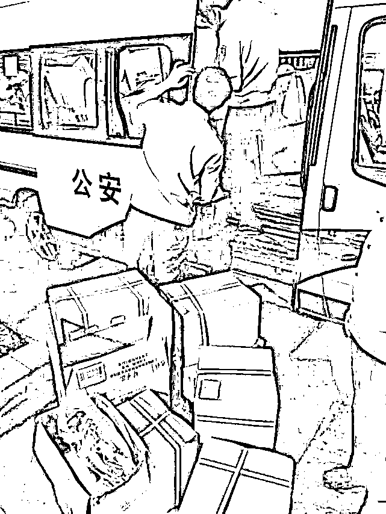

# 网红美容霜竟来自废弃公厕

> 原文：[`mp.weixin.qq.com/s?__biz=MzIyMDYwMTk0Mw==&mid=2247508499&idx=2&sn=44c9e400b38d78efc55dadb5f5207f2c&chksm=97cb692ba0bce03d5fd7643ae272544476c289bf9e6526ea1fbf6744c9039d34d3034baa0002&scene=27#wechat_redirect`](http://mp.weixin.qq.com/s?__biz=MzIyMDYwMTk0Mw==&mid=2247508499&idx=2&sn=44c9e400b38d78efc55dadb5f5207f2c&chksm=97cb692ba0bce03d5fd7643ae272544476c289bf9e6526ea1fbf6744c9039d34d3034baa0002&scene=27#wechat_redirect)

“本想肤如凝脂肌如雪，却不曾想满脸蜕皮，像烧焦了一样，又痛又痒。”去年 8 月底，浙江临海的爱美女士莫莫跟卖家多次协商无果，才把自己捂得严严实实走进了市场监管部门。原来，始作俑者是一瓶在微商圈销售异常火爆的传奇网红美容霜。

近日，临海市公安局会同市场监管部门辗转浙江、重庆、广州、黑龙江等地，行程 10 余万公里，捣毁了以伍家两姐妹为首的重大生产、销售伪劣化妆品团伙，彻底斩断了一条集生产、包装、销售为一体的产业链条，现已采取刑事强制措施 10 人，刑拘在逃 4 人，捣毁制假生产销售窝点 8 个，扣押伪劣“琼曼”、“豪曼”、“伍昱洁”系列美容霜、滋养膏等化妆品 10 万余件，涉案金额 3000 余万元。

1

**生意火爆，供不应求**

**80 后宝妈从经销商摇身一变制造商**

去年 9 月，市场监管部门将该案移送临海市公安局后，临海警方就锁定了一个名叫“幻”的微信账号，该账号通过夸大美容霜功效，发送虚假广告等方式销售“琼曼”、“豪曼”美容霜。事实上，该美容霜没有特殊化妆品批准文号，经专业机构检测，发现其汞含量超了七千多倍。获此线索后，临海警方立即介入调查。民警通过前期调查，发现“幻”是一名 80 后宝妈，名叫包某焕，河南南阳人，大专毕业后到临海打工，认识了现在的老公毕某，两人结婚生子后，包某焕为了照顾小孩辞去工作，并在网上开了一家经营正规化妆品的网店，生意惨淡。

直到 2014 年，包某焕在网上认识了一个名叫伍某琼的女人，经她介绍从其员工盛某处低价购进一些名叫“琼曼”、“豪曼”的美容霜并放在自己的网店上售卖，由于美容霜中含有超标重金属汞及荧光剂，美白效果显著，网店生意突然火了起来。2014 年下半年，包某焕又陆续在淘宝上注册了“曼女郎美妆用品店”、“豪曼美丽之家”、“爱上美肤馆”3 家淘宝网店，并招募了 3 名微商代理，销售“琼曼”、“豪曼”美容霜，生意越做越大，产品供不应求，在巨大的利润诱惑下，包某焕铤而走险，她直接从上家盛某处购入伪劣化妆品原料及外包装，自行包装后通过淘宝、微商平台出售。

2020 年 9 月 1 日，专案组在临海伟星合院将包某焕抓获，现场缴获大量“琼曼”、“豪曼”美容霜及罐装原料、空瓶子等。2021 年 1 月 18 日，包某焕因犯生产、销售伪劣产品罪，被判处有期徒刑 10 个月，没收违法所得 17 万元，并处罚金人民币 10 万元。

2

**利润太丰厚**

**正规公司挂着羊头卖起狗肉**

专案组以包某焕的口供为突破，顺利找到其上线盛某，并通过进一步侦查，顺藤摸瓜找到伍某洁和田某龙夫妇，以及伍某洁的姐姐伍某琼和盛某的妻子邓某容，至此，一个盘踞在重庆山城的家族式生产、销售伪劣化妆品团伙初露端倪。

伍某洁夫妇早在 2010 年就注册了伍昱洁日用化妆品有限公司，依法取得营业执照化妆品许可证，生产销售伍昱洁系列化妆品，生意一直不温不火。头脑活络的伍某洁很快将目光转移到祛斑霜、美白霜等效果立竿见影的护肤品上，但因为这些产品往往汞含量极高，不可能通过合法途径销售，伍某洁夫妇就玩弄起偷天换日的鬼把戏，以伍昱洁正规化妆品公司的名义销售汞含量超标的“琼曼”、“豪曼”美容霜。让人意想不到的是，仅仅两年功夫，伍某洁夫妇就从一名普通商贩发展成为千万富翁，开豪车、住别墅的同时，夫妻感情也因第三者介入而破裂，两人离婚后，伍某洁重新注册了熙妃暄日用化妆品有限公司，令人惊讶的是离异后的两人为了高额的利润仍保持亲密的商业合作伙伴关系，继续明修栈道、暗度陈仓。

2014 年，伍某洁嫌广州原料价格太贵，找到哈尔滨的“唐总”，以一桶 20 公斤 2000 元的价格，购买化妆品原料，在明知检测不合格的情况下，不送检测、不经审批，指使车间直接进行生产、灌装，包装成“伍昱洁”系列祛斑霜、滋养膏等化妆品，并将成品交给其姐姐伍某琼销往下线美容院。盛某夫妇则负责对原料进行生产、罐装，并包装成“琼曼”、“豪曼”美容霜，通过网上销往全国各地。

该公司每个月至少向哈尔滨“唐总”购进原材料两桶，每桶可以生产 500 至 800 瓶美容霜。2014 年至今，已生产销售美容霜 70 万余瓶，涉案金额 3000 余万元。

3

**网红美容霜竟来自公共厕所**

经过大量的工作，并在各有关部门的大力支持下，专案组查清了犯罪团伙的整体组织架构，并锁定了他们的落脚点。11 月 15 日，在当地警方的大力支持下，专案组在重庆某小区将犯罪嫌疑人盛某、田某、邓某等人一举抓获，而伍家两姐妹因为今年的疫情困在加拿大无法归国，专案组将其列为网上逃犯。

令人匪夷所思的是，这些号称美白神霜的传奇美容霜竟然出自废弃公厕，民警在查扣现场看到，杂乱堆放的化妆品原料、污垢厚重的桌子、锈迹斑斑的灌装工具、战斗机一样的蝇虫，还散发着阵阵恶臭。目前，专案组仍在积极对接广州、哈尔滨警方，以更大范围肃清生产销售伪劣化妆品的源头。

来源 | 潇湘晨报综合

← 向右滑动与灰产圈互动交流 →

