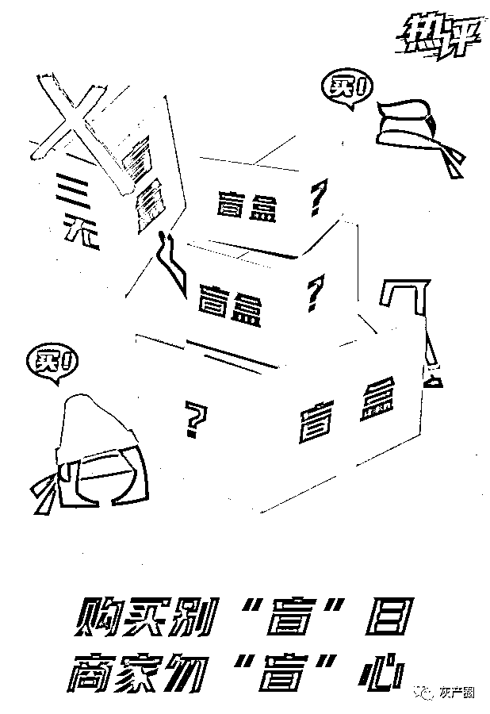
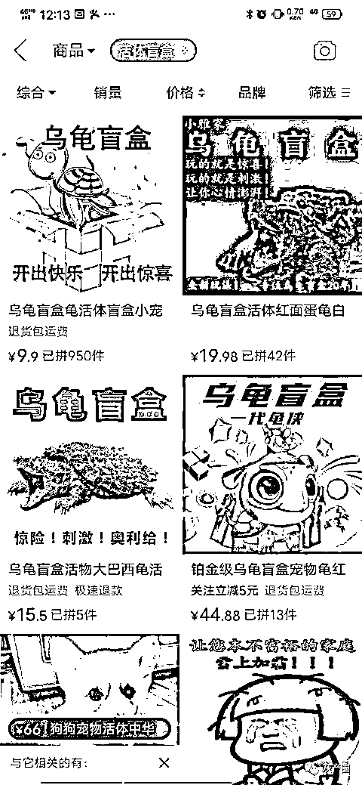
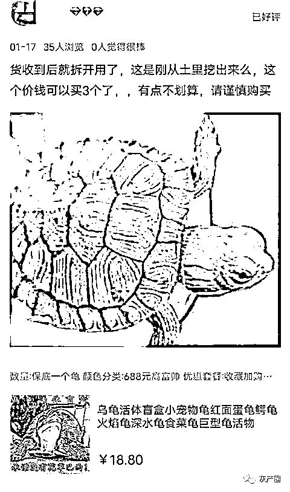
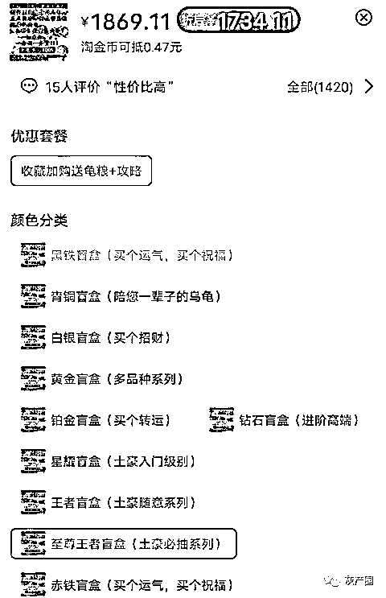
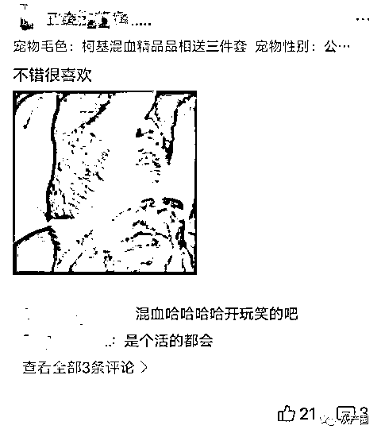
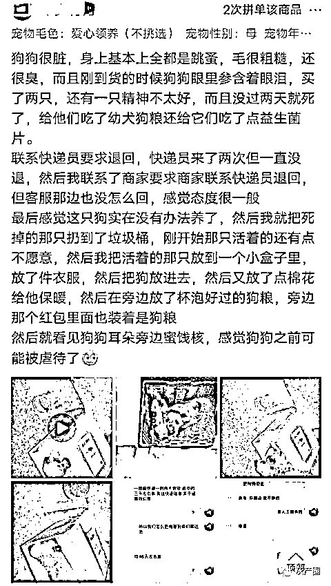
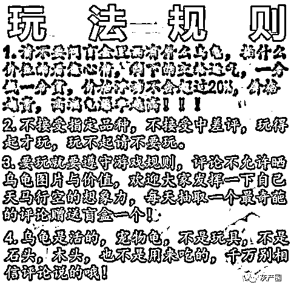

# “一旦售出，不退不换”？！活体动物盲盒乱象

> 原文：[`mp.weixin.qq.com/s?__biz=MzIyMDYwMTk0Mw==&mid=2247508499&idx=3&sn=83be8ba079891ebb345f84ea76d1768a&chksm=97cb692ba0bce03d5696becc64e36a5ad982e016a93d4307794c246014c0f26625a7350022b6&scene=27#wechat_redirect`](http://mp.weixin.qq.com/s?__biz=MzIyMDYwMTk0Mw==&mid=2247508499&idx=3&sn=83be8ba079891ebb345f84ea76d1768a&chksm=97cb692ba0bce03d5696becc64e36a5ad982e016a93d4307794c246014c0f26625a7350022b6&scene=27#wechat_redirect)

" 人生就像一盒巧克力，你永远无法知道下一盒是什么口味。" 因为不确定带来的惊喜感、限量款带来的增值等，" 盲盒 " 近年来在市场中火了起来。

记者近日在网购时发现，除了动漫、影视作品的周边外，一些活体宠物竟然也被放进了 " 盲盒 "，公然售卖。不少商家还牛气地说：" 不接受一切拒收、退换、中差评，玩得起就下单，玩不起千万别买，狗狗是生命，请尊重生命。" 而在网页的评论区，不少买家称遇到了纠纷，维权困难重重。

乱象 1

" 金龟 " 变 " 草龟 "，实际价值低于盲盒价格

" 没死，但是没活力 "" 乌龟小得可怜 "" 就这样吧，意料之中 "…… 在一家网购平台，搜索 " 活体盲盒 "，出现了很多店铺，翻看 " 宝贝评论 "，诸如此类的留言比比皆是。记者发现，目前 " 活体盲盒 " 所售卖的大多是乌龟、狗、猫、鸟类等。

该平台上 " 活体盲盒 " 销量排名第一的是一家卖乌龟的店，月销超过 1000 件。商家的首页宣传图上清晰地写着：中龟率 100%，并承诺没有便宜的龟类。店里盲盒分为 12 个档次，价格从 18.8 元到 1288 元。并且不同的价格还分别取了不同的名字。比如 188 元套餐叫 " 土豪练手 "，最贵的 1288 元的套餐叫 " 一步到位 "。

△盲盒里面价值偏低

△最贵的一个盲盒要一千多元

在评论中，记者发现，大多是 " 还算活泼 "" 不亏 "，很少有说直接赚到的。但更多的买家表示，实际价值要低于盲盒价格。有买了 18.8 元套餐的买家评论：" 基本都是中华草龟和很杂的鳄龟，都是几块钱的龟。不想被骚扰就留好评了，希望在犹豫的人能看到。" 也有购买 688 元套餐的买家表示：" 这个价格可以买 3 个了，有点不划算，请谨慎购买。"

△买家的差评

另一家网购平台，" 活体盲盒 " 大多是狗，有一家店声称卖的是 " 混血柯基 "，价格只有 11.4 元到 59.4 元。记者咨询后，客服说发货还需要支付疫苗费用、包装费用。全款在 165 元 -185 元之间。从买家晒的图片中看到，收到的狗狗柯基的特征很不明显。

乱象 2

不能退也不能给差评，一周之内死亡只退一半钱

即使发现上当受骗，但不能无理由退货，也是活体盲盒的一大乱象。

△买家的差评

记者发现，几乎所有宠物盲盒的商品详情页内，店家都标注了 " 不能退换 "。很多商家还额外标注：不接受指定品种、不接受退换与中差评，评论中不能写是亏还是赚，不能说出是什么品种等。意思就是：品种不能选，买到啥是啥，也不能不要，感觉不值也不能在评论中说。

△卖家的霸王条款

记者随机挑选了一家店铺，买家只能选择公母，看不到任何狗的样子也不知道狗的年龄，价格在 66 元到 158 元不等，目前售出近 2000 件。在店铺首页，店家标注：健康包活、疫苗已做。但评论区里，不少人表示，狗大多都是中华田园犬，而且状态不佳，有的狗收货后一两天就死掉了，甚至有在运货的途中就死掉。但退款之路却困难重重。虽然平台支持 "7 天无理由退货 "，但无一例外，这些商家的商品介绍里都声明：活体宠物不支持 7 天无理由退货。

有买家说，收到的猫不到一周就死了，店家称是买家照顾得不好，和店里无关。也有买家表示，盲盒里根本不是小猫，收到的猫体型较大且性格暴躁，不宜驯服，怀疑是流浪猫。记者咨询店铺客服，客服表示宠物来源都是正规养殖场，问及售后问题，客服表示如果收到货发现宠物已经死了，可以全额退款，一周之内死亡，赔一半的钱，其余情况概不负责。

商家自己给出的种种限制，是否损害了消费者权益？江苏天熙律师事务所律师周小迪告诉记者，不允许评论，不允许晒单，不接受中差评，是限制消费者权益的行为，与网络平台销售规则不符。

乱象 3

通过普通快递邮寄，这在我国《邮政法》明令禁止

记者发现，这些 " 活体盲盒 " 大多是通过普通快递进行运输。但 1 月 22 日，记者咨询了南京多家快递公司，表示想邮寄宠物，无一例外遭到了拒绝。

业内人士告诉记者，事实上，对于活体动物的邮寄，现行规章制度早有说法。我国《邮政法》第三十七条提到，任何单位和个人不得利用邮件寄递含有法律、行政法规禁止的物品。具体到《邮政法实施细则》中，第三十三条 " 禁止寄递或者在邮件内夹带下列物品 " 第六项即为 " 各种活的动物 "。同时按照我国相关规定，如果市民确实需要寄送活体宠物，建议找相关专业物流公司办理活体动物的托运。同时办理托运手续时，应提供检疫部门出具的动物检疫合格证明。

某快递网点负责人表示：" 运送动物必须使用专门的物流渠道，且要有相应卫生检疫证明。混在普通货物之中，动物存在死亡、逃逸等诸多可能，会对其他快件、周围的环境和人员造成污染。"

记者又咨询了之前浏览过的店铺，其中一名客服称检疫合格证明他们都有，但是不提供，随后便不再回复。而更多的店铺回答是：介意勿拍。

记者随后拨打了网购平台的电话进行咨询，客服表示，猫狗乌龟不是违禁品，都可以正常网络快递销售。至于是否可以 7 天无理由退货，客服说，等出了问题后申请售后再看。

来源：现代快报

← 向右滑动与灰产圈互动交流 →

