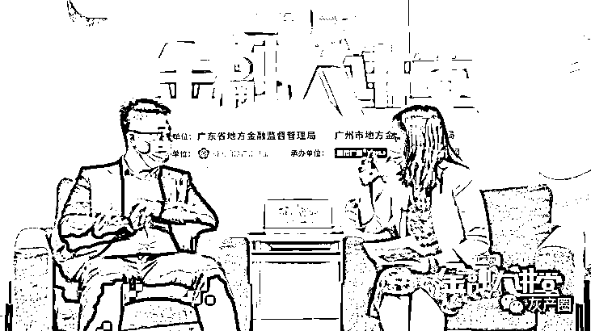
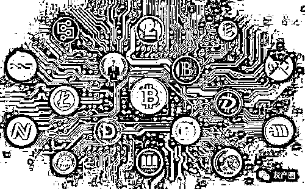

# 如何避免落入虚拟货币骗局？请认真看完这篇文章

> 原文：[`mp.weixin.qq.com/s?__biz=MzIyMDYwMTk0Mw==&mid=2247508499&idx=4&sn=d909c7e2b1cba77564bf91f503fb1ead&chksm=97cb692ba0bce03d030219860d17bcc6f44dbe291b29bd1dbc37934e103a1add105440b8e99c&scene=27#wechat_redirect`](http://mp.weixin.qq.com/s?__biz=MzIyMDYwMTk0Mw==&mid=2247508499&idx=4&sn=d909c7e2b1cba77564bf91f503fb1ead&chksm=97cb692ba0bce03d030219860d17bcc6f44dbe291b29bd1dbc37934e103a1add105440b8e99c&scene=27#wechat_redirect)

**主持人：近年，国内通过发行代币形式包括首次代币发行（ICO）进行融资的活动大量涌现，投机炒作盛行，涉嫌从事非法金融活动，严重扰乱了经济金融秩序，本期节目，我们荣幸邀请到北京市康达（广州）律师事务所高级合伙人伟权律师向大家介绍虚拟货币金融风险以及防范措施。律师，您好。　**

余律师：主持人好，大家好。

**主持人：自比特币诞生以来，特别是近几年，市场上出现了大量的虚拟货币，利用互联网技术进行广泛传播，严重扰乱了货币市场，律师能为我们介绍一下目前我国以虚拟货币涉嫌从事非法金融活动的大概情况吗？**

律师：好的，就我们查阅到的资料显示，近年来，国内以虚拟货币涉嫌从事非法金融活动的案例呈上升趋势，由 2001 年的 2 件到 2019 年 1065 件。从地域分布来看，当前案例主要集中在浙江省、广东省、福建省， 从案由分类情况来看，当前最主要的案由是民事案件，占所有案件的一半以上，其次是刑事，行政。

**主持人：律师能跟我们分享虚拟货币的相关案例吗？**

律师：好的，我们搜索了虚拟货币有关的案例了解到，针对原告因虚拟货币纠纷向人民法院起诉要求对方赔偿损失的案例，法院均驳回了原告的全部诉讼请求。

相关法院均认为，根据中国人民银行、中央网信办、工业和信息化部、工商总局、银监会、证监会、保监会于 2017 年 9 月 4 日发布的《关于防范代币发行融资风险的公告》规定，虚拟货币非我国规定的货币当局发行，不具有法偿性与强制性等属性，不具有与货币等同的法律地位。

因双方买卖的标的物为虚拟货币，故案涉买卖合同应为无效合同，交易造成的后果和引发的风险由投资者自行承担。故对于上述原告的诉请均不予支持。

**主持人：看到以虚拟货币涉嫌从事非法金融活动的案例数据如此庞大，而且对消费者造成巨大损失。律师，您能介绍一下虚拟货币是什么？让我们有效辨识虚拟货币吗？**

律师：好的，虚拟货币是指非真实的货币。知名的虚拟货币如百度公司的百度币、腾讯公司的 Q 币，Q 点、盛大公司的点券，新浪推出的微币（用于微游戏、新浪读书等，2013 年流行的数字货币有，比特币、莱特币、无限币、夸克币、泽塔币、烧烤币、便士币（外网）、隐形金条、红币、质数币。目前全世界发行有上百种数字货币。

**主持人：虚拟货币是货币吗？虚拟货币是否受法律保护呢？**

律师：根据中国人民银行等部门发布的通知、公告，虚拟货币不是货币当局发行，不具有法偿性和强制性等货币属性，并不是真正意义上的货币，不具有与货币等同的法律地位，不能且不应作为货币在市场上流通使用，公民投资和交易虚拟货币不受法律保护。

**主持人：为了让我们更深入的了解虚拟货币，虚拟货币有哪些特征呢？**

律师：虚拟货币有以下几个特征：

1.由某个网络社区发行和管理，不受监管或很少受到监管，特别是不受或较少受到中央银行的监管；

2.以数字形式存在；

3.网络社区建立了内部支付系统；

4.被网络社区的成员普遍接受和使用；（能用作一般等价物）

5.可以用来购买网络社区中的数据商品或实物商品；（拥有交易媒介的功能）

6.可以为数据商品或实物商品标价。（拥有计价功能）

**主持人：目前市场上出现了大量的虚拟货币，那虚拟货币有哪些种类呢？**

律师：虚拟货币一般而言，分为三大种类，即游戏币、门户网站或者即时通讯工具服务商发行的专用货、互联网上的虚拟货币。

游戏币是指在单机游戏时代，主角靠打倒敌人、进赌馆赢钱等方式积累货币，用这些购买草药和装备，但只能在自己的游戏机里使用。那时，玩家之间没有“市场”。自从互联网建立起门户和社区、实现游戏联网以来，虚拟货币便有了“金融市场”，玩家之间可以交易游戏币。

门户网站或者即时通讯工具服务商发行的专用货币是用于购买本网站内的服务。使用最广泛的当属腾讯公司的 Q 币，可用来购买会员资格、QQ 秀等增值服务。这一些虚拟货币与法定货币之间不存在兑换关系，只能够在网络社区中获得和使用。

互联网上的虚拟货币，如比特币（BTC）、莱特货币（LTC）等，比特币是一种由开源的 P2P 软体产生的电子货币，也有人将比特币意译为“比特金”，是一种网络虚拟货币。主要用于互联网金融投资，也可以作为新式货币直接用于生活中使用。这一些虚拟货币能与法定货币相互兑换，还可以用来购买虚拟和真实的商品或服务。

**主持人：好的，通过律师的介绍我们清楚地了解到了虚拟货币的特征、种类等内容，那么虚拟货币会给我们带来哪些风险呢？ **

律师：虚拟货币作为电子商务的产物，扮演越来越重要的角色，而且，越来越和现实世界交汇。然而，在虚拟货币日益长大的同时，由于相关法规却相对滞后，区块链技术的无序发展、不同国家监管安排差异等因素，使得虚拟货币存在着被滥用于主要从事以下犯罪活动的风险 ：

**洗钱风险**

虚拟货币具有去中心化、匿名性、跨国性、交易不可撤销等特点，一直是犯罪分子洗钱的重要工具。犯罪分子可能利用不同国家对虚拟货币的监管差异，通过境内外虚拟货币交易平台将犯罪资金转换为虚拟货币，然后进行不同虚拟货币之间的转换，继而在不同虚拟货币交易平台之间进行货币转移，最后将虚拟货币兑换成法定货币，通过混合使用虚拟货币洗钱和其他洗钱手段，达到转换、转移犯罪资产，实现表面合法化的目的。

**恐怖融资风险**

虚拟货币在一定程度上兼具支付工具和价值存储工具的属性，这使得恐怖分子可能利用虚拟货币进行非法资金的筹集、转移、储存和使用。反洗钱金融行动特别工作组（FATF ）发布的报告显示，执法人员已发现个别恐怖活动组织所属网站呼吁同情者和支持者利用比特币进行捐款，有的极端主义者还在互联网上商量如何使用虚拟货币购买武器，并对不太了解虚拟货币的其他极端主义者进行技术培训。

**逃税风险**

国际社会在对缺乏集中式管理机构或中介机构的虚拟货币予以有效的税收监管以及在适当保护公民隐私与有效防范逃税之间保持平衡等方面，均面临较大的技术难度。虚拟货币由于其自身特点，很容易沦为犯罪分子跨境转移资产、逃避政府税收监管的支付工具与价值存储载体。尽管目前已披露的利用虚拟货币逃税的案例鲜见于媒体，但是逃税与洗钱一直是国际社会较为关注的虚拟货币风险。

**非法集资与集资诈骗风险**

犯罪分子可能将虚拟货币作为非法集资或集资诈骗的支付工具，以投资发行虚拟货币、开发比特币底层技术应用、利用虚拟货币“搬砖”套利等为幌子，进行非法集资或集资诈骗。据不完全统计，自 2016 年以来，中国裁判文书网上公布的以虚拟货币为幌子的传销诈骗案件多达 180 件，涉案总金额高达上千亿元人民币。有的不法分子通过代币的违规发售、流通，向投资者筹集比特币、以太币等虚拟货币， 非法发售代币票券、非法发行证券，从事非法集资、金融诈骗、传销等违法犯罪活动。

**盗窃风险**

虚拟货币的产生、交易、储存均要通过互联网，虚拟货币交易商、虚拟钱包提供商为虚拟货币所有者提供交易账户。在服务过程中，虚拟货币交易商与虚拟钱包提供商可能监守自盗，窃取客户的虚拟货币，黑客也可能侵入客户账户并窃取虚拟货币。

**敲诈勒索风险**

尽管虚拟货币尚未被大多数国家界定为具有财产价值的虚拟商品，但是其使用范围日益广泛，加之转移具有匿名性特点，使得虚拟货币很容易成为犯罪分子从事敲诈勒索的重要目标。

主持人：原来虚拟货币会带来这么多的风险啊，那么针对这些风险，我们要怎么防范呢？

律师：为了防控虚拟货币犯罪风险、维护我国金融稳定和经济安全，我建议 ：

**加深对虚拟货币本质属性的认识**

　　国内迄今为止尚未对虚拟货币做出明确界定，不少人仍对虚拟货币存在错误认识，或者认识不够。2013 年中国人民银行等五部委联合印发的《关于防范比特币风险的通知》指出，通过特定计算机程序计算出来的比特币具有没有集中发行方（去中心化）、总量有限、使用不受地域限制（跨国性）、匿名性等四个主要特点，尽管被称为“货币”，但是由于并非由货币当局发行，因此不具有法偿性、强制性等货币属性，并非真正意义的货币，应是一种特定的虚拟商品，不能且不应作为货币在市场上流通使用，但是可以作为虚拟商品在互联网上买卖。

可见，《关于防范比特币风险的通知》尽管没有对包括比特币在内的虚拟货币做出明确界定，但是对比特币的属性和特征进行了概括。

2017 年中国人民银行等七部委联合印发的《关于防范代币发行融资风险的公告》再次强调，比特币、以太币等虚拟货币不具有与货币等同的法律地位，并明确禁止代币融资交易平台（虚拟货币交易平

[`v.qq.com/iframe/preview.html?width=500&height=375&auto=0&vid=m3100wxur5b`](https://v.qq.com/iframe/preview.html?width=500&height=375&auto=0&vid=m3100wxur5b)

← 向右滑动与灰产圈互动交流 →

