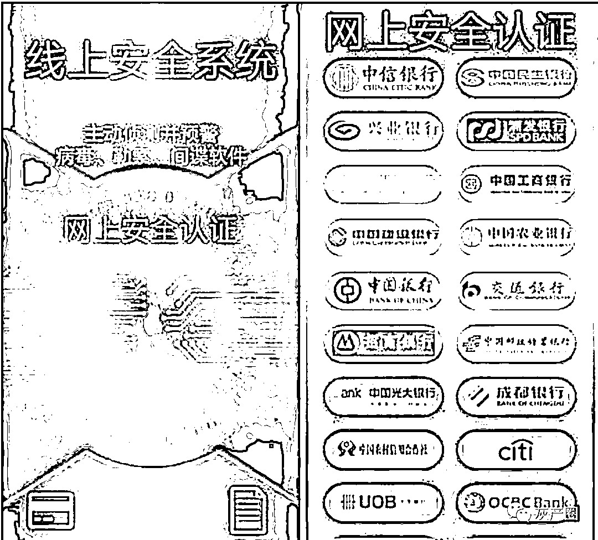
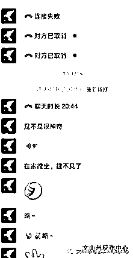

# 安全账户 → 公安 App，骗子套路一变，她又中招损失 50 万！

> 原文：[`mp.weixin.qq.com/s?__biz=MzIyMDYwMTk0Mw==&mid=2247508499&idx=5&sn=d52a5084d0388e1986ae59004f114fc6&chksm=97cb692ba0bce03dc4bcc21154667934c0b2d17301b24ccd707422cfe9c2a5e64b61593fcb85&scene=27#wechat_redirect`](http://mp.weixin.qq.com/s?__biz=MzIyMDYwMTk0Mw==&mid=2247508499&idx=5&sn=d52a5084d0388e1986ae59004f114fc6&chksm=97cb692ba0bce03dc4bcc21154667934c0b2d17301b24ccd707422cfe9c2a5e64b61593fcb85&scene=27#wechat_redirect)

注意！注意！注意！ ***冒充公检法诈骗“升级版来袭***  

 骗子一改***“安全账户”*** 的说辞 伪造出所谓***“公安 App”***  

 套路更具迷惑性
有人已上当 

“你好，我是云南省信通管理局的，你的**身份信息泄露，**在北京**涉嫌洗黑钱，****你的电话号码马上要被限制不能使用。**”1 月 23 日中午，文山州砚山县王女士接到自称是云南省信通管理局打来的电话，称她的银行账户涉嫌诈骗。

王女士一听，慌了，赶紧反驳，“我没有做过这些事情啊！”

****

**对方说需要核实一下情况，并声称有可能是王女士的身份信息泄露。**“你必须配合我们的调查，否则对你和家人都有影响。**我现在给你转接北京市通州区公安局的李警官，他负责跟进为你调查。”** 

**王女士觉得自己身正不怕影子歪，配合调查也无妨。“我一定好好配合，我真的没做过这些啊！”**

**过了一会儿，对方把电话转接到李警官。“你好，我是李警官！现在你涉嫌一起诈骗案件，如果你参与了诈骗就会被拘捕 3 到 5 年，**此案件现属于国家机密需要你做好保密工作，在此期间不能和任何人说，就是家人也不能说。”**** 

**“你现在需要下载**“安全防护”**这个软件，配合我们做初步调查，**你要态度好点，否则我们就要抓你的。**”李警官语气严厉，让王女士感觉事情很严重，内心更加惶恐了。**

**王女士十分紧张地回答道，“我一定保密，马上下载。”**

****

**她一边按照李警官的指示下载注册软件，一边解释警官说自己真的没有诈骗。

李警官表示警方会调查清楚的，并进一步指示道，“你现在录制一段眨眼睛、张嘴、摇头的视频发给我。然后我再给你发个链接，是保障线上安全防护的。”**

****

**待王女士下载好了。对方又表示，“想证明你的清白也不是没有办法，如果你配合我们对你的银行账户进行逐一的核查，假如一切都没问题，那么就能证明你是清白的，**否则你名下的所有存款都会被冻结充公。”**** 

**当王女士按照对方指示,在骗子提供的“线上安全系统”输入所有信息之后，接下来，王女士通过正常渠道查询自己的账户余额，**自己几张银行卡内的钱都已经被转走。当她再和对方联系发现已经被拉黑。**** 

****

**最终，王女士的农业银行、建设银行、农村信用社等三个储蓄账户内**共计 50 余万元被转走。**** 

****

****

****其实骗子冒充公检法诈骗手段
百变不离其宗
最终目的都是让你转钱****

****教你怎么识破各种套路**** 

****一起来康康骗子的伎俩**** 

**0****1****获取信任**

**诈骗分子自称是某某公安机关人员，接着准确说出受害人姓名、身份证号码、家庭住址，甚至是某些更具体的细节（如几时转账多少钱到哪里）来获取受害人信任。**

**0****2****添加受害人 QQ 等即时通讯软件** 

**诈骗分子利用“冻结银行卡”“手机号码停机处理”“勒令到指定地区接受调查”等借口恐吓受害人，为了使受害人恐慌，诈骗分子还会通过 QQ、微信等即时通讯工具发送假警官证照片、假逮捕令、假拘留证，让受害人认定对方“警察”的身份。**

**0****3****加重手段**

**如诈骗分子专业点的，还会为受害人“量身定制”一段视频录像，录像内容大概是两名“警察”在审讯室讯问“犯罪嫌疑人”，“犯罪嫌疑人”清楚说出受害人的身份信息并称其参与违法犯罪活动。**

****

****以前，骗子第四步会诱导受害人转账至“安全账户”，**诈骗分子以受害人不在当地，调查需要一定时间为由，现需对受害人的银行账户进行管控，诱导受害人向诈骗分子提供的“安全账户”转账，直到受害人发现被骗。** 

****现在，骗子的第四步会让受害人安装注册 APP，**让受害人填写银行卡号、身份证号、户名、银行卡预留手机号等信息，将受害人的存款全部转走。
这款所谓的“安全防护”APP 就是一种木马病毒，该 APP 具有拦截并获取其手机通讯录、通话记录及银行卡转账短信提醒信息等功能，账户在进行交易时受害人无法及时获知，致使其财产损失惨重。**

****因此
当接到警察的电话
说你涉嫌诈骗
让你配合调查
你根本无须跟他解释
直接报警**** 

****友情提醒：****

****1.**公检法机关办案会当面向涉案人出示证件或相关法律文书，不会通过电话、QQ、传真、网页等形式办案，更不会让你下载所谓的“安全防护”APP。
**2.**公检法机关不存在安全账户或者核查账户，更不会让公民提现转账汇款。
**3.**电信、医保、公安、检察部门不会相互转接电话。
**4.**要保护好个人信息，特别是银行卡号密码、U 盾相关信息，千万不要透露给陌生人，以防被骗子掌握从而实施精准诈骗。
**5.**如一旦发现被骗，保留证据及时拨打 110，当你无法作出判断自己是否深陷骗局，可以拨打 96110 进行咨询。                                                      **

**来源：文山州反电信网络诈骗分中心、昆明市反电信网络诈骗中心**

********

**← 向右滑动与灰产圈互动交流 →**

****