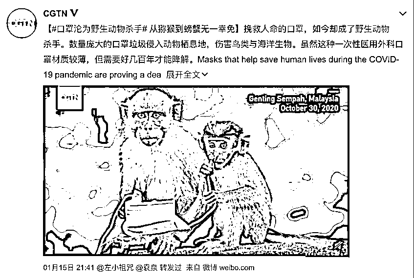
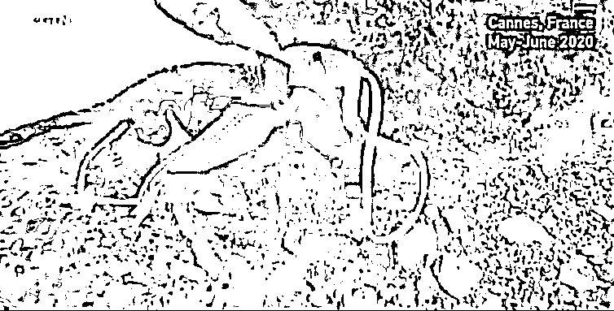
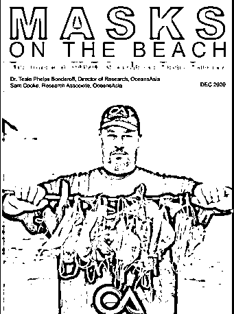
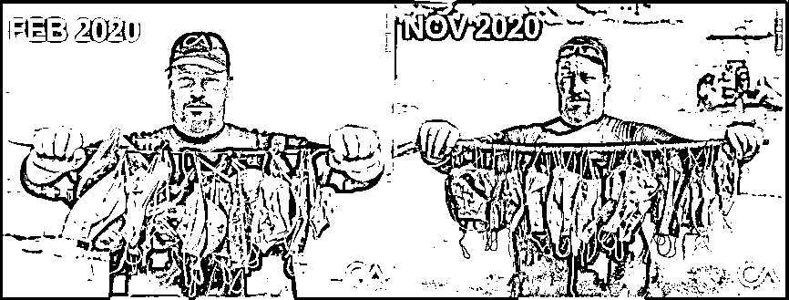
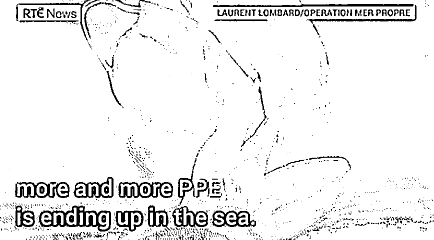
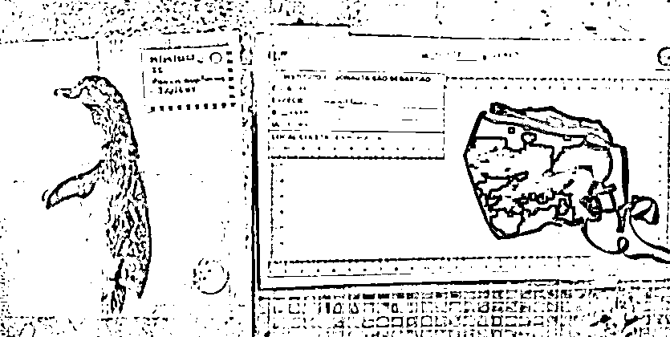
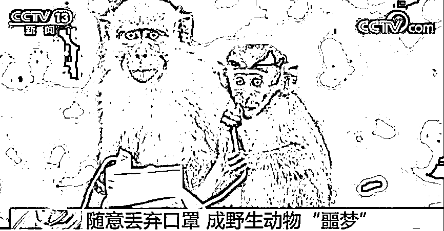
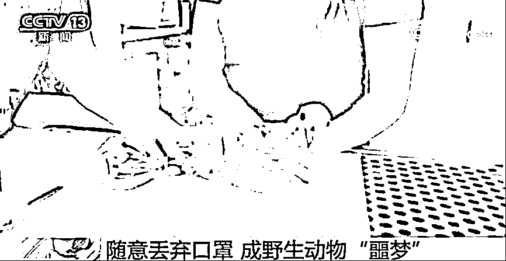

# 你乱扔掉的口罩，最后可能被你吃进身体里！

> 原文：[`mp.weixin.qq.com/s?__biz=MzIyMDYwMTk0Mw==&mid=2247508555&idx=2&sn=dce39f3fc1186042e798a10be8bc184c&chksm=97cb6973a0bce0655262a51f615510e658dfd098d7a2dd027b30709a2982c6d4bf30ca9f8d61&scene=27#wechat_redirect`](http://mp.weixin.qq.com/s?__biz=MzIyMDYwMTk0Mw==&mid=2247508555&idx=2&sn=dce39f3fc1186042e798a10be8bc184c&chksm=97cb6973a0bce0655262a51f615510e658dfd098d7a2dd027b30709a2982c6d4bf30ca9f8d61&scene=27#wechat_redirect)

突如其来的新冠疫情席卷了全世界，口罩也成为大家生活中必备品。公交车上、马路上、医院里，各种各样的公共场合中，人人戴口罩，甚至一个人一天要换多次口罩。

作为预防新冠最有效的手段，口罩成为保护我们健康的重要一环，但随手扔弃口罩，也成为一个值得关注的问题。

有些人，可能会按照正确的方法丢弃，有的人正在随意丢弃。他们可能不会想到，被他们随意丢弃的口罩，会造成什么样的影响。

日前微博上#口罩沦为野生动物杀手#的话题，引起了大家关注。原因就是随意丢弃，使得挽救人命的口罩，成为了野生动物以及海洋生物的杀手。

海洋保护组织 Oceans Asia 此前发现，由于口罩被随意丢弃，在海域中有章鱼躲在废弃口罩下；还有不少海洋生物被口罩左右两边的耳带缠绕而死亡的案例。

2020 年 12 月， 海洋保护组织 Oceans Asia 发表报告称，2020 年全球总共生产了大约 520 亿个口罩，其中至少有 15.6 亿个口罩被乱丢流入海洋中。降解这些口罩需要好几百年，且即使降解也会破坏海洋生态系统。^①

常见的口罩一般由面罩、耳绳和鼻梁条三部分组成。生态环境部固管中心正高级工程师郑洋 1 月 27 日在接受央视采访时指出，口罩分为三层，最外层蓝色的戴在外边，最里面白色戴在脸这一侧，中间是熔喷布，外边两层叫无纺布。虽然名字不一样，但它们的材质是一样的，主要是塑料的成分，由聚丙烯组成，都属于不可降解的塑料。如果把它扔到自然环境中，我们的生物系统，很难把它消化、吸收掉，因此它的降解时间，可能要几十年到几百年。^②

**全球多地现大量废弃口罩**

事实上，全球多地出现了大量的被随意丢弃的废弃口罩。

海洋保护组织 Oceans Asia 人员 2020 年 2 月在索罟群岛海滩发现了大量废弃口罩，而到了 11 月，9 个月的时间，废弃口罩的数量并无减少。

法国某非营利环保组织于 2020 年 5 月在地中海沿岸的蓝色海岸附近发现了大量疫情相关的垃圾废物，包括手套、口罩和洗手液等。

在 2020 年巴西独立日小长假期间，圣保罗海滩上意外出现了一具麦哲伦企鹅尸体。除了营养不良，还在它胃里找到一只致命的黑色 N95 口罩。当地科学家称，这可能是新冠期间首例因为防护用品而死亡的动物。我们有理由相信，这绝不会是最后一例。

在马来西亚吉隆坡郊外的山上，经常会发现有猕猴啃咬被丢弃的旧口罩的带子，对于这种体型小的猴子来说，这样的行为存在潜在的窒息危险。

在英国的切姆斯福德，一只海鸥被口罩带子缠住双脚长达一个星期不能动弹，在救援人员的帮助下才成功脱困。

**你乱扔的口罩，最后可能回到你的餐桌上**

随意丢弃口罩，不仅会对环境及动物产生影响，还会对人类自身造成危害。

上述报告强调，这些随意丢弃的口罩将会产生成千上万吨的海洋塑料污染，然后缓慢降解为直径小于 5 毫米的微塑料。

而这些直径小于 5 毫米的“微塑料”很容易被鱼类吃进肚子，从而进入人的食物链中，对人的身体健康造成影响。我们饮用的水、吃的鱼中都可能有微塑料，微塑料进入身体，却不会被消化，会进入身体的循环系统，对身体带来不良影响。

2018 年，欧洲肠胃病学会首次报告在人体粪便中检测到多达 9 种微塑料，直径在 50 微米至 500 微米之间。这提示我们，微塑料会到达人体肠胃，可能影响消化系统。^③

但会不会积累？我们是否能完全排出去？微塑料是否是造成一些疾病的原因？目前无法给出非常肯定的结论。

但已有部分研究发现，塑料微纤维可以深入肺部并诱发急慢性炎症，较长的纤维更持久，典型的肺部清除机制更难以清除它们。研究发现，某些尺寸和直径的纤维引起大鼠的急性炎症反应，而较短较粗的纤维则未表现出肺部炎症诱发作用。

而让科学家更为担心的是，这些微塑料太小了，足够小到能进入我们的各个器官，而且，它们也可以成为一些有毒化学物质传递的途径，比如塑料中的邻苯二甲酸酯增塑剂、双酚 A 等。

**我们不仅要正确佩戴口罩，还要正确丢弃**

预防新冠等传染性疾病，戴口罩是必须的，许多研究也证实了这一点。

2020 年 6 月《柳叶刀》的研究中谈到，处于风险环境中时，不戴口罩的感染几率为 17.4%，戴口罩后下降至 3.1%，数据主要源于对家庭内部接触以及病例接触者的评估。^④

2020 年《新英格兰医学杂志》刊发了一篇飞沫拍摄实验结果，当志愿者说出“Stay healthy”这个词的时候，空气中会产生大量的直径为 20~500 微米的细小液滴。

说得越响亮时，空气中产生的细小液滴越多。然而，用一块有点湿的毛巾盖住志愿者的嘴巴后，他们再说“Stay healthy”时，产生的细小液滴数量就降到了 0。^⑤

这也说明，佩戴口罩，就可以有效防护飞沫。

这提示我们，不仅要正确佩戴口罩以起到预防作用，还要在口罩使用完后，正确丢弃。

日常生活中，如居民小区、办公场所、商场等地产生的废弃口罩，可作为生活垃圾中的“其他垃圾”收集转运，因为大范围人群没有传染类疾病，口罩废弃后则被视为“其他生活垃圾”进行处理。海洋保护组织建议，如果可以，最好将挂耳绳剪掉后再丢弃。但需要注意的是，要加强对投放和收集设施的消杀工作。

而在医院、病房这样的环境内，口罩要丢弃在专门用于投放医疗垃圾的黄色回收袋当作“医疗废物”回收，进行闭环处理。

来源 ：健康时报，潇湘晨报

← 向右滑动与灰产圈互动交流 →

