# 用数字货币洗钱，警察蜀黍就没招了吗？

> 原文：[`mp.weixin.qq.com/s?__biz=MzIyMDYwMTk0Mw==&mid=2247508555&idx=3&sn=97e549bffe07905b6f8493535a3bdd43&chksm=97cb6973a0bce06535e52ba2080b813fe54b95e3165d07b98806c3eb815a2873a18ff7df99eb&scene=27#wechat_redirect`](http://mp.weixin.qq.com/s?__biz=MzIyMDYwMTk0Mw==&mid=2247508555&idx=3&sn=97e549bffe07905b6f8493535a3bdd43&chksm=97cb6973a0bce06535e52ba2080b813fe54b95e3165d07b98806c3eb815a2873a18ff7df99eb&scene=27#wechat_redirect)

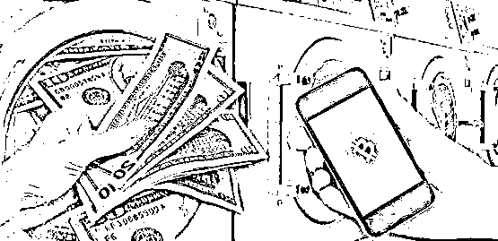

**“我跟你讲，比特币这个东西啊，知道它为什么这么值钱吗？因为洗钱特别方便。”**那天夜里，朋友陈小胖一边撸着羊肉串一边跟我说。

那阵子，比特币价格一路窜到逼近四万美元一枚，尽管距离币圈当初的名言：“一币一别墅，一币一嫩模”还有些差距，但已经差不多能买到一辆特斯拉，于是朋友聚会撸串难免聊到数字货币的话题。

陈小胖来自传统行业，对前沿科技感兴趣，却了解得不深，我觉得他对数字货币的印象，恰能代表很多人。

这种印象，大概和“比特币”、“洗钱”两个词经常在新闻里结伴出现有关。

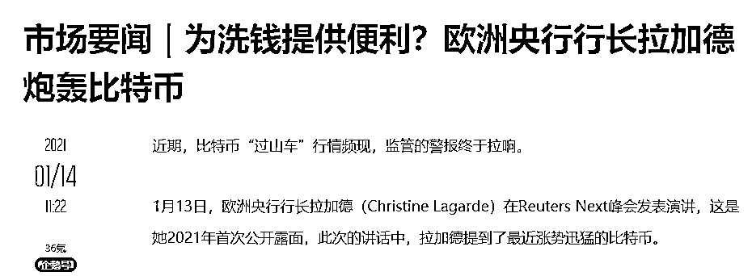

那么问题来了：**既然连你都知道比特币能洗钱，大家还公开聊这个事，那反洗钱机构和执法部门是怎么打击的呢？**靠嘴巴来炮轰比特币吗？当然不是，否则我也不敢写啊哈哈。

说来也巧，2020 年底，我在 CIS 网络安全创新大会上恰好听到一个演讲，主题就是**《虚拟货币时代如何反诈骗和反洗钱》，**演讲者是区块链安全公司 PeckShield 派盾的反洗钱业务负责人李瑞，他们协助警方搞过不少案子，是妥妥的实战派。

今天跟大家分享一下我听他演讲时的一些笔记和感想。如果大家有兴趣，之后有机会再专门去撩一撩。

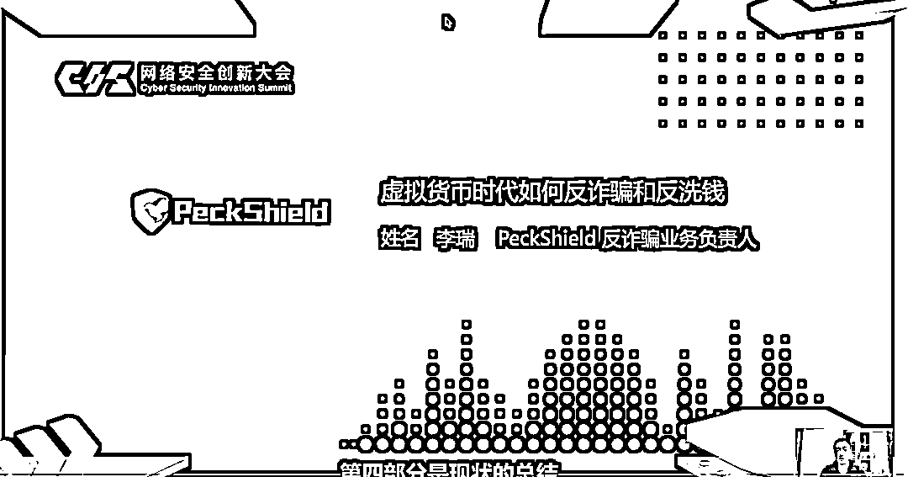

**由于疫情缘故，这是一个线上演讲，右下角就是李瑞** 

**一、为什么数字货币能洗钱？** 

首先我们还是得承认，数字货币确实被一些人拿来洗钱。

而且越来越多的犯罪分子开始从“传统的”洗钱方法转向数字货币。 

比如杀猪盘。（不知道杀猪盘的先看这篇*《[看了 3 天诈骗团伙内训资料，我流下一身冷汗和自叹不如的泪](http://mp.weixin.qq.com/s?__biz=MzU0NDEwMTc1MA==&mid=2247492872&idx=1&sn=4fccfce11c732f105f3757f752105e95&chksm=fb03e111cc7468071e9ca50d70a851e69c120dbb4c536ee3e9a6bb143e8e53aff6ece1631915&scene=21#wechat_redirect)》*）

之前杀猪盘最典型的杀猪方法就是**把受害者引诱到假赌博网站**，2020 年下半年开始，**越来越多的杀猪团伙转向让受害者充值数字货币**（原因后面会说）。

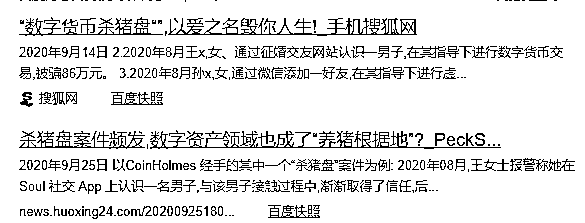

考虑到有一部分浅友对数字货币并不太熟悉，这里先科普了一下**为什么数字货币能用来洗钱**。

李瑞在演讲里给大家总结了这么几个原因：

**原因一：涉及跨国交易，冻结资金难**

法定货币是受到跨国资金管制的。

如果你要把一笔人民币变成美元汇到国外，必须先在银行购买外汇，整个汇款过程是受到外汇管制的，比如有规定一般情况下每年每人只有 5 万美元的购汇额度。

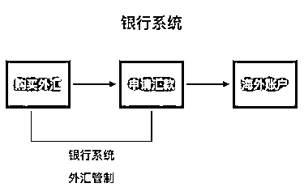

**然鹅，数字货币的账户**（钱包地址）**没有国界概念，也不受外汇管制。**

犯罪分子把一笔境内资产转移到海外，只需要在交易所或者私底下找人换成数字货币，直接转账到海外的（其实不分海外与国内）钱包地址，再在交易所或私底下找人卖成海外的法定货币，中间没有任何技术上的限制。

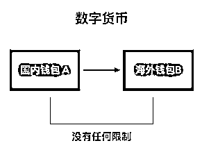

区块链没有国境的概念，所以资产冻结、追回的过程很困难。

**原因二：执法部门缺乏相关办案经验** 

数字货币是一个全新的金融体系，对警察蜀黍们来说，许多以往的法律法规和办案经验都 hold 不住了，需要学习新的姿势。

单就拿**“确定案值”**这件事来说，头一天案子涉案金额还高达几个亿，结果第二天就变成几千万，到最后案件审理时，已经跌成了几毛钱（当然这里只是个比方，实际情况可能复杂得多），换谁谁不懵？ 

从制定到发布一条针对性的新法律法规，需要时间，一线办案人员累积经验，也需要时间，而犯罪分子就可以打个时间差捞上几笔。 

**原因三：匿名的账户体系** 

数字货币的钱包地址都是一串很长的字符，交易双方并不需要知道字符背后是谁，申请钱包地址也不需要实名登记。

**原因四：复杂的交易网络**

由于数字货币的钱包地址非常容易获得，不像银行卡还要用身份证，**一个犯罪团伙在洗钱的过程中可以用程序自动生成成千上万个账户地址，资金来回倒腾**，形成一个迷宫样的“交易网络”，增加警方的追踪难度。

网上甚至还专门有人提供基于复杂交易网络的“洗币”服务。

演讲中，李瑞向观众抛出了一个问题：

****2019 年有多少资产通过数字货币的形式发往海外？****

****答案是 114 亿美元。**********这还仅仅是 PeckShield 派盾基于他们公司自己统计到的数据。还有多少没统计到，谁知道呢……******

那么，难道反洗钱的一方遇到数字货币就束手无策了吗？当然也不是。

 **二、咋整** 

这几年，派盾协助警方打击过不少数字货币洗钱案和诈骗案，李瑞总结了他们的几个反数字货币洗钱的套路。

**1）地址标签——给数字货币“去匿名化”**

尽管数字货币的钱包地址只是一串字符，很难直接知道背后的实体是谁，但由于大部分数字货币交易还是得基于现实世界的活动，所以总能找到千丝万缕的联系。 

**数字货币有一个特点：所有交易都是公开可查的。**

每一种数字货币都相当于是一块面向全世界所有人的“大黑板”，上面写着每一笔交易，任何人都可以随时查看。

“地址‘叽里呱啦’转账了 0.00457941 个 BTC 到‘噼里啪啦’，手续费是……时间是……”每一笔都记在区块链上。

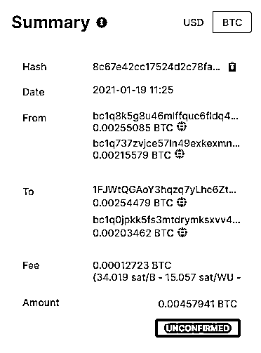

**虽然没法知道某个匿名地址背后的人是谁，但是我们可以给所有暴露出来过的地址打上“标签”，把相关的信息记在小本本里，当信息多到一定程度，就能串联起来形成线索。**  

比如 2017 年席卷全球的 WannaCry 勒索病毒，勒索者留下一个比特币钱包地址：

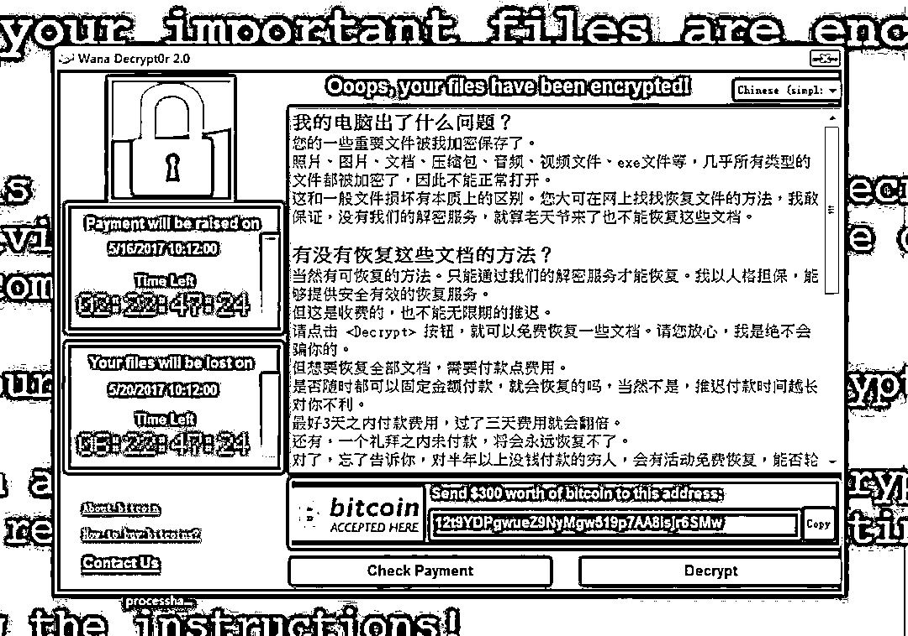

“嗯，这个地址是勒索团伙的，记上了。”

再比如你跟隔壁老王做过一笔数字货币交易，交易过后，你也可以悄悄记在小本本里：“lqrscjsyqzzzmm……这个地址是隔壁老王的，记上了。”

当你的“小本本”里记录的地址越来越多，记录的信息越来越丰富（不光可以记录地址是谁的，也可以记录它的风险评级、余额、交易情况等等，各种有用没用的信息都可以记上），你掌握的数据也越来越多，然后你就可以拿它去帮助警察蜀黍查案啦~ 

某一天，WannaCry 勒索团队的地址向某个神秘地址转了一笔钱，而你翻出小本本，发现这个地址竟是隔壁老王的……于是你就可以向警察蜀黍提供线索，送老王一程。

**总之，只要给一个地址打上足够多的标签，就能慢慢勾勒出这个地址背后实体的画像，实现“去匿名化”。**  

李瑞说，截止到 2020 年 11 月底，他们维护了一个庞大的区块链地址标签库，里头大概有 1.1 亿个地址，其中超过 6500 个比特币地址，3500 万个以太坊（ETH）地址，并且这些地址覆盖了市面上主流的 50 家交易所。

于是，当警察找他们协助调查一起诈骗+洗钱案，现实情况很可能是这样的：

起初警方只拿到一个数字货币钱包地址，但不知道背后是谁，于是到派盾的标签库里一查，发现这个地址来自“水币交易所”，于是警察就可以直接拿着相关文件找到水币交易所的相关负责人，要求调取注册账号时的身份信息和银行卡记录等等，顺藤摸瓜找到犯罪分子的真实身份。 

当然，交易所的账号也许也是犯罪分子用“四件套”冒用他人身份注册的，但这又是另一个问题了。 

**总之，给数字货币地址打上足够多的标签，就能让它“去匿名化”。**

**好奇读者**：“o(*^▽^*)┛脑湿脑湿，那犯罪分子也不是傻子，赃款最后不进交易所卖掉，而是私下找人卖掉，是不是就查不到了？”

犯罪分子的确可以不进交易所，直接走“场外交易”—— 张三有钱，李四有币，一手交钱，一手打币，并且现实情况中，的确有很多人专门当“场外币商”协助洗钱。

这也是有办法的，此处先留一道思考题，后面我们会结合一个实际案例给大家讲讲原因。

我们回来接着说追踪技术。

光是打标签肯定是不够的，因为这个地址标签库会越来越大，查起来会非常麻烦，这些数据就像是石油的原油，需要另一个工具把有用的部分提炼出来，所以我们需要祭出第二个法宝：**“智能追踪工具”**。

它可以对这些标签数据进行结构化处理——把这些数据有条有理地梳理清楚，并且可以从一个地址出发，一层一层地筛选出最可疑、最有价值的地址。

为了让人类理解经过机器处理的数据，以及方便警方查案和取证，还得有一个**“可视化资金流向工具”**把整个过程用图的形式呈现出来。

这里用到了图数据库和人工智能等一系列技术，今天就不展开了。直接上图让大家感受一下：

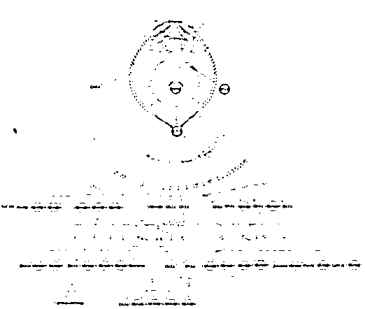

**（照片有点糊，感受个大概意思就好）**

哪怕你完全不懂技术，应该也能看出**中间那个红色的点和橙色的点最可疑**，因为有大量钱包地址最后都跟他们连着。 

**三、案例**

听了一堆理论，实际情况这套方法能不能帮忙抓到诈骗和洗钱的坏人呢？李瑞说了几个案例：

**1）假冒名人忽悠案**

第一个案例发生在 2020 年 7 月，当时美国前总统奥巴马的社交媒体账号忽然发消息：“疫情期间感恩大回馈，往下面这个地址打 1000 美元的比特币，我会回馈你 2000 美元，消息 30 分钟内有效，走过路过不要错过…………”

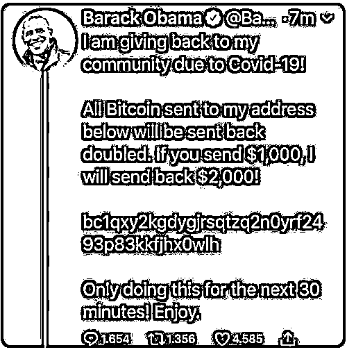

说来也巧，几乎在同一时间，比尔盖茨也发了一条类似的消息：“大家总让我回报社会，现在是时候了，我会让所有打到我的 BTC 账户上的钱翻倍，你打过来 1000 美元，我还你 2000 美元，30 分钟内有效~”

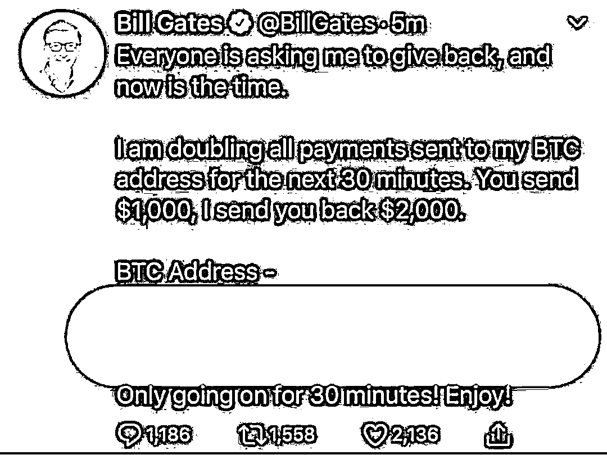

除此之外，时任副总统的拜登、当时的世界首富亚马逊掌门人杰夫·贝索斯、特斯拉创始人伊隆·马斯克……一票美国知名人士纷纷玩起了感恩回馈，仿佛串通好了似的。

傻白甜们纷纷把钱打过去，才发现这些名人被一个黑客团伙盗号了。

尽管骗局看起来而简单，早在几年前就已经出现过，可上当受骗的人依然远远超出想象，短短几个小时，超过十万美元的比特币被打到骗子的钱包地址。

李瑞告诉我，这个案子有些特殊，首先对方本身就是黑客团伙，能盗走这么多名人的社交媒体账号，搞出这么大动静，说明技术不赖，通常会备好洗钱的后手。

其次是单笔诈骗的数额不大，绝大多数都小于 0.14 个比特币，犯罪团伙收到钱之后还利用大量地址进行混淆，极大提高了执法机关的查案成本。

可最后 FBI（美国联盟调查局）还是把案子破了，怎么做的呢？

根据公开出来的消息，他们一层一层梳理洗钱的脉络，抽丝剥茧，发现其中有一笔钱进了美国知名数字货币交易所 Coinbase，于是他们从交易所调出身份信息，再配合其他手段，最终锁定嫌疑犯。

**2）搬砖套利案**

第二个案例发生在国内，也是 2020 年 7 月份前后曝光的。

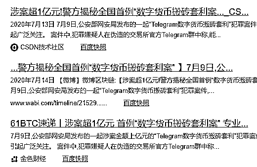

套路本身并不复杂，诈骗团伙先散布消息，说数字货币的市场价格波动很大，由于交易所之间的价格不同步，可以从中“搬砖套利”，忽悠大家打币。

傻白甜们一听，以为自己咸鱼翻身的机会到了，也没认真想过，真有这么好的赚钱机会，人家干嘛要带上你？

起初，诈骗团伙真的给受害者返现，以骗取信任，可是当受害者一次性存进较多的钱时，骗子就不再回应。 

根据新闻报道，这个团伙同样非常“技术流”，他们利用机器人在聊天软件 Telegram 上创建了十几万个“搬砖套利群”，然后用客服号和假账号作托，在群里一顿忽悠。

从发布消息到引导用户注册、转账，再到销赃，全程自动化。

当警察抓住并审讯他们时，二号主犯还一直问：“怎么找到我们的，是哪个钱包出问题了吗？”——他们以为作案流程滴水不漏，不相信警方能找到证据。

整个洗钱过程的资金流向虽然不复杂，却也有点难描述，大家看个图感受一下就好……

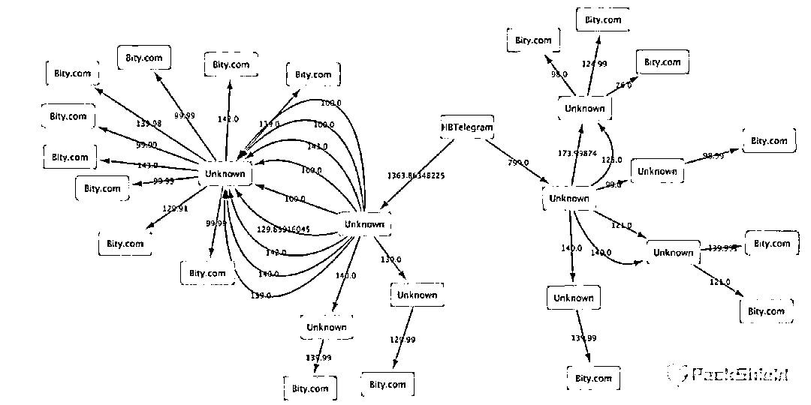

虽然最后破案的技术细节警方没有透露，但协助破案的区块链公司的负责人说的一句话耐人寻味：**“区块链的神奇之处在于，能完整地把你的历史记录下来，即使你现在很谨慎，但是不能保证未来不会留下破绽。可能你现在没有犯错，但你早期犯下的错，还是会被永久地写在区块链上。”**

**3）杀猪盘** 

2020 年 8 月，王女士报警称他在聊天软件 Soul 上认识一男子，聊了一段时间，诱导她购买了价值 3 万元的 USDT 币，充值到男子推荐的交易平台，卖出 3.5 万元，获利 5 千元。

于是王女士又陆续购买价值 30 万元的 USDT 币，直到对方声称需要缴纳 25 万元税费，王女士才发现被骗。

这个骗局的洗钱过程是怎样的呢？同样很难描述。

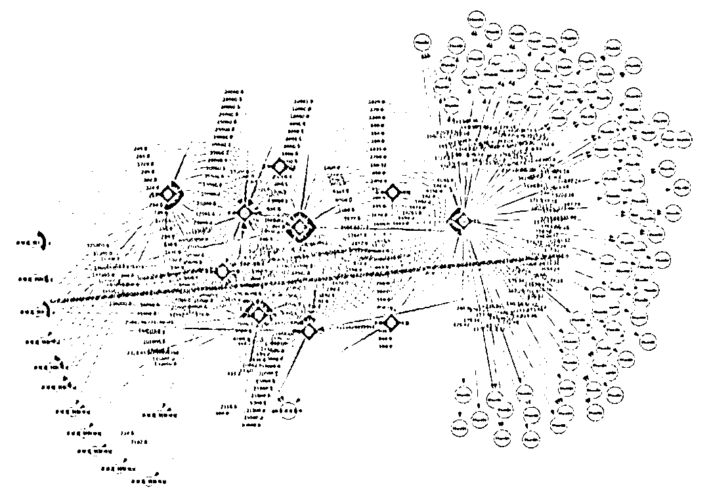

我在派盾的官网找到他们梳理的案件流程图： 

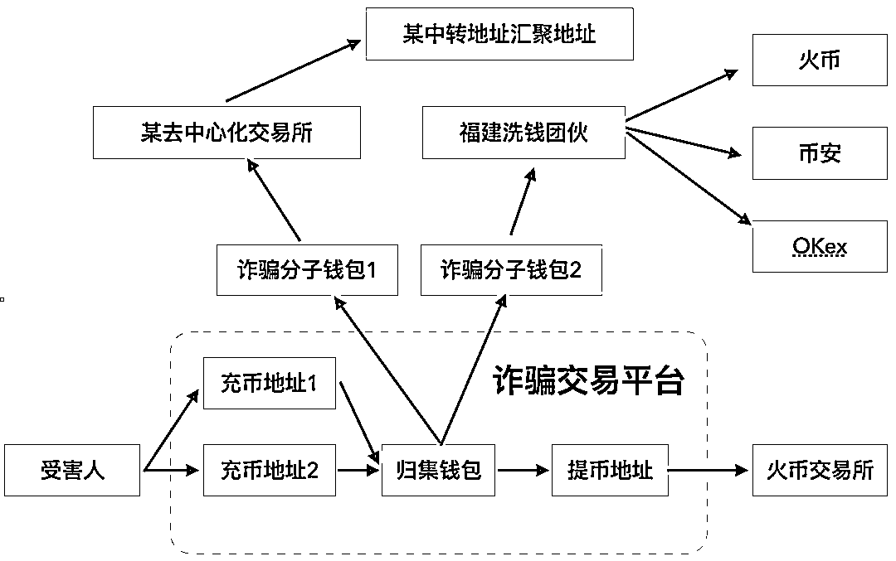

下面那条蓝色箭头的流程是用来“养猪”的，即骗取受害者信任，当受害者给“归集钱包”打过去一笔币，会受到更多的币。

上面这条红色箭头的流程是用来“杀猪”的，当受害者把一大笔钱打过去，骗子就不再返还。

**4）电信诈骗+场外币商洗钱**

这个案例可以解答前面留下的思考题：如果洗钱团伙不走交易所，而是私下交易，怎么办？

派盾他们协助河南漯河警方打击过一个电信诈骗团伙，一开始顺着资金流向找到一个交易所账户，可是很快就发现注册信息是冒用的。

但随后他们又发现，这些钱以 USDT 币的形式进了一个“场外币商”的钱包。

按照正常流程，这个“场外币商”会帮他们把 USDT 币撮合交易成法定货币，再打给犯罪嫌疑人。

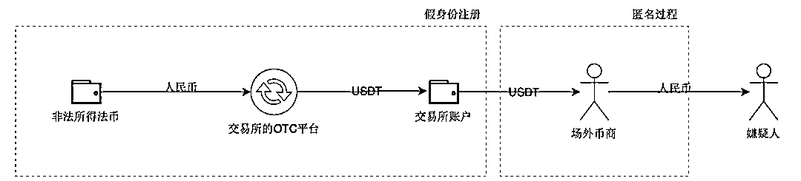

于是警方把突破口放在这个场外币商身上。

此处省略 1000 字，警方最终找到这个场外币商，让他交代出跟诈骗分子的联系方式，然后通过聊天工具定位控制住犯罪嫌疑人。

**四、一些感想**

李瑞说，犯罪团伙转向数字货币的一个大原因是**2020 年国家加快了《反洗钱法》的修订进程，并且在****全国范围进行“断卡”行动。**

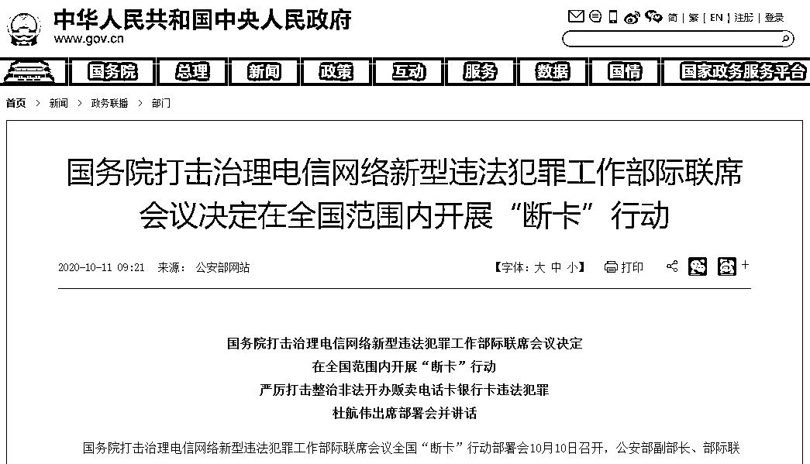

大家可以自行了解断卡行动，断卡行动就是为了打击那些收受好处，协助罪团伙开银行卡、电话卡的行为。 

**“今年（2020 年）8 月份，涉及数字货币相关的案件数量超过了 2019 年全年。”**李瑞在演讲里提到的这个数据让我非常吃惊。

我意识到，**犯罪分子转向数字货币，某种程度上正是因为他们旧的洗钱犯罪渠道正在被封堵，以至于他们不得不寻求新的出路。**写这篇时，我正好看到一则新闻，银行开始在 ATM 机上用人脸识别技术来封堵诈骗和洗钱：

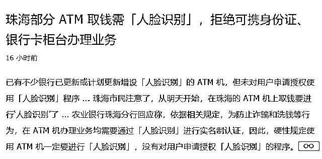

但犯罪、洗钱团伙是活的，他们永远都会寻找新的洗钱方法，过去用投资，用假冒的银行卡，用电话费和游戏点券充值……现在转向数字货币，未来他们一定也还有新的手法，昨天利用互联网，今天利用区块链，也许明天还会用人工智能、云计算……任何一种新科技都可能被坏人利用。

我们要做的不是“炮轰”新技术，因为发展的问题总得靠发展来解决，而不是靠历史倒退。

犯罪和打击犯罪，洗钱和反洗钱永远是不断升级的攻防战，没有一劳永逸，所有现状都是暂时。

面对问题，我们能做的永远都是继续推动历史车轮，滚滚向前。

← 向右滑动与灰产圈互动交流 →

