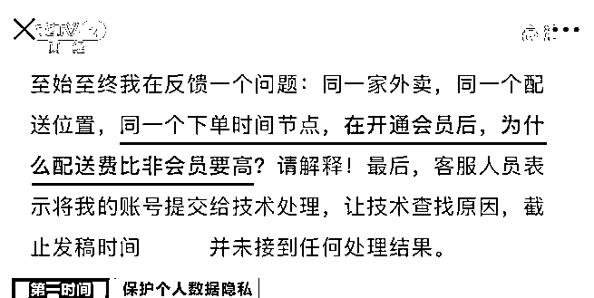
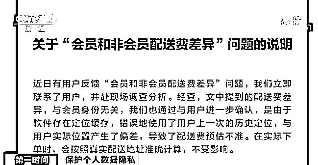
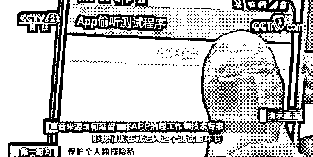
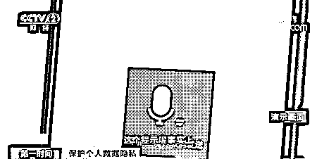
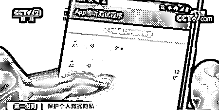
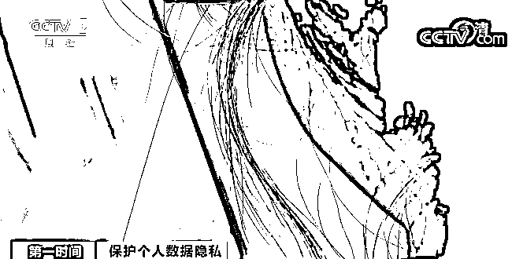
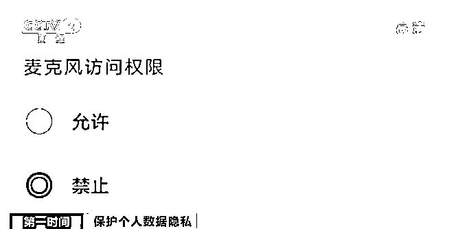
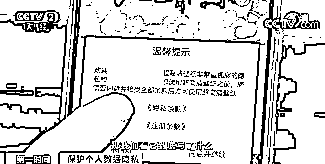

# 开了会员，配送费却猛涨 3 倍！“杀熟”又出新招？App 会“偷听”吗？实验结果令人震惊→

> 原文：[`mp.weixin.qq.com/s?__biz=MzIyMDYwMTk0Mw==&mid=2247508555&idx=4&sn=6d779b5a5c9e47ef2fb4172cb26947d7&chksm=97cb6973a0bce065ffa3916a51f6eaedd17cd8b844b72fb96c3a655f528722a25e922ed294e3&scene=27#wechat_redirect`](http://mp.weixin.qq.com/s?__biz=MzIyMDYwMTk0Mw==&mid=2247508555&idx=4&sn=6d779b5a5c9e47ef2fb4172cb26947d7&chksm=97cb6973a0bce065ffa3916a51f6eaedd17cd8b844b72fb96c3a655f528722a25e922ed294e3&scene=27#wechat_redirect)

进入大数据时代，很多人都有这样的经历，**并不是旅游旺季，机票价格却越搜越高**；**聊天时随口提到某款商品，一转身就在各大平台上看到相关商品的广告推送**。

在网络时代，我们能很快地找到自己想要的信息，但自己的信息数据却似乎也更容易被泄露，或在不知情的情况下被商家非法利用。

**1**

**大数据“杀熟” 会员配送费高于非会员**

[`mp.weixin.qq.com/mp/readtemplate?t=pages/video_player_tmpl&action=mpvideo&auto=0&vid=wxv_1718117643615797249`](https://mp.weixin.qq.com/mp/readtemplate?t=pages/video_player_tmpl&action=mpvideo&auto=0&vid=wxv_1718117643615797249)

△央视财经《第一时间》栏目视频

不久前，一篇质疑某外卖平台运用算法进行“杀熟”的文章引发热议。该平台的一位会员用户指出，**同样的订单，他的配送费定价时常比非会员用户的更高。**

**肖先生**：经常点同一家的外卖，忽然有一天我开了会员之后，**发现配送费价格一下较之前涨出三倍**。开了会员之后，反而比非会员价格还要高，那我开会员的意义在哪。

文章引发热议后，相关外卖平台联系了肖先生，针对他提出的质疑，平台方给出的回复是：**配送费上的价格差异是由于系统缓存而导致的误差。**

**肖先生**：我尝试了很多次，在一周之内都是这种情况。缓存的说法肯定说不过去。何来的位置缓存呢？在同一个地方，差异就是存在于会员和非会员之间。

据中消协介绍，消费者对“大数据杀熟”等问题投诉不断增多，问题的核心是互联网平台对算法技术的应用问题，集中体现在推荐算法、价格算法、评价算法、排名算法、概率算法和流量算法等方面。

**中国消费者协会投诉部主任 陈剑**：可能经营者对消费者进行精准的个人数据画像。这种画像相关的商品和服务只推荐给了他，所以他所获取的知情权存在很大的缺陷。 

**2**

**平台累积大量个人数据**

**“算”制用户画像**

基于大数据的用户画像，能让商家摸清你更爱吃辣还是吃酸，并通过算法把更符合你口味的餐厅排序靠前。用户数据，往往是通过一个个手机 App 被互联网平台采集的。

在与 App 打交道的过程中，同样也有令大家担忧的问题不断出现，比如“App 偷听”现象，**“App 偷听”是否存在呢？来看技术专家做的测试。**

[`mp.weixin.qq.com/mp/readtemplate?t=pages/video_player_tmpl&action=mpvideo&auto=0&vid=wxv_1718127000336269334`](https://mp.weixin.qq.com/mp/readtemplate?t=pages/video_player_tmpl&action=mpvideo&auto=0&vid=wxv_1718127000336269334)

△央视财经《第一时间》栏目视频

**App 治理工作组技术专家 何延哲**：假如发一个语音，当手松开了以后，这个录音事实上还在继续。 

我们还可以把提示去掉，测试的过程是两分钟。 

 两分钟后，记者看到，在测试程序中生成了一条时长为 120 秒的语音。技术人员将语音数据导出后，经过核对，**证实了当测试程序置于前台运行时，“偷听”是可以实现的。**

 此外，经过对比实验，技术人员告诉我们，**在测试程序退至后台，或者在手机处于锁屏的情况下，录音依然可以持续进行一段时间****，但都会自行终止。**只是不同的手机操作系统，锁屏下持续录音的时长略有不同。

在技术上可以实现的“偷听”手段，是否在市面上的 App 中被滥用了呢？ 

**App 治理工作组技术专家 何延哲**：目前还没有发现哪款 App 有把语音信息上传之后的偷听行为。

那么，平台对用户做出的精准个性化推荐又是如何实现的呢？ 

据专家介绍，主要是通过对我们的购买记录、浏览记录、搜索记录，甚至是下载过的应用程序清单等信息进行大数据分析，最终得以实现。 

专家提示，用户可以在手机操作系统的权限设置里，找到麦克风权限，检查目前有哪些 App 被授权使用麦克风。根据自己的需要，用户是可以随时关闭对 App 使用麦克风的授权。  

**3**

**部分 App 隐私政策篇幅长**

**账户无法注销**

App 治理工作组的专家们在对市面上的 App 进行检测时，还发现很多 App 存在隐私政策篇幅长、用户难以读懂、账户无法注销等诸多问题。

[`mp.weixin.qq.com/mp/readtemplate?t=pages/video_player_tmpl&action=mpvideo&auto=0&vid=wxv_1718117215763234826`](https://mp.weixin.qq.com/mp/readtemplate?t=pages/video_player_tmpl&action=mpvideo&auto=0&vid=wxv_1718117215763234826)

△央视财经《第一时间》栏目视频

在测试的过程中，专家发现一款壁纸 App，隐私政策竟然有一万多字。

专家告诉记者，**账号注销难**，是目前用户投诉量很大的另一个问题。如今，技术带来的便利和个人信息的保护，正处在一个摇摆天平的两端。专家表示，在这个天平的“配平”过程中，需要监管机构、平台和用户三方在互动中来探寻。

**清华大学人工智能国际治理研究院副院长 梁正**：有一些商业模式的迭代是很快的，这方面不能完全等到法律制定出来。针对每一个问题都有相应的技术解决方案来应对它，不是没解的。关键是要把规则制定清楚。

**对 App“越界”行为要严打重罚**

[`mp.weixin.qq.com/mp/readtemplate?t=pages/video_player_tmpl&action=mpvideo&auto=0&vid=wxv_1718118096516743173`](https://mp.weixin.qq.com/mp/readtemplate?t=pages/video_player_tmpl&action=mpvideo&auto=0&vid=wxv_1718118096516743173)

△央视财经《第一时间》栏目视频

工信部多次在官方网站上通报侵害用户权益的 App，其中不少 App 被通报的原因是违规收集个人信息，强制、频繁、过度索取权限。技术是把“双刃剑”，互联网公司既能给用户推荐更适宜的商品和服务，也能利用技术侵犯用户隐私、损害用户利益。

对此，相关监管部门要对 App 的个人信息收集进一步规范和细化，还要强化执法力度，让相关的法律、法规“长出牙齿”，完善惩戒机制，对不顾用户正当权益的 App 运营商予以严惩。

来源：央视财经（ID：cctvyscj）

← 向右滑动与灰产圈互动交流 →

