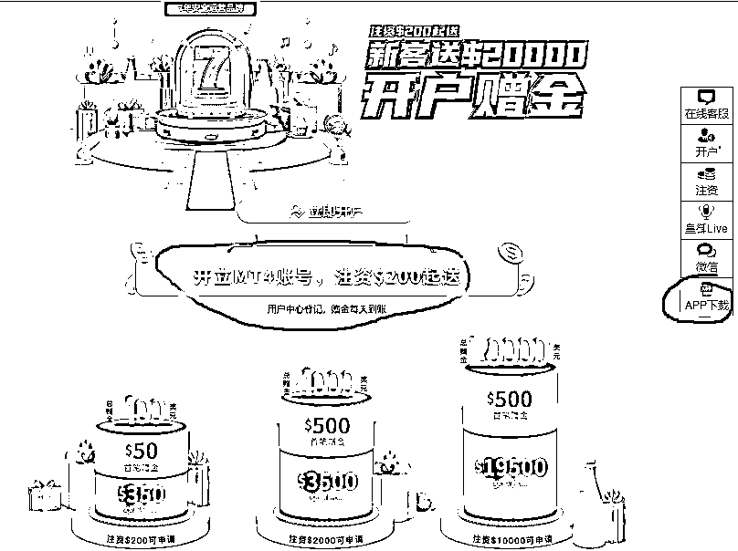
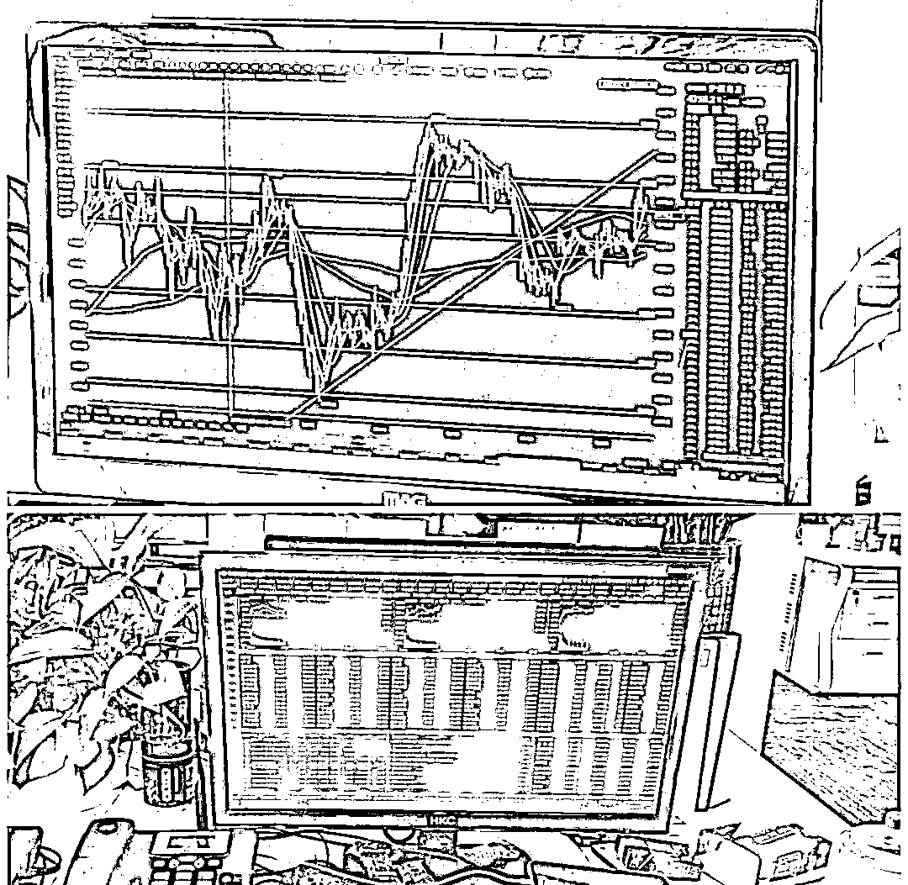
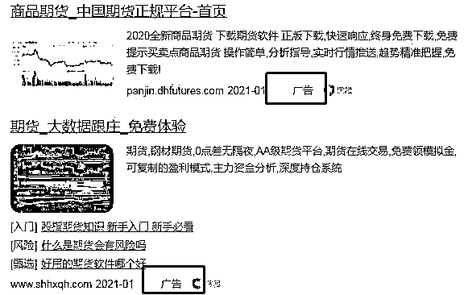
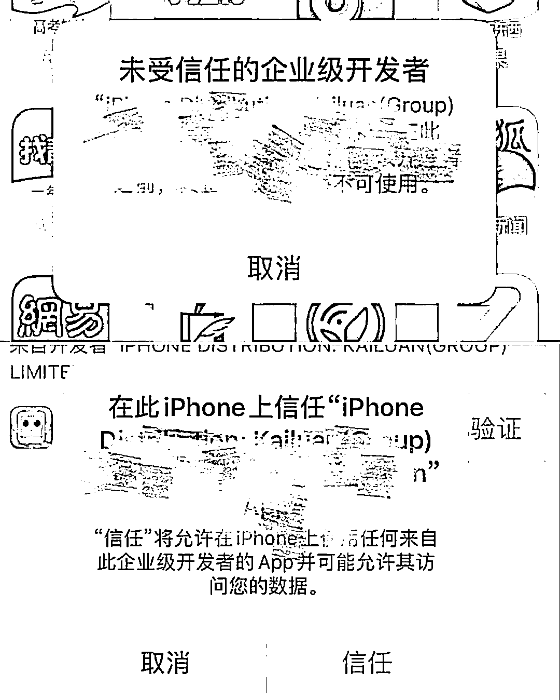

# 新晋诈骗之王来了——“杀猪盘”投资理财

> 原文：[`mp.weixin.qq.com/s?__biz=MzIyMDYwMTk0Mw==&mid=2247508555&idx=5&sn=ce531e375c64ee98886a7abb637a9202&chksm=97cb6973a0bce0659d0364ee2fd7d31c1a01d08dd09fc6a981f4b3317720c73efe97effa8fe5&scene=27#wechat_redirect`](http://mp.weixin.qq.com/s?__biz=MzIyMDYwMTk0Mw==&mid=2247508555&idx=5&sn=ce531e375c64ee98886a7abb637a9202&chksm=97cb6973a0bce0659d0364ee2fd7d31c1a01d08dd09fc6a981f4b3317720c73efe97effa8fe5&scene=27#wechat_redirect)

1 月 28 日，洛阳一市民报警，称其在网上添加了一个好友，后被带入“某某”网站投资，遭遇“杀猪盘”骗局，被骗 30 余万元。

**这还不算多！**

仅此类案件涉案金额已经占到 2020 全年电信诈骗案件涉案金额的四成。

**虚假投资诈骗，当之无愧的诈骗之王**

我们对近几年来的网络虚假投资诈骗案件进行梳理，尽管类型众多，但核心手法无外乎以下几个步骤：

**零风险，高收益作诱饵**

虚假投资公司或平台打出的广告，全部都是超高年化收益，动辄 12%以上，甚至高达 30%-50%，而且稳赚不赔。

△某虚假投资平台广告

**前期给点小收益尝鲜**

一开始受害人都是抱着试试看的态度少量入仓，所以平台前期都会给受害人一些收益，眼看账户飞涨，小额提现也是秒到帐，受害人逐渐飘飘然，越投越多。

**“杀猪”、“榨干”**

资金到位以后，简单粗暴的，直接卷款删号说再见；有点耐心的，继续忽悠你往里投钱。等受害人幡然醒悟，想要及时提现止损时，“登录异常”、“服务器维护”，“银行账户冻结”等，对方有无数种理由解释为何提现失败。

**如果你在网上投资了，往下看，或许还来得及**

为什么你的投资注定亏损？关键在于你投资的平台本身就是个虚假平台。无论是界面，还是操作方式，假平台与正规平台别无二致。为了更加逼真，假平台甚至会购买与实时市场相同的数据图表。

△深圳龙岗警方打掉的投资诈骗公司假平台的 K 线图

如此一来，如何识别真假平台成为重中之重

牢记以下四点

教你避开绝大部分虚假投资平台的坑

01

**你从哪里看来的广告**

在微信公众号、网络搜索引擎上投放虚假广告；在微博、抖音等软件的评论区宣称掌握内幕消息……是骗子的惯用伎俩。

**超八成受害者是在社交平台和骗子互加好友，从而被“荐股老师”、“投资高手”、“内幕消息”吸引到虚假平台参与投资。**

△图片来源网络

02

**你通过什么方式下载的 App**

金融类 App 在手机应用商城的上架审核非常严格，需要提供相关执照、证书、协议等资质文件。由于无法在应用市场上架，诈骗分子只能让受害人通过点击网址链接或扫描二维码的方式下载虚假 App。

**非官方应用市场下载的，都是虚假平台。**

△图片来源网络

03

**你充值到什么账户**

虚假平台会要求将资金转账到指定的个人账户，而正规的交易平台只能使用对公账户。同时，购买理财产品，需要签订协议。银监局明令禁止账户转账，更别提转账到个人账户。

**要求转账到个人账户或者对公账户与平台名称不符的，都是虚假平台。**

04

**平台有没有给出限制**

虚假平台会制定诸多限制，如限制交易时间、交易量、限制出金等，想尽办法让客户亏损。即便你现在是赚的，平台也会祭出杀手锏——手动修改收据，让你亏的一塌糊涂。

**只要平台有各种限制，那毫无疑问，虚假平台！**

**反诈中心提醒**

**在进行股票、债券等投资时，一定要擦亮眼睛，不要被网上各种花言巧语和高额收益所蒙蔽，以免上当受骗。**

**如遇诈骗，可以随时拨打 110 咨询举报。**

来源：洛阳市反虚假信息诈骗中心

← 向右滑动与灰产圈互动交流 →

