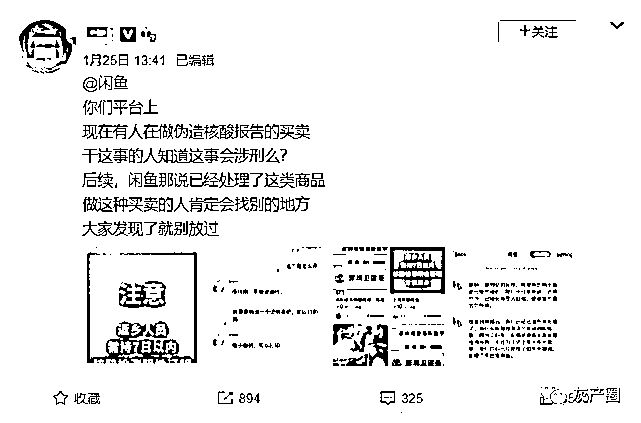
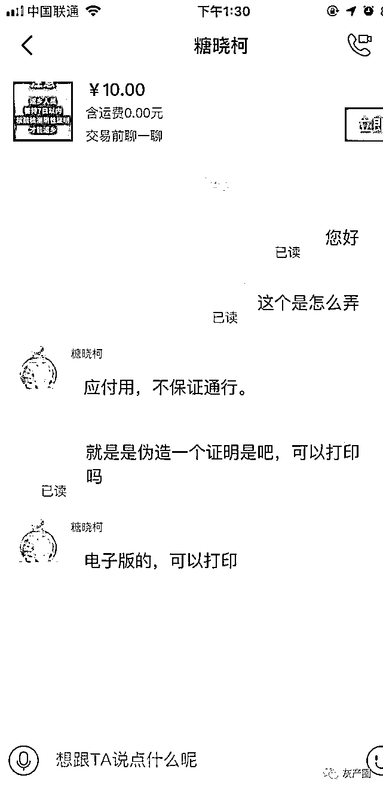
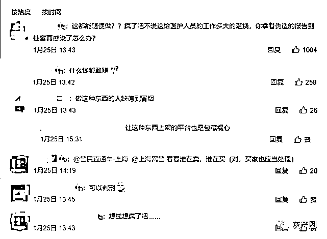
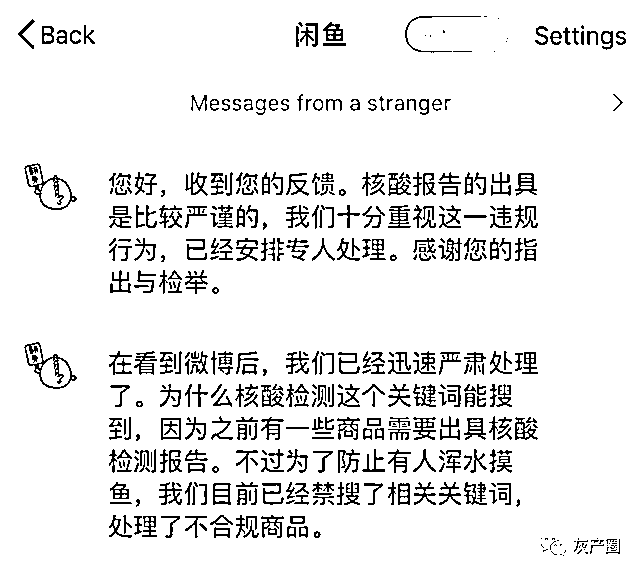
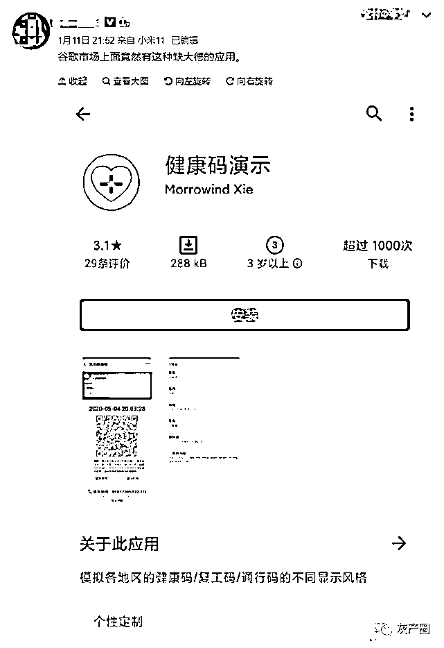
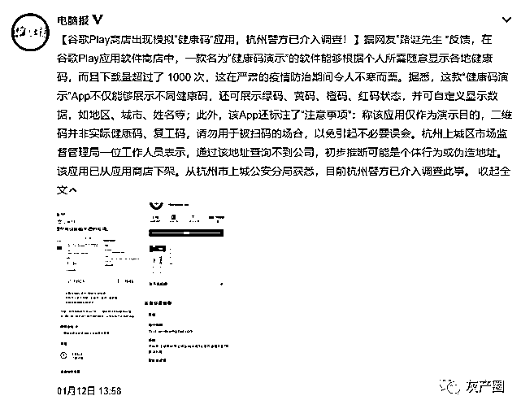
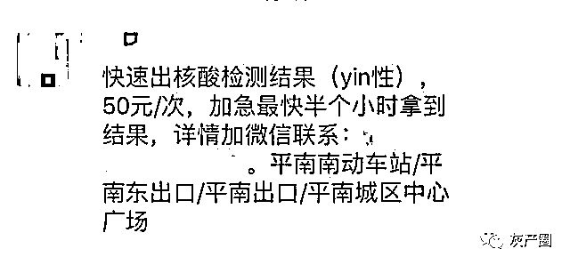
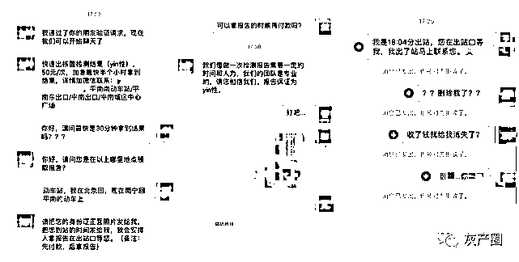

# 无底线的“核酸检测”黑灰产：10 元可买假报告，半小时快速出阴性证明……

> 原文：[`mp.weixin.qq.com/s?__biz=MzIyMDYwMTk0Mw==&mid=2247508668&idx=1&sn=9ff62f611cbb632b4f8430db0d8c0183&chksm=97cb6984a0bce0928bbb9e3d5f31b8eb78d397163004969767e8345fc3f99184c2b48eb0b05b&scene=27#wechat_redirect`](http://mp.weixin.qq.com/s?__biz=MzIyMDYwMTk0Mw==&mid=2247508668&idx=1&sn=9ff62f611cbb632b4f8430db0d8c0183&chksm=97cb6984a0bce0928bbb9e3d5f31b8eb78d397163004969767e8345fc3f99184c2b48eb0b05b&scene=27#wechat_redirect)

**“小时候，乡愁是一枚小小的邮票；**

长大后，乡愁是一份核酸检测报告。”

1 月 20 日，国家卫健委提出，春节返乡需持有 7 日内核酸检测阴性证明后。

这句“乡愁”就是过年回家最真实的写照了。

但这张回家必备的报告也让一些人生出了不该有的心思。

**10 元可买假核酸检测报告**

来源：@冬亚

小编这两天看到新闻报道，有博主爆料在闲鱼上遇到了**贩卖“假核酸检测报告”**的商家，而且**售价只要 10 元！**

与商家的对话 / 来源：@冬亚

根据爆料博主与商家的对话，商家声称声明**“不保证通用，仅供应付”……**

网友谴责 / 来源：@冬亚

曝光后，网友们都炸锅了，纷纷谴责这种“无良”行为。

闲鱼回复 / 来源：@冬亚

在博主曝光举报后，闲鱼也回应已经进行处理了。今天，小编再去搜索“核酸检测”已经不能搜索出相关商品信息了。

**假健康码 APP**

除了上面的“PS 业务”的假核酸检测，还有之前的做“假健康码 APP”的行为也是让小编很是气愤。

来源：@路诞先生

1 月 11 日，有博主爆料，在谷歌 Play 应用软件商店中发现一款名为**“健康码演示”**的 APP 能够根据个人所需随意显示各地健康码。

下载这款 APP 后，**可以模拟生成各地的健康码、通行码，还可以自定义输入地区、城市、姓名并且显示相关数据。**

新闻报道 / 来源：微博

好在 1 月 13 日，杭州发布的消息称开发这个 APP 的人已经被采取刑事强制措施，案件在进一步侦办。

**半小时可出核酸检测？**

除了无良商家、违法开发人员，还有一些骗子利用大家归乡心切，赚起“黑心钱”。

来源：公安部网安局

近日广西贵港网警接到网民反映，一些聊天群里出现**“快速出核酸检测结果”、“加急最快半个小时”**的信息，而且已经有人因此上了当。

来源：公安部网安局

有消费者看到“30 分钟内就可以拿到检测结果”，就联系了对方，结果**钱付了就被对方拉黑了。**

听信了“快速检测”的虚假宣传，结果不仅落入骗子敛财的圈套，还影响了自己的正常出行。

**多地核酸检测费用降低**

春节临近，多地陆续出台细则，几乎都比卫健委的要求更为严格，不管城市还是农村，不管去哪里，核酸检测证明几乎成了绕不过的一道手续。

此前因为春节返乡人员核酸检测费用自付时，很多网友都炸了。认为这个政策不人性化，对农民工不友好。

但今天小编也关注到，多地的核酸检测费用调整降低。

**北京市**医保局明确，调整“新型冠状病毒核酸检测”项目价格，单样本检测价格调整为 80 元/次。

**四川省**医疗保障局发布《通知》，规定省三级公立医疗机构检测费用下调至 80 元/次，省二级公立医疗机构检测费用下调至 72 元/次。

**贵州省**也印发《通知》，贵州省疾控检测机构、医疗机构开展新冠病毒核酸检测最高收费标准调整为 50 元/人次（不包含检测试剂），检测试剂费用按照采购价格零差率销售。

**陕西省**也调整检测费用，明确公立医疗机构按照相关规定开展的新型冠状病毒核酸检测价格调整为每人次最高限价 80 元(含检测试剂)，下浮不限。

消费者虽然需要预约、排队，但检测费用大大节省了。

并且，除了医院，各地也有不少第三方检测机构，可以满足部分消费者上门检测、快速出结果的需求。

**在此，消费保也要提醒广大消费者：**

虽然大家希望能快速地拿到核酸检测证明，但也要**认准经卫健部门认证的具备资质的医院、专业医疗机构或第三方检测机构进行检测。**

不要轻信也不要助长诸如以上的“投机倒把”行为，这不仅是对自己和他人的不负责，也是给国家防疫工作添堵。

**聊一聊**

**你做核酸检测花了多少钱？**

来源：消费保、终结诈骗、公安部网安局、微博、央视新闻

← 向右滑动与灰产圈互动交流 →

