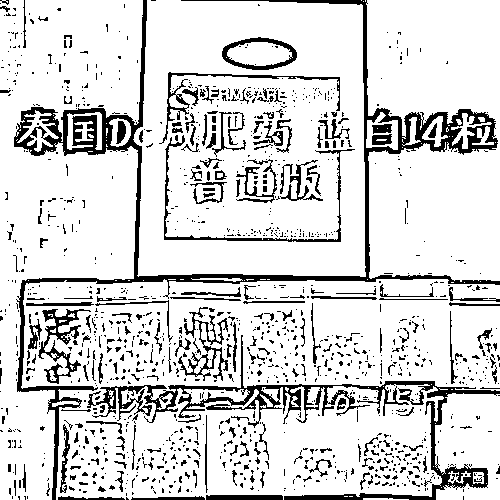
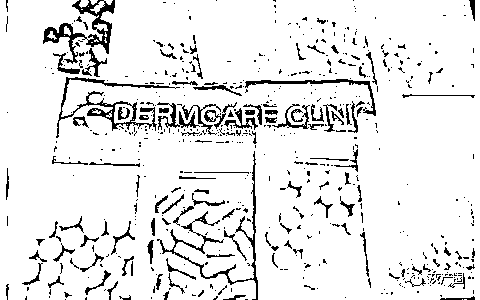
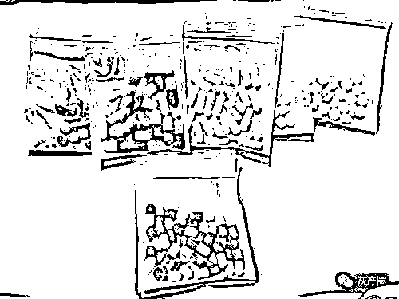
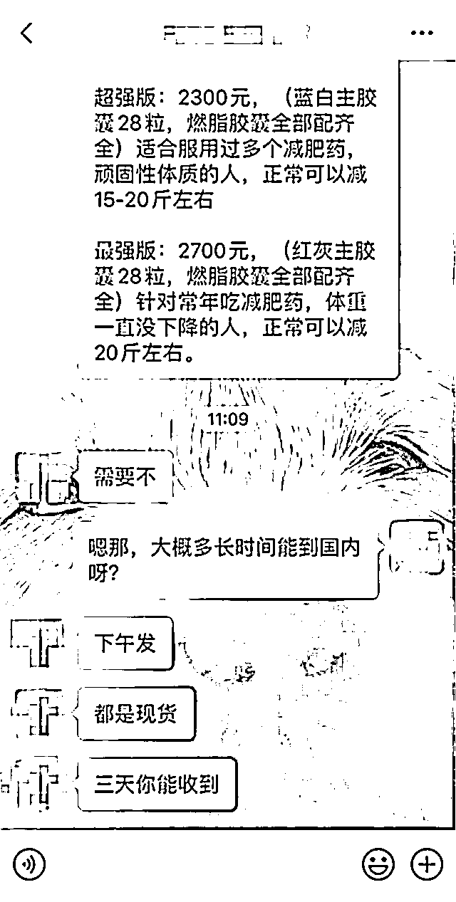
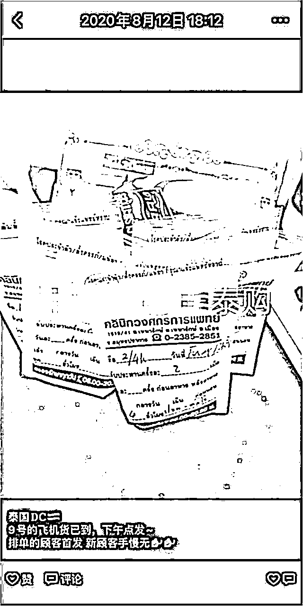
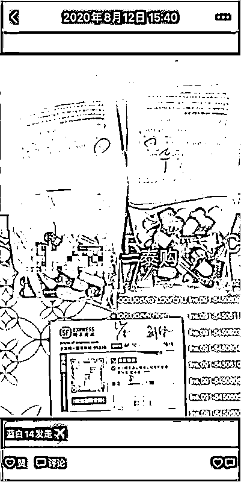
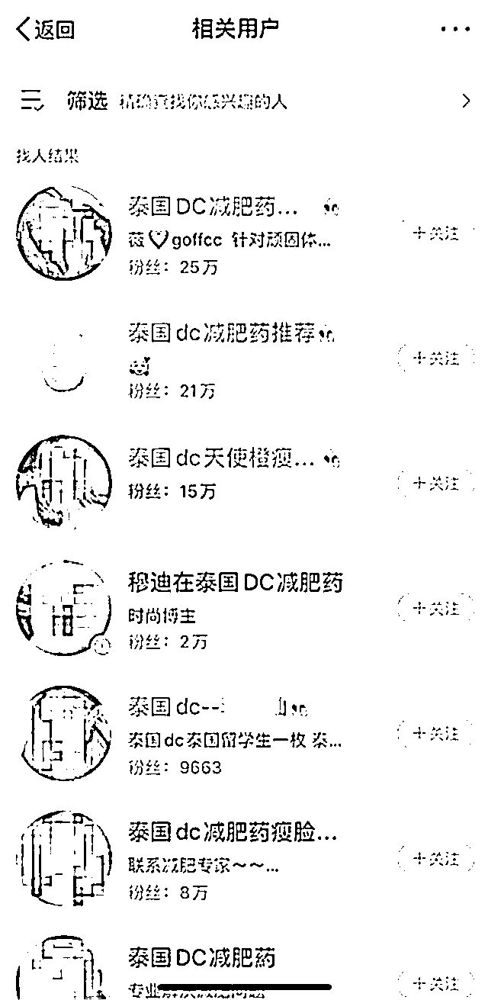
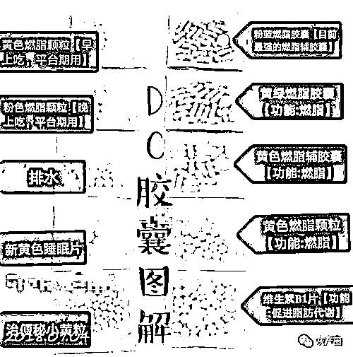
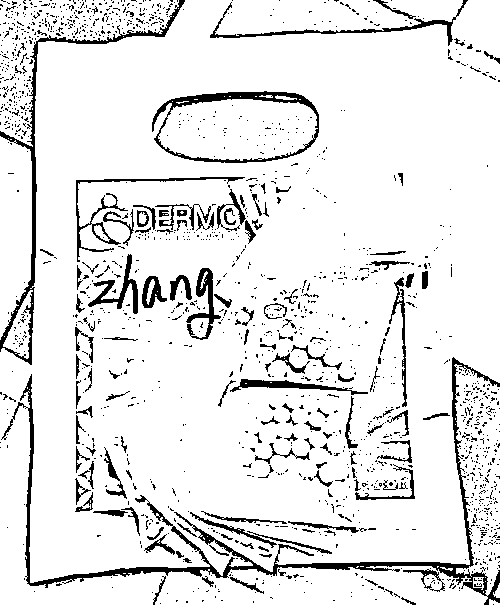

# 这款网红药，涉毒！

> 原文：[`mp.weixin.qq.com/s?__biz=MzIyMDYwMTk0Mw==&mid=2247508668&idx=2&sn=05b411263ee24788b36da7560e175e5e&chksm=97cb6984a0bce09205e7eb43c5732ad86321b451d2853f6ce44bb60bdce11cc9e56550c8dfd8&scene=27#wechat_redirect`](http://mp.weixin.qq.com/s?__biz=MzIyMDYwMTk0Mw==&mid=2247508668&idx=2&sn=05b411263ee24788b36da7560e175e5e&chksm=97cb6984a0bce09205e7eb43c5732ad86321b451d2853f6ce44bb60bdce11cc9e56550c8dfd8&scene=27#wechat_redirect)

号称是**泰国进口的网红 "DC 减肥特效药 "，实际上却含有管制精神药品成分**。前段时间，上海市禁毒办发布的这则消息，迅速登上了微博热搜排行榜。

[`v.qq.com/iframe/preview.html?width=500&height=375&auto=0&vid=o3138wj436f`](https://v.qq.com/iframe/preview.html?width=500&height=375&auto=0&vid=o3138wj436f)

新闻回顾

泰国网红减肥药涉毒，引发网友大讨论

去年 8 月，有媒体报道称有市民网购泰国 DC 减肥药后，被警方以涉毒案件带走调查。该案件经报道后引发关注。**上海市禁毒办发布消息，以泰国 DC 减肥药为代表的一批网红药品中，含有国家管制精神药品成分**。

上海市禁毒办表示，近期从境外非法流入我国的 " 减肥药 " 等非法药物中，多含管制精神药品成分，如安非拉酮、芬特明、地西泮（" 减肥药 "），硝西泮、氟硝西泮（" 安眠药 "），莫达非尼、利他林（" 聪明药 "）等，上述成分我国均已在 2005 年列入《麻醉药品及精神药品品种名录》施行严格等目录管制和行政许可等措施。

事情一出，迅速登上了微博热搜排行榜。网友们各抒己见，引起了大讨论。" 还是管住嘴、迈开腿比较好。"" 这些药的售卖渠道是什么？"" 网上的药物最好不要买，很难监控。" 有些网友还质疑，" 各种网络平台上卖药的，能不能管一管？"" 为这些药带货的网红们需要追究责任吗？"

记者调查

微商对外宣称是医院药品渠道正规

都说 DC 是泰国的网红减肥药，那这个药品是如何进入中国市场的呢？记者联系了一名曾经购买过 DC 减肥药的消费者。

南京姑娘小枫（化名）五官端正、长相甜美，但是她一直很自卑，因为她是个不折不扣的胖美眉。5 年前，小枫开始接触减肥药。" 之前我吃的都是一些国产的，曲美、诺美等，但是效果平平。后来，**偶然间了解到泰国 DC 减肥药效果很好，就抱着试试看的心情，在网络上找了微商购买**。"

起初，小枫是有点害怕的，担心减肥药有副作用。但是吃了一个疗程之后，觉得效果 " 惊艳 "，便不可自拔。" 我自己觉得是没什么副作用。不过半年前，我因为备孕停了药。昨天看到这个新闻，吓死了。家里面还有十几天的药，我立马就扔了。"

在小枫的介绍下，记者联系到了售卖 DC 减肥药的微商。**该微商称，自己售卖泰国和俄罗斯两种减肥药，泰国的减肥药就是 DC**。" 一个疗程 28 天的量，分为普通版、加强版、特强版、超强版、最强版，价格从 1200 元到 2700 元不等。" 当记者问及，" 可以正常出货吗？" 该微商称可以，现货或者直邮两种方式都可以。" 你转账给我，国内现货今天就能发货。直邮需要等半个月左右。"

△记者与微商的聊天记录

面对记者提出的问题，"DC 减肥药有副作用吗？" 微商表示，" 因人而异，副作用很小，但是如果备孕之前，要至少停药 1 年。" 当记者表示担心副作用大，有点犹豫时，微商立即回复，DC 是泰国医院开的药，渠道正规，不用担心。

随后，**记者翻阅了该名微商的朋友圈，发现很多 " 晒单 " 广告**，即把消费者反馈减肥效果的聊天截图，当成广告发布在朋友圈。

△微商售卖的广告

泰国 DC 减肥药的热销，不仅仅依靠 " 人传人 "，在一些网络平台上，也可以轻松搜索到。在某社交平台上，记者以 " 泰国 ""DC" 为关键词搜索用户，出现了数十名代购，有的网络代购粉丝数甚至多达二三十万。不过，这些代购在社交平台上 " 低调 " 许多，只发布了一些减肥励志语录，并没有发布任何关于 DC 减肥药的内容。**如果想了解详细内容，必须添加代购个人微信，通过验证才可继续沟通**。

专家分析

泰国 DC 减肥药如滥用具有较大危害

上海市禁毒办认定 DC 减肥药涉毒，含有管制精神药品成分。那么减肥药中的成分，对人体究竟有哪些危害呢？

国家禁毒委员会办公室 - 中国药科大学禁毒关键技术联合实验室主任狄斌表示，境外流入我国的 " 泰国 DC 减肥药 " 等非法药物中含有我国管制的多种精神药品成分，如安非拉酮、芬特明、地西泮（" 减肥药 "），硝西泮、氟硝西泮（" 安眠药 "），利他林、莫达非尼（" 聪明药 "）等，**上述成分目前在我国均已被列入《麻醉药品及精神药品品种目录》**，同时施行严格的目录管制等措施；除此以外，**还含有一些临床使用的处方药物**，如抗抑郁药氟西汀，抗高血压、心律失常药物普萘洛尔以及利尿药物如氢氯噻嗪，还有促进排泄的药物如比沙可啶。

狄斌分析称，其中，" 安非拉酮 " 通过兴奋下丘脑腹内侧的饱食中枢，抑制下丘脑摄食中枢，从而产生饱食感，达到控制食欲、降低食量的作用，但易出现莫名情绪波动或失眠、情绪亢奋等，且长期使用会产生依赖性；芬特明为间接作用的拟交感神经药，通过抑制食欲而起到减肥作用，不过副作用较大，最常见的就是失眠，严重者甚至会引起瓣膜性心脏病；利他林和莫达非尼是中枢兴奋药，直接通过刺激延脑呼吸中枢产生兴奋作用，但会产生心动过速等副作用。

**上述使人产生兴奋的药物会产生失眠以及心血管副作用（如心律失常），因此不法分子往往会添加相应的药物来抵消这些副作用**。如 " 地西泮 " 是临床常见的镇静催眠药，多用于抗焦虑、镇静催眠等，长期使用具有耐受与依赖性；" 普萘洛尔 " 为 β 肾上腺素受体阻滞剂，临床用于抗心律失常。" 氟西汀 " 为抗抑郁药，通过抑制 5- 羟色胺的重摄取而产生抗抑郁作用，但长期使用会产生食欲减退。

如上所述，狄斌认为，" 泰国 DC 减肥药 " 中的成分，大多属于国家管制类精神药品或处方药，其滥用具有较大危害。

**************代购销售 DC 减肥药属违法行为**

********

****记者从业内人士处获悉，若是有充分证据证明，消费者在不知情的情况下，购买了含有管制精神药品成分的减肥药，那不属于违法，但如果上瘾，需要配合接受治疗。不过不违法的前提是，具体案情具体分析，且有充足的证据。****

****不仅如此，像泰国 DC 减肥药这种泰国本地的处方药，符合《中华人民共和国药品管理法》第 48 条第 2 款规定的情形，属于必须批准而未经批准生产、进口的药品，或必须检验而未经检验即销售的药品，应认定为假药。****

****而《中华人民共和国刑法》第 141 条对销售假药有明确规定：生产、销售假药的，处三年以下有期徒刑或者拘役，并处罚金；对人体健康造成严重危害或者有其他严重情节的，处三年以上十年以下有期徒刑，并处罚金；致人死亡或者有其他特别严重情节的，处十年以上有期徒刑、无期徒刑或者死刑，并处罚金或者没收财产。****

****春节临近****

****做好疫情防控的同时****

****禁毒防控也不能松懈！****

****一起来看这段小视频****

****学习更多的毒品预防知识！****

******DC 减肥药：你是要“瘦”，还是要“寿”？******

 ****[`mp.weixin.qq.com/mp/readtemplate?t=pages/video_player_tmpl&action=mpvideo&auto=0&vid=wxv_1713340376909971463`](https://mp.weixin.qq.com/mp/readtemplate?t=pages/video_player_tmpl&action=mpvideo&auto=0&vid=wxv_1713340376909971463)**** 

******小编提醒：******

****不要轻信朋友圈或其他网上来路不明的减肥药物，如果在明知是精神药品却仍在不遵医嘱的情况下随意服用，就有可能涉嫌滥用毒品，留下案底！****

****更不要为了利益做药代或者帮人代买药物，害己害人，一旦被海关或者公安查出，有可能面临触犯法律法规的风险！****

****切勿相信虚假宣传，谨遵医嘱，健康减肥，科学用药，良好的体质才是美丽的基石！****

****来源丨梧桐发布，现代快报**** 

****************

****← 向右滑动与灰产圈互动交流 →****

********