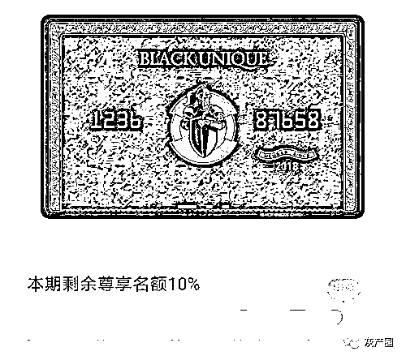

# 全球购骑士卡：以优惠之名收“智商税”？

> 原文：[`mp.weixin.qq.com/s?__biz=MzIyMDYwMTk0Mw==&mid=2247508668&idx=3&sn=2c15728b9a899c00a7ebea7cbad995b1&chksm=97cb6984a0bce092ee1a9bfda82096c2d16a64bf8c606e8c73abd1e8181af6ec85295b74d67d&scene=27#wechat_redirect`](http://mp.weixin.qq.com/s?__biz=MzIyMDYwMTk0Mw==&mid=2247508668&idx=3&sn=2c15728b9a899c00a7ebea7cbad995b1&chksm=97cb6984a0bce092ee1a9bfda82096c2d16a64bf8c606e8c73abd1e8181af6ec85295b74d67d&scene=27#wechat_redirect)

“风靡全网，抖音人手一张”。过去一年，一张“网红骑士卡”火了起来。

该卡名为“全球购骑士卡”，声称“汇聚 24 国大牌优惠，全球大牌 1 折起，热门视频会员充值 5 折起，加油 8.5 折起，肯德基在线点餐 6 折起，星爸爸（星巴克）饮品券 8 折起等超 200 项特权！”

这张卡被不少消费者认为是“薅羊毛”神器，但也有不少消费者认真对比后发现，这张声称限量、限时免费办理的卡一直可以免费办理。而且，该卡在实际购买商品时折扣条件很有限，部分商品的优惠力度还不如其他官方平台。因此，不少消费者认为自己受到了欺骗。

全球骑士卡人士对记者表示，骑士卡刚刚推出时，是准备做限量的免费领取，由于后续的产品调整，目前是拉长了免费领取时间，但未来可能会取消免费领取，进行会员升级和收费；对于低折扣，骑士卡从来没有对外宣称是价格最低，在全球购骑士卡平台上消费至少是可以节省找优惠券的时间，骑士卡就是做一个优惠的聚合，让消费者能在更短的时间内获取到更多的折扣信息。

要花钱的“免费办理”

全球购骑士卡是广州探途网络技术有限公司（以下简称“探途公司”）发行的首张汇聚海外折扣、会员专属特权的综合权益卡。天眼查显示，探途公司的最终受益人是李健诚和李斌，两人通过持有广州力挚网络科技有限公司（租租车）的股份直接控股探途公司，但目前探途公司已经从租租车剥离出来了。

全球购骑士卡方面声称，该卡拥有 24 个国家大牌优惠。会员可享受免税店、奥特莱斯、大型商超购物 4 折起，还可获得出行、购物、娱乐等近百项专属特权，是一张真正意义上的权益集合卡。而且这张卡限时免费办理。

记者了解到，注册这张卡方式很简单：通过微信公众号、支付宝小程序以及官方 APP 都可以办理。

3 月 11 日，记者点击全球购骑士卡微信公众号推送的“骑士卡限时免费办理”，填写好姓名、手机号、收件地址后提交申请，被提示参考价 299 元的骑士卡只需要 0 元，但需要支付快递费或者是 9.9 元的电子卡费用。页面显示，3 月 12 日后恢复参考价 299 元。

但在 3 月 13 日，当记者再次点击该微信公众号上的“骑士卡限时免费办理”活动时，该活动依旧存在，且截止日期延长至 3 月 19 日。而此前，已经有不少网友反映该卡声称限量办理，却一直不限量。

对此，全球骑士卡人士向记者表示，骑士卡刚刚推出时，是准备做限量的免费领取，由于后续的产品调整，目前是拉长了免费领取时间，但未来可能会取消免费领取，进行会员升级和收费。

另一方面，全球骑士卡宣称可以免费办理，却需要支付 12 元的快递费也被用户吐槽是在收“智商税”。此外，记者实测全球购骑士卡微信公众号的“免费办理”功能，写好姓名、手机号、收件地址后提交申请，却被告知还需要获得 3 个好友助力方可激活。

“企业采购大批量的快递业务显然可以把物流成本压低下来。”有用户吐槽，平台依靠收取快递费也能赚钱，但需支付一定额度的邮费，同样引发质疑。

“花了 12 块领回来的那张卡片并没有实际价值，消费时不用出示。”一位购卡用户向本报记者说道，邮寄过来的卡只有卡片上的账号和激活密码有用，激活之后后续买东西优惠都在“全球购骑士特权”APP 或者骑士商城上，而激活码完全可以通过网络形式发送。

如今，说好的免费办理，电子卡也要收取 9.9 元的费用，骑士卡的这波操作也引来消费者吐槽。不过，全球骑士卡人士表示，骑士卡的实体卡是需要邮寄给用户的，像普通一个快递寄到新疆、西藏可能要二三十块钱，平台都是统一的价格，公司也并没有想通过邮费赚钱。

被质疑宣传噱头过大

“视频会员充值 5 折起，24 国名店 4 折起，天猫淘宝限时 1 折起”“立即免费办理，一次办理，终身免费”，在这样的宣传诱惑下，不少消费者纷纷购买全球购骑士卡。

有网友实测发现，该卡的确可以购买到比官方价更实惠的商品。然而也有网友反映，在全球购骑士卡的宣传中，打出了“五折起”“六折起”这样的吸引折扣，但实际消费过程中，并非所有商品都有这样的折扣。

记者随意点开全球购骑士特权 APP 首页上一处显眼的“爱奇艺、腾讯 5 折起”的图标，提示信息显示，爱奇艺的会员 5 折优惠只存在于购买钻石会员 12 个月和连续包月首月的时候才可享受。其他会员优惠都达不到 5 折。

而且全球购骑士卡享有的部分权益，在很多优惠类平台也可享受到，全球购骑士卡就做了一个整合。在获客成本不断攀升的今天，低价折扣平台层出不穷，类似这种优惠权益聚合的平台目前市面上存在不少。而且部分商品比主流电商平台上的价格还要高。

一位视频用户向本报记者介绍了一个名为“公象网”的平台，爱奇艺黄金会员优惠月卡只需要 11.6 元、周卡只需要 3.9 元，而全球购骑士卡平台上的爱奇艺月卡要 14.85 元、周卡要 7 元。

此外，一位已经购卡的消费者体验后向记者说道：“优惠的确多，但很多都是少几分、几毛的。”在他看来，实际用下来之后并没有宣传中的力度那么大。

对此，全球骑士卡方面人士解释道，宣传中提到的折扣在用户实际使用中都是能找到的。

网经社电子商务研究中心法律权益部助理分析师蒙慧欣对记者表示，如果消费下来，在相应折扣上有差距，说明有宣传夸大的行为。她提醒消费者要对比下再慎重选择是否要购买。

对于“五折起”“六折起”这样的广告宣传，浙江圣泽灌律师事务所律师黄伟告诉记者，商家的这种行为很大可能会对消费者造成误导。《消费者权益保护法》第二十条第一款规定，经营者向消费者提供有关商品或者服务的质量、性能、用途、有效期限等信息，应当真实、全面，不得作虚假或者引人误解的宣传。同样类似的表述在《反不正当竞争法》第八条第一款中也有体现。比如，经营者不得对其商品的性能、功能、质量、销售状况、用户评价、曾获荣誉等作虚假或者引人误解的商业宣传，欺骗、误导消费者。

“全球购骑士卡虽然是一种虚拟的会员卡产品，但是在销售过程中仍然要遵守相关规定，显然现有的宣传语不能真实反映产品的真实价值，明显具有误导的性质。”黄伟告诉记者，当然现有的商家也做了一定的规避，比如在宣传折扣时，会宣传××折起，并未直接说都是××折，但非常关键的一点是消费者在消费的过程中，知情权是否得到了充分有效的保障。比如，商家有无在购买页面显眼的位置明确告知消费者会员权益的情况、有无相关的协议或者条款让消费者同意，如果这些都没有做到，显然会构成欺诈，消费者有权要求退款并索赔。

全球骑士卡方面人士表示，电商平台去做一些大促销，也采用类似的宣传方式。“我们在做宣传、投放的时候也是跟其他的电商平台去看齐的，我们也担心，用户到我们平台发现没有优惠造成客诉，其实我们也不希望出现这种情况。”

该人士举例称，比如说全国加油 8.5 折起之类的宣传，“我们在宣传时也会说明全国 300 多个城市加油 8.5 折，包括下单页面，咨询客服都可以知道具体是哪些城市”。但其也坦言，没有办法在广告图片中把 300 多个城市具体列出来，因为太多了，而且这些城市是实时在增加的

来源：中国经营报 

← 向右滑动与灰产圈互动交流 →

