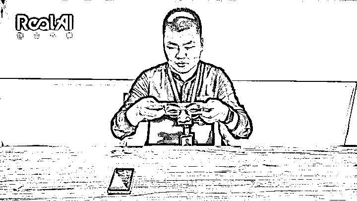
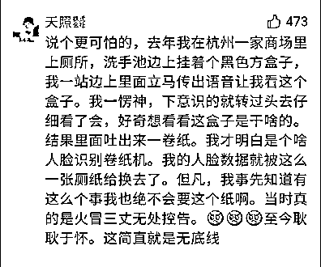

# 人脸识别爆出巨大丑闻！

> 原文：[`mp.weixin.qq.com/s?__biz=MzIyMDYwMTk0Mw==&mid=2247508768&idx=1&sn=2599442489ca9a2922bd91b37fb1550b&chksm=97cb6818a0bce10e01803494a4727d12037c21423475df373211d02a4ac6d02ec55086d43ba8&scene=27#wechat_redirect`](http://mp.weixin.qq.com/s?__biz=MzIyMDYwMTk0Mw==&mid=2247508768&idx=1&sn=2599442489ca9a2922bd91b37fb1550b&chksm=97cb6818a0bce10e01803494a4727d12037c21423475df373211d02a4ac6d02ec55086d43ba8&scene=27#wechat_redirect)

人脸识别技术，爆出巨大丑闻。 刚刚，清华大学的一条重大发现，利用人脸识别技术的漏洞，“ 15 分钟解锁 19 个陌生智能国产手机 ”的事件，惊呆了我们科技圈的小伙伴 。这起事件，如果用嘴简单的语言来形容就是：“ hello，你新买的手机不错呀，借我看看 ？”然后，对方拿着你的手机，啪的一下，进行人脸识别开锁。你的手机就自动打开了。所有功能、信息；任人宰割！！！是不是超级不可思议？？？看完下面的详细过程，你会更大吃一惊。以下画面来源于：清华大学 RealAI 团队的“ 勇敢爆料 ”，你们赶紧看看：整个过程其实非常简单，清华大学的 RealAI 团队共选取了 20 款手机，其中 1 款是国外的，另外 19 款都是我们国产的智能手机，居来自排名前五的国产手机品牌，每一品牌下选取了 3-4 款不同价位的手机型号，覆盖低端机到旗舰机 。第一步：清华大学的测试人员，把 19 部国产手机，人脸识别全部绑定为旁边的“ 1 号同学 ” 第二步：让旁边的同学、同事，拿起他的手机，进行人脸识别。 直接识别，打不开！（被系统发现了）但是，接下来最精彩的部分来了。第三步：将 1 号同学的照片，特别是眼睛部位。打印出来。贴在我们平时戴的眼镜上面。 然后，奇迹发生了。。。19 款国产智能手机，全部成功解锁。从被破解的程度上看，攻击这些手机的难度几乎没有任何区别，不管是低端机，还是售价 4000 以上的高端手机，全都是秒级解锁。。。啪的一下，全都自动解锁了！！！那，这是不是巧合呢？？？ 突如其来的成功让清华大学的研究人员自己，都觉得有点不可思议。我们天天在使用的智能手机，人脸识别系统竟然如此脆弱？？？要知道在一些国际知名的黑客挑战赛上，挑战人脸识别技术的项目经常伴随着数次尝试与失败。「这样的结果还挺出乎我们意料的，我们以为会需要多调优几次，但没想到这么容易就成功了。」---清华大学的 RealAI 团队 的算法人员表示自己都没想到。。。为了进一步验证，随后清华大学的研究机构又重新测试，将各种各样，不同的人，不同的国产手机，不同的主人，人脸识别。都重新做了测试： 结果，震惊了所有人！！几乎所有的测试，国产手机都是“ 秒开 ”！一下就被解锁了。。。包括手机里的图片、视频、APP 应用、甚至手机银行，全都能自由使用！！ 一下子，清华大学彻底火了。今天，我们科技圈的各个同事，都被这条重大发现，懵逼了。。 虽然，我们之前就想过，人工智能技术，是一个新的技术，肯定会有不完整的地方。但，今天当有人真正爆出这一幕时，我们还是被震惊了。。 刚刚写稿前，清华大学 RealAI 研究团队对外还说了这样一段话：现有的人脸识别技术可靠度远远不够，一方面受制于技术成熟度，另一方面受至于技术提供方与应用方的不重视。「顺利解锁手机其实只是第一步，其实我们通过测试发现，手机上的很多应用，包括政务类、金融类的应用 APP，都可以通过对抗样本攻击来通过认证，甚至我们能够假冒机主在线上完成银行开户，下一步就是转账。」太可怕了！人脸识别，这下要彻底刷屏了！二《北京日报》前不久报道的这一起事件，不知道你们有没有印象：某男子准备买房，于是去一家钟意的售楼处看房。看完后，男子对房子比较满意，于是询问价格。包括向售楼处、也包括多次向不同的房产中介询问价格，优惠！！货比三家后，这个男子找了优惠最好的一家“ 正式买房 ”！！然而，接下来发生的一幕却令所有人感到“ 不可思议 ”。据《北京日报》报道，这位不久前刚在南四环某楼盘购买了商品房的消费者告诉记者：他在签约前发现自己被人脸识别了。结果就是，虽然他是在经纪人陪同下签约的，但由于人脸识别系统记录到他曾主动到访过一次，因此不能享受 2%的优惠，「两个价格相差近 20 万元。」男子非常疑惑！自己第一次去售楼处的时候，根本没有留下真实姓名和登记，怎么会有自己的信息？？问题其实就出在摄像头上面：可能我们平时生活的时候，很多时候都习惯了摄像头，也习惯了人脸识别。根本不知道这个意味着什么？？ 1、现在很多地方的摄像头都具有“ 人脸识别功能 ”；只要你集中注意力在一个地方停留过久，就会被摄像头记录下来。2、然后你的基本信息，就会被记录存档！3、戴口罩也没用，现在的人脸识别技术已经先进到即使你戴着口罩，也能轻易识别的夸张地步 。简单来说就是：这个男子因为没戴头盔，自己去看了一眼房子。然后被开发商的摄像头，人脸识别系统记录了。人脸识别系统，自动识别出了这个男子的“ 身份信息 ”。然后一下子这个人就稀里糊涂损失了 20 万！！！说实话，房子不是路边的水果，问一遍就直接买。谁不是货比三家，慎重考虑考虑再考虑，才决定买的！要是因为一个人脸识别就要多比别人多付 20 万，那岂止是一个冤。。。并且，这也不是 20 万的问题！这是人脸识别，滥用的问题？？！！ 如果，随便来一个人都能使用人脸识别，对你随便摄像。那我们这些“ 路人 ”，在人脸识别的霸权之下，不是人人都成为了“ 皇帝的新衣 ”。 信息都被公开，任人看光？？三 整治人脸识别，刻不容缓！清华大学曝光的事件，以及北京日报曝光的人脸识别事件，都不是独例；你们看一看下面这个网友的留言： 网友说：说个更可怕的，去年我在杭州一家商场里上厕所，洗手池边上挂着个黑色方盒子，我一站边上里面立马传出语音让我看这个盒子。我一愣神，下意识的就转过头去仔细看了会，好奇想看看这盒子是干啥的。结果里面吐出来一卷纸。我才明白是个啥人脸识别卷纸机。我的人脸数据就被这么一张厕纸给换去了。但凡，我事先知道有这么个事我也绝不会要这个纸啊。当时真的是火冒三丈无处控告。至今耿耿于怀。这简直就是无底线再比如餐厅！ 最近有网友反映，海底捞现在满餐厅都是摄像头。。随便一数就是几十个，上百个。。如果只是为了防止客人“ 逃单 ”，“ 或者丢失物品 ”，那最多只需要 3-5 个摄像头就够了。有必要这样全场密密麻麻的装满摄像头吗？？并且，不知道大家有没有注意？现在你去商场里、超市里、甚至去一些路边走路，你都会发现，很多地方都被人装了好多好多的“ 摄像头 ”！！ 如果只是为了防偷窃？那也太牛刀小试了，一个小小的超市，餐厅其实根本不需要如此重多的“ 高科技 ”啊。。 众所周知，人脸识别技术作为我们国家倡导的“ 高新科技 ”，其实用途是非常非常广泛的。 比如，刷脸坐高铁：比如刷脸支付：如果，人脸识别摄像头像上面的商家一样，人人都可以布置，到处去设置，去采集我们的人脸图片。睁眼的也采集，闭眼的瞬间也采集。那万一碰到坏人，黑客，不法分子；一旦被利用，那后果将不敢想象。。 这不是危言耸听，这是真的！新华社都已经报道了： 叛卖真人照片！《新华社》在 10 月底的时候，就已经报道了这样的事件。当时我都还没在意。现在想想，我真的是“ 太天真 ”！！写在最后：不可否认，人脸识别系统，在某一些方面确实，是比较便利的。 比如，今年疫情我们之所以能迅速的控制住。并不是因为我们医疗技术比欧美更厉害，真正的原因是我们的大数据能力、人脸识别能力、定位追踪技术，比较厉害，一旦发现哪里出现疫情，迅速就能识别可能接触的人群，第一时间进行隔离处理。。 但是，现在不一样了！！当我们发现一个小小的开发商，现在也能行驶国家权力！在没有任何告知我们的情况下，直接就“ 人脸识别 ”掌握我们的隐私信息的时候；当我们发现，原来所谓的智能手机，人脸解锁功能，就如同“ 皇帝的新衣 ”，如此简单，就能被破解的时候。 甚至，就连路边一个小小的火锅店、餐厅也能随便安装几十个，上百个摄像头，正大光明的拍照、记录我们的信息； 就连上个厕所，都要被人脸识别，拿走我们的人脸数据！！很明显！！人脸识别已经“ 变味 ”了。。。对，确实！早期的时候，国家为了大数据创新、为了提高人脸识别的技术；为了技术，只要你不是干坏事，也就睁一只眼闭一只眼。但，现在不一样了！现在的人脸识别技术已经完全被“ 滥用 ”了；就连戴着口罩都能轻易识别，现在更是戴个眼镜，就能轻易解锁我们的手机。 如果还放任不管，百分百必出大事！！最后说一句，感谢清华大学！感谢贵校的人工智能研究团队 RealAI ，勇敢的站出来，将人工智能的巨大丑闻，公之于众！                                                                                      来源：天涯论坛，支付界

← 向右滑动与灰产圈互动交流 →

